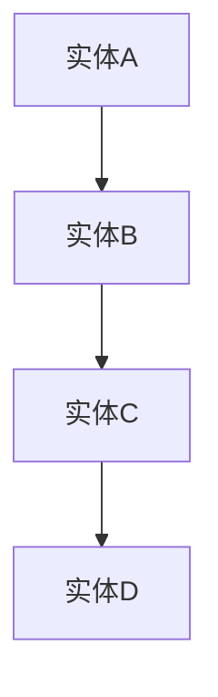
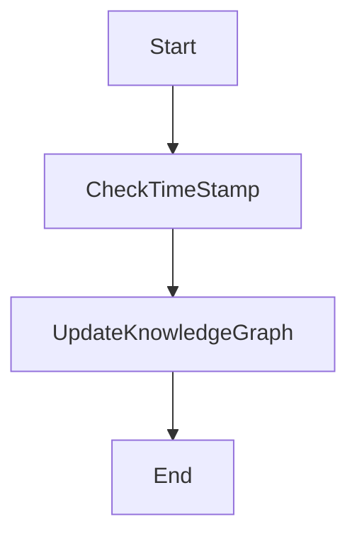
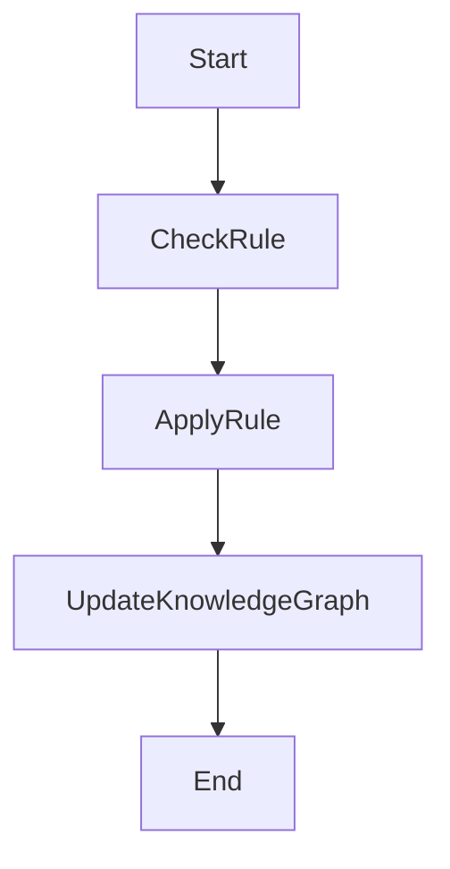
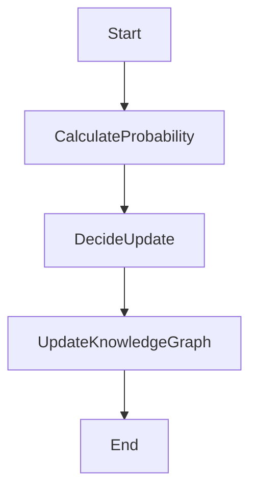
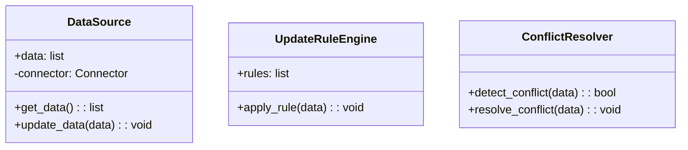
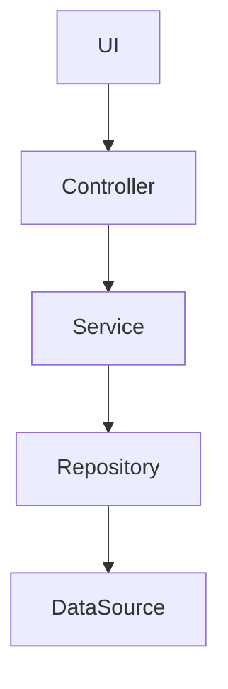
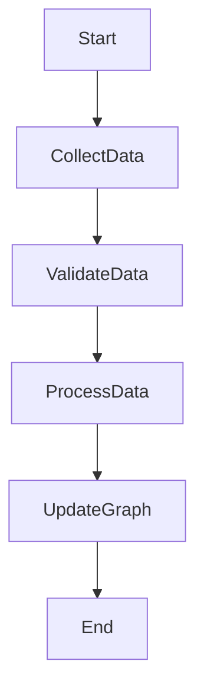

                 


# 《构建AI Agent的动态知识图谱更新系统》

## 关键词：动态知识图谱，AI Agent，知识图谱更新，系统架构，算法原理，项目实战

## 摘要：  
本文详细探讨了构建AI Agent的动态知识图谱更新系统的背景、核心概念、算法原理、系统架构设计及项目实战。通过逐步分析，文章解释了动态知识图谱更新的必要性，详细讲解了系统的构建过程，包括更新机制、数据源管理、冲突处理、系统架构设计和实际案例分析。本文旨在为AI Agent的动态知识图谱更新系统提供理论支持和实践指导。

---

# 第一部分: 动态知识图谱更新系统的背景与核心概念

## 第1章: 动态知识图谱更新系统概述

### 1.1 问题背景

#### 1.1.1 知识图谱的重要性  
知识图谱是一种以图结构形式表示知识的工具，能够将实体及其关系组织成网络，为AI Agent提供语义理解的基础。  

#### 1.1.2 动态知识更新的必要性  
知识图谱需要实时更新以反映现实世界的变化。例如，产品信息、用户行为、市场动态等都需要及时更新以保证准确性。  

#### 1.1.3 传统知识图谱更新的不足  
传统的知识图谱更新方法通常依赖人工操作，效率低、成本高，难以应对大规模实时更新的需求。  

### 1.2 动态知识图谱更新系统的定义与特点

#### 1.2.1 动态知识图谱的定义  
动态知识图谱是一种能够实时感知和更新知识信息的图谱，能够根据输入数据自动调整其结构和内容。  

#### 1.2.2 更新机制的核心特点  
动态知识图谱更新系统具备实时性、自动化和智能化的特点，能够根据输入数据自动触发更新操作。  

#### 1.2.3 应用场景的多样性  
动态知识图谱广泛应用于搜索引擎优化、智能推荐系统、对话系统等领域，能够显著提升AI Agent的性能和用户体验。  

### 1.3 相关技术概述

#### 1.3.1 知识图谱的基本概念  
知识图谱由实体（node）和关系（edge）组成，能够以结构化的方式表示知识。  

#### 1.3.2 动态知识更新技术  
动态知识更新技术包括数据采集、冲突检测与解决、知识融合等关键步骤。  

#### 1.3.3 AI Agent的基本原理  
AI Agent通过感知环境、执行任务和与用户交互来实现目标。动态知识图谱为其提供了实时的知识支持。  

---

# 第二部分: 核心概念与联系

## 第2章: 动态知识图谱更新系统的核心原理

### 2.1 更新机制的原理

#### 2.1.1 基于时间戳的更新  
时间戳更新机制通过记录数据的修改时间来判断数据的有效性，确保最新的数据优先被使用。  

#### 2.1.2 基于规则的更新  
基于规则的更新机制通过预定义的规则来检测和处理知识图谱中的冲突和冗余信息。  

#### 2.1.3 基于概率的更新  
基于概率的更新机制通过概率模型来评估数据的可信度，优先更新高可信度的数据。  

### 2.2 数据源管理与冲突处理

#### 2.2.1 数据源的多样性  
动态知识图谱更新系统需要整合多种数据源，包括结构化数据、非结构化数据和外部API接口数据。  

#### 2.2.2 冲突检测与解决策略  
冲突检测通过比较不同数据源的信息，发现矛盾或不一致的地方。冲突解决策略包括合并、删除或保留最新数据等。  

#### 2.2.3 数据质量评估  
数据质量评估通过指标如一致性、完整性、准确性等来衡量数据源的可靠性。  

### 2.3 概念对比与ER实体关系图

#### 2.3.1 更新机制对比表  
| 更新机制   | 描述                              | 优缺点                       |
|------------|-----------------------------------|------------------------------|
| 时间戳更新 | 根据数据修改时间判断优先级        | 简单高效，但依赖时间戳准确性  |
| 规则更新   | 通过预定义规则进行数据处理        | 灵活性差，规则设计复杂        |
| 概率更新   | 基于概率模型评估数据可信度          | 计算复杂，但结果更准确        |

#### 2.3.2 实体关系图  


---

# 第三部分: 算法原理讲解

## 第3章: 动态知识图谱更新系统的算法原理

### 3.1 基于时间戳的更新算法

#### 3.1.1 算法流程图  


#### 3.1.2 核心代码实现  
```python
def update_knowledge_graph(timestamp):
    if timestamp > last_update_time:
        merge_data()
    else:
        log_error("Timestamp is outdated")
```

### 3.2 基于规则的更新算法

#### 3.2.1 算法流程图  


#### 3.2.2 核心代码实现  
```python
def apply_rule(data):
    if data matches rule:
        update_data()
    else:
        log_error("Rule not matched")
```

### 3.3 基于概率的更新算法

#### 3.3.1 算法流程图  


#### 3.3.2 核心代码实现  
```python
def calculate_probability(data):
    probability = 0.8  # 示例概率值
    if probability > 0.5:
        update_data()
    else:
        log_info("Data not updated")
```

### 3.4 数学模型与公式

#### 3.4.1 时间戳更新模型  
$$ timestamp = datetime.now() $$

#### 3.4.2 概率更新模型  
$$ probability = \frac{count}{total} $$

---

# 第四部分: 系统分析与架构设计

## 第4章: 动态知识图谱更新系统的架构设计

### 4.1 项目背景

#### 4.1.1 项目目标  
构建一个能够实时更新知识图谱的系统，为AI Agent提供动态知识支持。  

#### 4.1.2 项目范围  
系统支持多种数据源接入，具备冲突检测与解决功能，提供RESTful API接口。  

### 4.2 系统功能设计

#### 4.2.1 功能模块  
- 数据采集模块：负责采集多源数据。  
- 更新规则引擎：根据预定义规则进行数据处理。  
- 冲突处理模块：检测并解决数据冲突。  

#### 4.2.2 领域模型类图  


### 4.3 系统架构设计

#### 4.3.1 分层架构  
系统采用分层架构，包括数据层、业务逻辑层和应用层。  

#### 4.3.2 系统架构图  


### 4.4 系统接口设计

#### 4.4.1 RESTful API  
- GET /knowledge-graph: 获取知识图谱数据。  
- POST /update: 提交更新请求。  

#### 4.4.2 API交互流程图  
```mermaid
graph TD
    Client --> API Gateway
    API Gateway --> Service Layer
    Service Layer --> Data Layer
    Data Layer --> DataSource
    DataSource --> Data Layer
    Data Layer --> Service Layer
    Service Layer --> API Gateway
    API Gateway --> Client
```

### 4.5 系统交互流程

#### 4.5.1 交互流程图  


---

# 第五部分: 项目实战

## 第5章: 动态知识图谱更新系统的项目实战

### 5.1 环境搭建

#### 5.1.1 安装依赖  
安装Python、Flask框架、Neo4j数据库等工具。  

#### 5.1.2 开发环境配置  
配置开发环境变量，确保所有工具正常运行。  

### 5.2 核心代码实现

#### 5.2.1 数据采集模块  
```python
import requests

def collect_data(api_url):
    response = requests.get(api_url)
    return response.json()
```

#### 5.2.2 更新规则引擎  
```python
def apply_rule(data):
    if 'rule' in data:
        update_data(data)
    else:
        log_error("Rule not found")
```

#### 5.2.3 冲突处理模块  
```python
def detect_conflict(data):
    if data.conflict:
        resolve_conflict(data)
    else:
        log_info("No conflict detected")
```

### 5.3 案例分析

#### 5.3.1 案例背景  
以电商知识图谱动态更新为例，展示系统的实际应用。  

#### 5.3.2 实际案例分析  
分析系统如何实时更新产品信息、用户评价等数据，提升推荐算法的效果。  

### 5.4 项目总结

#### 5.4.1 经验总结  
- 数据源的质量直接影响系统的性能。  
- 冲突处理机制的设计至关重要。  

#### 5.4.2 遇到的问题  
- 数据冗余导致性能下降。  
- 数据更新频率过高影响系统稳定性。  

#### 5.4.3 改进建议  
- 引入分布式架构提高系统性能。  
- 增强日志管理功能，便于问题排查。  

---

# 第六部分: 总结与展望

## 第6章: 总结与展望

### 6.1 总结

#### 6.1.1 核心知识点回顾  
动态知识图谱更新系统的核心在于高效的数据管理、智能的更新规则和强大的冲突处理能力。  

#### 6.1.2 系统构建的关键点  
- 数据源的多样性和可靠性。  
- 更新规则的灵活性和可扩展性。  
- 冲突处理机制的准确性和高效性。  

### 6.2 展望

#### 6.2.1 系统优化方向  
- 引入机器学习算法优化更新策略。  
- 增强系统的可解释性。  

#### 6.2.2 新技术的发展  
- 结合区块链技术提升数据安全性。  
- 利用边缘计算实现本地化更新。  

### 6.3 最佳实践 Tips

#### 6.3.1 注意事项  
- 定期进行系统维护和数据清理。  
- 加强团队协作，确保各模块协调工作。  

#### 6.3.2 项目小结  
通过本项目的实施，我们掌握了动态知识图谱更新系统的构建方法，提升了AI Agent的知识处理能力。  

---

作者：AI天才研究院/AI Genius Institute & 禅与计算机程序设计艺术/Zen And The Art of Computer Programming

