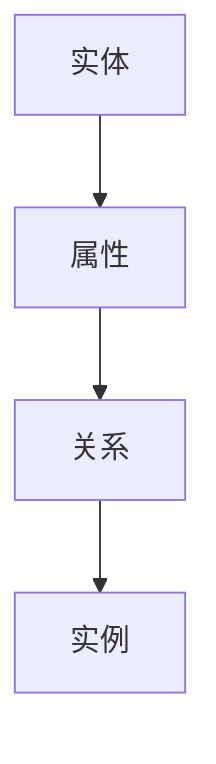
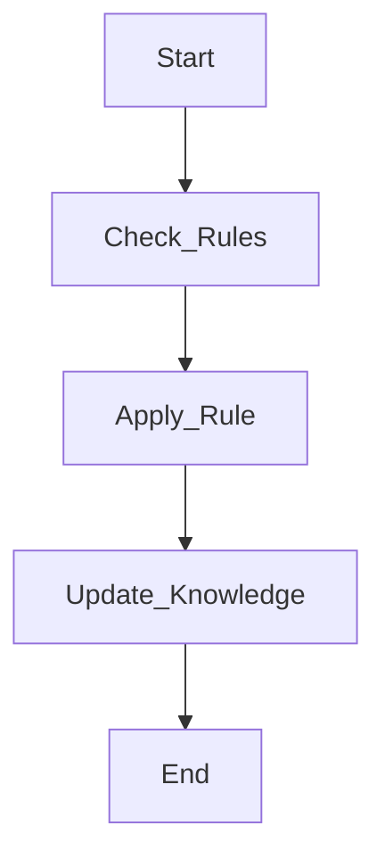
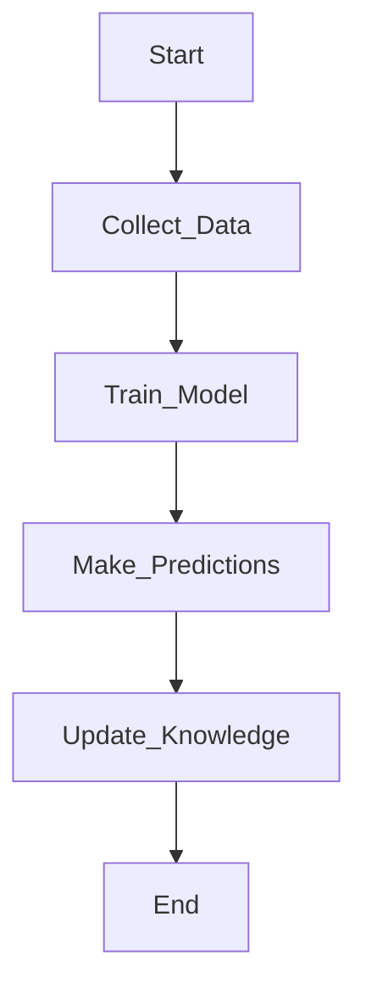
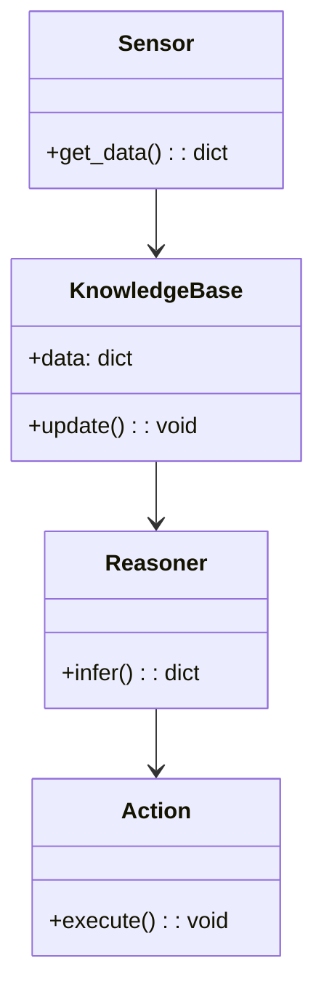
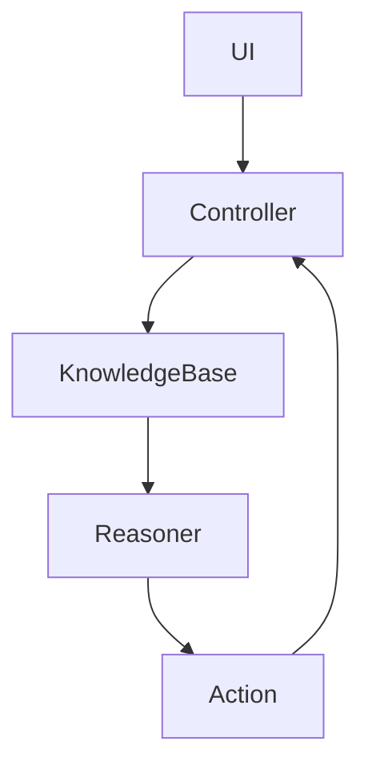
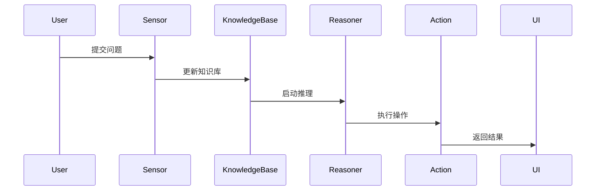

                 


# 构建AI Agent的动态知识推理系统

> 关键词：AI Agent, 动态知识推理, 知识表示, 推理算法, 系统架构

> 摘要：本文详细探讨了构建AI Agent的动态知识推理系统的各个方面，从核心概念到算法原理，再到系统架构设计和项目实战，旨在为读者提供一个全面的指南。通过本文，读者将能够理解动态知识推理的原理，掌握相关的算法实现方法，并学会如何设计和实现一个完整的动态知识推理系统。

---

## 第一部分: AI Agent的动态知识推理系统概述

## 第1章: 问题背景与核心概念

### 1.1 问题背景

#### 1.1.1 当前AI系统面临的挑战
在当前的人工智能系统中，知识表示与推理是一个核心问题。传统的知识表示方法往往依赖于静态的知识库，难以应对动态变化的环境。例如，在智能助手、自动驾驶等领域，系统需要实时处理动态信息，静态知识表示方法显得力不从心。

#### 1.1.2 动态知识推理的必要性
动态知识推理是AI Agent在复杂环境中进行实时决策的核心能力。例如，在智能客服系统中，用户的需求可能随时变化，系统需要根据最新的信息进行推理和决策。

#### 1.1.3 AI Agent的核心目标与应用场景
AI Agent的核心目标是通过动态知识推理，在复杂环境中实现自主决策和问题解决。其应用场景包括智能助手、自动驾驶、智能客服、智能推荐系统等。

### 1.2 核心概念与定义

#### 1.2.1 AI Agent的基本定义
AI Agent是一种能够感知环境、自主决策并采取行动的智能实体。它通过与环境交互，利用感知信息和内部知识库进行推理，以实现预定目标。

#### 1.2.2 动态知识推理的定义与特点
动态知识推理是指在动态变化的环境中，AI Agent能够实时更新和调整其知识库，并基于最新的信息进行推理和决策。其特点包括实时性、自适应性和不确定性处理能力。

#### 1.2.3 系统的边界与外延
动态知识推理系统的边界包括感知模块、知识库、推理引擎和行动模块。其外延则涉及机器学习、自然语言处理等领域。

---

## 第二部分: 核心概念与联系

## 第2章: 动态知识推理系统的核心原理

### 2.1 动态知识推理的原理

#### 2.1.1 知识表示与推理的基本原理
知识表示是动态知识推理的基础。常用的表示方法包括符号逻辑、概率论和知识图谱。推理则是基于这些表示方法，通过逻辑规则或机器学习模型得出结论。

#### 2.1.2 动态知识更新的机制
动态知识更新是通过传感器或外部数据源获取最新信息，并将其与现有知识库进行融合。这需要解决信息冲突和冗余问题。

#### 2.1.3 知识图谱的构建与应用
知识图谱是一种结构化的知识表示方法，能够有效地表示实体之间的关系。动态知识推理系统可以通过知识图谱进行高效的推理和查询。

### 2.2 核心概念对比

#### 2.2.1 动态知识推理与静态知识推理的对比
| 对比维度       | 动态知识推理                     | 静态知识推理                     |
|----------------|--------------------------------|--------------------------------|
| 知识更新       | 实时更新                       | 静态不变                       |
| 环境适应性     | 高                             | 低                             |
| 应用场景       | 动态环境                       | 静态环境                       |

#### 2.2.2 不同推理方法的优缺点对比
| 推理方法       | 基于规则的推理                 | 基于机器学习的推理               |
|----------------|-------------------------------|---------------------------------|
| 优点           | 解释性强，易于部署             | 鲜Context-aware, 处理复杂问题   |
| 缺点           | 需要手动定义规则               | 解释性差，依赖数据质量           |

#### 2.2.3 知识表示与推理的实体关系图



---

## 第三部分: 算法原理讲解

## 第3章: 动态知识推理算法的实现

### 3.1 基于规则的推理算法

#### 3.1.1 算法原理与流程



#### 3.1.2 算法实现的代码示例

```python
def rule_based_inference(knowledge_base):
    for rule in rules:
        if rule.condition met in knowledge_base:
            apply rule.action to knowledge_base
    return updated_knowledge_base
```

#### 3.1.3 算法的优缺点分析
- 优点：解释性强，易于部署。
- 缺点：需要手动定义规则，难以处理复杂问题。

### 3.2 基于机器学习的推理算法

#### 3.2.1 算法原理与流程



#### 3.2.2 算法实现的代码示例

```python
def ml_inference(model, knowledge_base):
    new_data = get_new_data()
    predictions = model.predict(new_data)
    update knowledge_base with predictions
    return updated_knowledge_base
```

#### 3.2.3 算法的优缺点分析
- 优点：能够处理复杂问题，适应性强。
- 缺点：解释性差，依赖数据质量。

---

## 第四部分: 数学模型与公式

## 第4章: 动态知识推理的数学模型

### 4.1 知识表示的数学模型

#### 4.1.1 基于符号逻辑的知识表示
知识表示可以通过逻辑命题表示，例如：
$$ P \rightarrow Q $$

#### 4.1.2 基于概率论的知识表示
概率论的知识表示可以使用贝叶斯网络，例如：
$$ P(A|B) = \frac{P(B|A)P(A)}{P(B)} $$

#### 4.1.3 知识图谱的数学表示
知识图谱可以表示为图结构，节点表示实体，边表示关系：
$$ \text{实体} \rightarrow \text{关系} \rightarrow \text{实体} $$

### 4.2 推理算法的数学公式

#### 4.2.1 基于规则的推理公式
基于规则的推理可以通过逻辑蕴含表示：
$$ P \land (P \rightarrow Q) \rightarrow Q $$

#### 4.2.2 基于机器学习的推理公式
基于机器学习的推理可以使用概率推理公式：
$$ P(Y|X) = \text{模型预测} $$

---

## 第五部分: 系统分析与架构设计

## 第5章: 系统分析与架构设计

### 5.1 问题场景介绍
假设我们正在开发一个智能客服系统，该系统需要实时处理用户的问题，并根据最新的信息进行推理和决策。

### 5.2 系统功能设计

#### 5.2.1 领域模型设计



#### 5.2.2 系统架构设计



#### 5.2.3 系统交互设计



---

## 第六部分: 项目实战

## 第6章: 项目实战

### 6.1 环境安装
需要安装以下工具和库：
- Python 3.8+
- Mermaid CLI
- Jupyter Notebook
- 必要的Python库（如numpy、pandas、scikit-learn）

### 6.2 系统核心实现

#### 6.2.1 知识库实现

```python
class KnowledgeBase:
    def __init__(self):
        self.data = {}

    def update(self, new_data):
        self.data.update(new_data)
```

#### 6.2.2 推理引擎实现

```python
class RuleBasedReasoner:
    def __init__(self, rules):
        self.rules = rules

    def infer(self, knowledge_base):
        for rule in self.rules:
            if rule['condition'](knowledge_base.data):
                knowledge_base.update(rule['action'])
        return knowledge_base.data
```

### 6.3 实际案例分析

#### 6.3.1 案例背景
假设我们正在开发一个智能助手，用户提出一个问题，系统需要实时更新知识库并进行推理。

#### 6.3.2 代码实现

```python
def main():
    knowledge_base = KnowledgeBase()
    rules = [
        {'condition': lambda x: '天气' in x, 'action': {'回答': '查询天气API'}}
    ]
    sensor = Sensor()
    reasoner = RuleBasedReasoner(rules)
    knowledge_base.update(sensor.get_data())
    knowledge_base = reasoner.infer(knowledge_base)
    print(knowledge_base.data)

if __name__ == '__main__':
    main()
```

#### 6.3.3 案例分析
在上述代码中，知识库通过传感器获取最新数据，并通过推理引擎进行推理。推理引擎使用基于规则的方法，根据条件更新知识库。

---

## 第七部分: 总结与展望

## 第7章: 总结与展望

### 7.1 核心内容回顾
本文详细介绍了构建AI Agent的动态知识推理系统的各个方面，包括核心概念、算法原理、系统架构设计和项目实战。

### 7.2 最佳实践 tips
- 确保知识库的实时更新
- 合理选择推理算法
- 定期优化系统架构

### 7.3 小结
动态知识推理是AI Agent实现自主决策的核心能力，通过本文的讲解，读者可以掌握构建动态知识推理系统的相关知识。

### 7.4 注意事项
- 数据更新频率会影响系统性能
- 算法选择需要根据具体场景
- 系统架构设计需要考虑扩展性

### 7.5 拓展阅读
建议读者进一步学习动态知识图谱、实时推理算法和分布式系统架构设计。

---

## 作者：AI天才研究院/AI Genius Institute & 禅与计算机程序设计艺术 /Zen And The Art of Computer Programming

---

以上是构建AI Agent的动态知识推理系统的完整目录和内容框架。每一部分都详细展开了相关主题，并结合实际案例进行了讲解。

