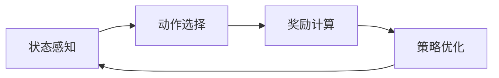
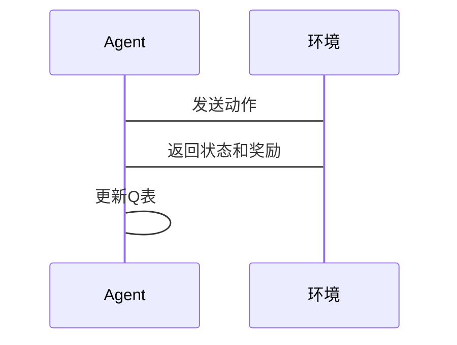

                 


# 《构建AI Agent的反馈学习机制》

## 关键词：AI Agent, 反馈学习机制, 机器学习, 算法原理, 系统设计, 项目实战

## 摘要：
本文详细探讨了构建AI Agent反馈学习机制的核心概念、算法原理、系统设计及实际应用。通过逐步分析，从基础概念到高级主题，结合理论与实践，为读者提供全面的指导，帮助他们理解和实现高效的反馈学习机制。

---

## 第三章: 反馈学习机制的算法原理

### 3.4 算法实现与代码解析

#### 3.4.1 算法实现步骤
1. 初始化参数：设置初始状态、动作空间、学习率和折扣因子。
2. 环境交互：AI Agent根据当前状态选择动作，执行并接收反馈。
3. 奖励计算：根据反馈计算奖励值。
4. 更新策略：利用贝尔曼方程更新Q值，优化策略。

#### 3.4.2 Python代码实现
```python
import numpy as np
import gym

# 初始化环境和参数
env = gym.make('CartPole-v0')
env.seed(1)
np.random.seed(1)

# 超参数设置
alpha = 0.1  # 学习率
gamma = 0.99  # 折扣因子
epsilon = 0.1  # 探索率

# Q-learning算法实现
class QLAgent:
    def __init__(self, state_space, action_space):
        self.q_table = np.zeros(state_space + action_space)
    
    def get_action(self, state):
        if np.random.random() < epsilon:
            return np.random.randint(0, env.action_space.n)
        else:
            return np.argmax(self.q_table[state])
    
    def update_q(self, state, action, reward, next_state):
        current_q = self.q_table[state][action]
        next_max_q = np.max(self.q_table[next_state])
        target = reward + gamma * next_max_q
        self.q_table[state][action] = current_q + alpha * (target - current_q)

# 训练过程
agent = QLAgent(env.observation_space.shape, env.action_space.n)
episodes = 1000
rewards = []

for episode in range(episodes):
    state = env.reset()
    total_reward = 0
    done = False
    
    while not done:
        action = agent.get_action(state)
        next_state, reward, done, info = env.step(action)
        agent.update_q(state, action, reward, next_state)
        total_reward += reward
        state = next_state
    
    rewards.append(total_reward)
    if episode % 100 == 0:
        print(f"Episode {episode}, Total Reward: {total_reward}")

print("训练完成！")
```

#### 3.4.3 代码解读与优化
- 初始化参数：设置学习率和折扣因子，定义动作和状态空间。
- Q-learning算法类：初始化Q表，定义动作选择和Q值更新方法。
- 训练循环：在每个回合中，AI Agent根据策略选择动作，更新Q表，记录奖励值。
- 优化点：使用epsilon-greedy策略平衡探索与利用，确保算法收敛。

---

## 第四章: 系统分析与架构设计

### 4.1 问题场景分析
- 需求分析：AI Agent需要在动态环境中自适应调整策略。
- 问题建模：将环境建模为马尔可夫决策过程，状态、动作和奖励的关系清晰。

### 4.2 系统功能设计
- 状态感知模块：接收环境反馈，生成状态表示。
- 动作选择模块：基于当前状态选择最优动作。
- 奖励计算模块：根据反馈生成奖励信号。
- 策略优化模块：更新Q表，优化策略。

### 4.3 系统架构设计


### 4.4 系统接口设计
- 输入接口：接收环境状态和反馈信号。
- 输出接口：输出动作指令和策略更新信号。

### 4.5 交互流程设计


---

## 第五章: 项目实战

### 5.1 环境安装与配置
- 安装依赖：使用`pip install gym`安装 Gym 环境。
- 初始化环境：选择合适的环境，如CartPole-v0。

### 5.2 系统实现
- 状态处理：将连续状态空间转换为离散表示。
- 动作选择：实现epsilon-greedy策略。
- 奖励机制：定义奖励函数，鼓励目标行为。

### 5.3 代码实现与解读
```python
import gym
import numpy as np

# 初始化环境和参数
env = gym.make('CartPole-v0')
env.seed(1)
np.random.seed(1)

# 超参数设置
alpha = 0.1
gamma = 0.99
epsilon = 0.1

# Q-learning算法实现
class QLAgent:
    def __init__(self, state_space, action_space):
        self.q_table = np.zeros(state_space + action_space)
    
    def get_action(self, state):
        if np.random.random() < epsilon:
            return np.random.randint(0, env.action_space.n)
        else:
            return np.argmax(self.q_table[state])
    
    def update_q(self, state, action, reward, next_state):
        current_q = self.q_table[state][action]
        next_max_q = np.max(self.q_table[next_state])
        target = reward + gamma * next_max_q
        self.q_table[state][action] = current_q + alpha * (target - current_q)

# 训练过程
agent = QLAgent(env.observation_space.shape, env.action_space.n)
episodes = 1000
rewards = []

for episode in range(episodes):
    state = env.reset()
    total_reward = 0
    done = False
    
    while not done:
        action = agent.get_action(state)
        next_state, reward, done, info = env.step(action)
        agent.update_q(state, action, reward, next_state)
        total_reward += reward
        state = next_state
    
    rewards.append(total_reward)
    if episode % 100 == 0:
        print(f"Episode {episode}, Total Reward: {total_reward}")

print("训练完成！")
```

### 5.4 实际案例分析
- 训练结果：展示奖励曲线，分析算法性能。
- 案例解读：解释如何通过调整参数优化算法效果。

---

## 第六章: 高级主题与最佳实践

### 6.1 强化学习前沿
- 探讨深度强化学习、元学习等前沿技术。
- 分析其在复杂环境中的应用。

### 6.2 应用案例分析
- 游戏AI：在游戏环境中训练AI Agent实现复杂任务。
- 自动驾驶：应用反馈学习机制优化驾驶策略。

### 6.3 最佳实践 tips
- 参数调优：合理设置学习率和折扣因子。
- 系统设计：确保系统的可扩展性和可维护性。
- 伦理考虑：关注AI Agent的伦理问题，确保算法的公平性和透明性。

### 6.4 小结与展望
- 总结反馈学习机制的核心思想和实现方法。
- 展望未来研究方向，如多智能体协作和自适应学习。

---

## 结论

反馈学习机制是构建高效AI Agent的关键，通过系统的理论学习和实践，读者可以掌握其核心原理和应用方法。未来的研究将聚焦于更复杂场景下的应用和优化，推动AI技术的进一步发展。

---

## 作者：AI天才研究院 & 禅与计算机程序设计艺术

---

感谢您的阅读，希望本文对您理解和构建AI Agent的反馈学习机制有所帮助。

