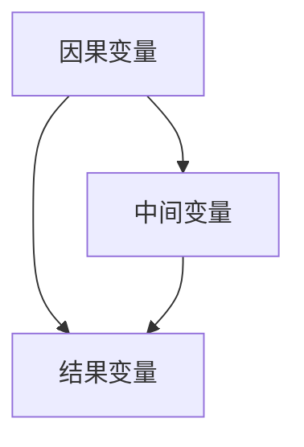
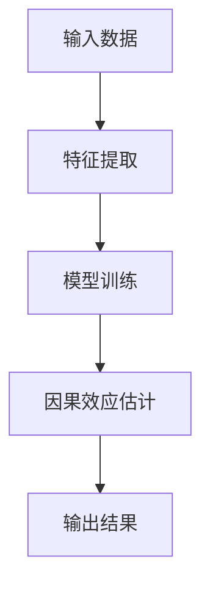
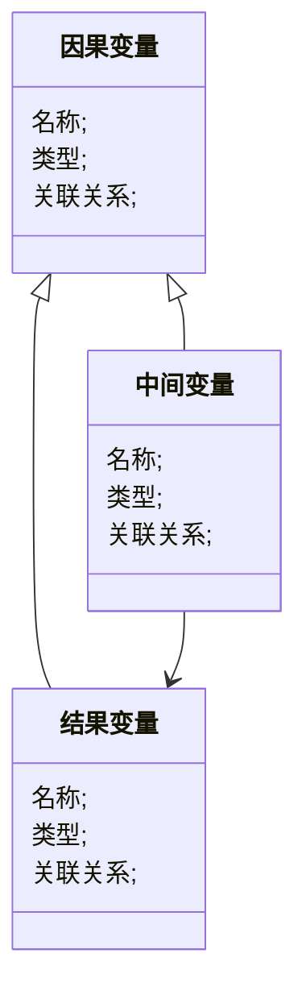
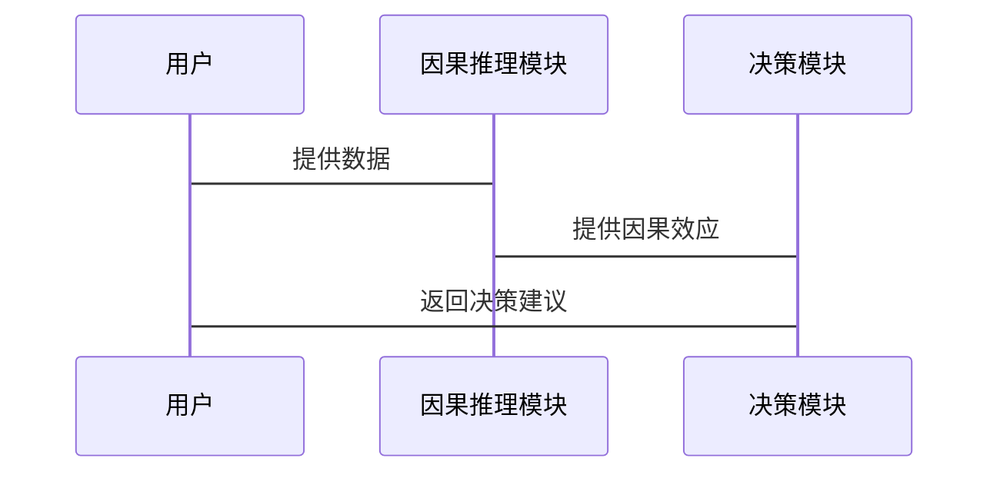

                 


# 构建AI Agent的因果推理模块

> 关键词：因果推理，AI Agent，潜在结果，倾向评分，因果森林

> 摘要：本文详细探讨了构建AI Agent因果推理模块的核心概念、算法原理、系统架构和实战应用。通过理论与实践结合，介绍如何设计和实现具备因果推理能力的AI Agent，涵盖潜在结果模型、倾向评分、因果森林等关键算法，以及系统设计与项目实战。

---

## 第一章：背景介绍

### 1.1 问题背景

#### 1.1.1 AI Agent的基本概念
AI Agent（人工智能代理）是指能够感知环境、自主决策并执行任务的智能实体。AI Agent广泛应用于自动驾驶、智能助手、推荐系统等领域。

#### 1.1.2 因果推理在AI Agent中的重要性
因果推理是理解“为什么”和“如果怎样”的核心能力，使AI Agent能够从经验中学习，并在复杂环境中做出最优决策。

#### 1.1.3 当前AI Agent的挑战与不足
当前AI Agent主要依赖相关性分析，难以处理干预和反事实推理，导致决策鲁莽或不够准确。

### 1.2 问题描述

#### 1.2.1 因果推理的核心问题
因果推理关注因果关系，而非相关性，旨在识别变量间的因果联系。

#### 1.2.2 AI Agent中的因果关系建模
通过因果图建模，AI Agent能够理解变量间的因果关系，提升决策的准确性和可靠性。

#### 1.2.3 问题解决的必要性
因果推理使AI Agent能够进行反事实推理，评估干预效果，增强决策能力。

### 1.3 问题解决

#### 1.3.1 因果推理的基本方法
包括潜在结果模型、倾向评分、因果森林等，这些方法帮助AI Agent理解因果关系。

#### 1.3.2 AI Agent中的因果推理目标
通过因果推理，AI Agent能够预测干预效果，优化决策策略。

#### 1.3.3 解决方案的可行性分析
现有算法和工具为构建因果推理模块提供了坚实基础，但实现复杂，需要跨学科知识。

### 1.4 边界与外延

#### 1.4.1 因果推理的边界条件
因果推理仅处理可观察和可干预的变量，不涉及不可观测的复杂因素。

#### 1.4.2 AI Agent的外延范围
AI Agent的因果推理模块是其决策系统的一部分，与其他模块如感知、规划协同工作。

#### 1.4.3 相关领域的区别与联系
因果推理与统计学习、机器学习等密切相关，但关注因果关系，区别在于相关性分析。

### 1.5 核心概念与核心要素

#### 1.5.1 因果推理的核心概念
因果关系是事件间的影响关系，因果推理是识别和建模这种关系的过程。

#### 1.5.2 AI Agent的核心要素
包括感知、决策、执行、学习和自适应能力，因果推理模块是其关键组成部分。

#### 1.5.3 概念结构与核心要素组成
AI Agent的因果推理模块由因果图、潜在结果模型、倾向评分算法等构成，协同工作以实现因果推理。

---

## 第二章：核心概念与联系

### 2.1 因果推理的基本原理

#### 2.1.1 因果关系的定义
因果关系是指一个事件是另一个事件的原因，因果推理旨在识别这些关系。

#### 2.1.2 因果图的基本结构
因果图（Directed Acyclic Graph, DAG）展示变量间的因果关系，节点代表变量，边代表因果影响。

#### 2.1.3 潜在结果框架
潜在结果框架（Potential Outcome Framework）用于建模每个变量的可能结果，帮助识别因果效应。

### 2.2 核心概念对比

#### 2.2.1 因果关系与相关关系对比
| 对比维度 | 因果关系 | 相关关系 |
|----------|----------|----------|
| 定义     | 变量间的影响关系 | 变量间的统计关联 |
| 目标     | 确定因果效应 | 描述变量间的关系 |
| 方法     | 因果图、潜在结果 | 相关分析、回归 |

#### 2.2.2 确定性因果与概率因果对比
确定性因果假设因果关系明确，概率因果考虑不确定性，更适用于复杂场景。

#### 2.2.3 因果推理与统计学习对比
因果推理关注因果机制，统计学习关注数据模式，两者结合可提升模型性能。

### 2.3 实体关系图



---

## 第三章：算法原理讲解

### 3.1 潜在结果模型

#### 3.1.1 潜在结果的定义
潜在结果是变量在不同处理下的可能结果，用于建模因果效应。

#### 3.1.2 潜在结果的估计方法
常用方法包括匹配估计量和回归调整，用于估计平均处理效应（ATE）和有条件处理效应（CATE）。

#### 3.1.3 潜在结果与因果效应的关系
通过比较潜在结果，识别因果效应，评估干预效果。

### 3.2 倾向评分

#### 3.2.1 倾向评分的定义
倾向评分是变量接受处理的概率，用于平衡对照组和处理组的可比性。

#### 3.2.2 倾向评分的估计方法
常用Logistic回归估计倾向评分，用于匹配或加权分析。

#### 3.2.3 倾向评分在因果推理中的应用
通过倾向评分调整，减少混杂变量影响，提高因果效应估计的准确性。

### 3.3 因果森林

#### 3.3.1 因果森林的定义
因果森林是一种非参数因果推断方法，用于估计个体处理效应。

#### 3.3.2 因果森林的构建过程
通过数据驱动方式构建森林模型，估计每个样本的个体处理效应。

#### 3.3.3 因果森林的应用场景
适用于高维数据和复杂因果关系，提供个体化因果效应评估。

### 3.4 算法实现

#### 3.4.1 Python代码实现

```python
import numpy as np
from causal_forests import CausalForest

X = np.random.rand(100, 5)
y = np.random.rand(100, 1)
cf = CausalForest()
cf.fit(X, y)
```

#### 3.4.2 算法流程图



### 3.5 数学模型与公式

#### 3.5.1 潜在结果公式
$$ Y_i^{do(X)} = \text{潜在结果在处理 } X \text{ 下} $$

#### 3.5.2 倾向评分公式
$$ P(T=1|X) = \text{Logit回归估计} $$

#### 3.5.3 因果森林公式
$$ \hat{\tau}_i = \text{个体处理效应估计} $$

---

## 第四章：系统分析与架构设计

### 4.1 问题场景介绍

#### 4.1.1 系统介绍
AI Agent因果推理系统旨在通过因果图建模，评估干预效果，辅助决策。

#### 4.1.2 问题场景
系统需处理多变量因果关系，支持反事实推理，提供干预建议。

### 4.2 系统功能设计

#### 4.2.1 领域模型


#### 4.2.2 系统架构


#### 4.2.3 接口设计


---

## 第五章：项目实战

### 5.1 环境安装

#### 5.1.1 Python环境
安装必要的库，如`causal-forest`和`numpy`，使用`pip install`命令。

### 5.2 系统核心实现

#### 5.2.1 核心代码
```python
import numpy as np
from causal_forests import CausalForest

# 生成数据
X = np.random.rand(100, 5)
y = np.random.rand(100, 1)

# 初始化模型
cf = CausalForest()

# 训练模型
cf.fit(X, y)

# 预测因果效应
effects = cf.predict(X)
```

#### 5.2.2 代码解读
模型训练使用因果森林算法，预测结果为个体处理效应，用于评估干预效果。

### 5.3 案例分析

#### 5.3.1 数据分析
分析因果效应分布，识别关键影响因素。

#### 5.3.2 结果解读
解释因果效应的意义，评估干预措施的有效性。

### 5.4 项目总结

#### 5.4.1 项目经验
因果推理模块的实现需要数据质量高，模型调参复杂，但效果显著。

#### 5.4.2 改进建议
未来可结合强化学习，提升因果推理的动态适应性。

---

## 第六章：最佳实践

### 6.1 小结

因果推理模块是AI Agent的核心，提升决策能力的关键。

### 6.2 注意事项

数据质量、模型选择和结果解释是实现中的关键点，需谨慎处理。

### 6.3 拓展阅读

推荐阅读因果推断的经典文献和工具书籍，深入理解因果推理的理论与实践。

---

## 作者

作者：AI天才研究院 & 禅与计算机程序设计艺术

---

通过以上内容，本文系统地介绍了构建AI Agent因果推理模块的各个方面，从理论到实践，为读者提供了深入的指导和见解。

