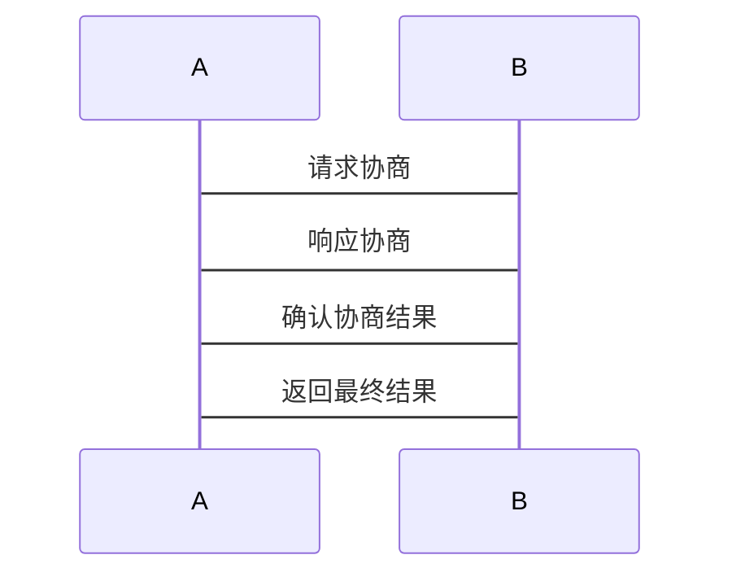

                 


# 构建AI Agent的多Agent协商与决策系统

## 关键词：多Agent系统、AI Agent、协商与决策、分布式系统、系统架构

## 摘要：本文详细探讨了构建AI Agent的多Agent协商与决策系统的核心概念、算法原理、系统架构及项目实战。通过背景介绍、核心概念对比、算法流程图、系统架构图和项目案例分析，系统性地讲解了多Agent协商与决策系统的构建过程和关键实现细节。

---

# 第一部分: 多Agent系统与AI Agent概述

## 第1章: 多Agent系统的基本概念

### 1.1 多Agent系统概述

#### 1.1.1 多Agent系统的定义与特点
多Agent系统是由多个智能体（Agent）组成的分布式系统，这些智能体能够自主感知环境、协作完成任务。其特点包括：
- **自主性**：Agent能够独立决策。
- **反应性**：能够实时感知环境并做出反应。
- **协作性**：多个Agent协同工作，完成复杂任务。
- **分布式**：系统中不存在集中控制节点。

#### 1.1.2 多Agent系统的核心要素
- **Agent**：系统的基本单位，负责感知和行动。
- **环境**：Agent所处的外部世界，可能包含其他Agent。
- **通信机制**：Agent之间交换信息的渠道。
- **协商与决策机制**：Agent达成一致并做出决策的过程。

#### 1.1.3 多Agent系统与传统单体系统的主要区别
| 特性               | 单体系统               | 多Agent系统              |
|--------------------|------------------------|--------------------------|
| 结构               | 单一控制中心           | 分布式结构，无中心节点    |
| 可扩展性           | 较差，扩展受限          | 较好，易于扩展           |
| 故障容错性         | 较差，单点故障风险高     | 较好，部分Agent故障不影响整体 |
| 适应性             | 较低，系统响应较慢       | 较高，Agent可动态调整策略 |

### 1.2 AI Agent的定义与分类

#### 1.2.1 AI Agent的基本概念
AI Agent是一种能够感知环境、执行任务的智能实体，具备以下特征：
- **感知**：通过传感器或接口获取环境信息。
- **推理**：基于感知信息做出决策。
- **行动**：执行决策，影响环境或与其他Agent交互。

#### 1.2.2 基于AI的Agent分类
根据智能体的复杂性和决策能力，AI Agent可以分为以下几类：
1. **反应式Agent**：基于当前感知做出即时反应，不依赖历史信息。
2. **认知式Agent**：具备复杂的推理能力，能够处理复杂任务。
3. **协作式Agent**：专门用于多Agent协作环境，能够与其他Agent协商。

#### 1.2.3 多Agent系统中Agent的角色与功能
- **领导型Agent**：负责协调和决策。
- **执行型Agent**：负责具体任务的执行。
- **监督型Agent**：负责监控系统运行状态。

### 1.3 多Agent协商与决策系统的背景与应用

#### 1.3.1 协商与决策系统的定义
多Agent协商与决策系统是指多个智能体通过通信和协作，共同达成一致并做出决策的系统。

#### 1.3.2 多Agent协商与决策系统的应用场景
- **分布式计算**：如分布式系统中的任务分配。
- **机器人协作**：如智能机器人在工厂中的协作。
- **智能家居**：家庭设备之间的协作与决策。

#### 1.3.3 当前研究与实践的热点问题
- **协商算法的效率优化**。
- **决策算法的鲁棒性提升**。
- **多Agent系统的可扩展性研究**。

---

## 第2章: 多Agent系统的核心概念与联系

### 2.1 多Agent系统的核心概念

#### 2.1.1 Agent的结构与行为
- **Agent的生命周期**：感知、推理、决策、行动。
- **Agent的状态**：内部知识库和外部环境状态。

#### 2.1.2 多Agent系统的通信机制
- **通信协议**：如JSON-RPC、HTTP。
- **消息传递**：Agent之间通过消息传递信息。

#### 2.1.3 多Agent协商与决策的基本原理
协商过程包括：
1. **信息交换**：Agent之间共享信息。
2. **冲突检测**：发现可能的冲突。
3. **协商解决**：通过协商达成一致。

### 2.2 多Agent系统的核心要素对比

#### 2.2.1 Agent的属性特征对比
| 特性       | 反应式Agent       | 认知式Agent       |
|------------|-------------------|-------------------|
| 感知能力   | 较弱              | 较强              |
| 推理能力   | 无或简单          | 复杂              |
| 决策能力   | 即时反应          | 基于知识推理      |

#### 2.2.2 多Agent系统的ER实体关系图
```mermaid
erd
    顾客
    订单
    产品
    供应商
    项目
    任务
```

---

## 第3章: 多Agent协商与决策算法原理

### 3.1 协商算法的基本原理

#### 3.1.1 分布式协商算法
协商过程包括：
1. **初始化**：所有Agent初始化状态。
2. **信息交换**：Agent之间共享信息。
3. **冲突检测**：检测是否存在冲突。
4. **协商解决**：通过协商达成一致。

#### 3.1.2 基于规则的协商算法
- **规则定义**：如“如果A和B冲突，则优先选择A”。
- **规则执行**：根据规则自动解决冲突。

#### 3.1.3 基于博弈论的协商算法
- **纳什均衡**：所有Agent达成一致，无法通过单方面改变策略而受益。
- **实现过程**：通过博弈树分析，找到纳什均衡点。

### 3.2 决策算法的核心原理

#### 3.2.1 基于状态机的决策算法
- **状态转移**：根据当前状态和输入，转移到下一个状态。
- **状态机设计**：使用状态转移图表示。

#### 3.2.2 基于概率的决策算法
- **概率计算**：基于历史数据计算概率。
- **决策规则**：如“选择概率最高的选项”。

#### 3.2.3 基于强化学习的决策算法
- **Q-learning算法**：通过奖励机制优化决策。
- **状态动作空间**：定义状态和动作空间。

---

## 第4章: 多Agent系统架构与设计

### 4.1 系统架构设计

#### 4.1.1 多Agent系统的功能模块划分
- **感知模块**：负责获取环境信息。
- **推理模块**：基于感知信息进行推理。
- **决策模块**：根据推理结果做出决策。

#### 4.1.2 系统的通信机制设计
- **通信协议**：如HTTP、WebSocket。
- **消息队列**：如RabbitMQ、Kafka。

#### 4.1.3 系统的集成与测试方案
- **模块化测试**：分别测试各个模块。
- **集成测试**：测试系统整体功能。

### 4.2 系统接口与交互设计

#### 4.2.1 系统接口的设计原则
- **RESTful API**：遵循REST原则设计接口。
- **版本控制**：确保接口版本兼容性。

#### 4.2.2 系统交互的序列图设计


---

## 第5章: 多Agent协商与决策系统的项目实战

### 5.1 项目环境与工具安装

#### 5.1.1 开发环境的搭建
- **操作系统**：Linux或Windows。
- **开发工具**：IntelliJ IDEA、PyCharm。

#### 5.1.2 必要工具与库的安装
- **Python库**：Flask、Django。
- **消息队列**：RabbitMQ、Kafka。

#### 5.1.3 环境配置
```bash
pip install flask
pip install rabbitmq
```

### 5.2 系统核心代码实现

#### 5.2.1 协商算法实现
```python
def negotiate(agent1, agent2):
    # 信息交换
    info1 = agent1.get_info()
    info2 = agent2.get_info()
    # 冲突检测
    if info1.conflict_with(info2):
        # 协商解决
        result = agent1.resolve_conflict(info1, info2)
        return result
    else:
        return info1, info2
```

#### 5.2.2 决策算法实现
```python
class DecisionAgent:
    def decide(self, state):
        # 状态分析
        if state == 'conflict':
            return 'resolve'
        else:
            return 'proceed'
```

### 5.3 案例分析与总结

#### 5.3.1 项目案例分析
- **案例背景**：多Agent系统中的任务分配。
- **案例实现**：使用协商算法分配任务。
- **结果分析**：协商效率和准确性。

#### 5.3.2 项目总结
- **优缺点分析**：协商算法的效率和系统架构的可扩展性。
- **改进建议**：优化协商算法，提升系统性能。

---

## 第6章: 多Agent协商与决策系统的最佳实践

### 6.1 小结
- **核心要点**：多Agent系统的构建需要考虑协商算法、决策算法和系统架构设计。
- **注意事项**：系统设计要注重模块化和可扩展性。

### 6.2 注意事项
- **性能优化**：合理设计通信机制，减少延迟。
- **安全性**：确保Agent之间的通信安全。

### 6.3 未来趋势与拓展阅读
- **未来趋势**：强化学习在多Agent系统中的应用。
- **推荐书籍**：《Multi-Agent Systems: Algorithm and Applications》。

---

## 作者：AI天才研究院 & 禅与计算机程序设计艺术

---

以上是整篇文章的详细目录和内容框架，确保了每部分内容的完整性和深度。希望这篇文章能为读者提供清晰的思路和实用的技术指导。

