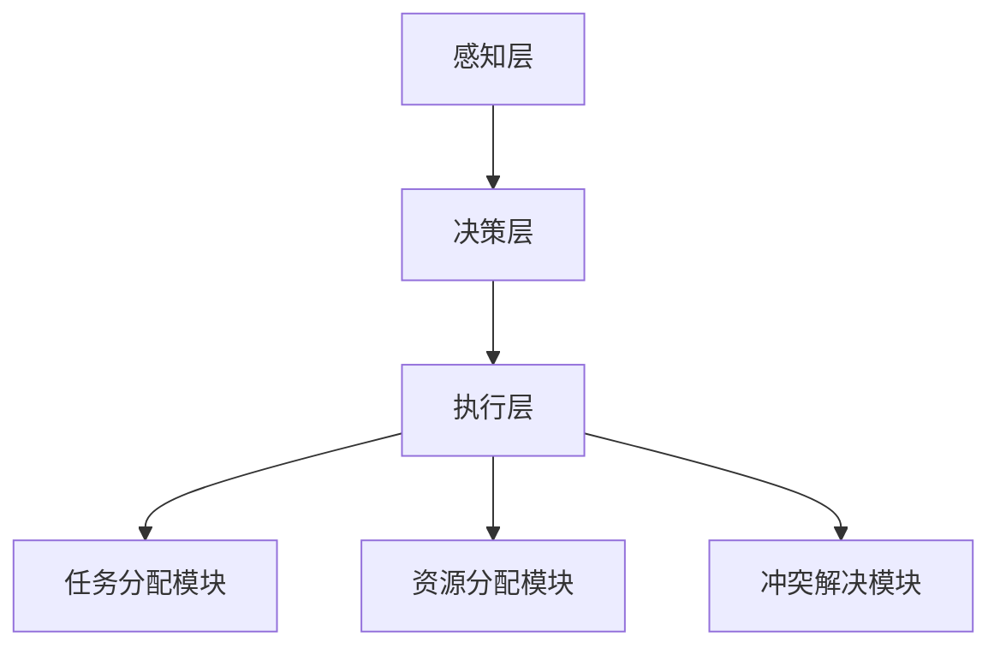

                 


# 构建AI Agent的多Agent竞争与合作框架

## 关键词
- AI Agent
- 多Agent系统
- 竞争与合作
- 分布式计算
- 博弈论
- 系统架构设计
- 竞争机制

## 摘要
构建AI Agent的多Agent竞争与合作框架是一个复杂而重要的任务，涉及AI Agent的基本概念、多Agent系统的设计原则、竞争与合作机制的实现等多方面的内容。本文将从AI Agent的基本概念出发，逐步深入探讨多Agent系统中的竞争与合作框架，结合实际案例分析，详细讲解如何构建一个高效、稳定的多Agent系统。

---

## 第一部分: AI Agent与多Agent系统基础

### 第1章: AI Agent的基本概念

#### 1.1 AI Agent的定义与特点

##### 1.1.1 AI Agent的定义
AI Agent（人工智能代理）是指能够感知环境并采取行动以实现目标的智能实体。AI Agent可以是软件程序、机器人或其他智能系统，其核心目标是通过自主决策和行动来优化任务完成效果。

##### 1.1.2 AI Agent的核心特点
- **自主性**：AI Agent能够自主决策，无需外部干预。
- **反应性**：能够实时感知环境并做出反应。
- **目标导向**：所有行为都以实现特定目标为导向。
- **社会性**：能够与其他Agent或人类进行交互和协作。

##### 1.1.3 AI Agent与传统AI的区别
传统AI（如专家系统）依赖于预定义的规则和数据，而AI Agent具备自主性和目标导向性，能够在动态环境中主动适应和调整行为。

---

#### 1.2 多Agent系统的基本概念

##### 1.2.1 多Agent系统的定义
多Agent系统（Multi-Agent System, MAS）是由多个相互作用的AI Agent组成的分布式系统，这些Agent通过协作和竞争共同完成复杂的任务。

##### 1.2.2 多Agent系统的主要特点
- **分布式性**：Agent之间分布在网络中，不存在中心控制节点。
- **协作性**：Agent之间通过协作提高整体系统的性能。
- **动态性**：环境和任务目标可能随时变化，Agent需要动态调整策略。

##### 1.2.3 多Agent系统的分类
- **基于任务的多Agent系统**：Agent之间协作完成特定任务。
- **基于市场的多Agent系统**：Agent通过市场机制进行资源分配和任务协调。
- **基于社会的多Agent系统**：Agent之间模拟社会行为，如角色扮演和角色分配。

---

### 第2章: 多Agent系统中的竞争与合作

#### 2.1 竞争机制

##### 2.1.1 竞争的定义与作用
竞争是指多个Agent在同一资源或目标上争夺优势的过程。竞争机制能够通过资源分配的优化提高系统的效率。

##### 2.1.2 多Agent系统中的竞争模型
- **资源分配竞争**：Agent争夺有限资源（如计算资源、数据访问权限）。
- **任务优先级竞争**：Agent根据任务的重要性竞争执行顺序。

##### 2.1.3 竞争机制的设计原则
- **公平性**：确保每个Agent都有机会获得资源。
- **效率性**：竞争机制不应成为系统性能的瓶颈。
- **可扩展性**：支持大量Agent同时参与竞争。

#### 2.2 合作机制

##### 2.2.1 合作的定义与作用
合作是指多个Agent为了共同目标而协同工作的过程。合作机制能够通过信息共享和任务分配提高系统的整体性能。

##### 2.2.2 多Agent系统中的合作模型
- **任务分配合作**：Agent之间通过协商分配任务。
- **信息共享合作**：Agent之间共享信息以提高决策的准确性。

##### 2.2.3 合作机制的设计原则
- **信息共享机制**：确保Agent之间的信息流通。
- **任务分配机制**：根据Agent的能力和当前状态分配任务。
- **冲突解决机制**：在合作过程中处理可能出现的冲突。

---

## 第三部分: 多Agent系统中的竞争与合作框架

### 第3章: 竞争与合作机制的实现

#### 3.1 竞争机制的实现

##### 3.1.1 竞争算法的设计
竞争机制的核心算法可以基于博弈论和分布式计算。例如，基于纳什均衡的资源分配算法。

##### 3.1.2 竞争算法的实现步骤
1. 定义竞争目标和资源。
2. 设计竞争规则和策略。
3. 实现竞争机制的算法。

##### 3.1.3 竞争机制的数学模型
资源分配竞争的数学模型可以表示为：
$$
\text{资源分配} = \arg\max_{i} (v_i)
$$
其中，\( v_i \) 是Agent \( i \) 的价值函数。

#### 3.2 合作机制的实现

##### 3.2.1 合作算法的设计
合作机制可以基于任务分配和信息共享。例如，基于Dijkstra算法的任务分配算法。

##### 3.2.2 合作算法的实现步骤
1. 确定合作目标和任务。
2. 设计合作规则和策略。
3. 实现合作机制的算法。

##### 3.2.3 合作机制的数学模型
任务分配合作的数学模型可以表示为：
$$
\text{任务分配} = \arg\min_{i} (c_i)
$$
其中，\( c_i \) 是Agent \( i \) 的任务成本。

---

### 第4章: 竞争与合作机制的综合应用

#### 4.1 多Agent系统的综合架构

##### 4.1.1 系统架构设计
多Agent系统的架构设计需要考虑模块化、可扩展性和容错性。例如，采用分层架构，将系统分为感知层、决策层和执行层。

##### 4.1.2 系统功能设计
系统功能设计需要考虑Agent之间的协作和竞争，例如：
- 任务分配模块
- 资源分配模块
- 冲突解决模块

##### 4.1.3 系统架构图（Mermaid）


#### 4.2 竞争与合作机制的结合

##### 4.2.1 竞争与合作的平衡
在多Agent系统中，竞争与合作需要平衡，以避免过度竞争或过度合作。

##### 4.2.2 竞争与合作的动态调整
根据系统状态动态调整竞争与合作的策略。

---

## 第四部分: 项目实战

### 第5章: 项目实战与分析

#### 5.1 项目环境与工具安装

##### 5.1.1 环境要求
- Python 3.8+
- pip
- Mermaid
- PyCharm

##### 5.1.2 工具安装
```bash
pip install mermaid
```

#### 5.2 核心代码实现

##### 5.2.1 竞争机制的实现代码
```python
def competitive_resource Allocation(agents, resources):
    # 竞争规则：优先分配资源给价值最高的Agent
    agent_values = {agent: compute_value(agent, resources) for agent in agents}
    sorted_agents = sorted(agents, key=lambda x: -agent_values[x])
    allocated_resources = {}
    for agent in sorted_agents:
        allocated_resources[agent] = resources.pop(0)
    return allocated_resources
```

##### 5.2.2 合作机制的实现代码
```python
def collaborative_task_allocation(agents, tasks):
    # 合作规则：根据能力分配任务
    agentCapabilities = {agent: compute_capability(agent, tasks) for agent in agents}
    sorted_agents = sorted(agents, key=lambda x: -agentCapabilities[x])
    allocated_tasks = {}
    for agent in sorted_agents:
        allocated_tasks[agent] = tasks.pop(0)
    return allocated_tasks
```

#### 5.3 项目案例分析

##### 5.3.1 案例背景
假设我们有一个多Agent系统，需要分配任务给多个Agent。

##### 5.3.2 竞争与合作机制的应用
通过竞争机制分配有限资源，通过合作机制完成复杂任务。

#### 5.4 案例分析与总结
竞争与合作机制的结合能够显著提高系统的效率和性能。

---

## 第五部分: 总结与展望

### 第6章: 总结与展望

#### 6.1 总结
本文详细介绍了构建AI Agent的多Agent竞争与合作框架的核心概念和实现方法，通过理论分析和实际案例，展示了如何设计和实现一个多Agent系统。

#### 6.2 展望
未来的研究可以进一步探索竞争与合作机制的动态调整和优化，同时结合边缘计算和雾计算等新技术，构建更加高效和智能的多Agent系统。

---

## 作者
作者：AI天才研究院/AI Genius Institute  
作者：禅与计算机程序设计艺术/Zen And The Art of Computer Programming

