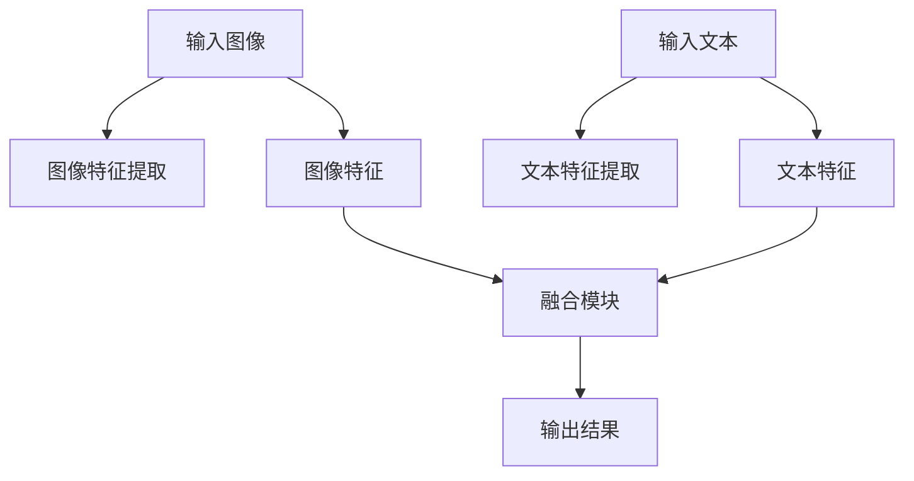
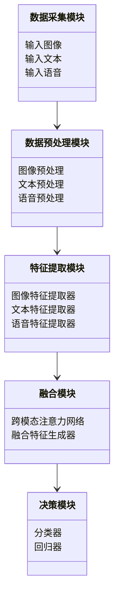
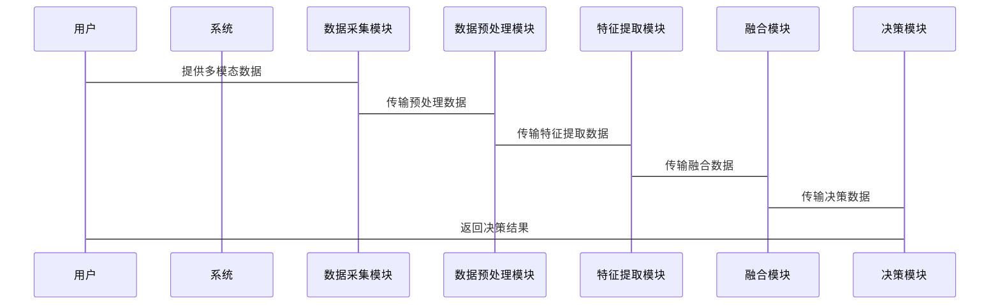

                 


# 构建AI Agent的多模态感知系统

> 关键词：AI Agent，多模态感知，数据融合，深度学习，系统架构

> 摘要：本文将详细探讨如何构建一个基于多模态感知的AI Agent系统。通过分析多模态数据的融合方法、核心算法的设计与实现、系统架构的规划，以及项目实战案例，我们将全面了解如何打造一个高效、智能的AI Agent。文章内容涵盖从基础概念到系统实现的各个方面，为读者提供系统的指导和实践参考。

---

# 第一部分: AI Agent与多模态感知系统基础

## 第1章: AI Agent的基本概念与多模态感知的背景

### 1.1 AI Agent的定义与核心特征

AI Agent（人工智能代理）是一种能够感知环境、做出决策并执行动作的智能实体。它可以是一个软件程序、机器人或任何能够与环境交互的智能系统。AI Agent的核心特征包括：

1. **自主性**：能够在没有外部干预的情况下自主运行。
2. **反应性**：能够实时感知环境并做出相应的反应。
3. **目标导向**：具有明确的目标，并根据目标采取行动。
4. **学习能力**：能够通过经验或数据不断优化自身的性能。

AI Agent的应用场景非常广泛，例如自动驾驶汽车、智能助手（如Siri、Alexa）、智能推荐系统等。

### 1.2 多模态感知的背景与意义

多模态感知是指AI Agent能够同时处理和理解多种类型的数据模态，如图像、文本、语音、传感器数据等。与单一模态感知相比，多模态感知能够提供更全面的信息，从而提高AI Agent的感知能力和决策准确性。

多模态感知的意义在于：
1. **提高感知准确性**：通过融合多种模态的信息，AI Agent能够更准确地理解和判断环境。
2. **增强鲁棒性**：单一模态的局限性可以通过其他模态的数据来弥补，从而提高系统的鲁棒性。
3. **扩展应用场景**：多模态感知能够支持更多的应用场景，例如智能安防、医疗诊断、机器人控制等。

### 1.3 多模态感知在AI Agent中的应用

在AI Agent中，多模态感知主要应用于以下几个方面：
1. **环境感知**：通过多模态数据（如图像、语音、传感器数据）感知环境中的物体、场景和事件。
2. **用户意图理解**：通过融合用户的语言、行为和环境信息，理解用户的意图并做出相应的反应。
3. **决策优化**：基于多模态数据的融合，优化AI Agent的决策过程，提高决策的准确性和效率。

---

## 第2章: 多模态数据的融合与处理

### 2.1 多模态数据的类型与特点

多模态数据主要包括以下几种类型：
1. **图像数据**：包括RGB图像、深度图像等，用于视觉感知。
2. **文本数据**：包括自然语言文本、关键词、短语等，用于语言理解。
3. **语音数据**：包括音频信号，用于语音识别和声纹分析。
4. **传感器数据**：包括来自各类传感器（如温度、加速度等）的数据，用于环境感知。

每种数据模态都有其独特的优势和局限性，例如图像数据具有丰富的空间信息，但对语义理解能力较弱；文本数据具有强大的语义表达能力，但缺乏空间和时间信息。

### 2.2 多模态数据的融合方法

多模态数据的融合方法主要分为以下几类：
1. **基于特征融合的方法**：将不同模态的数据特征进行融合，例如通过加权平均、拼接等方式将图像和文本的特征向量进行融合。
2. **基于模型融合的方法**：在不同的模态上分别构建模型，然后将模型的输出结果进行融合，例如通过投票、加权融合等方式。
3. **基于注意力机制的融合方法**：通过注意力机制对不同模态的信息进行加权，突出重要信息，例如在图像和文本融合中，注意力机制可以关注图像中与文本相关的区域。

### 2.3 多模态数据处理的数学模型

在多模态数据处理中，常用的数学模型包括：
1. **图像处理模型**：如卷积神经网络（CNN），用于图像特征提取。
2. **文本处理模型**：如Transformer模型，用于文本特征提取和生成。
3. **融合模型**：如多模态注意力网络，用于不同模态数据的融合与交互。

例如，在图像和文本的融合中，可以使用以下数学表达式：
$$
\text{融合特征} = \alpha \cdot \text{图像特征} + \beta \cdot \text{文本特征}
$$
其中，$\alpha$ 和 $\beta$ 是通过注意力机制学习得到的权重。

---

## 第3章: 多模态感知系统的核心算法

### 3.1 多模态数据的表示方法

多模态数据的表示方法包括：
1. **图像表示**：通过CNN提取图像的特征向量。
2. **文本表示**：通过词嵌入（如Word2Vec、BERT）提取文本的特征向量。
3. **融合表示**：通过融合模型将不同模态的特征向量进行融合，得到统一的表示。

### 3.2 多模态数据的特征提取算法

常用的特征提取算法包括：
1. **图像特征提取**：使用ResNet、VGG等CNN模型提取图像特征。
2. **文本特征提取**：使用BERT、GPT等模型提取文本特征。
3. **融合特征提取**：通过多模态Transformer网络提取融合特征。

### 3.3 多模态数据的分类与回归算法

在多模态数据的分类与回归任务中，常用的算法包括：
1. **多任务学习**：同时学习多个任务，共享特征提取部分，提高模型的泛化能力。
2. **对抗训练**：通过生成对抗网络（GAN）进行模态间的对抗训练，提高模型的鲁棒性。
3. **联合学习**：将不同模态的特征进行联合建模，例如使用多模态图神经网络进行分类。

---

# 第二部分: 多模态感知系统的算法实现

## 第4章: 多模态数据融合的算法实现

### 4.1 图像与文本融合的算法

图像与文本的融合算法主要包括以下几种：
1. **图像到文本的注意力机制**：通过图像特征指导文本生成，例如图像描述生成。
2. **文本到图像的生成模型**：通过文本描述生成对应的图像，例如图像生成模型（GAN）。
3. **联合表示模型**：通过多模态表示模型将图像和文本特征进行联合表示。

### 4.2 多模态数据融合的数学模型

在多模态数据融合中，常用的数学模型包括：
1. **跨模态注意力机制**：
$$
\text{注意力权重} = \text{softmax}(\text{图像特征} \cdot \text{文本特征})
$$
2. **多模态生成模型**：
$$
\text{生成输出} = \text{生成器}(\text{图像特征} + \text{文本特征})
$$
3. **融合模型的损失函数**：
$$
\text{总损失} = \lambda_1 \cdot \text{图像损失} + \lambda_2 \cdot \text{文本损失}
$$

### 4.3 算法实现的代码示例

以下是一个多模态数据融合的Python代码示例：

```python
import tensorflow as tf
from tensorflow.keras import layers

def multi_modal_network(image_input, text_input, alpha=0.5):
    # 图像分支
    image_features = layers.Conv2D(32, (3,3), activation='relu')(image_input)
    image_features = layers.MaxPooling2D((2,2))(image_features)
    image_features = layers.Flatten()(image_features)
    image_features = layers.Dense(64, activation='relu')(image_features)

    # 文本分支
    text_features = layers.Dense(64, activation='relu')(text_input)

    # 融合
    fused_features = layers.Concatenate()([image_features, text_features])
    output = layers.Dense(1, activation='sigmoid')(fused_features)

    return output

# 输入定义
image_input = layers.Input(shape=(64, 64, 3))
text_input = layers.Input(shape=(100,))

# 模型构建
output = multi_modal_network(image_input, text_input)
model = tf.keras.Model(inputs=[image_input, text_input], outputs=output)

# 编译模型
model.compile(optimizer='adam', loss='binary_crossentropy', metrics=['accuracy'])
```

### 4.4 算法实现的系统架构

以下是多模态数据融合的系统架构图：



---

## 第5章: 多模态感知系统的系统架构设计

### 5.1 系统功能设计

多模态感知系统的功能模块包括：
1. **数据采集模块**：负责采集多模态数据，如图像、文本、语音等。
2. **数据预处理模块**：对采集到的数据进行清洗、归一化等预处理。
3. **特征提取模块**：对预处理后的数据进行特征提取，如使用CNN、Transformer等模型。
4. **融合模块**：将不同模态的特征进行融合，得到统一的特征表示。
5. **决策模块**：基于融合后的特征进行分类、回归等任务，输出决策结果。

### 5.2 系统架构设计

以下是多模态感知系统的系统架构图：



### 5.3 系统接口设计

多模态感知系统的接口设计包括：
1. **数据输入接口**：接收多模态数据，如图像、文本、语音等。
2. **模型接口**：提供特征提取、融合和决策模块的接口，供上层应用调用。
3. **结果输出接口**：输出决策结果，如分类标签、回归值等。

### 5.4 系统交互设计

以下是多模态感知系统的交互序列图：



---

## 第6章: 多模态感知系统的项目实战

### 6.1 环境安装与配置

为了运行多模态感知系统，首先需要安装以下环境和工具：
1. **Python**：建议使用Python 3.7或更高版本。
2. **TensorFlow**：用于深度学习模型的训练和部署。
3. **Keras**：用于构建和训练深度学习模型。
4. **OpenCV**：用于图像处理。
5. **自然语言处理库**：如NLTK、spaCy，用于文本处理。

### 6.2 系统核心实现

以下是多模态感知系统的Python实现代码示例：

```python
import tensorflow as tf
from tensorflow.keras import layers
import cv2
import numpy as np
from tensorflow.keras.preprocessing.text import Tokenizer

# 图像数据预处理
def preprocess_image(image_path):
    image = cv2.imread(image_path)
    image = cv2.resize(image, (64, 64))
    image = image / 255.0
    return image

# 文本数据预处理
def preprocess_text(text):
    tokenizer = Tokenizer(num_words=1000)
    tokenizer.fit_on_texts([text])
    text_sequence = tokenizer.texts_to_sequences([text])[0]
    return text_sequence

# 多模态模型构建
def multi_modal_model():
    # 图像输入
    image_input = layers.Input(shape=(64, 64, 3))
    x = layers.Conv2D(32, (3,3), activation='relu')(image_input)
    x = layers.MaxPooling2D((2,2))(x)
    x = layers.Flatten()(x)
    x = layers.Dense(64, activation='relu')(x)

    # 文本输入
    text_input = layers.Input(shape=(None,))
    x_text = layers.Embedding(1000, 64)(text_input)
    x_text = layers.GlobalAveragePooling1D()(x_text)

    # 融合
    merged = layers.Concatenate()([x, x_text])
    output = layers.Dense(1, activation='sigmoid')(merged)

    model = tf.keras.Model(inputs=[image_input, text_input], outputs=output)
    return model

# 模型训练
def train_model(model, image_data, text_data, labels):
    model.compile(optimizer='adam', loss='binary_crossentropy', metrics=['accuracy'])
    model.fit([image_data, text_data], labels, epochs=10, batch_size=32)

# 主程序
if __name__ == '__main__':
    # 加载数据
    image_data = np.array([preprocess_image('image1.jpg'), preprocess_image('image2.jpg')])
    text_data = np.array(['This is a test text.', 'Another test text.'])
    labels = np.array([1, 0])

    # 构建模型
    model = multi_modal_model()

    # 开始训练
    train_model(model, image_data, text_data, labels)
```

### 6.3 代码实现与分析

上述代码实现了一个简单的多模态感知系统，主要包括以下步骤：
1. **图像数据预处理**：将图像 resize 并归一化。
2. **文本数据预处理**：使用Tokenizer对文本进行分词和编码。
3. **多模态模型构建**：构建一个包含图像分支和文本分支的多模态模型，使用Concatenate层将两个分支的输出进行融合。
4. **模型训练**：使用训练数据对模型进行训练，优化目标为二分类任务。

### 6.4 实际案例分析

假设我们有一个图像分类任务，其中图像和文本描述是相关联的。例如，给定一张猫的图像和一段描述“这只猫是橘色的”，模型需要通过图像和文本的融合来分类这只猫是否为橘色。

### 6.5 系统小结

通过上述实战案例，我们可以看到，多模态感知系统的核心在于如何有效地融合不同模态的数据，从而提高模型的性能和准确性。在实际应用中，需要根据具体场景选择合适的融合方法和算法。

---

# 第三部分: 多模态感知系统的扩展与展望

## 第7章: 多模态感知系统的扩展与未来研究方向

### 7.1 当前研究热点

当前，多模态感知系统的研究热点包括：
1. **跨模态对抗学习**：通过对抗训练提高模态间的信息共享和互补性。
2. **多模态图神经网络**：将多模态数据建模为图结构，利用图神经网络进行特征提取和融合。
3. **自适应融合方法**：根据不同的场景和任务动态调整融合策略。

### 7.2 未来研究方向

未来，多模态感知系统的研究方向可能包括：
1. **更高效的融合方法**：探索更高效的特征融合方法，减少计算复杂度。
2. **多模态实时处理**：研究如何在实时场景中高效处理多模态数据。
3. **多模态人机交互**：研究如何通过多模态感知实现更自然的人机交互。

### 7.3 当前技术的局限性与挑战

当前多模态感知系统面临的主要挑战包括：
1. **计算资源限制**：多模态数据的处理需要大量的计算资源，尤其是在实时场景中。
2. **数据异构性**：不同模态的数据具有不同的格式和特征，如何有效融合这些数据是一个难题。
3. **模型解释性**：多模态模型的复杂性导致其解释性较差，难以满足实际应用中的需求。

---

## 第8章: 多模态感知系统的最佳实践与注意事项

### 8.1 最佳实践

在构建多模态感知系统时，需要注意以下几点：
1. **数据预处理**：对不同模态的数据进行标准化处理，确保数据的可比性和一致性。
2. **模型选择**：根据具体任务选择合适的模型和算法，避免过度复杂的模型。
3. **融合策略**：根据任务需求选择合适的融合策略，如注意力机制、对抗训练等。
4. **性能评估**：通过多种指标（如准确率、F1分数等）对模型性能进行评估，确保模型的泛化能力。

### 8.2 注意事项

在实际应用中，需要注意以下几点：
1. **数据隐私**：在处理多模态数据时，需要考虑数据的隐私性和安全性。
2. **计算资源**：确保系统有足够的计算资源来处理多模态数据。
3. **模型部署**：在实际部署时，需要考虑模型的实时性和可扩展性。

### 8.3 未来研究方向与展望

未来，随着深度学习技术的不断发展，多模态感知系统将朝着更高效、更智能的方向发展。研究者们将致力于解决当前技术的局限性，推动多模态感知系统在更多领域的应用。

---

# 结语

通过本文的详细讲解，我们了解了如何构建一个基于多模态感知的AI Agent系统。从基础概念到算法实现，再到系统架构和项目实战，我们系统地探讨了多模态感知系统的各个方面。希望本文能够为读者提供有价值的指导和启发，帮助他们在实际应用中更好地构建和优化多模态感知系统。

---

# 作者信息

作者：AI天才研究院/AI Genius Institute & 禅与计算机程序设计艺术 /Zen And The Art of Computer Programming

---

# 参考文献

1. LeCun, Y., Bengio, Y., & Hinton, G. (2015). Deep learning. Nature, 521(7555), 436-444.
2. Vaswani, A., et al. (2017). Attention is all you need. Advances in neural information processing systems, 30.
3. Krizhevsky, A., Sutskever, I., & Hinton, G. E. (2012). ImageNet classification with deep convolutional neural networks. Communications of the ACM, 55(8), 32-37.

---

# 拓展阅读

1. [《Deep Learning》](https://www.deeplearningbook.org/)
2. [《Attention Is All You Need》](https://arxiv.org/abs/1706.03762)
3. [《多模态数据融合的挑战与机遇》](https://link.springer.com/article/10.1007/s10044-020-00880-z)

---

感谢您的阅读！如果对本文有任何疑问或建议，请随时与我们联系！

