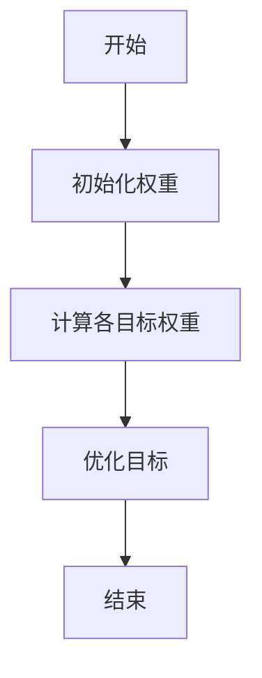
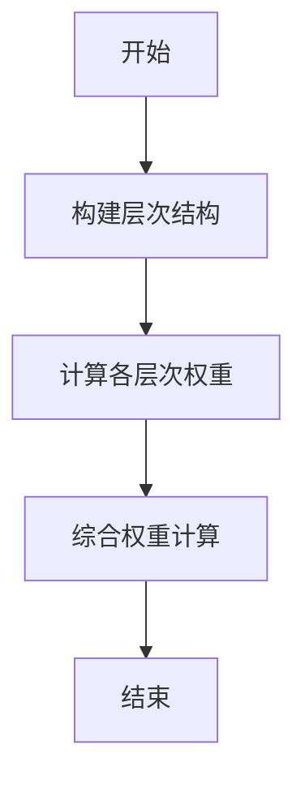
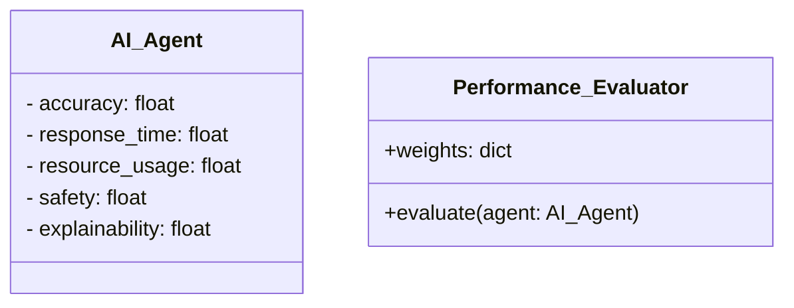
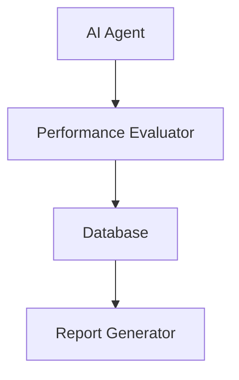
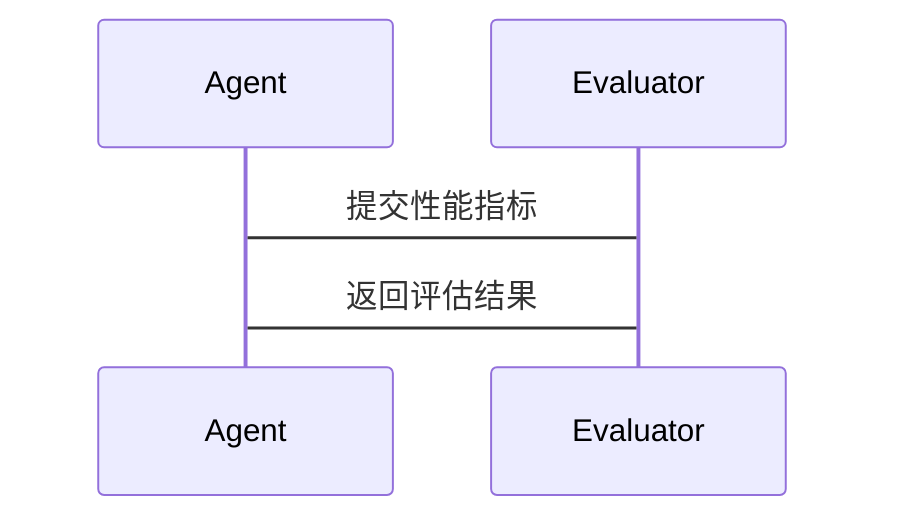

                 


# 构建AI Agent的多维度性能评估体系

> 关键词：AI Agent，多维度性能评估，系统性能，性能指标，评估体系，智能系统评价

> 摘要：本文探讨了构建AI Agent多维度性能评估体系的重要性与方法，通过分析AI Agent的核心概念、多维度评估维度及其相互关系，结合具体案例，详细阐述了基于多目标优化和层次分析法的评估算法，提出了系统架构设计与实现方案，并总结了实际应用中的最佳实践。

---

## 第一部分: AI Agent与多维度性能评估体系概述

### 第1章: AI Agent的背景与概念

#### 1.1 问题背景与挑战
##### 1.1.1 AI Agent的定义与核心概念
AI Agent（人工智能代理）是指能够感知环境、自主决策并执行任务的智能实体。它可以是一个软件程序、机器人或任何具备人工智能功能的系统。AI Agent的核心目标是通过感知和行动来优化特定目标的实现。

##### 1.1.2 当前AI Agent应用中的问题与挑战
当前，AI Agent在许多领域得到了广泛应用，但也面临着一些问题：
- **性能评估单一化**：传统评估体系往往只关注单一维度（如准确率），忽略了其他重要指标（如响应时间、安全性）。
- **维度之间的冲突**：不同评估维度之间可能存在冲突，例如高准确率可能意味着高计算资源消耗。
- **动态环境适应性**：AI Agent需要在不断变化的环境中动态调整策略，这对评估体系的实时性和灵活性提出了更高要求。

##### 1.1.3 多维度性能评估的必要性与意义
多维度性能评估体系的构建能够帮助我们全面、客观地评价AI Agent的能力，从而为优化设计和实际应用提供有力支持。

#### 1.2 多维度性能评估体系的构建目标
##### 1.2.1 评估体系的核心目标
构建一个多维度、全面、可量化的评估体系，涵盖AI Agent的性能、效率、可解释性、安全性等多个维度。

##### 1.2.2 体系构建的边界与外延
评估体系的边界包括AI Agent的设计、开发、测试和部署阶段，外延则涉及实际应用场景中的用户需求和业务目标。

##### 1.2.3 体系的核心要素与组成结构
多维度性能评估体系的核心要素包括：
1. **评估维度**：准确率、响应时间、资源消耗、可解释性等。
2. **评估指标**：量化每个维度的具体指标。
3. **评估方法**：多目标优化、层次分析法等。

---

### 第2章: AI Agent与多维度性能评估的关系

#### 2.1 AI Agent的类型与特点
##### 2.1.1 基于规则的AI Agent
基于预定义的规则进行决策，适用于简单、静态的任务环境。

##### 2.1.2 基于模型的AI Agent
通过构建领域知识模型进行推理和决策，适用于复杂、动态的任务环境。

##### 2.1.3 基于强化学习的AI Agent
通过与环境的交互和奖励机制优化决策策略，适用于需要动态调整的任务。

##### 2.1.4 基于生成模型的AI Agent
利用生成对抗网络等技术生成多样化的行为方案，适用于需要创造性和多样性的任务。

#### 2.2 多维度性能评估的核心维度
##### 2.2.1 评估维度的分类与特征
1. **准确性**：AI Agent输出结果的正确性。
2. **响应时间**：AI Agent执行任务的快慢。
3. **资源消耗**：AI Agent运行过程中使用的计算资源。
4. **可解释性**：AI Agent决策过程的透明度。
5. **安全性**：AI Agent行为的安全性，避免负面后果。

##### 2.2.2 各维度之间的关系与依赖
通过分析各维度之间的关系，可以构建一个权重分配模型，确保各维度的均衡优化。

---

## 第二部分: 多维度性能评估体系的算法原理

### 第3章: 多维度性能评估的算法原理

#### 3.1 多目标优化算法
##### 3.1.1 多目标优化的基本原理
多目标优化是一种在多个目标之间寻找最优解的优化方法，适用于评估维度较多且相互冲突的情况。

##### 3.1.2 多目标优化的数学模型
$$ \text{目标函数：} f(x) = (f_1(x), f_2(x), ..., f_n(x)) $$
$$ \text{约束条件：} g_i(x) \leq 0, h_j(x) = 0 $$

##### 3.1.3 基于权重的多目标优化算法
通过为每个目标分配权重，将多目标问题转化为单目标优化问题。

#### 3.2 层次分析法（AHP）
##### 3.2.1 层次分析法的基本原理
AHP通过构建层次结构，将复杂问题分解为多个子问题，并通过权重分配进行综合评估。

##### 3.2.2 层次分析法的数学模型
$$ A = \{a_{ij}\} \text{，其中} a_{ij} \text{表示第i个因素对第j个因素的相对重要性} $$
$$ \text{权重计算：} w_i = \frac{\sum a_{ij}}{\sum \sum a_{ij}} $$

---

### 第4章: 算法实现与代码分析

#### 4.1 多目标优化算法实现
##### 4.1.1 算法流程图（mermaid）


##### 4.1.2 Python实现代码
```python
import numpy as np

def multi_objective_optimization(objectives, weights):
    optimized = []
    for obj, weight in zip(objectives, weights):
        optimized.append(obj * weight)
    return sum(optimized)
```

#### 4.2 层次分析法实现
##### 4.2.1 算法流程图（mermaid）


##### 4.2.2 Python实现代码
```python
def ahp_analysis(criteria, alternatives):
    # 计算比较矩阵
    comparison_matrix = np.zeros((len(criteria), len(criteria)))
    for i in range(len(criteria)):
        for j in range(len(criteria)):
            comparison_matrix[i][j] = criteria[i] / criteria[j]
    # 计算权重
    weights = np.mean(comparison_matrix, axis=0)
    return weights
```

---

### 第5章: 数学模型与公式

#### 5.1 多目标优化模型
##### 5.1.1 多目标优化的数学表达式
$$ \text{目标函数：} f(x) = (f_1(x), f_2(x), ..., f_n(x)) $$
$$ \text{约束条件：} g_i(x) \leq 0, h_j(x) = 0 $$

#### 5.2 层次分析法模型
##### 5.2.1 层次分析法的权重计算公式
$$ w_i = \frac{\sum a_{ij}}{\sum \sum a_{ij}} $$

---

## 第三部分: 系统分析与架构设计

### 第6章: 系统分析与架构设计

#### 6.1 问题场景介绍
以自动驾驶AI Agent为例，构建一个多维度性能评估体系，涵盖安全性、响应时间、资源消耗等维度。

#### 6.2 系统功能设计
##### 6.2.1 领域模型类图（mermaid）


#### 6.3 系统架构设计
##### 6.3.1 系统架构图（mermaid）


#### 6.4 系统接口设计
##### 6.4.1 接口描述
- 输入：AI Agent的各项性能指标。
- 输出：综合评估结果。

##### 6.4.2 交互流程（mermaid）


---

## 第四部分: 项目实战

### 第7章: 项目实战

#### 7.1 环境安装
安装必要的Python库，如numpy、scipy等。

#### 7.2 系统核心实现源代码
##### 7.2.1 评估类实现
```python
class PerformanceEvaluator:
    def __init__(self, weights):
        self.weights = weights
    
    def evaluate(self, agent):
        score = 0
        for metric, weight in self.weights.items():
            score += getattr(agent, metric) * weight
        return score
```

##### 7.2.2 评估结果分析
```python
# 示例评估结果
agent = {
    'accuracy': 0.95,
    'response_time': 0.1,
    'resource_usage': 0.2,
    'safety': 0.8,
    'explainability': 0.7
}

weights = {
    'accuracy': 0.3,
    'response_time': 0.2,
    'resource_usage': 0.15,
    'safety': 0.25,
    'explainability': 0.1
}

score = sum([metric * weight for metric, weight in zip(agent.keys(), weights.values())])
print(f"综合得分：{score}")
```

#### 7.3 案例分析
以自动驾驶AI Agent为例，详细分析各项指标的权重分配和评估结果。

---

## 第五部分: 最佳实践与总结

### 第8章: 最佳实践

#### 8.1 小结
构建一个多维度性能评估体系需要综合考虑多个维度的权重分配和优化算法的选择。

#### 8.2 注意事项
- 确保评估维度的全面性和适用性。
- 在实际应用中动态调整权重和评估指标。

#### 8.3 未来趋势
随着AI技术的发展，多维度性能评估体系将更加智能化和动态化。

#### 8.4 拓展阅读
推荐阅读《多目标优化算法及其应用》、《层次分析法在智能系统中的应用》等书籍。

---

## 作者：AI天才研究院/AI Genius Institute & 禅与计算机程序设计艺术/Zen And The Art of Computer Programming

---

通过以上内容，我们详细探讨了构建AI Agent多维度性能评估体系的核心概念、算法原理、系统架构和实际应用。希望本文能够为读者提供有价值的参考和启发。

