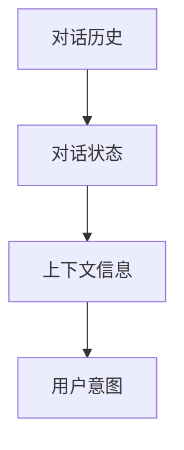
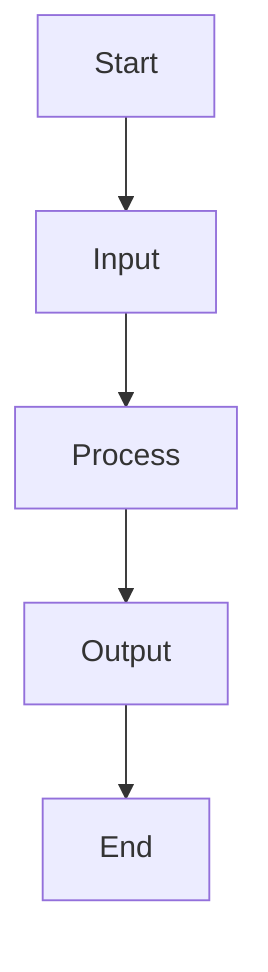
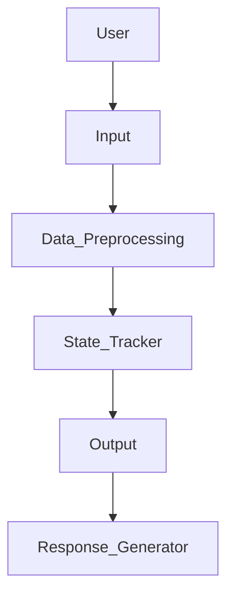
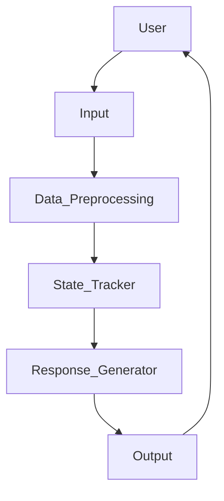

                 


# 构建AI Agent的多轮对话状态跟踪系统

## 关键词：AI Agent, 多轮对话, 状态跟踪, 对话系统, 状态管理

## 摘要：  
多轮对话状态跟踪是构建高效AI Agent的核心技术之一。本文将从背景、核心概念、算法原理、系统架构到项目实战，全面解析如何构建一个多轮对话状态跟踪系统。文章详细探讨了状态跟踪的重要性、实现方法、系统设计以及实际应用案例，帮助读者深入理解并掌握这一技术。

---

# 第一部分: 构建AI Agent的多轮对话状态跟踪系统背景介绍

## 第1章: 多轮对话状态跟踪系统概述

### 1.1 问题背景

#### 1.1.1 多轮对话的定义与特点
- 多轮对话是指用户与系统之间进行的连续交互，通常涉及多个轮次的输入和输出。
- 特点：
  - 连续性：对话跨越多个轮次。
  - 上下文依赖：后续轮次的信息依赖于之前的对话历史。
  - 动态性：对话状态会随着每次交互而变化。

#### 1.1.2 状态跟踪在对话系统中的重要性
- 状态跟踪是理解用户意图、提供准确回复的基础。
- 通过跟踪对话状态，系统能够保持上下文信息，确保每次交互的连贯性。
- 状态跟踪直接影响用户体验和系统的准确性。

#### 1.1.3 当前对话系统的主要挑战
- 对话历史的复杂性：随着轮次增加，对话历史变得复杂。
- 状态表示的多样性：如何有效表示多样的对话状态。
- 实时更新的难度：在实时交互中快速更新状态。

### 1.2 问题描述

#### 1.2.1 多轮对话中的状态表示
- 状态表示方法：
  - 基于关键词：简单但可能丢失语义信息。
  - 基于向量：使用嵌入技术表示状态。
  - 基于规则：通过预定义规则表示状态。

#### 1.2.2 对话历史与上下文的关系
- 对话历史是上下文的重要组成部分。
- 上下文还包括外部知识库的信息。

#### 1.2.3 状态跟踪的边界与外延
- 状态跟踪的边界：仅关注当前对话的状态。
- 外延：与意图识别、对话管理密切相关。

### 1.3 问题解决

#### 1.3.1 状态跟踪的核心目标
- 准确捕捉对话中的关键信息。
- 维护对话的连贯性。
- 为后续交互提供上下文支持。

#### 1.3.2 状态跟踪的主要方法
- 基于规则的方法：适用于简单场景。
- 统计方法：如HMM、CRF。
- 深度学习方法：如Transformer模型。

#### 1.3.3 状态跟踪的实现步骤
1. 数据收集与预处理。
2. 状态表示方法的选择。
3. 对话历史的存储与管理。
4. 状态更新与维护。

### 1.4 概念结构与核心要素

#### 1.4.1 对话系统的整体架构
- 输入层：接收用户输入。
- 处理层：包括意图识别、状态跟踪。
- 输出层：生成回复。

#### 1.4.2 状态跟踪的核心要素
- 对话历史：记录用户输入和系统回复。
- 当前状态：基于对话历史推断的状态。
- 上下文信息：包括用户偏好、外部知识。

#### 1.4.3 状态跟踪与其他模块的关系
- 与意图识别：共享对话历史。
- 与对话管理：提供状态信息以生成回复。

---

## 第2章: 多轮对话状态跟踪的核心概念与联系

### 2.1 核心概念原理

#### 2.1.1 对话状态的表示方法
- 文本表示：直接使用文本描述状态。
- 向量表示：使用嵌入向量表示状态。

#### 2.1.2 状态转移的机制
- 基于转移矩阵：如HMM模型。
- 基于注意力机制：如Transformer模型。

#### 2.1.3 对话历史的作用
- 提供上下文信息。
- 帮助推断当前状态。

### 2.2 概念属性特征对比表格

| 概念 | 定义 | 特征 |
|------|------|------|
| 对话状态 | 当前对话的关键信息 | 动态性、上下文依赖 |
| 对话历史 | 所有之前的对话记录 | 静态性、完整性 |
| 意图识别 | 确定用户的意图 | 单轮性、准确性 |

### 2.3 ER实体关系图架构


---

# 第二部分: 多轮对话状态跟踪系统的算法原理

## 第3章: 算法原理讲解

### 3.1 算法选择与原理

#### 3.1.1 基于HMM的状态跟踪算法
- HMM（隐马尔可夫模型）用于处理序列数据。
- 适用于状态转移的建模。

#### 3.1.2 基于Transformer的对话状态跟踪
- Transformer模型通过自注意力机制捕捉全局信息。
- 适用于长对话的上下文捕捉。

#### 3.1.3 算法的优缺点对比
| 算法 | 优点 | 缺点 |
|------|------|------|
| HMM | 简单高效 | 无法处理长距离依赖 |
| Transformer | 强大的上下文捕捉 | 计算资源消耗大 |

### 3.2 算法流程图


### 3.3 算法实现代码

#### 3.3.1 HMM算法实现
```python
def track_state(input_sequence):
    states = ['state1', 'state2', 'state3']
    start_prob = {'state1': 0.6, 'state2': 0.4, 'state3': 0.0}
    trans_prob = {
        'state1': {'state1': 0.7, 'state2': 0.2, 'state3': 0.1},
        'state2': {'state1': 0.1, 'state2': 0.6, 'state3': 0.3},
        'state3': {'state1': 0.0, 'state2': 0.4, 'state3': 0.6}
    }
    # 简单实现，仅返回最后一个状态
    return states[-1]
```

#### 3.3.2 Transformer模型实现
```python
import torch
class Transformer(nn.Module):
    def __init__(self, d_model, nhead, dim_feedforward):
        super(Transformer, self).__init__()
        self.encoder_layer = nn.TransformerEncoderLayer(d_model=d_model, nhead=nhead, dim_feedforward=dim_feedforward)
        self.decoder_layer = nn.TransformerDecoderLayer(d_model=d_model, nhead=nhead, dim_feedforward=dim_feedforward)

    def forward(self, x):
        encoded = self.encoder_layer(x)
        decoded = self.decoder_layer(encoded)
        return decoded
```

### 3.4 算法的数学模型和公式

#### 3.4.1 HMM模型
- 状态转移概率：
  $$ P(s_t|s_{t-1}) $$
- 观察概率：
  $$ P(o_t|s_t) $$

#### 3.4.2 Transformer模型
- 自注意力机制：
  $$ \text{Attention}(Q, K, V) = \text{softmax}\left(\frac{QK^T}{\sqrt{d_k}}\right)V $$

---

## 第4章: 系统分析与架构设计

### 4.1 系统分析

#### 4.1.1 问题场景介绍
- 项目目标：构建一个多轮对话状态跟踪系统。
- 需求分析：支持多轮对话、准确跟踪状态。

#### 4.1.2 系统功能设计
- 功能模块：
  - 数据预处理模块。
  - 状态跟踪模块。
  - 状态更新模块。

#### 4.1.3 系统架构设计


#### 4.1.4 系统接口设计
- 输入接口：接收用户输入。
- 输出接口：提供状态信息。

#### 4.1.5 系统交互流程图


---

## 第5章: 项目实战

### 5.1 项目实战

#### 5.1.1 环境安装
- 安装Python和相关库：
  ```bash
  pip install numpy torch transformers
  ```

#### 5.1.2 系统核心代码实现
```python
class StateTracker:
    def __init__(self):
        self.states = []

    def update_state(self, input_text):
        # 处理输入，更新状态
        self.states.append(input_text)
        return self.states[-1]

    def get_current_state(self):
        return self.states[-1] if self.states else None
```

#### 5.1.3 代码解读
- `StateTracker`类：
  - `update_state`：处理输入并更新状态。
  - `get_current_state`：获取当前状态。

#### 5.1.4 实际案例分析
- 示例对话：
  1. 用户：我需要预订机票。
  2. 系统：请问您的目的地是哪里？
  3. 用户：上海。
  4. 系统：请问出发日期是什么时候？

#### 5.1.5 小结
- 状态跟踪是实现高效对话系统的关键。
- 实际应用中需考虑系统的实时性和准确性。

---

## 第6章: 总结与展望

### 6.1 总结
- 本文详细探讨了多轮对话状态跟踪系统的设计与实现。
- 强调了状态跟踪的重要性及其在对话系统中的核心作用。

### 6.2 最佳实践
- 状态表示要简洁且能捕捉关键信息。
- 在实际应用中，需结合具体场景优化算法。

### 6.3 小结
- 状态跟踪是构建智能对话系统的重要技术。
- 未来的研究方向包括更高效的算法和更准确的状态表示方法。

### 6.4 注意事项
- 注意对话历史的存储与管理。
- 避免信息过载和计算复杂度过高。

### 6.5 拓展阅读
- 推荐阅读相关书籍和论文，深入研究对话系统和自然语言处理技术。

---

## 作者：AI天才研究院 & 禅与计算机程序设计艺术

---

**本文总结：** 通过本文的详细讲解，读者可以全面了解构建AI Agent的多轮对话状态跟踪系统的各个方面，包括背景、算法、系统设计和项目实战。希望本文能为相关领域的研究和实践提供有价值的参考。

