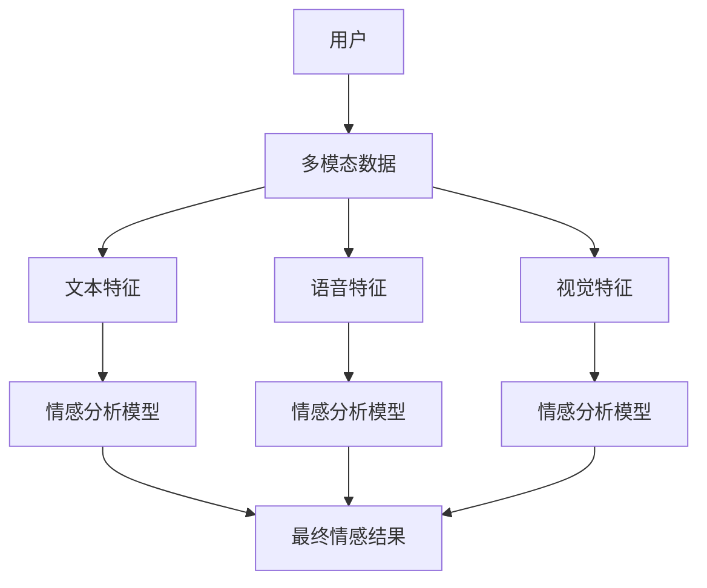
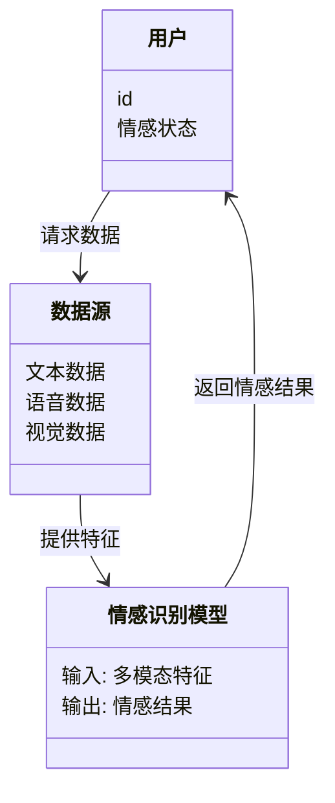
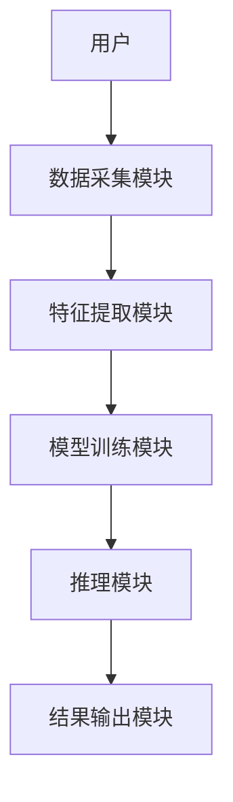
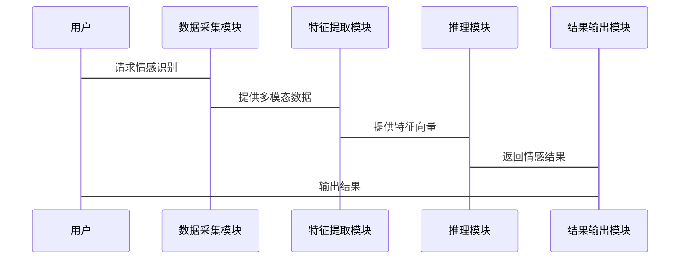

                 


# 构建AI Agent的实时多模态情感识别系统

> 关键词：AI Agent, 多模态情感识别, 实时处理, 深度学习, 系统架构

> 摘要：本文详细探讨了如何构建一个基于AI Agent的实时多模态情感识别系统。文章从背景知识入手，分析了多模态情感识别的核心概念与算法原理，详细讲解了系统架构设计，并通过项目实战展示了如何实现该系统。文章最后总结了构建此类系统的关键点和未来发展方向。

---

## 第一章: AI Agent与实时多模态情感识别系统概述

### 1.1 AI Agent的基本概念

#### 1.1.1 AI Agent的定义与特点
AI Agent（人工智能代理）是指能够感知环境、自主决策并执行任务的智能实体。其特点包括自主性、反应性、目标导向和社交能力。

#### 1.1.2 多模态情感识别的定义与特点
多模态情感识别是指通过整合多种数据源（如文本、语音、视觉）来分析和识别情感状态。其特点包括高准确性、实时性和多维度分析。

#### 1.1.3 实时情感识别的背景与意义
随着AI技术的发展，实时情感识别在人机交互、智能客服、教育等领域具有重要应用价值。它能够提升用户体验，增强系统的智能化水平。

---

## 第二章: 多模态情感识别的核心概念

### 2.1 多模态数据的特征分析

#### 2.1.1 文本特征
文本特征包括词汇选择、句法结构和语义信息。例如，情感词典中的词汇可以帮助识别文本情感倾向。

#### 2.1.2 语音特征
语音特征包括音调、语速和音量。例如，高音调和快速说话可能表示兴奋或紧张。

#### 2.1.3 视觉特征
视觉特征包括面部表情、姿态和眼神交流。例如，微笑和眼神接触通常表示积极情绪。

### 2.2 情感识别的多模态融合方法

#### 2.2.1 特征级融合
特征级融合是指在数据预处理阶段将不同模态的特征进行整合。例如，将文本中的词袋模型与语音的基频分析相结合。

#### 2.2.2 模型级融合
模型级融合是指在训练阶段将不同模态的特征分别输入不同的模型，然后将结果进行融合。例如，使用多个神经网络分别处理文本、语音和视觉数据。

#### 2.2.3 决策级融合
决策级融合是指在最终决策阶段将不同模态的情感识别结果进行整合。例如，使用加权投票法对多模态结果进行融合。

### 2.3 多模态情感识别的ER实体关系图


---

## 第三章: 多模态情感识别的算法原理

### 3.1 文本情感识别算法

#### 3.1.1 基于词袋模型的文本特征提取
词袋模型是一种简单有效的文本特征提取方法，它将文本表示为单词的频率向量。例如：
$$
X = \{x_1, x_2, ..., x_n\}, \text{其中 } x_i \text{ 表示单词 } i \text{ 的出现次数}
$$

#### 3.1.2 基于深度学习的文本情感分类
使用卷积神经网络（CNN）或循环神经网络（RNN）进行文本情感分类。例如：
$$
\text{输入: } x \in \mathbb{R}^{d} \\
\text{输出: } y \in \{0, 1\} \text{ 表示负面或正面情感}
$$`

#### 3.1.3 示例代码实现
```python
from sklearn.feature_extraction.text import CountVectorizer
from sklearn.linear_model import LogisticRegression

# 示例代码
text = "I love this book"
vectorizer = CountVectorizer()
X = vectorizer.fit_transform([text])
model = LogisticRegression()
model.fit(X, [1])
```

### 3.2 语音情感识别算法

#### 3.2.1 语音特征提取
提取语音特征，如梅尔频率倒谱系数（MFCC）。例如：
$$
\text{输入: } audio \text{ 信号} \\
\text{输出: } MFCC = [f_1, f_2, ..., f_n]
$$`

#### 3.2.2 基于深度学习的语音分类
使用循环神经网络（RNN）或长短期记忆网络（LSTM）进行语音情感分类。例如：
$$
\text{输入: } MFCC \text{ 向量} \\
\text{输出: } y \in \{0, 1\} \text{ 表示负面或正面情感}
$$`

### 3.3 视觉情感识别算法

#### 3.3.1 面部表情识别
使用OpenCV进行面部关键点检测，提取表情特征。例如：
$$
\text{输入: } 图像 \\
\text{输出: } 表情特征向量
$$`

#### 3.3.2 基于深度学习的视觉分类
使用卷积神经网络（CNN）进行图像分类。例如：
$$
\text{输入: } 图像 \\
\text{输出: } y \in \{0, 1\} \text{ 表示负面或正面情感}
$$`

---

## 第四章: 系统分析与架构设计

### 4.1 问题场景介绍
构建一个实时多模态情感识别系统，需要考虑数据采集、特征提取、模型训练和实时推理等多个环节。

### 4.2 系统功能设计

#### 4.2.1 领域模型


### 4.3 系统架构设计

#### 4.3.1 系统架构图


#### 4.3.2 系统接口设计
系统需要提供API接口，支持实时数据输入和情感结果输出。

### 4.4 系统交互设计

#### 4.4.1 交互流程图


---

## 第五章: 项目实战

### 5.1 环境安装
安装必要的库，如Python、TensorFlow、Keras、OpenCV等。

### 5.2 系统核心实现

#### 5.2.1 数据采集模块
使用麦克风和摄像头采集实时语音和视频数据。

#### 5.2.2 特征提取模块
对文本、语音和视觉数据进行特征提取，如词袋模型、MFCC和面部表情检测。

#### 5.2.3 模型训练模块
训练多模态情感识别模型，可以使用预训练模型进行迁移学习。

#### 5.2.4 推理模块
实时接收输入数据，进行特征提取和情感识别，返回结果。

### 5.3 实际案例分析
通过实际案例展示系统的运行流程和结果。

---

## 第六章: 最佳实践与总结

### 6.1 最佳实践
- 数据预处理：确保数据质量和多样性。
- 模型优化：使用数据增强和超参数调优提升性能。
- 系统优化：优化数据传输和处理速度，确保实时性。

### 6.2 小结
本文详细介绍了构建AI Agent的实时多模态情感识别系统的全过程，包括核心概念、算法原理和系统设计。

### 6.3 注意事项
- 数据隐私：注意保护用户数据隐私。
- 系统稳定性：确保系统在高负载下的稳定性。

### 6.4 拓展阅读
建议读者进一步阅读相关领域的最新论文和技术文档，深入理解多模态情感识别的技术细节。

---

## 作者信息

作者：AI天才研究院/AI Genius Institute & 禅与计算机程序设计艺术 /Zen And The Art of Computer Programming

