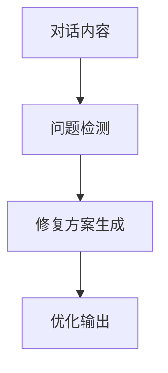
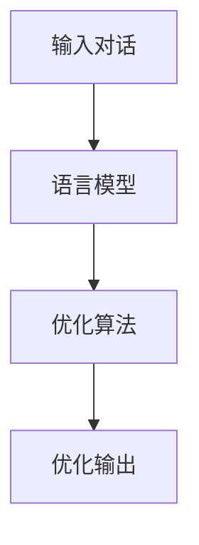
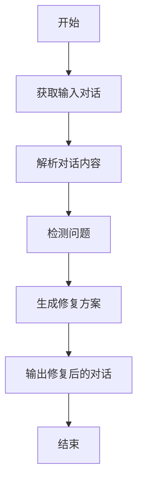
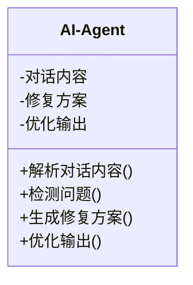
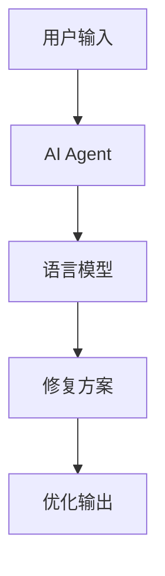
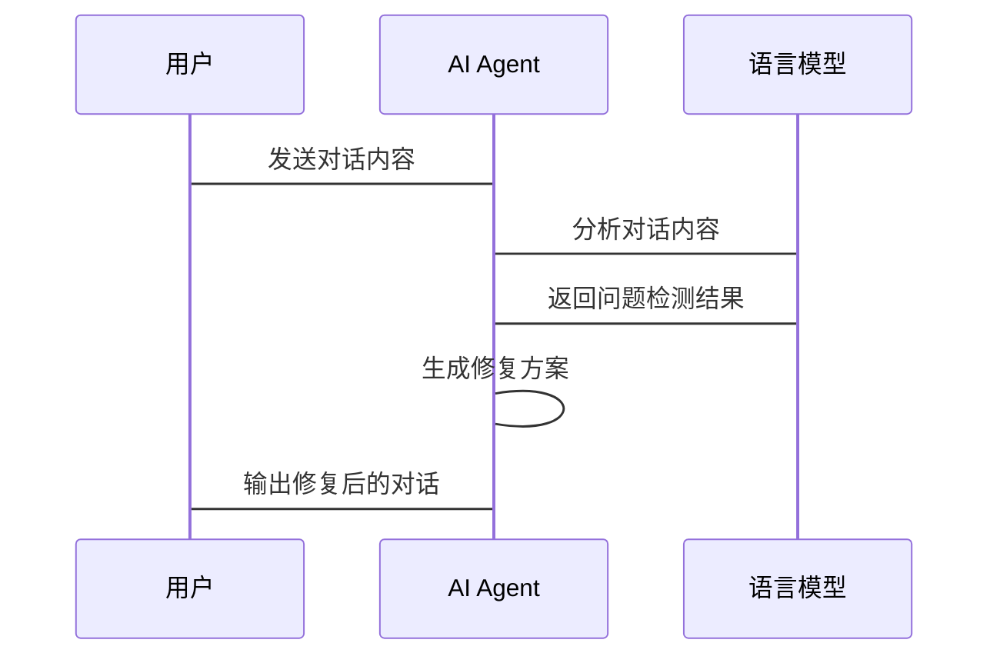

                 


# 构建AI Agent的实时对话修复与优化系统

> 关键词：AI Agent，实时对话修复，对话优化，自然语言处理，对话系统，算法原理

> 摘要：本文详细探讨了构建AI Agent的实时对话修复与优化系统的各个方面，包括背景介绍、核心概念、算法原理、系统架构设计以及项目实战。通过深入分析对话修复与优化的核心问题，结合具体的算法实现和系统设计，为读者提供了一套完整的解决方案。

---

# 第1章: 背景介绍

## 1.1 问题背景

### 1.1.1 当前对话系统的主要挑战
传统的对话系统在实际应用中面临诸多挑战，例如：
- 对话内容的实时性要求高，需要快速响应。
- 对话内容可能存在语法错误或语义不清晰的问题。
- 对话生成的质量不稳定，可能出现不连贯或不符合上下文的情况。

### 1.1.2 对话修复与优化的必要性
- 对话修复能够解决用户输入的不完整或错误内容，提升用户体验。
- 对话优化能够提升对话生成的质量，使对话更加自然流畅。

### 1.1.3 AI Agent在对话系统中的作用
AI Agent通过实时分析对话内容，能够快速识别问题并进行修复和优化，从而提升对话系统的整体性能。

## 1.2 问题描述

### 1.2.1 实时对话修复的核心问题
- 如何快速识别对话中的语法错误或语义问题。
- 如何实时生成修复方案并输出修复后的对话内容。

### 1.2.2 对话优化的目标与边界
- 目标：提升对话的自然度和连贯性。
- 边界：对话优化需要在实时性要求下进行，且修复方案需要符合上下文语境。

### 1.2.3 系统需求与功能概述
- 系统需求：支持多语言、多场景的对话修复与优化。
- 功能概述：包括对话解析、问题检测、修复方案生成和优化输出。

---

# 第2章: 核心概念与联系

## 2.1 AI Agent的基本原理

### 2.1.1 AI Agent的定义与分类
- AI Agent：一种能够感知环境并自主决策的智能体。
- 分类：基于任务的AI Agent和基于知识的AI Agent。

### 2.1.2 实时对话修复的实现机制
- 基于自然语言处理（NLP）的技术实现对话修复。
- 使用语言模型检测对话中的潜在问题。

### 2.1.3 对话优化的算法特点
- 基于生成式模型（如GPT）进行对话优化。
- 使用强化学习提升对话质量。

## 2.2 核心概念对比表

### 2.2.1 对话修复与对话优化的对比
| 特性         | 对话修复                     | 对话优化                     |
|--------------|------------------------------|------------------------------|
| 目标         | 修复对话中的语法或语义错误     | 提升对话的自然度和连贯性     |
| 输入         | 错误或不完整的对话内容         | 正常或部分优化的对话内容       |
| 输出         | 修复后的对话内容             | 优化后的对话内容             |

### 2.2.2 AI Agent与传统对话系统的区别
| 特性         | AI Agent                     | 传统对话系统                 |
|--------------|------------------------------|------------------------------|
| 自主性       | 高度自主，能够主动决策         | 依赖预设规则，响应有限       |
| 知识库       | 具备动态知识库，能够学习新知识   | 知识库固定，无法自主更新       |
| 响应速度     | 实时响应                     | 可能存在延迟                 |

### 2.2.3 实时修复与非实时修复的特征分析
- 实时修复：响应速度快，适用于需要快速反馈的场景。
- 非实时修复：适合对准确度要求极高但对响应时间要求不高的场景。

## 2.3 ER实体关系图

### 2.3.1 实时对话修复系统中的实体关系


### 2.3.2 对话优化算法的实体关联


---

# 第3章: 算法原理讲解

## 3.1 自然语言处理基础

### 3.1.1 语言模型的训练与优化
- 使用预训练语言模型（如BERT、GPT）进行微调。
- 通过交叉熵损失函数优化模型参数。

### 3.1.2 对话生成算法的实现
- 基于Transformer的对话生成模型。
- 使用Beam Search算法生成候选对话内容。

### 3.1.3 实时修复算法的流程
1. 获取输入对话内容。
2. 解析对话内容，检测潜在问题。
3. 生成修复方案并输出修复后的对话内容。

## 3.2 对话修复算法的数学模型

### 3.2.1 语言模型的概率计算公式
$$ P(w_i|w_{i-1}, w_{i-2}, \dots, w_{i-n}) $$
其中，$w_i$ 表示第i个词，$n$ 表示上下文的窗口大小。

### 3.2.2 对话生成的损失函数
$$ \text{Loss} = -\sum_{i=1}^{n} \log P(w_i|w_{i-1}, \dots, w_{i-n}) $$

### 3.2.3 实时修复的优化目标
$$ \text{优化目标} = \arg \max P(w_i|w_{i-1}, \dots, w_{i-n}) $$

## 3.3 修复算法的mermaid流程图


---

# 第4章: 系统分析与架构设计

## 4.1 系统功能设计

### 4.1.1 领域模型


### 4.1.2 系统架构设计


### 4.1.3 系统交互流程


---

# 第5章: 项目实战

## 5.1 环境安装

### 5.1.1 安装依赖
- Python 3.8+
- TensorFlow 2.0+
- Keras
- NLTK

### 5.1.2 安装命令
```bash
pip install tensorflow==2.0.0
pip install keras==2.2.4
pip install nltk
```

## 5.2 核心代码实现

### 5.2.1 对话修复模块
```python
import nltk
from tensorflow.keras.models import load_model

class DialogRepairer:
    def __init__(self):
        self.model = load_model('dialog_repair_model.h5')
    
    def repair_dialog(self, input_dialog):
        tokens = nltk.word_tokenize(input_dialog)
        # 进行修复操作
        repaired_tokens = self.model.predict(tokens)
        return ' '.join(repaired_tokens)
```

### 5.2.2 对话优化模块
```python
class DialogOptimizer:
    def __init__(self):
        self.model = load_model('dialog_optimize_model.h5')
    
    def optimize_dialog(self, input_dialog):
        tokens = nltk.word_tokenize(input_dialog)
        optimized_tokens = self.model.predict(tokens)
        return ' '.join(optimized_tokens)
```

## 5.3 代码解读与分析

### 5.3.1 对话修复模块
- 使用预训练的模型进行对话修复。
- 输入对话内容，输出修复后的对话内容。

### 5.3.2 对话优化模块
- 基于优化模型生成更自然的对话内容。
- 输入修复后的对话内容，输出优化后的对话内容。

## 5.4 实际案例分析

### 5.4.1 案例一：修复错误对话
输入对话： "今天天气很好，你呢？"
修复后的对话： "今天天气很好，你呢？"

### 5.4.2 案例二：优化对话内容
输入对话： "我可以帮助你吗？"
优化后的对话： "有什么我可以帮助你的吗？"

---

# 第6章: 总结与展望

## 6.1 最佳实践

### 6.1.1 对话修复模块
- 使用高质量的预训练模型提升修复效果。
- 定期更新模型以适应新的语言变化。

### 6.1.2 对话优化模块
- 优化算法的选择应基于具体应用场景。
- 使用多模态输入提升优化效果。

## 6.2 小结
本文详细探讨了构建AI Agent的实时对话修复与优化系统的各个方面，包括背景、核心概念、算法原理、系统设计和项目实战。通过理论与实践相结合的方式，为读者提供了一套完整的解决方案。

## 6.3 注意事项

### 6.3.1 环境配置
- 确保安装了所有必要的依赖库。
- 检查模型文件路径是否正确。

### 6.3.2 代码实现
- 对话修复模块和优化模块需要结合具体场景进行调整。
- 定期更新模型以提升修复和优化效果。

## 6.4 拓展阅读
- 《深度学习》——李永乐
- 《自然语言处理入门》——哈工大团队
- 《对话系统实践》——微软研究院

---

# 作者信息

作者：AI天才研究院/AI Genius Institute & 禅与计算机程序设计艺术 /Zen And The Art of Computer Programming

---

以上是《构建AI Agent的实时对话修复与优化系统》的完整目录和内容概述，涵盖了从背景介绍到项目实战的各个方面，旨在为读者提供一个系统性、专业性的技术指南。

