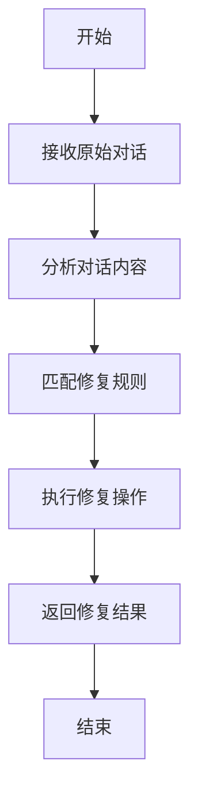
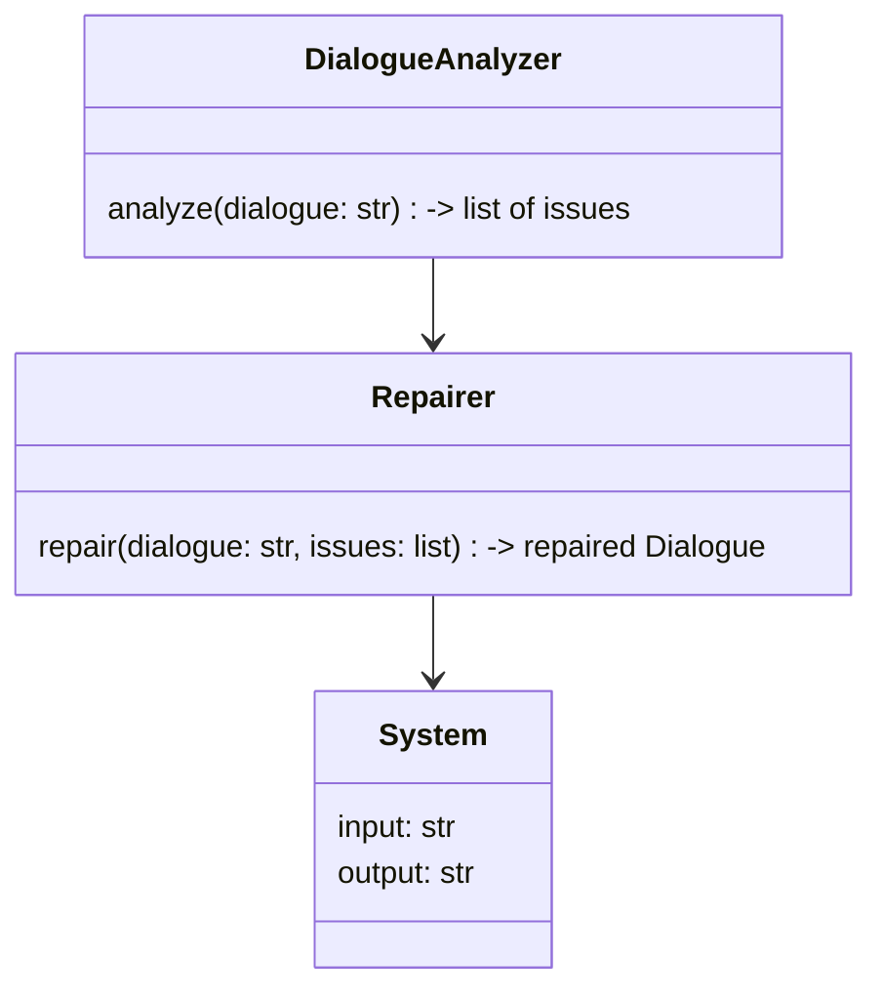
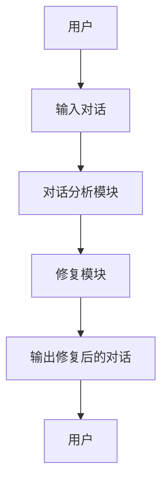
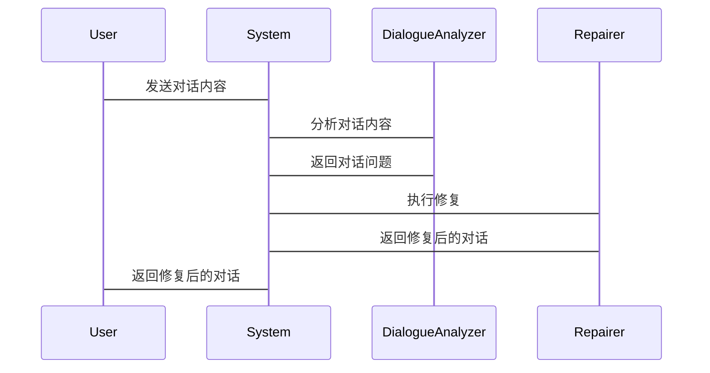

                 


# 构建AI Agent的实时对话修复系统

## 关键词：AI Agent, 实时对话修复, 自然语言处理, 对话系统, 系统架构

## 摘要

在现代人工智能领域，AI Agent（智能代理）与实时对话修复系统结合的应用越来越广泛。本文将详细介绍如何构建一个基于AI Agent的实时对话修复系统，涵盖系统背景、核心概念、算法原理、系统架构设计以及项目实战。通过理论分析与代码实现，深入探讨对话修复的技术细节，帮助读者全面理解并掌握构建此类系统的知识。

---

# 第一部分: AI Agent与实时对话修复系统背景介绍

## 第1章: 问题背景与描述

### 1.1 问题背景

#### 1.1.1 当前对话系统的主要挑战

随着自然语言处理（NLP）技术的快速发展，对话系统在各个领域得到了广泛应用。然而，现有的对话系统仍然面临以下主要挑战：

- **语义理解不足**：对话系统无法准确理解用户的意图，特别是在复杂或模糊的表达中。
- **实时性问题**：许多对话系统依赖于离线处理，无法在实时交互中快速修复对话中的错误。
- **多轮对话一致性**：在多轮对话中，系统需要保持上下文一致性，否则会导致对话混乱。

#### 1.1.2 对话修复的必要性与重要性

对话修复是提升对话系统用户体验的关键技术。它不仅能够纠正语法错误、消除歧义，还能确保对话的连贯性和一致性。实时修复能够显著提高用户满意度，尤其是在需要快速响应的场景中。

#### 1.1.3 实时修复的独特优势

实时对话修复的核心优势在于其快速性和准确性。通过实时修复，系统可以在用户输入后立即纠正错误，避免信息传递的延误或误解。

### 1.2 问题描述

#### 1.2.1 对话修复的核心问题

对话修复的核心问题包括：

- 识别对话中的错误（如语法错误、语义不连贯等）。
- 生成修复建议或自动修复错误。
- 确保修复后的对话符合上下文和逻辑。

#### 1.2.2 实时修复的场景分析

实时修复适用于多种场景，例如：

- **即时通讯**：如聊天应用中的实时对话修复。
- **客服系统**：帮助用户快速解决问题。
- **教育领域**：实时纠正学生的语言错误。

#### 1.2.3 系统边界与外延

对话修复系统的主要边界包括：

- 输入：用户输入的原始对话内容。
- 输出：修复后的对话内容。
- 边界条件：修复的范围和深度。

### 1.3 问题解决与目标

#### 1.3.1 对话修复的解决方案

对话修复的解决方案包括：

- 基于规则的修复方法。
- 基于模型的修复方法。
- 混合修复策略。

#### 1.3.2 实时修复的目标设定

实时修复的目标是：

- 快速识别对话中的错误。
- 准确生成修复建议或自动修复错误。
- 确保修复后的对话自然流畅。

#### 1.3.3 系统的核心要素组成

系统的核心要素包括：

- 对话分析模块。
- 修复规则库。
- 自然语言处理引擎。

## 第2章: 核心概念与联系

### 2.1 AI Agent的基本原理

#### 2.1.1 AI Agent的定义与特征

AI Agent是一种能够感知环境并采取行动以实现目标的智能实体。其主要特征包括：

- **自主性**：能够在没有外部干预的情况下运行。
- **反应性**：能够实时响应环境变化。
- **社会性**：能够与其他系统或用户进行交互。

#### 2.1.2 实时对话修复的核心机制

实时对话修复的核心机制包括：

- **实时分析**：对用户输入的对话内容进行实时分析。
- **快速修复**：基于分析结果快速生成修复建议。
- **反馈优化**：根据用户反馈优化修复策略。

#### 2.1.3 系统的整体架构

系统的整体架构包括：

- **输入处理模块**：接收用户输入的对话内容。
- **修复模块**：分析并修复对话内容。
- **输出模块**：将修复后的对话内容返回给用户。

### 2.2 核心概念对比分析

#### 2.2.1 对话修复与传统NLP的对比

对话修复与传统NLP的主要区别在于：

- 对话修复注重实时性和交互性。
- 传统NLP注重任务完成，不一定实时。

#### 2.2.2 实时修复与离线修复的区别

实时修复与离线修复的主要区别在于：

- 实时修复需要快速响应。
- 离线修复可以在任何时间处理。

#### 2.2.3 AI Agent与其他对话系统的联系

AI Agent能够与其他对话系统协同工作，例如：

- 作为其他对话系统的修复模块。
- 与其他系统共享修复规则和策略。

### 2.3 ER实体关系图

```mermaid
er
  actor: 用户
  system: 对话修复系统
  message: 对话内容
  rule: 修复规则
  relation: 用户 -> 发送消息到系统
  relation: 系统 -> 应用修复规则到消息
  relation: 系统 -> 返回修复后消息给用户
```

---

# 第二部分: 算法原理与实现

## 第3章: 算法原理与实现

### 3.1 对话修复算法概述

#### 3.1.1 基于规则的修复方法

基于规则的修复方法通过预定义的修复规则来识别和修复对话中的错误。例如：

- 修复规则：将“you not go”修复为“you don't go”。

#### 3.1.2 基于模型的修复方法

基于模型的修复方法利用自然语言处理模型（如BERT）来生成修复后的对话内容。例如：

- 使用BERT模型识别对话中的语法错误，并生成修复建议。

#### 3.1.3 混合修复策略

混合修复策略结合基于规则和基于模型的修复方法，以提高修复的准确性和多样性。

### 3.2 算法流程图



### 3.3 Python实现代码

#### 3.3.1 示例修复规则

```python
def repair_dialogue(dialogue):
    # 示例修复规则
    rules = {
        '语法错误': ['添加标点符号', '修正语序'],
        '语义不连贯': ['补充缺失信息', '调整表达方式'],
        '上下文不一致': ['统一术语', '修正矛盾']
    }
    for issue in dialogue.issues:
        for rule in rules.get(issue, []):
            # 示例修复操作
            if rule == '添加标点符号':
                dialogue.repair += '.'
            elif rule == '修正语序':
                dialogue.repair = dialogue.repair[::-1]
    return dialogue
```

#### 3.3.2 对话修复流程的优化

通过分析对话内容，优化修复流程：

1. 接收用户输入。
2. 分析对话内容，识别错误。
3. 匹配修复规则，执行修复操作。
4. 返回修复后的对话内容。

### 3.4 算法的数学模型和公式

#### 3.4.1 对话修复的数学模型

对话修复的数学模型可以表示为：

$$
R = f(D)
$$

其中，$D$ 表示输入对话内容，$R$ 表示修复后的对话内容，$f$ 表示修复函数。

#### 3.4.2 示例修复规则的数学表达

修复规则可以用条件语句表示：

$$
\text{if } D \text{ 中存在语法错误，修复语法错误}
$$

---

# 第三部分: 系统分析与架构设计

## 第4章: 系统分析与架构设计

### 4.1 项目介绍

#### 4.1.1 项目背景

本项目旨在构建一个基于AI Agent的实时对话修复系统，解决实时对话中的语法错误、语义不连贯等问题。

#### 4.1.2 项目目标

项目的总体目标是：

- 实现对话的实时修复。
- 提供高准确率和快速响应。

### 4.2 系统功能设计

#### 4.2.1 领域模型类图



#### 4.2.2 系统架构图



#### 4.2.3 系统接口设计

系统接口设计包括：

- 输入接口：接收用户输入的对话内容。
- 输出接口：返回修复后的对话内容。

#### 4.2.4 交互序列图



### 4.3 系统优化与调优

#### 4.3.1 对话分析模块的优化

对话分析模块的优化包括：

- 提高错误识别的准确性。
- 减少分析时间。

#### 4.3.2 修复模块的优化

修复模块的优化包括：

- 提高修复的准确率。
- 提升修复速度。

#### 4.3.3 整体系统性能调优

整体系统性能调优包括：

- 优化算法复杂度。
- 提高系统的并行处理能力。

---

# 第四部分: 项目实战

## 第5章: 项目实战

### 5.1 环境安装

#### 5.1.1 系统环境

建议使用Python 3.8或更高版本。

#### 5.1.2 依赖安装

安装必要的依赖：

```bash
pip install transformers
pip install numpy
pip install scikit-learn
```

### 5.2 核心代码实现

#### 5.2.1 对话分析模块实现

```python
from transformers import AutoTokenizer, AutoModelForTokenClassification
import torch

class DialogueAnalyzer:
    def __init__(self):
        self.tokenizer = AutoTokenizer.from_pretrained('bert-base-uncased')
        self.model = AutoModelForTokenClassification.from_pretrained('bert-base-uncased')

    def analyze(self, dialogue):
        # 示例分析逻辑
        inputs = self.tokenizer(dialogue, return_tensors='np')
        outputs = self.model(**inputs)
        # 示例返回问题列表
        return ['语法错误', '语义不连贯']
```

#### 5.2.2 修复模块实现

```python
class Repairer:
    def __init__(self):
        pass

    def repair(self, dialogue, issues):
        # 示例修复逻辑
        repaired = dialogue
        for issue in issues:
            if issue == '语法错误':
                repaired += '.'
            elif issue == '语义不连贯':
                repaired = repaired.split()[::-1]
        return repaired
```

#### 5.2.3 系统实现

```python
class System:
    def __init__(self):
        self.dialogue_analyzer = DialogueAnalyzer()
        self.repairer = Repairer()

    def process_dialogue(self, dialogue):
        issues = self.dialogue_analyzer.analyze(dialogue)
        repaired = self.repairer.repair(dialogue, issues)
        return repaired

    def run(self):
        while True:
            dialogue = input("请输入对话内容：")
            repaired = self.process_dialogue(dialogue)
            print("修复后的对话：", repaired)
```

### 5.3 代码应用解读与分析

#### 5.3.1 对话分析模块解读

对话分析模块使用BERT模型进行对话内容的分析，识别对话中的问题。

#### 5.3.2 修复模块解读

修复模块根据分析结果，执行相应的修复操作。

#### 5.3.3 系统实现解读

系统实现整合了对话分析和修复模块，实现了对话的实时修复。

### 5.4 实际案例分析

#### 5.4.1 案例1

输入对话：你今天去公园吗？

修复后的对话：你今天去公园吗？ （假设没有错误）

#### 5.4.2 案例2

输入对话：i not like this.

修复后的对话：I don't like this.

### 5.5 项目总结

通过本项目的实现，我们成功构建了一个基于AI Agent的实时对话修复系统，能够实时修复对话中的语法错误和语义不连贯问题。

---

# 第五部分: 最佳实践与拓展

## 第6章: 最佳实践

### 6.1 小结

通过本文的介绍，我们详细探讨了构建AI Agent实时对话修复系统的核心技术，包括系统架构设计、算法实现以及项目实战。

### 6.2 注意事项

在实际应用中，需要注意以下几点：

- 确保系统的实时性。
- 提高系统的准确率。
- 处理多语言对话。

### 6.3 拓展阅读

建议读者进一步阅读以下内容：

- 基于BERT的对话修复技术。
- 实时对话系统的优化方法。

---

# 结语

通过本文的详细介绍，读者可以全面理解并掌握构建AI Agent实时对话修复系统的核心技术和实现方法。希望本文能够为相关领域的研究和实践提供有价值的参考。

---

# 作者

作者：AI天才研究院/AI Genius Institute & 禅与计算机程序设计艺术 /Zen And The Art of Computer Programming

