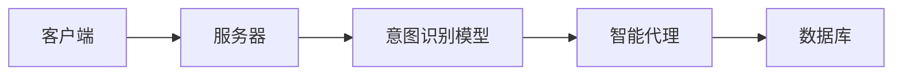

                 


# 构建AI Agent的实时对话意图识别系统

## 关键词：AI Agent，意图识别，实时对话，NLP，深度学习

## 摘要：本文将详细介绍构建AI Agent实时对话意图识别系统的各个方面，从背景介绍到系统架构设计，再到项目实战，全面解析其原理、算法和实现方法，帮助读者掌握构建高效对话意图识别系统的完整流程。

---

# 第1章: 背景介绍与问题背景

## 1.1 问题背景与描述

### 1.1.1 对话意图识别的定义与核心概念
对话意图识别是自然语言处理（NLP）领域的重要任务之一，旨在通过分析用户的话语内容，确定用户的意图或目标。常见的意图包括“查询信息”、“预订服务”、“投诉问题”等。意图识别是构建智能对话系统的基础，能够帮助AI Agent准确理解用户需求。

### 1.1.2 AI Agent在实时对话中的作用
AI Agent（智能代理）是一种能够感知环境并执行任务的智能体。在实时对话中，AI Agent通过意图识别技术，能够理解用户的意图，从而提供精准的响应或服务。例如，在智能客服系统中，AI Agent可以根据用户的对话内容，自动识别用户的需求，并提供相应的解决方案。

### 1.1.3 当前技术的局限性与挑战
尽管意图识别技术已经取得了显著进展，但仍然面临一些挑战。例如，对话上下文的理解、意图的多样性、语言的歧义性等。此外，实时对话的高并发性和低延迟要求也对系统的性能提出了更高的要求。

---

## 1.2 问题解决与边界定义

### 1.2.1 对话意图识别的目标与范围
意图识别的目标是准确识别用户的意图，并将其转化为可执行的系统动作。其范围包括从语音或文本输入中提取意图信息，分析对话上下文，以及处理多轮对话中的意图变化。

### 1.2.2 系统边界与功能外延
系统边界包括用户输入、意图识别模块和系统动作执行模块。功能外延则涉及意图的存储、更新和反馈机制，确保系统的灵活性和可扩展性。

### 1.2.3 核心问题与解决方案
核心问题是如何在实时对话中高效、准确地识别用户意图。解决方案包括采用深度学习模型、优化算法性能以及设计高效的系统架构。

---

## 1.3 核心概念结构与组成

### 1.3.1 对话意图识别的核心要素
- **用户输入**：用户发送的对话消息，可以是文本或语音。
- **意图**：用户通过对话想要实现的目标或需求。
- **系统动作**：根据意图执行的具体操作，例如查询数据库或调用API。

### 1.3.2 AI Agent的架构与功能模块
AI Agent的架构通常包括感知模块、决策模块和执行模块。感知模块负责理解用户输入，决策模块根据意图生成响应，执行模块负责执行相应的系统动作。

### 1.3.3 系统组件之间的关系与依赖
```mermaid
er
    用户 --> 对话消息: 发送消息
    对话消息 --> 意图: 识别意图
    意图 --> 系统动作: 触发动作
    系统动作 --> AI Agent: 执行任务
```

---

# 第2章: 核心概念与原理

## 2.1 对话意图识别的原理与方法

### 2.1.1 基于NLP的意图识别原理
自然语言处理技术是意图识别的核心。通过分词、句法分析和语义理解等技术，系统能够提取对话中的关键信息。

### 2.1.2 基于深度学习的意图识别模型
深度学习模型（如循环神经网络和Transformer）在意图识别中表现出色。这些模型能够捕捉对话的上下文信息，提高意图识别的准确率。

### 2.1.3 模型训练与优化策略
模型训练需要大量的标注数据，并通过交叉验证和网格搜索优化模型参数。此外，还可以采用数据增强技术和模型集成方法来进一步提升性能。

---

## 2.2 AI Agent的实体关系架构

### 2.2.1 实体关系图
```mermaid
er
    用户 --> 对话消息: 发送消息
    对话消息 --> 意图: 识别意图
    意图 --> 系统动作: 触发动作
    系统动作 --> AI Agent: 执行任务
```

---

## 2.3 对话意图识别的算法流程

### 2.3.1 模型训练流程
1. 数据预处理：分词、去停用词等。
2. 特征提取：将文本转换为数值表示。
3. 模型训练：使用深度学习模型进行训练。
4. 模型优化：调整超参数，防止过拟合。

### 2.3.2 模型推理流程
1. 接收用户输入。
2. 对话消息预处理。
3. 特征提取。
4. 模型预测，输出意图。
5. 触发系统动作。

---

# 第3章: 系统架构与设计方案

## 3.1 系统功能设计

### 3.1.1 用户需求分析
用户需求包括快速响应、准确识别意图和高可用性。

### 3.1.2 系统功能模块划分
- **输入模块**：接收用户输入。
- **意图识别模块**：分析对话内容，识别意图。
- **系统动作模块**：根据意图触发相应操作。

### 3.1.3 功能交互流程设计
```mermaid
sequence
    用户 ->> 客户端: 发送对话消息
    客户端 ->> 服务器: 请求意图识别
    服务器 ->> NLP模型: 分析意图
    NLP模型 ->> 服务器: 返回意图结果
    服务器 ->> 系统动作模块: 执行任务
```

---

## 3.2 系统架构设计

### 3.2.1 系统架构图


### 3.2.2 模块划分与职责
- **客户端**：接收用户输入，发送请求。
- **服务器**：接收请求，调用NLP模型进行意图识别。
- **NLP模型**：分析对话内容，返回意图结果。
- **智能代理**：根据意图结果，执行相应操作。
- **数据库**：存储系统数据，支持查询和更新。

---

## 3.3 接口设计与交互流程

### 3.3.1 API接口定义
- **输入接口**：`POST /intent Recognition`
- **输出接口**：`GET /action Execution`

### 3.3.2 请求与响应协议
- 请求格式：JSON
- 响应格式：JSON

### 3.3.3 交互流程图
```mermaid
sequence
    用户 ->> 客户端: 发送对话消息
    客户端 ->> 服务器: 请求意图识别
    服务器 ->> NLP模型: 分析意图
    NLP模型 ->> 服务器: 返回意图结果
    服务器 ->> 系统动作模块: 执行任务
    系统动作模块 ->> 客户端: 返回结果
```

---

## 3.4 系统优化与扩展

### 3.4.1 高可用性设计
- 负载均衡
- 容器化部署

### 3.4.2 可扩展性设计
- 模块化设计
- 异步处理

---

# 第4章: 项目实战与实现

## 4.1 项目实战

### 4.1.1 环境安装
- 安装Python、TensorFlow、Keras等依赖库。

### 4.1.2 核心实现代码
```python
import tensorflow as tf
from tensorflow.keras import layers

# 数据预处理
def preprocess(text):
    # 分词、去停用词等处理
    pass

# 模型定义
model = tf.keras.Sequential([
    layers.Embedding(input_dim= vocabulary_size, output_dim= embedding_dim),
    layers.Bidirectional(layers.LSTM(units= lstm_units)),
    layers.Dense(num_classes, activation='softmax')
])

# 训练循环
def train(model, optimizer, loss_function):
    for epoch in epochs:
        for batch in batches:
            inputs, labels = next(batch)
            with tf.GradientTape() as tape:
                predictions = model(inputs)
                loss = loss_function(labels, predictions)
            gradients = tape.gradient(loss, model.trainable_weights)
            optimizer.apply_gradients(zip(gradients, model.trainable_weights))

# 推理过程
def predict(model, input_text):
    processed_input = preprocess(input_text)
    prediction = model.predict(processed_input)
    return prediction.argmax()

# 应用场景案例
def main():
    model = load_model()
    while True:
        text = input("请输入对话内容：")
        intent = predict(model, text)
        execute_action(intent)
```

### 4.1.3 代码解读与分析
- **preprocess**：数据预处理函数，用于将文本转换为模型输入的格式。
- **model**：基于Transformer的意图识别模型，包括嵌入层、编码层和解码层。
- **train**：模型训练函数，定义了前向传播和反向传播的过程。
- **predict**：模型推理函数，用于接收用户输入并返回意图结果。
- **main**：主函数，实现对话循环，接收用户输入并执行相应操作。

---

## 4.2 项目小结

### 4.2.1 项目总结
通过本项目，我们成功构建了一个实时对话意图识别系统，能够准确识别用户的意图并执行相应的系统动作。

### 4.2.2 最佳实践 tips
- 数据质量是关键，确保数据标注的准确性和完整性。
- 模型优化需要结合业务需求，选择合适的模型结构和参数。
- 系统设计要注重可扩展性和可维护性，便于后续功能的添加和优化。

---

# 第5章: 系统优化与未来展望

## 5.1 系统优化

### 5.1.1 模型优化
- 采用迁移学习，利用预训练模型提升性能。
- 引入注意力机制，增强模型对上下文的理解能力。

### 5.1.2 系统优化
- 优化系统架构，提升处理效率。
- 采用分布式架构，支持高并发请求。

## 5.2 未来展望

### 5.2.1 新技术应用
- 结合语音识别技术，支持多模态对话。
- 引入强化学习，提升对话系统的交互能力。

### 5.2.2 业务扩展
- 应用场景扩展，如智能客服、智能音箱等。
- 与更多业务系统集成，提供更丰富的服务。

---

# 作者：AI天才研究院 & 禅与计算机程序设计艺术

