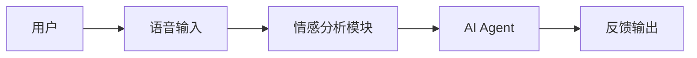
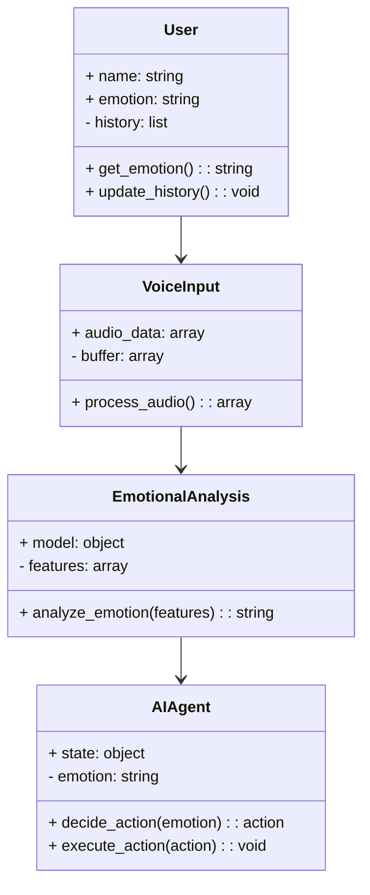
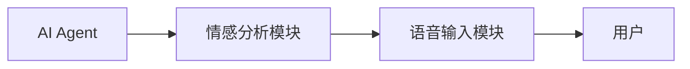
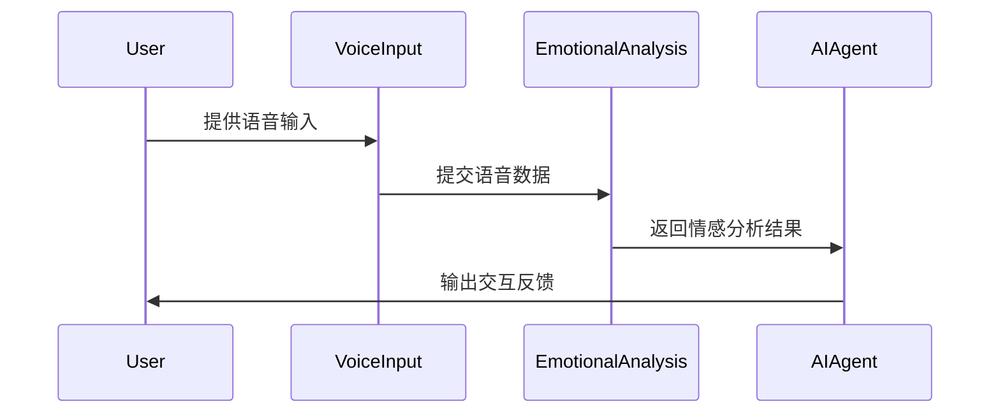

                 


# 构建AI Agent的实时语音情感分析系统

> 关键词：AI Agent，语音情感分析，实时处理，机器学习，深度学习，自然语言处理

> 摘要：本文详细探讨了构建AI Agent的实时语音情感分析系统的各个方面，从系统背景、核心概念到算法实现、系统设计和项目实战，旨在为读者提供一个全面的技术指南。

---

# 第一部分: 背景与概述

## 第1章: AI Agent与语音情感分析概述

### 1.1 AI Agent的基本概念

#### 1.1.1 AI Agent的定义与分类
- **定义**：AI Agent（人工智能代理）是一种能够感知环境、自主决策并执行任务的智能实体。
- **分类**：
  - **简单反射型Agent**：基于预定义规则执行任务。
  - **基于模型的反应型Agent**：利用环境模型做出决策。
  - **目标驱动型Agent**：根据目标选择最优行动。
  - **实用驱动型Agent**：通过效用函数优化决策。

#### 1.1.2 语音情感分析的定义与应用
- **定义**：语音情感分析是通过分析语音信号的情感特征，识别说话人情感状态的过程。
- **应用**：
  - 客服系统：识别客户情绪，提供个性化服务。
  - 智能音箱：根据用户情绪调整交互方式。
  - 医疗领域：辅助诊断患者情绪状态。

#### 1.1.3 AI Agent与语音情感分析的结合
- **结合方式**：
  - AI Agent通过语音情感分析模块实时感知用户情绪。
  - 根据用户情绪动态调整交互策略。

### 1.2 问题背景与需求分析

#### 1.2.1 当前语音交互的痛点
- 情感分析的实时性不足，导致用户体验差。
- 情感分析模型缺乏泛化能力，适应性差。
- AI Agent的决策机制与情感分析脱节，无法提供个性化服务。

#### 1.2.2 情感分析在语音交互中的价值
- 提高用户交互体验。
- 增强系统的情感智能，使其更加人性化。
- 为AI Agent提供更丰富的决策依据。

#### 1.2.3 AI Agent在实时语音情感分析中的应用场景
- **智能客服**：实时感知客户情绪，提供更优质的服务。
- **智能家居**：根据用户情绪调整环境设置。
- **教育辅助**：通过情感分析提供个性化的教学建议。

### 1.3 系统目标与实现方案

#### 1.3.1 系统目标的设定
- 实现实时语音情感分析功能。
- 构建基于情感分析的AI Agent决策系统。
- 提供高准确率、低延迟的实时分析能力。

#### 1.3.2 系统实现的技术路线
1. **语音信号处理**：提取语音情感特征。
2. **情感分类模型**：训练深度学习模型进行情感分类。
3. **AI Agent设计**：基于情感分析结果，设计AI Agent的交互逻辑。
4. **系统集成**：将情感分析模块与AI Agent集成，实现实时交互。

#### 1.3.3 系统边界与功能范围
- **系统边界**：仅关注语音情感分析和AI Agent的交互逻辑。
- **功能范围**：
  - 语音信号采集与处理。
  - 情感分类与分析。
  - AI Agent的决策与反馈。

---

# 第二部分: 核心概念与原理

## 第2章: 语音情感分析的核心原理

### 2.1 语音情感分析的基本原理

#### 2.1.1 语音特征的提取方法
- **声学特征**：
  - 音调（Pitch）：反映说话人的紧张程度。
  - 音量（Volume）：反映情绪的强烈程度。
  - 音速（Speech Rate）：反映情绪的急躁或放松。
- **时频域特征**：
  - 坐标转换：将语音信号从时域转换到频域。
  - 特征提取：提取梅尔频率倒谱系数（MFCC）等特征。

#### 2.1.2 声学特征与情感关联
- **特征选择**：选择与情感高度相关的特征。
- **特征组合**：将多个特征组合，提高分类准确率。

#### 2.1.3 基于深度学习的情感分类模型
- **模型选择**：采用循环神经网络（RNN）或卷积神经网络（CNN）进行情感分类。
- **模型训练**：使用标注数据进行监督学习，优化模型参数。

### 2.2 AI Agent的核心原理

#### 2.2.1 AI Agent的行为决策机制
- **决策逻辑**：
  - 根据情感分析结果，选择最优的交互策略。
  - 结合上下文信息，动态调整决策。
- **反馈机制**：
  - 根据用户反馈，优化决策策略。

#### 2.2.2 状态感知与反馈机制
- **状态感知**：
  - 实时感知用户情感状态。
  - 监测系统运行状态。
- **反馈机制**：
  - 根据用户反馈调整交互方式。
  - 优化情感分析模型。

#### 2.2.3 多模态输入的处理方式
- **多模态数据融合**：
  - 结合语音、文本、图像等多种模态数据。
  - 使用深度学习模型进行融合。

### 2.3 系统核心概念的关系图

#### 2.3.1 实体关系图（ER图）


---

# 第三部分: 算法原理与实现

## 第3章: 语音情感分析的算法实现

### 3.1 语音特征提取算法

#### 3.1.1 基于MFCC的特征提取
```python
import librosa

def extract_features(audio_path):
    audio, sr = librosa.load(audio_path, sr=None)
    mfccs = librosa.feature.mfcc(y=audio, sr=sr)
    return mfccs
```

#### 3.1.2 基于深度学习的特征提取
- **模型选择**：使用双向LSTM提取语音特征。
- **特征表示**：
  - 将语音信号转换为深度特征向量。
  - 使用注意力机制提取关键特征。

### 3.2 情感分类算法

#### 3.2.1 基于传统机器学习的分类方法
- **算法选择**：使用支持向量机（SVM）或随机森林（Random Forest）进行分类。

#### 3.2.2 基于深度学习的分类方法
- **模型选择**：使用CNN或RNN进行情感分类。
- **模型结构**：
  - 输入层：接收特征向量。
  - 隐藏层：提取高级特征。
  - 输出层：输出情感类别。

#### 3.2.3 模型调优与优化策略
- **超参数调优**：使用网格搜索优化模型参数。
- **模型评估**：采用交叉验证评估模型性能。
- **性能优化**：使用早停法防止过拟合。

### 3.3 算法实现的代码示例

#### 3.3.1 情感分类模型代码
```python
import tensorflow as tf
from tensorflow.keras import layers

def build_model(input_shape, num_classes):
    model = tf.keras.Sequential()
    model.add(layers.Conv2D(32, (3, 3), activation='relu', input_shape=input_shape))
    model.add(layers.MaxPooling2D((2, 2)))
    model.add(layers.Conv2D(64, (3, 3), activation='relu'))
    model.add(layers.MaxPooling2D((2, 2)))
    model.add(layers.Flatten())
    model.add(layers.Dense(64, activation='relu'))
    model.add(layers.Dense(num_classes, activation='softmax'))
    return model
```

#### 3.3.2 模型训练代码
```python
model = build_model((100, 13, 1), num_classes=3)
model.compile(optimizer='adam', loss='sparse_categorical_crossentropy', metrics=['accuracy'])
model.fit(x_train, y_train, epochs=10, batch_size=32, validation_data=(x_val, y_val))
```

---

# 第四部分: 系统分析与架构设计方案

## 第4章: 系统架构设计与实现

### 4.1 问题场景介绍
- **场景描述**：构建一个实时语音情感分析系统，集成到AI Agent中，实现情感感知与智能交互。

### 4.2 项目介绍
- **项目目标**：实现实时语音情感分析，优化AI Agent的交互体验。
- **项目范围**：涵盖语音信号处理、情感分类、AI Agent设计与集成。

### 4.3 系统功能设计

#### 4.3.1 领域模型（类图）


### 4.4 系统架构设计

#### 4.4.1 系统架构图


#### 4.4.2 系统接口设计
- **输入接口**：语音输入模块接收用户语音信号。
- **输出接口**：AI Agent根据情感分析结果输出反馈。

#### 4.4.3 系统交互流程


---

# 第五部分: 项目实战

## 第5章: 项目实现与案例分析

### 5.1 环境安装与配置

#### 5.1.1 安装Python依赖
```bash
pip install numpy librosa tensorflow keras matplotlib
```

#### 5.1.2 安装其他工具
- **音频处理工具**：安装FFmpeg以支持多种音频格式。

### 5.2 系统核心实现

#### 5.2.1 语音特征提取模块
```python
import librosa

def extract_features(audio_path):
    audio, sr = librosa.load(audio_path, sr=None)
    mfccs = librosa.feature.mfcc(y=audio, sr=sr)
    return mfccs
```

#### 5.2.2 情感分类模型训练
```python
import tensorflow as tf
from tensorflow.keras import layers

def build_model(input_shape, num_classes):
    model = tf.keras.Sequential()
    model.add(layers.Conv2D(32, (3, 3), activation='relu', input_shape=input_shape))
    model.add(layers.MaxPooling2D((2, 2)))
    model.add(layers.Conv2D(64, (3, 3), activation='relu'))
    model.add(layers.MaxPooling2D((2, 2)))
    model.add(layers.Flatten())
    model.add(layers.Dense(64, activation='relu'))
    model.add(layers.Dense(num_classes, activation='softmax'))
    return model
```

### 5.3 案例分析与详细解读

#### 5.3.1 案例场景
- **场景描述**：用户与AI Agent进行语音交互，系统实时分析用户情感并反馈。

#### 5.3.2 系统运行流程
1. **语音输入**：用户通过麦克风提供语音信号。
2. **特征提取**：系统提取语音情感特征。
3. **情感分类**：模型分析情感并返回结果。
4. **AI Agent决策**：根据情感结果调整交互策略。
5. **反馈输出**：AI Agent输出反馈。

### 5.4 项目小结

#### 5.4.1 核心代码总结
- 语音特征提取代码。
- 情感分类模型代码。
- 系统交互流程代码。

---

# 第六部分: 总结与展望

## 第6章: 总结与最佳实践

### 6.1 系统总结
- **系统优势**：
  - 实现实时语音情感分析。
  - 提供个性化交互体验。
  - 提高系统智能化水平。
- **系统不足**：
  - 情感分类模型的泛化能力有待提升。
  - 系统运行效率需要进一步优化。

### 6.2 最佳实践 tips

#### 6.2.1 开发建议
- **数据质量**：确保训练数据的多样性和平衡性。
- **模型优化**：采用迁移学习和数据增强技术优化模型性能。
- **系统集成**：在实际应用中，需考虑系统的实时性和稳定性。

#### 6.2.2 注意事项
- **隐私保护**：确保用户数据的安全性和隐私性。
- **系统兼容性**：保证系统在不同平台和设备上的兼容性。
- **用户体验**：注重用户反馈，不断优化交互流程。

#### 6.2.3 拓展阅读
- **推荐书籍**：《Deep Learning》、《Speech and Language Processing》。
- **推荐论文**：相关领域的最新研究论文。
- **推荐工具**：开源的语音处理工具和深度学习框架。

---

# 作者：AI天才研究院/AI Genius Institute & 禅与计算机程序设计艺术 /Zen And The Art of Computer Programming

