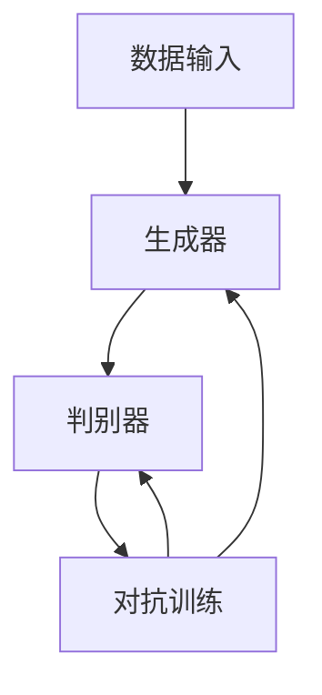
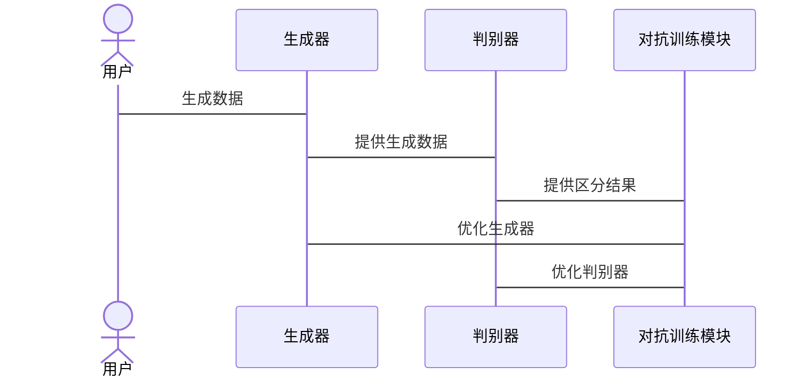

                 


# 构建AI Agent的对抗学习机制：提高鲁棒性

> 关键词：AI Agent, 对抗学习, 鲁棒性, 生成器, 判别器, 智能系统, 计算机科学

> 摘要：本文详细探讨了在AI Agent中构建对抗学习机制的方法，分析了对抗学习的基本原理及其在提高AI Agent鲁棒性中的应用。通过系统化的理论分析、算法推导和实战案例，本文为读者提供了从基础概念到实际应用的全面指导，帮助读者深入理解如何通过对抗学习机制提升AI Agent的鲁棒性和适应性。

---

## 第1章: 对抗学习与AI Agent概述

### 1.1 对抗学习的基本概念

对抗学习是一种通过生成器和判别器的对抗过程来优化模型的机器学习方法。生成器的目标是生成逼真的数据，而判别器的目标是区分真实数据和生成数据。两者的对抗过程使得生成器能够生成更高质量的数据，同时判别器的性能也在不断提升。

#### 对抗学习的核心要素
- **生成器（Generator）**：负责生成数据，目标是欺骗判别器，使其认为生成的数据是真实的。
- **判别器（Discriminator）**：负责区分真实数据和生成数据，目标是尽可能准确地区分两者。
- **损失函数**：对抗学习通过损失函数定义生成器和判别器的优化目标，通常采用最小化最大化策略。

#### 对抗学习与传统机器学习的区别
传统的机器学习方法通常依赖于单方面优化模型，而对抗学习通过引入对抗过程，使得模型在生成和判别两个任务之间交替优化，从而实现更复杂的任务。

### 1.2 AI Agent的基本概念

AI Agent是一种能够感知环境、做出决策并执行任务的智能实体。它可以是一个软件程序、机器人或其他智能系统，具备以下核心功能：
- **感知环境**：通过传感器或其他输入方式获取环境信息。
- **决策与推理**：基于获取的信息进行推理和决策。
- **执行动作**：根据决策结果执行具体的动作。

### 1.3 对抗学习在AI Agent中的应用背景

AI Agent在实际应用中面临许多挑战，例如环境的不确定性、对手的对抗性行为等。对抗学习能够通过生成器和判别器的对抗过程，帮助AI Agent在复杂环境中提高鲁棒性和适应性。

#### AI Agent面临的挑战
- **环境不确定性**：AI Agent需要在动态和不确定的环境中做出决策。
- **对手的对抗性**：在对抗性场景中，AI Agent需要应对对手的干扰和攻击。
- **数据偏差**：训练数据可能存在偏差，影响AI Agent的性能。

#### 对抗学习在提高AI Agent鲁棒性中的作用
对抗学习通过引入对抗过程，使得AI Agent能够在模拟的对抗环境中进行训练，从而更好地应对实际中的不确定性。

---

## 第2章: 对抗学习机制的核心原理

### 2.1 对抗学习的基本原理

对抗学习的核心在于生成器和判别器的对抗过程。生成器的目标是生成数据，使其被判别器误判为真实数据；判别器的目标是准确区分真实数据和生成数据。

#### 生成器与判别器的对抗过程
- 生成器通过不断优化生成数据的分布，使得判别器难以区分真实数据和生成数据。
- 判别器通过不断优化自身的分类能力，尽可能准确地区分真实数据和生成数据。

#### 最小化最大化目标函数
生成器的目标是最小化判别器的损失函数，而判别器的目标是最大化自身的损失函数。通过交替优化生成器和判别器，对抗学习实现了生成数据的质量提升。

### 2.2 对抗学习的核心概念与联系

对抗学习与博弈论密切相关，可以看作是一种零和博弈。生成器和判别器的目标函数是相互对立的，通过对抗过程实现模型的优化。

#### 对抗学习与博弈论的联系
- 在博弈论中，对抗学习类似于两个玩家的对抗过程，生成器和判别器分别扮演两个对立的角色。
- 对抗学习的目标是找到生成器和判别器的纳什均衡点。

#### 对抗学习与AI Agent的结合
通过对抗学习，AI Agent可以在复杂环境中进行自我优化，提高其鲁棒性和适应性。

### 2.3 对抗学习的数学模型

对抗学习的数学模型通常基于最小化最大化目标函数。生成器的目标是最小化判别器的损失函数，而判别器的目标是最大化自身的损失函数。

#### 对抗学习的损失函数
生成器的损失函数为：
$$ L_G = \log(P(D(x_{生成}=1))} $$
判别器的损失函数为：
$$ L_D = -(\log(P(D(x_{真实}=1))} + \log(P(D(x_{生成}=0))}) $$

#### 对抗训练的优化过程
通过对生成器和判别器的交替优化，对抗学习实现了生成数据的质量提升。

---

## 第3章: 对抗学习在AI Agent中的应用

### 3.1 对抗学习在AI Agent中的核心作用

对抗学习通过引入对抗过程，帮助AI Agent在复杂环境中提高鲁棒性和适应性。

#### 提高AI Agent的鲁棒性
对抗学习通过模拟对抗环境，使得AI Agent能够更好地应对不确定性。

#### 增强AI Agent的对抗性
对抗学习通过生成器和判别器的对抗过程，使得AI Agent能够在对抗环境中进行优化。

#### 提升AI Agent的适应性
对抗学习通过不断优化生成数据的质量，使得AI Agent能够更好地适应复杂环境。

### 3.2 对抗学习在AI Agent中的具体实现

#### 对抗学习的生成器设计
生成器需要设计合适的网络结构和损失函数，以生成高质量的数据。

#### 对抗学习的判别器设计
判别器需要设计合适的网络结构和损失函数，以准确区分真实数据和生成数据。

#### 对抗学习的联合优化
通过对生成器和判别器的联合优化，对抗学习实现了生成数据的质量提升。

### 3.3 对抗学习在AI Agent中的应用场景

#### 智能对话系统中的对抗学习
对抗学习可以帮助智能对话系统生成更自然的对话内容，同时提高其鲁棒性。

#### 自然语言处理中的对抗学习
对抗学习可以帮助自然语言处理模型更好地理解上下文，提高其准确性。

#### 游戏AI中的对抗学习
对抗学习可以帮助游戏AI更好地应对对手的策略，提高其游戏水平。

---

## 第4章: 系统分析与架构设计方案

### 4.1 系统功能设计

#### 系统功能模块
- 数据输入模块
- 生成器模块
- 判别器模块
- 对抗训练模块

#### 功能模块之间的关系
数据输入模块提供原始数据，生成器模块生成数据，判别器模块区分数据，对抗训练模块优化生成器和判别器。

#### 系统功能流程
数据输入模块 -> 生成器模块 -> 判别器模块 -> 对抗训练模块 -> 优化生成器和判别器。

### 4.2 系统架构设计

#### 系统架构图


#### 系统架构说明
- 数据输入模块负责提供原始数据。
- 生成器模块负责生成数据。
- 判别器模块负责区分数据。
- 对抗训练模块负责优化生成器和判别器。

### 4.3 系统接口设计

#### 系统接口
- 生成器接口
- 判别器接口
- 对抗训练接口

#### 接口交互过程
生成器生成数据 -> 判别器区分数据 -> 对抗训练优化生成器和判别器。

### 4.4 系统交互设计

#### 系统交互流程


#### 系统交互说明
- 用户通过生成器生成数据。
- 判别器区分生成数据和真实数据。
- 对抗训练模块优化生成器和判别器。

---

## 第5章: 项目实战

### 5.1 环境安装

#### 安装Python
- 安装Python 3.8或更高版本。

#### 安装深度学习库
- 安装TensorFlow或PyTorch。

#### 安装其他依赖
- 安装numpy、matplotlib等。

### 5.2 核心代码实现

#### 生成器代码
```python
import tensorflow as tf
from tensorflow.keras import layers

def build_generator(input_dim, output_dim):
    model = tf.keras.Sequential()
    model.add(layers.Dense(256, activation='relu', input_dim=input_dim))
    model.add(layers.Dense(output_dim, activation='sigmoid'))
    return model
```

#### 判别器代码
```python
def build_discriminator(input_dim):
    model = tf.keras.Sequential()
    model.add(layers.Dense(256, activation='relu', input_dim=input_dim))
    model.add(layers.Dense(1, activation='sigmoid'))
    return model
```

#### 对抗训练代码
```python
def train(generator, discriminator, x_train, epochs=100, batch_size=32):
    for epoch in range(epochs):
        for i in range(len(x_train) // batch_size):
            noise = tf.random.normal([batch_size, 100])
            gen_output = generator(noise)
            real_output = discriminator(x_train[i*batch_size:(i+1)*batch_size])
            d_loss = tf.keras.losses.binary_crossentropy(tf.ones_like(real_output), real_output) + \
                      tf.keras.losses.binary_crossentropy(tf.zeros_like(gen_output), gen_output)
            g_loss = tf.keras.losses.binary_crossentropy(tf.ones_like(gen_output), gen_output)
            discriminator.trainable = True
            discriminator.optimizer.minimize(d_loss, var_list=discriminator.trainable_weights)
            discriminator.trainable = False
            generator.optimizer.minimize(g_loss, var_list=generator.trainable_weights)
    return generator, discriminator
```

### 5.3 案例分析

#### 案例1: 智能对话系统
- 使用对抗学习训练生成器和判别器，生成更自然的对话内容。
- 通过对抗训练，提高对话系统的鲁棒性和自然性。

#### 案例2: 游戏AI
- 使用对抗学习训练生成器和判别器，帮助游戏AI更好地应对对手。
- 通过对抗训练，提高游戏AI的水平和适应性。

### 5.4 项目小结

通过对抗学习，我们可以显著提高AI Agent的鲁棒性和适应性。通过生成器和判别器的对抗过程，AI Agent能够在复杂环境中进行自我优化，实现更高质量的任务执行。

---

## 第6章: 总结与展望

### 6.1 对抗学习的总结

对抗学习是一种通过生成器和判别器的对抗过程来优化模型的机器学习方法。通过对抗学习，我们可以显著提高AI Agent的鲁棒性和适应性。

### 6.2 对抗学习在AI Agent中的应用前景

对抗学习在AI Agent中的应用前景广阔，未来可以通过对抗学习实现更复杂的任务，例如多智能体协作、动态环境适应等。

### 6.3 对抗学习的注意事项

在实际应用中，对抗学习需要考虑以下问题：
- 训练过程的收敛性
- 模型的泛化能力
- 计算资源的消耗

### 6.4 未来研究方向

未来的研究方向包括：
- 多智能体对抗学习
- 动态环境中的对抗学习
- 对抗学习的理论分析与优化

### 6.5 小结

通过对抗学习，我们可以显著提高AI Agent的鲁棒性和适应性。通过对抗学习的深入研究和应用，AI Agent将在更多领域中展现出强大的能力。

---

## 作者：AI天才研究院/AI Genius Institute & 禅与计算机程序设计艺术 /Zen And The Art of Computer Programming

