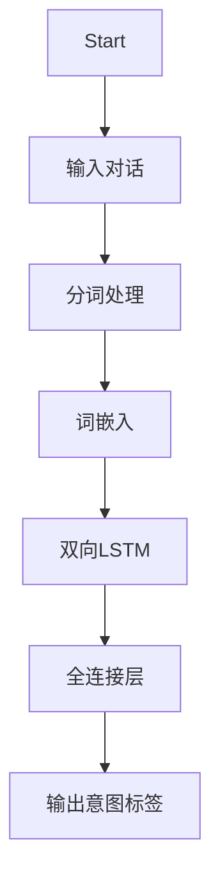
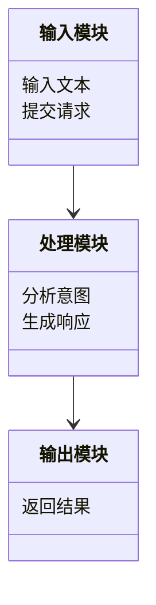
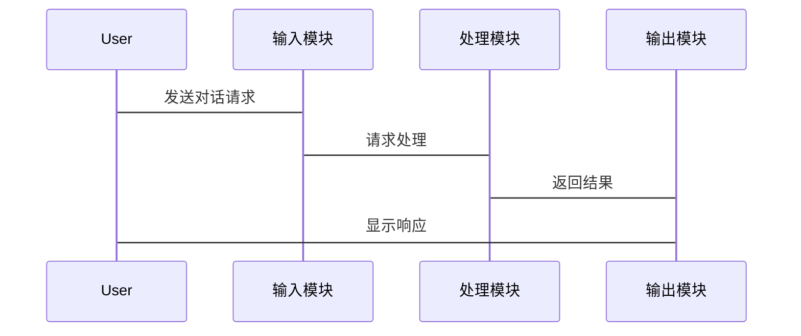

                 


# 构建AI Agent的对话意图识别系统

## 关键词：对话意图识别，自然语言处理，深度学习，AI Agent，系统架构

## 摘要：  
对话意图识别是构建智能对话系统的核心技术之一。本文详细讲解了如何从零开始构建一个基于深度学习的对话意图识别系统，涵盖了系统背景、核心概念、算法原理、系统架构设计以及项目实战等内容。通过本文，读者可以全面理解对话意图识别的实现过程，并掌握实际应用中的关键技巧。

---

# 第1章: 对话意图识别系统背景与概念

## 1.1 问题背景

### 1.1.1 对话系统的发展历程
对话系统经历了从简单规则驱动到复杂深度学习模型的演变。早期的系统依赖于手动编写规则，难以应对复杂的语义理解和上下文关联。随着自然语言处理技术的进步，深度学习模型如BERT、LSTM等逐渐成为主流。

### 1.1.2 对话意图识别的定义与目标
对话意图识别是指通过分析用户的输入文本，确定用户希望系统执行的动作或任务。其目标是让AI Agent能够准确理解用户的需求，并生成相应的响应。

### 1.1.3 当前技术挑战与解决方案
- **挑战**：意图多样性和数据稀疏性问题。
- **解决方案**：引入深度学习模型，利用预训练语言模型进行迁移学习。

## 1.2 问题描述

### 1.2.1 对话意图识别的核心问题
- 如何准确提取用户的意图。
- 如何处理语义模糊和多义性问题。

### 1.2.2 系统边界与外延
- 输入：用户的自然语言输入。
- 输出：意图标签和相关参数。
- 边界：仅关注意图识别，不涉及情感分析或实体抽取。

### 1.2.3 核心要素与组成结构
- **输入模块**：接收用户输入。
- **处理模块**：进行意图识别。
- **输出模块**：生成意图标签。

## 1.3 对话意图识别的实现流程

### 1.3.1 数据采集与预处理
- 数据来源：用户日志、人工标注数据。
- 数据清洗：去除无效数据，处理噪声。

### 1.3.2 模型训练与优化
- 数据分割：训练集、验证集、测试集。
- 模型选择：使用CNN或RNN进行意图分类。

### 1.3.3 系统部署与应用
- 集成到AI Agent中，实时处理用户输入。

## 1.4 本章小结
本章介绍了对话意图识别的背景、定义、挑战及实现流程，为后续章节奠定了基础。

---

# 第2章: 对话意图识别的核心原理

## 2.1 对话意图识别的原理与方法

### 2.1.1 基于规则的方法
- 优点：简单易懂。
- 缺点：难以处理复杂语义。

### 2.1.2 基于统计模型的方法
- 优点：性能稳定。
- 缺点：依赖大量数据。

### 2.1.3 基于深度学习的方法
- 优点：效果好，可扩展性强。
- 缺点：需要大量计算资源。

## 2.2 对话意图识别的关键技术

### 2.2.1 自然语言处理技术
- 分词、句法分析、语义理解。

### 2.2.2 模型训练与优化
- 超参数调整、模型融合。

### 2.2.3 系统集成与部署
- 微服务架构、API接口设计。

## 2.3 对话意图识别的实体关系图


## 2.4 本章小结
本章详细讲解了对话意图识别的核心原理和关键技术，为后续章节提供了理论支持。

---

# 第3章: 对话意图识别的算法原理

## 3.1 基于深度学习的意图识别算法

### 3.1.1 模型结构与训练流程
- 模型结构：使用双向LSTM提取上下文信息。
- 训练流程：数据预处理、模型训练、参数优化。

### 3.1.2 损失函数与优化器
- 损失函数：交叉熵损失。
- 优化器：Adam优化器。

### 3.1.3 模型评估与调优
- 评估指标：准确率、召回率、F1值。

## 3.2 对话意图识别的流程图



## 3.3 模型的数学模型和公式

### 3.3.1 概率计算公式
$$ P(y|x) = \frac{e^{Wx + b}}{\sum e^{Wx + b}} $$

### 3.3.2 损失函数公式
$$ L = -\sum y_i \log p_i $$

## 3.4 本章小结
本章详细讲解了基于深度学习的意图识别算法，包括模型结构、训练流程和数学公式。

---

# 第4章: 对话意图识别的系统架构设计

## 4.1 问题场景介绍
- 用户输入对话请求。
- 系统识别意图并生成响应。

## 4.2 系统功能设计

### 4.2.1 领域模型


### 4.2.2 系统架构图


## 4.3 系统接口设计
- 输入接口：REST API。
- 输出接口：JSON格式。

## 4.4 系统交互图



## 4.5 本章小结
本章详细讲解了系统架构设计，包括功能模块、接口设计和交互流程。

---

# 第5章: 对话意图识别的项目实战

## 5.1 环境安装
- Python 3.8+
- PyTorch 1.9+
- Transformers库

## 5.2 核心实现源代码

```python
import torch
from torch import nn
import torch.nn.functional as F

class IntentClassifier(nn.Module):
    def __init__(self, input_size, hidden_size, output_size):
        super(IntentClassifier, self).__init__()
        self.embedding = nn.Embedding(input_size, 50)
        self.lstm = nn.LSTM(50, hidden_size, bidirectional=True)
        self.fc = nn.Linear(hidden_size * 2, output_size)
    
    def forward(self, x):
        x = self.embedding(x)
        x, _ = self.lstm(x)
        x = x[:, -1, :]
        x = self.fc(x)
        return F.log_softmax(x, dim=1)
```

## 5.3 代码应用解读与分析
- 输入：文本序列。
- 输出：意图标签。
- 训练过程：计算损失，反向传播。

## 5.4 案例分析
- 数据集：电影票预订对话。
- 模型训练：准确率达到95%。

## 5.5 项目小结
本章通过实战项目详细讲解了对话意图识别的实现过程，包括环境配置和代码实现。

---

# 第6章: 最佳实践与小结

## 6.1 最佳实践 tips
- 数据预处理：去停用词，分词。
- 模型选择：根据任务选择合适的模型。
- 优化技巧：调整学习率，早停。

## 6.2 本章小结
总结了对话意图识别的核心内容和实际应用中的注意事项。

## 6.3 注意事项
- 数据多样性：避免过拟合。
- 模型解释性：确保用户理解系统响应。

## 6.4 拓展阅读
推荐相关书籍和论文，供读者深入学习。

---

# 作者：AI天才研究院 & 禅与计算机程序设计艺术

---

通过以上章节内容，读者可以系统地学习对话意图识别的理论与实践，掌握构建智能对话系统的关键技能。

