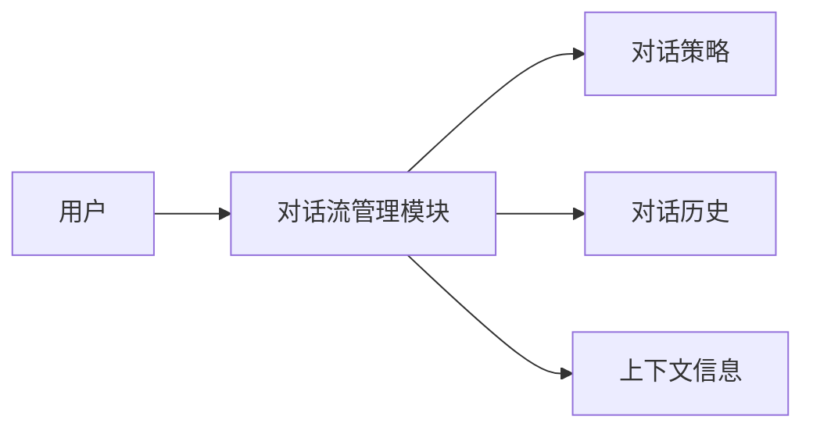
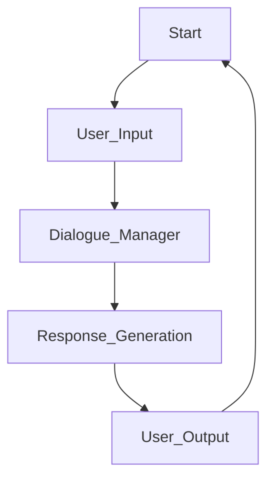
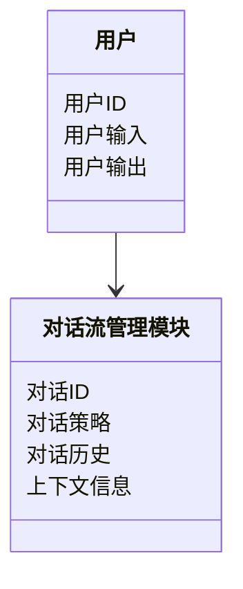
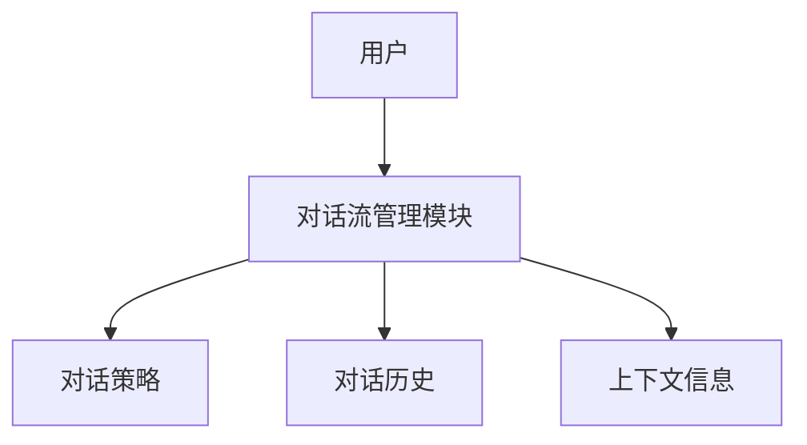
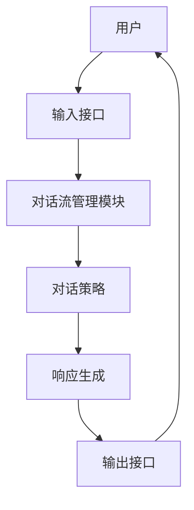

                 


# 构建AI Agent的对话流管理系统：提升交互流畅度

## 关键词：AI Agent，对话流管理，交互流畅度，系统架构，算法原理

## 摘要

随着人工智能技术的快速发展，AI Agent在各个领域的应用越来越广泛。然而，对话流管理作为AI Agent实现高效交互的核心部分，其重要性不言而喻。本文将详细探讨如何构建一个高效的对话流管理系统，从背景概念、技术原理到系统设计、项目实战和优化策略，全面解析提升交互流畅度的关键点。通过理论与实践相结合的方式，帮助读者深入理解并掌握对话流管理的技术精髓。

---

## 第1章：AI Agent与对话流管理概述

### 1.1 AI Agent的基本概念

AI Agent（人工智能代理）是指能够感知环境并采取行动以实现目标的智能实体。它可以是一个软件程序，也可以是一个物理设备，通过与用户或环境交互，完成特定任务。AI Agent的核心特征包括自主性、反应性、目标导向和社交能力。

#### 1.1.2 对话流管理的定义与作用

对话流管理是对对话过程中的信息流进行规划、控制和优化的过程。其作用包括：
1. **引导对话**：确保对话按照预设的流程进行，避免偏离主题。
2. **提升流畅度**：通过实时调整对话策略，提高用户体验。
3. **处理异常情况**：当对话出现意外情况时，及时恢复并引导对话回到正轨。

#### 1.1.3 AI Agent在对话流管理中的应用

AI Agent可以通过对话流管理实现智能客服、虚拟助手、教育机器人等多种应用场景。例如，在智能客服系统中，AI Agent能够根据用户的问题自动匹配最佳的对话路径，确保问题高效解决。

### 1.2 对话流管理的背景与挑战

#### 1.2.1 当前对话系统的痛点

当前的对话系统存在以下问题：
1. **对话不连贯**：用户的问题可能涉及多个主题，系统难以保持上下文一致性。
2. **应对能力有限**：面对复杂或意外的问题，系统往往无法有效处理。
3. **用户体验不佳**：对话过程中的延迟或错误可能让用户感到不满。

#### 1.2.2 对话流畅度的重要性

对话流畅度是衡量AI Agent性能的重要指标。流畅的对话能够提高用户体验，增强用户对系统的信任感。同时，流畅的对话也能够提高系统的效率，减少资源浪费。

#### 1.2.3 对话流管理的核心问题

对话流管理的核心问题包括：
1. **对话路径规划**：如何根据用户输入选择最佳的响应路径。
2. **上下文管理**：如何保持对话的连贯性和一致性。
3. **异常处理**：如何应对对话中的意外情况。

### 1.3 本书的目标与结构

#### 1.3.1 本书的目标

本书旨在帮助读者理解对话流管理的核心原理，并通过实际案例展示如何构建高效的对话流管理系统。同时，本书还将探讨对话流管理的优化策略，为读者提供理论与实践相结合的指导。

#### 1.3.2 本书的结构与内容

本书分为五个部分：
1. **背景与概念**：介绍AI Agent和对话流管理的基本概念。
2. **技术原理**：详细讲解对话流管理的算法原理和数学模型。
3. **系统设计**：展示对话流管理系统的架构设计和接口设计。
4. **项目实战**：提供对话流管理系统的实现代码和案例分析。
5. **优化与未来展望**：探讨对话流管理系统的优化策略和未来发展趋势。

---

## 第2章：对话流管理的核心概念与联系

### 2.1 核心概念与原理

#### 2.1.1 对话流管理的实体关系图



#### 2.1.2 对话流管理的流程图



### 2.2 核心概念对比与ER图

#### 2.2.1 对话流管理中的实体对比

| 实体 | 属性 | 关系 |
|------|------|------|
| 用户 | 输入、输出 | 发起对话 |
| 对话流管理模块 | 策略、历史、上下文 | 处理对话 |

#### 2.2.2 ER实体关系图

```mermaid
erd
    entity 用户 {
        用户ID
        用户输入
        用户输出
    }
    entity 对话流管理模块 {
        对话ID
        对话策略
        对话历史
        上下文信息
    }
    relationship 发起对话 {
        用户 --> 对话流管理模块
    }
```

---

## 第3章：对话流管理的算法原理

### 3.1 对话流管理的算法流程

#### 3.1.1 算法流程图

```mermaid
graph TD
    Start --> Check_Input
    Check_Input --> [输入是否有效]
    If_Yes --> Generate_Response
    Generate_Response --> Output_Response
    If_No --> Handle_Exception
    Handle_Exception --> Recovery_Response
    Recovery_Response --> End
```

### 3.2 数学模型与公式

#### 3.2.1 对话流畅度的数学模型

对话流畅度可以表示为：

$$
\text{流畅度} = \frac{\text{有效对话次数}}{\text{总对话次数}} \times 100\%
$$

其中，有效对话次数是指用户在对话过程中感到满意的次数。

#### 3.2.2 示例与解释

假设在100次对话中，用户有85次感到满意，那么流畅度为：

$$
85\% = \frac{85}{100} \times 100\%
$$

---

## 第4章：系统分析与架构设计

### 4.1 问题场景介绍

#### 4.1.1 对话流管理的场景分析

在智能客服系统中，用户可能提出多种问题，例如：

1. **简单问题**：如“如何找回密码？”
2. **复杂问题**：如“如何处理订单错误？”
3. **意外问题**：如“我遇到了技术问题，无法继续操作。”

### 4.2 系统功能设计

#### 4.2.1 领域模型类图



### 4.3 系统架构设计

#### 4.3.1 系统架构图



### 4.4 系统接口与交互设计

#### 4.4.1 系统接口设计

1. **用户输入接口**：接收用户的输入信息。
2. **对话策略接口**：根据用户输入生成响应策略。
3. **输出接口**：将生成的响应返回给用户。

#### 4.4.2 交互流程图



---

## 第5章：对话流管理系统的实现

### 5.1 环境安装与配置

#### 5.1.1 开发环境搭建

1. 安装Python和必要的库（如numpy、pandas）。
2. 安装对话流管理框架（如Rasa）。

### 5.2 核心功能实现

#### 5.2.1 对话流管理的代码实现

```python
def manage_dialogue(user_input, dialogue_history, context):
    # 检查输入是否有效
    if is_valid_input(user_input):
        response = generate_response(user_input, dialogue_history, context)
        return response
    else:
        # 处理异常情况
        handle_exception(user_input, dialogue_history, context)
        return "抱歉，我未能理解您的问题。请重新描述您的问题。"
```

#### 5.2.2 代码解读与分析

1. **输入检查**：函数首先检查用户的输入是否有效。
2. **响应生成**：如果输入有效，生成响应；否则，处理异常情况并返回错误信息。

#### 5.3 实际案例分析

案例：用户询问“如何找回密码？”

1. 系统接收输入并检查有效性。
2. 生成响应“请提供您的注册邮箱，我们将发送密码重置链接。”
3. 用户提供邮箱地址，系统验证后发送链接。

---

## 第6章：优化策略与未来展望

### 6.1 系统优化策略

#### 6.1.1 性能优化方法

1. **缓存机制**：对频繁访问的数据进行缓存，减少数据库查询次数。
2. **并行处理**：利用多线程或多进程处理多个对话请求。

#### 6.1.2 可扩展性优化

1. **模块化设计**：将系统划分为多个模块，便于扩展和维护。
2. **分布式架构**：在高并发场景下，采用分布式架构提高系统的处理能力。

### 6.2 未来发展趋势

#### 6.2.1 对话流管理的未来方向

1. **智能化**：结合强化学习和深度学习，进一步提升对话流畅度。
2. **个性化**：根据用户的偏好和行为习惯，提供个性化的对话体验。

#### 6.2.2 技术融合的

随着技术的进步，对话流管理将与自然语言处理、计算机视觉等技术深度融合，实现更加智能化和个性化的交互体验。

---

## 作者：AI天才研究院 & 禅与计算机程序设计艺术

---

通过以上章节的详细讲解，我们全面探讨了构建AI Agent对话流管理系统的各个方面，从理论到实践，从设计到优化，为读者提供了一套完整的解决方案。希望本书能够为AI Agent的开发者和研究者提供有价值的参考和启发。

