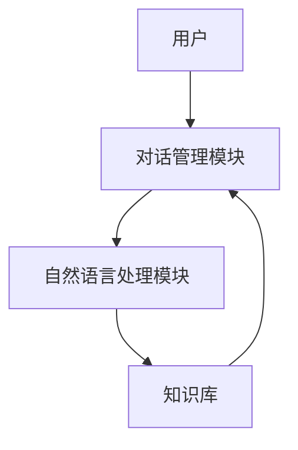
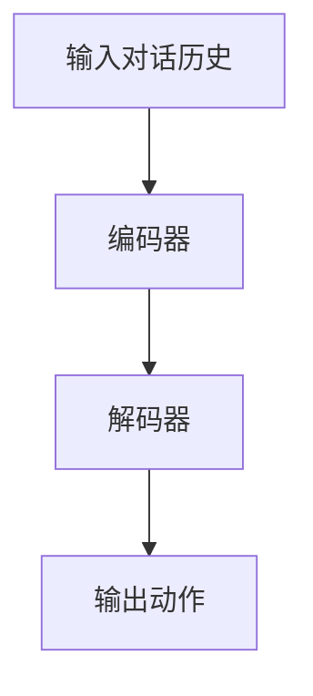
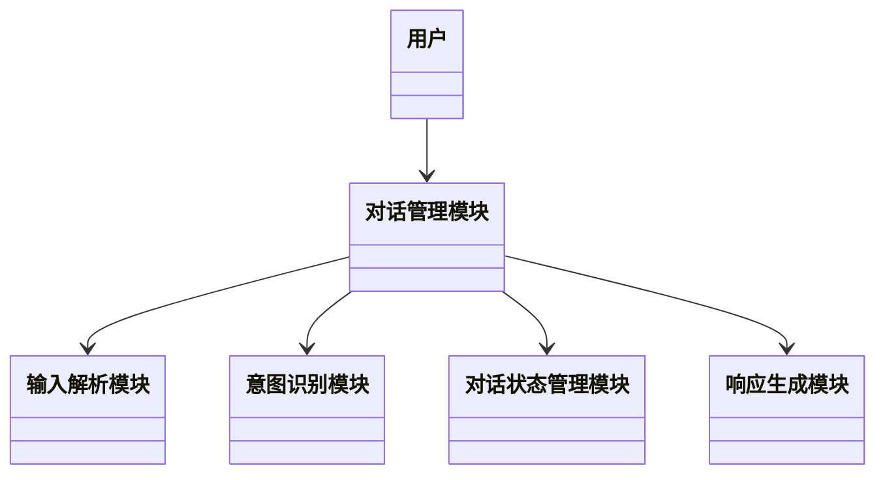
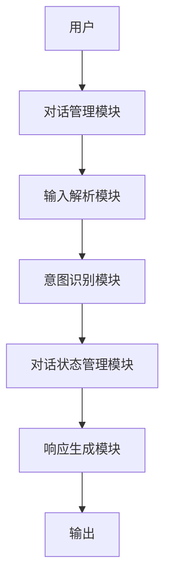

                 


# 构建AI Agent的对话管理系统

> 关键词：AI Agent, 对话管理系统, 自然语言处理, 算法原理, 系统架构

> 摘要：本文详细探讨了构建AI Agent对话管理系统的各个方面，从核心概念到算法原理，再到系统架构设计和项目实战。通过深入分析对话管理系统的原理、算法实现、架构设计以及实际项目案例，为读者提供全面的技术指导。

---

## 第1章: AI Agent与对话管理系统的背景与概述

### 1.1 AI Agent的基本概念

#### 1.1.1 AI Agent的定义与特点

AI Agent（人工智能代理）是指能够感知环境并采取行动以实现目标的智能实体。AI Agent可以是软件程序，也可以是硬件设备，其核心目标是通过与用户的交互或环境的交互，完成特定任务。AI Agent的特点包括：

- **自主性**：能够在没有外部干预的情况下运行。
- **反应性**：能够根据环境反馈调整行为。
- **目标导向**：所有行动都以实现特定目标为导向。
- **学习能力**：能够通过数据和经验优化自身行为。

#### 1.1.2 对话管理系统的定义与作用

对话管理系统是AI Agent的重要组成部分，负责处理用户与AI Agent之间的对话流程。其主要作用包括：

- **解析用户意图**：通过自然语言处理技术，识别用户的意图和需求。
- **生成响应**：根据用户的输入生成合适的回复。
- **维护对话状态**：跟踪对话的上下文，确保对话的连贯性。
- **协调多个模块**：整合自然语言理解、生成和其他功能模块，形成完整的对话流程。

#### 1.1.3 构建对话管理系统的背景与意义

随着自然语言处理技术的快速发展，AI Agent在各个领域的应用越来越广泛。构建高效的对话管理系统对于提升用户体验、优化系统性能具有重要意义。通过对话管理系统，AI Agent能够更准确地理解用户需求，提供更智能的服务。

---

### 1.2 对话管理系统的核心问题

#### 1.2.1 对话流程中的关键问题

在对话管理过程中，需要解决以下几个关键问题：

- **意图识别**：准确识别用户的意图。
- **对话状态管理**：维护对话的上下文信息。
- **多轮对话处理**：处理复杂且多轮的对话流程。
- **异常处理**：应对用户输入的异常情况。

#### 1.2.2 对话管理系统的边界与外延

对话管理系统的边界主要集中在对话流程的处理上，其外延则包括与自然语言理解、生成以及其他功能模块的交互。对话管理系统的核心功能是通过与这些模块的协同工作，实现高效的对话流程。

#### 1.2.3 对话管理系统的概念结构与核心要素组成

对话管理系统的概念结构可以分为以下几个核心要素：

- **对话历史**：记录对话的上下文信息。
- **意图解析**：识别用户的意图。
- **对话策略**：制定对话的执行策略。
- **响应生成**：生成合适的回复。

---

### 1.3 本章小结

本章主要介绍了AI Agent和对话管理系统的背景与概念，重点分析了对话管理系统的核心问题和概念结构。通过这些分析，为后续章节的深入探讨奠定了基础。

---

## 第2章: 对话管理系统的核心概念与联系

### 2.1 对话管理系统的原理

#### 2.1.1 对话管理的核心原理

对话管理系统的原理可以简单理解为：通过解析用户的输入，生成合适的回复。具体步骤包括：

1. **输入解析**：将用户的输入转化为结构化的数据。
2. **意图识别**：识别用户的意图。
3. **对话状态维护**：更新对话的上下文信息。
4. **响应生成**：根据意图和对话状态生成回复。

#### 2.1.2 对话管理的实现机制

对话管理的实现机制主要包括基于规则的方法、统计模型和深度学习模型。每种方法都有其优缺点，选择合适的实现机制取决于具体的应用场景和需求。

---

### 2.2 核心概念对比分析

#### 2.2.1 对话管理系统的属性特征对比

以下是几种常见的对话管理系统的属性特征对比：

| 特性                | 基于规则的对话管理 | 基于统计的对话管理 | 基于深度学习的对话管理 |
|---------------------|---------------------|--------------------|--------------------------|
| 实现方式            | 使用预定义的规则   | 基于统计模型        | 基于神经网络模型        |
| 优势                | 简单易懂，易于维护 | 更加灵活            | 表现更接近人类对话        |
| 劣势                | 无法处理复杂场景    | 需要大量数据        | 训练时间长，资源消耗大    |

#### 2.2.2 对话管理系统的ER实体关系图

以下是对话管理系统的ER实体关系图：



---

### 2.3 本章小结

本章通过对比分析不同对话管理系统的实现机制，深入探讨了对话管理系统的属性特征和实体关系图。这些分析为后续章节的算法实现和系统设计提供了理论基础。

---

## 第3章: 对话管理系统的算法原理

### 3.1 对话管理算法概述

#### 3.1.1 基于规则的对话管理算法

基于规则的对话管理算法通过预定义的规则来处理对话流程。这种方法简单易懂，适用于场景简单且规则明确的对话管理。

#### 3.1.2 统计模型的对话管理算法

基于统计模型的对话管理算法通过分析大量的对话数据，提取出对话的模式和规律。这种方法更加灵活，但需要大量的数据支持。

#### 3.1.3 基于深度学习的对话管理算法

基于深度学习的对话管理算法通过神经网络模型来学习对话的模式和规律。这种方法表现更接近人类对话，但实现复杂且需要大量的计算资源。

---

### 3.2 基于深度学习的对话管理算法

#### 3.2.1 算法流程图

以下是基于深度学习的对话管理算法的流程图：



---

### 3.3 本章小结

本章详细介绍了对话管理系统的算法原理，重点分析了基于深度学习的对话管理算法。通过对算法流程图的分析，读者可以更好地理解对话管理系统的实现过程。

---

## 第4章: 对话管理系统架构设计

### 4.1 系统功能设计

#### 4.1.1 系统功能模块划分

对话管理系统的功能模块可以划分为以下几个部分：

- **输入解析模块**：负责解析用户的输入。
- **意图识别模块**：负责识别用户的意图。
- **对话状态管理模块**：负责维护对话的上下文信息。
- **响应生成模块**：负责生成回复。

#### 4.1.2 系统功能设计类图

以下是系统功能设计类图：



---

### 4.2 系统架构设计

#### 4.2.1 系统架构设计图

以下是系统架构设计图：



---

### 4.3 本章小结

本章通过系统功能设计和架构设计，详细探讨了对话管理系统的实现过程。通过对类图和架构图的分析，读者可以更好地理解对话管理系统的整体结构。

---

## 第5章: 项目实战——构建对话管理系统

### 5.1 环境搭建

#### 5.1.1 开发工具安装

- 安装Python
- 安装相关库（如TensorFlow、Keras等）

#### 5.1.2 开发环境配置

- 配置虚拟环境
- 安装依赖库

---

### 5.2 核心代码实现

#### 5.2.1 对话管理模块的实现

以下是对话管理模块的实现代码：

```python
class DialogManager:
    def __init__(self):
        self.dialog_history = []
        self.intent = None

    def process_input(self, input_text):
        # 解析输入
        self.dialog_history.append(input_text)
        # 识别意图
        self.intent = self._identify_intent(input_text)
        # 生成响应
        response = self._generate_response(self.intent)
        return response

    def _identify_intent(self, text):
        # 简单的意图识别实现
        # 实际应用中需要更复杂的算法
        return "information_request"

    def _generate_response(self, intent):
        # 根据意图生成响应
        return f"您需要了解关于{intent}的信息，请提供更多细节。"
```

---

### 5.3 系统功能实现

#### 5.3.1 输入解析模块的实现

以下是输入解析模块的实现代码：

```python
class InputParser:
    def parse(self, input_text):
        # 简单的输入解析实现
        return input_text.lower()
```

---

### 5.4 本章小结

本章通过具体的项目实战，详细讲解了对话管理系统的实现过程。通过对代码的分析，读者可以更好地理解对话管理系统的实际应用。

---

## 第6章: 优化与部署

### 6.1 性能优化

#### 6.1.1 算法优化

- 使用更高效的算法
- 优化模型参数

#### 6.1.2 系统优化

- 优化系统架构
- 优化数据库访问

---

### 6.2 系统扩展

#### 6.2.1 功能扩展

- 增加多语言支持
- 增加多轮对话支持

---

### 6.3 系统安全与可靠性

#### 6.3.1 安全性保障

- 数据加密
- 权限控制

#### 6.3.2 系统可靠性

- 容错设计
- 备份恢复

---

### 6.4 部署方案

#### 6.4.1 系统部署

- 部署到云服务器
- 配置反向代理

---

### 6.5 本章小结

本章详细探讨了对话管理系统的优化与部署过程。通过对系统的优化和部署，可以进一步提升对话管理系统的性能和可靠性。

---

## 第7章: 总结与展望

### 7.1 总结

通过对对话管理系统的全面分析，我们深入探讨了其核心概念、算法原理和系统架构设计。通过具体的项目实战，我们进一步了解了对话管理系统的实现过程。

### 7.2 展望

随着自然语言处理技术的不断发展，对话管理系统将更加智能化和个性化。未来的研究方向包括更复杂的对话管理算法、更高效的系统架构设计以及更广泛的应用场景。

---

## 作者：AI天才研究院/AI Genius Institute & 禅与计算机程序设计艺术 /Zen And The Art of Computer Programming

---

通过以上章节的详细讲解，我们系统地探讨了构建AI Agent对话管理系统的各个方面，从理论到实践，为读者提供了全面的技术指导。希望本文能够为读者在构建对话管理系统的过程中提供有价值的参考和启示。

