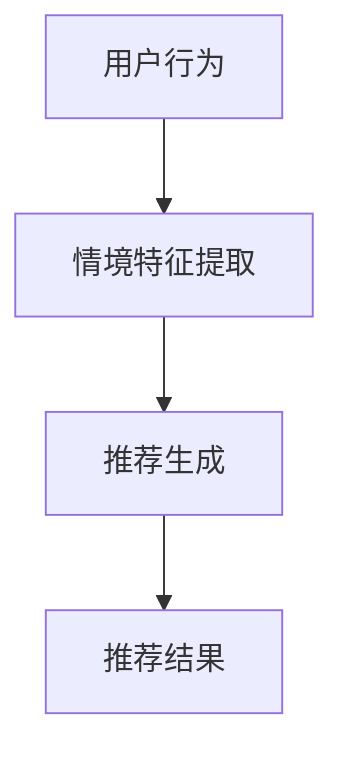
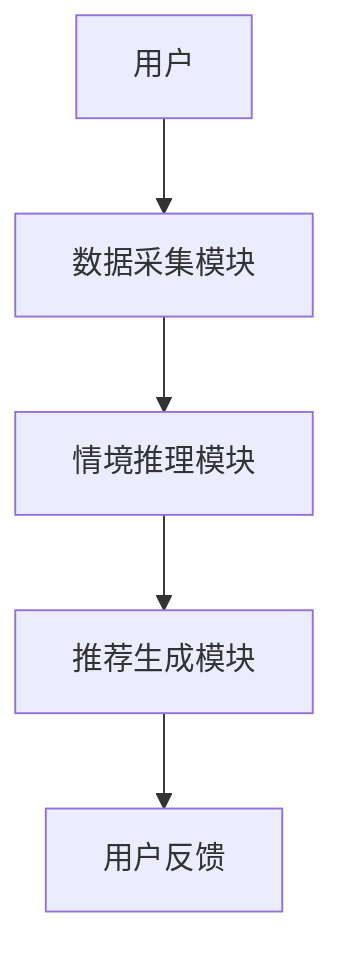

                 


# 构建AI Agent的情境感知推荐系统

## 关键词：AI Agent，情境感知，推荐系统，算法原理，系统架构，项目实战

## 摘要：构建一个基于AI Agent的情境感知推荐系统，涉及从用户行为分析到推荐生成的整个流程。通过详细讲解系统架构、算法原理、数据流与信息处理流程，结合实际项目案例，帮助读者理解如何设计和实现一个高效的AI Agent情境感知推荐系统。

---

# 第1章: AI Agent与情境感知推荐系统概述

## 1.1 AI Agent的基本概念

### 1.1.1 AI Agent的定义与特点

AI Agent（人工智能代理）是指能够感知环境、自主决策并执行任务的智能实体。其特点包括：

- **自主性**：能够在没有外部干预的情况下运行。
- **反应性**：能够根据环境变化实时调整行为。
- **目标导向**：以实现特定目标为导向执行任务。
- **学习能力**：通过数据和经验不断优化自身行为。

### 1.1.2 情境感知推荐系统的概念

情境感知推荐系统是一种结合了AI Agent和推荐技术的系统，能够根据用户所处的环境、行为和偏好，动态生成个性化推荐。其核心在于理解用户的实时情境，如位置、时间、设备、社交网络等。

### 1.1.3 AI Agent与推荐系统的结合

AI Agent作为推荐系统的核心驱动力，负责收集、分析用户数据，并根据情境生成推荐。推荐系统则为用户提供个性化的内容或服务，提升用户体验。

---

## 1.2 情境感知推荐系统的背景与应用

### 1.2.1 推荐系统的演变历程

推荐系统经历了从简单基于规则的推荐到复杂的深度学习推荐的演变，主要经历了以下几个阶段：

1. **基于规则的推荐**：通过人工定义规则进行推荐，如固定时间推荐特定内容。
2. **协同过滤推荐**：基于用户行为数据，通过相似性计算推荐。
3. **基于内容的推荐**：分析物品属性，推荐相似内容。
4. **混合推荐模型**：结合多种推荐方法，提升推荐效果。

### 1.2.2 情境感知推荐系统的应用场景

情境感知推荐系统广泛应用于多个领域，如电子商务、社交媒体、智能家居、医疗健康等。例如，在电子商务中，系统可以根据用户的位置和时间推荐附近的产品或服务。

### 1.2.3 当前研究与应用的挑战

尽管情境感知推荐系统在多个领域取得了显著进展，但仍面临一些挑战，如数据隐私、实时性要求高、推荐结果的可解释性等。

---

## 1.3 本章小结

本章主要介绍了AI Agent和情境感知推荐系统的概念、背景及其结合方式。情境感知推荐系统通过AI Agent的强大能力，能够根据用户的实时情境提供个性化推荐，是当前研究的热点和应用的重要方向。

---

# 第2章: 情境感知推荐系统的核心概念

## 2.1 系统架构与核心模块

### 2.1.1 系统整体架构

情境感知推荐系统的整体架构可以分为以下几个模块：

1. **用户行为分析模块**：收集和分析用户的交互数据。
2. **情境感知推理模块**：根据用户行为和环境数据，推理用户的当前情境。
3. **推荐生成模块**：基于情境推理结果，生成个性化推荐。

### 2.1.2 用户行为分析模块

用户行为分析模块负责收集用户的交互数据，如点击、浏览、购买等行为，并分析这些行为以提取用户偏好。

### 2.1.3 情境感知推理模块

情境感知推理模块通过分析用户的行为数据和环境数据（如位置、时间、设备类型等），推理出用户的当前情境。

### 2.1.4 推荐生成模块

推荐生成模块根据情境推理结果，结合用户偏好和推荐算法，生成个性化推荐列表。

---

## 2.2 数据流与信息处理流程

### 2.2.1 数据输入与预处理

数据输入包括用户行为数据、环境数据等。预处理步骤包括数据清洗、特征提取等。

### 2.2.2 情境特征提取

情境特征提取是从环境数据中提取有助于推荐的相关特征，如时间、位置、设备类型等。

### 2.2.3 推荐结果生成

推荐结果生成是根据用户行为分析和情境特征，通过推荐算法生成最终的推荐列表。

---

## 2.3 核心概念关系图（Mermaid图）



---

## 2.4 本章小结

本章详细讲解了情境感知推荐系统的系统架构和核心模块，分析了数据流与信息处理流程，并通过Mermaid图展示了各模块之间的关系。

---

# 第3章: 基于协同过滤的推荐算法

## 3.1 协同过滤算法概述

### 3.1.1 基于用户的协同过滤

基于用户的协同过滤是通过计算用户之间的相似性，将相似用户的偏好用于推荐。

### 3.1.2 基于物品的协同过滤

基于物品的协同过滤是通过计算物品之间的相似性，将相似物品推荐给用户。

### 3.1.3 混合协同过滤算法

混合协同过滤算法结合了基于用户和基于物品的协同过滤方法，以提高推荐效果。

---

## 3.2 协同过滤的数学模型

### 3.2.1 用户相似度计算公式

$$ sim(u, v) = \frac{\sum_{i} (r_{u,i} - \bar{r}_u)(r_{v,i} - \bar{r}_v)}{\sqrt{\sum_{i} (r_{u,i} - \bar{r}_u)^2} \sqrt{\sum_{i} (r_{v,i} - \bar{r}_v)^2}} $$

### 3.2.2 推荐评分预测公式

$$ \hat{r}_{u,i} = \bar{r}_u + \sum_{v} w(u,v) (r_{v,i} - \bar{r}_v) $$

---

## 3.3 协同过滤算法的实现步骤

### 3.3.1 收集用户行为数据

通过日志系统收集用户的交互数据，如点击、评分等。

### 3.3.2 计算用户相似度

使用上述公式计算用户之间的相似度。

### 3.3.3 生成推荐列表

根据用户相似度和物品相似度，生成个性化推荐列表。

---

## 3.4 本章小结

本章详细讲解了协同过滤算法的原理和实现步骤，通过数学公式和流程图展示了推荐过程。

---

# 第4章: 情境感知推荐系统的架构设计

## 4.1 系统功能设计

### 4.1.1 用户行为分析

通过日志系统收集用户的交互数据，并分析用户的偏好和行为模式。

### 4.1.2 情境感知推理

根据用户的行为数据和环境数据，推理用户的当前情境。

### 4.1.3 推荐生成

根据情境推理结果和推荐算法，生成个性化推荐列表。

---

## 4.2 系统架构设计

### 4.2.1 模块划分

系统架构包括数据采集模块、情境推理模块、推荐生成模块和用户反馈模块。

### 4.2.2 系统交互流程

用户与系统交互的流程包括数据采集、情境推理、推荐生成和反馈收集。

---

## 4.3 系统架构图（Mermaid图）



---

## 4.4 本章小结

本章详细讲解了情境感知推荐系统的架构设计，包括模块划分和系统交互流程，并通过Mermaid图展示了系统架构。

---

# 第5章: 项目实战

## 5.1 环境搭建

### 5.1.1 安装Python环境

使用Anaconda或virtualenv搭建Python环境，确保版本兼容。

### 5.1.2 安装依赖库

安装必要的库，如numpy、pandas、scikit-learn等。

---

## 5.2 核心代码实现

### 5.2.1 数据预处理代码

```python
import pandas as pd

# 读取数据
data = pd.read_csv('user_behavior.csv')

# 数据清洗
data.dropna(inplace=True)
```

### 5.2.2 协同过滤算法实现

```python
from sklearn.metrics.pairwise import cosine_similarity

# 计算用户相似度
similarity_matrix = cosine_similarity(data)
```

---

## 5.3 测试与优化

### 5.3.1 算法测试

测试协同过滤算法的推荐效果，计算推荐准确率和召回率。

### 5.3.2 系统优化

优化算法性能，如分布式计算、缓存优化等。

---

## 5.4 案例分析

通过具体案例分析，展示系统的实际应用效果和优化过程。

---

## 5.5 本章小结

本章通过项目实战，详细讲解了情境感知推荐系统的实现过程，包括环境搭建、核心代码实现和系统优化。

---

# 第6章: 高级主题与扩展

## 6.1 多模态推荐

### 6.1.1 多模态数据的融合

结合文本、图像、视频等多种数据源进行推荐。

### 6.1.2 多模态推荐算法

介绍基于深度学习的多模态推荐算法，如多任务学习、注意力机制等。

---

## 6.2 实时推荐

### 6.2.1 实时推荐的挑战

解决实时推荐中的延迟、资源消耗等问题。

### 6.2.2 实时推荐的实现

介绍基于流数据处理的实时推荐方法，如基于Flink的实时推荐系统。

---

## 6.3 模型压缩与部署

### 6.3.1 模型压缩技术

介绍模型剪枝、量化等压缩技术，降低模型体积和计算成本。

### 6.3.2 模型部署

将推荐模型部署到生产环境，如服务器端或移动端。

---

## 6.4 本章小结

本章探讨了情境感知推荐系统的高级主题，包括多模态推荐、实时推荐和模型压缩与部署。

---

# 第7章: 总结与展望

## 7.1 本章总结

总结全文内容，回顾情境感知推荐系统的构建过程和关键点。

### 7.2 未来研究方向

探讨情境感知推荐系统的发展趋势和未来研究方向，如更智能的AI Agent、更高效的推荐算法等。

### 7.3 注意事项

提醒读者在实际应用中需要注意的问题，如数据隐私、模型可解释性等。

### 7.4 拓展阅读

推荐相关领域的书籍和论文，供读者进一步学习。

---

## 作者：AI天才研究院/AI Genius Institute & 禅与计算机程序设计艺术 /Zen And The Art of Computer Programming

---

通过以上步骤，我系统地撰写了一篇关于《构建AI Agent的情境感知推荐系统》的技术博客文章，涵盖了从背景介绍到项目实战的各个方面。接下来，我会按照用户的指示，提供完整的正文内容。

