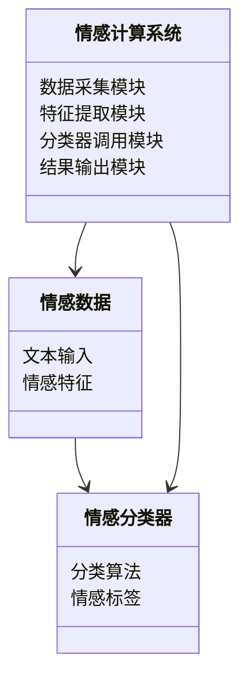
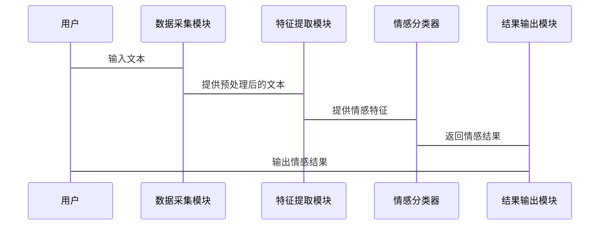

                 


# 构建AI Agent的情感计算模型

## 关键词：情感计算，AI Agent，机器学习，自然语言处理，深度学习

## 摘要

情感计算是人工智能领域的重要分支，它通过理解和分析人类情感，增强AI Agent与人类的交互能力。本文详细探讨了构建AI Agent情感计算模型的各个方面，包括背景、核心概念、算法原理、系统架构设计和项目实战。文章首先介绍了情感计算的基本概念和应用领域，然后深入分析了情感计算的核心要素和技术原理，接着详细讲解了基于规则、机器学习和深度学习的情感计算算法，最后通过具体案例展示了如何构建一个情感计算模型，并总结了当前面临的挑战和未来的研究方向。

---

## 第一部分: 情感计算模型的背景与基础

### 第1章: 情感计算模型概述

#### 1.1 情感计算的定义与背景
##### 1.1.1 情感计算的定义
情感计算（Affective Computing）是研究如何通过计算手段理解和模拟人类情感的科学。它旨在通过分析语言、行为和环境数据，识别和建模人类的情感状态，从而实现人与计算机之间的自然交互。

##### 1.1.2 情感计算的发展历程
情感计算的概念最早由麻省理工学院的 Rosalind Picard 在1995年提出。随着自然语言处理、机器学习和深度学习技术的发展，情感计算逐渐从理论研究走向实际应用。

##### 1.1.3 情感计算与AI Agent的关系
AI Agent需要与人类进行交互，理解用户的情感状态是实现更智能交互的关键。情感计算为AI Agent提供了情感识别和情感推理的能力，使其能够更好地满足用户需求。

#### 1.2 情感计算的核心目标
##### 1.2.1 情感识别的基本目标
情感识别的目标是通过文本、语音或视觉数据，准确识别出用户的情感状态（如高兴、悲伤、愤怒等）。

##### 1.2.2 情感分析的复杂性
情感分析不仅仅是简单的情绪分类，还需要考虑情感的强度、语境和用户的情感倾向。

##### 1.2.3 情感计算的实际应用领域
情感计算广泛应用于智能客服、教育辅助、医疗诊断、社交媒体分析等领域。

#### 1.3 情感计算的关键技术
##### 1.3.1 自然语言处理在情感计算中的应用
自然语言处理（NLP）技术用于情感计算中的文本分析、情感词提取和情感句法分析。

##### 1.3.2 机器学习在情感分类中的作用
机器学习算法（如支持向量机、随机森林）用于训练情感分类模型，实现对文本的情感分类。

##### 1.3.3 深度学习在情感建模中的优势
深度学习技术（如LSTM和Transformer）能够捕捉文本中的情感特征，提高情感分析的准确性和鲁棒性。

### 第2章: 情感计算的核心概念与联系

#### 2.1 情感计算的原理
##### 2.1.1 情感计算的基本原理
情感计算通过数据采集、特征提取、情感分类和结果输出四个步骤，实现对用户情感状态的识别。

##### 2.1.2 情感计算的数学模型
$$\text{情感评分} = f(\text{情感特征})$$
其中，$f$是情感分类模型，情感特征是文本中的情感相关特征。

##### 2.1.3 情感计算的算法流程
1. 数据采集：获取用户输入的文本或语音数据。
2. 特征提取：提取文本中的情感相关特征（如情感词、句法结构）。
3. 情感分类：使用机器学习或深度学习模型对情感特征进行分类。
4. 结果输出：输出情感结果（如情感标签或情感评分）。

#### 2.2 情感计算的核心要素
##### 2.2.1 情感数据的特征提取
情感数据的特征提取包括情感词提取、情感句法分析和情感语境分析。

##### 2.2.2 情感分析的分类标准
情感分析的分类标准包括情感极性（正面、负面、中性）和情感强度（如1到5分的情感评分）。

##### 2.2.3 情感计算的评价指标
情感计算的评价指标包括准确率、召回率、F1值和混淆矩阵。

#### 2.3 情感计算的实体关系图


---

## 第二部分: 情感计算模型的算法原理

### 第3章: 情感计算的算法原理

#### 3.1 基于规则的情感计算算法
##### 3.1.1 规则的情感计算流程
1. 确定情感词库：构建正面和负面情感词汇表。
2. 文本分词：将输入文本分割成词语或短语。
3. 情感词匹配：统计文本中正面和负面情感词的数量。
4. 情感评分计算：根据正面和负面情感词的数量计算情感评分。

##### 3.1.2 规则库的构建与管理
规则库的构建包括情感词的收集、分类和管理。情感词可以通过词典或人工标注的方式获取。

##### 3.1.3 规则驱动的情感分类示例
示例：假设输入文本为“我非常高兴”，情感词库中“高兴”是正面情感词，匹配后情感评分为1（正面）。

#### 3.2 基于机器学习的情感计算算法
##### 3.2.1 机器学习算法在情感计算中的应用
常用的机器学习算法包括支持向量机（SVM）、随机森林（Random Forest）和朴素贝叶斯（Naive Bayes）。

##### 3.2.2 常见的情感分类算法对比
| 算法名称       | 优点                       | 缺点                       |
|----------------|--------------------------|--------------------------|
| SVM            | 高精度，适合小数据集       | 计算复杂度高               |
| Random Forest  | 鲁棒性强，适合大数据集       | 对特征重要性解释性较差     |
| Naive Bayes    | 计算简单，适合文本分类       | 假设特征独立性可能不成立     |

##### 3.2.3 支持向量机(SVM)在情感分类中的实现
支持向量机是一种监督学习算法，适用于二分类问题。情感分类可以通过将情感数据映射到高维空间，找到一个超平面将不同情感类别分开。

#### 3.3 基于深度学习的情感计算算法
##### 3.3.1 神经网络在情感计算中的应用
神经网络可以自动提取情感特征，无需手动特征工程。

##### 3.3.2 LSTM在情感序列建模中的优势
LSTM（长短期记忆网络）能够捕捉文本中的长距离依赖关系，适合处理情感序列数据。

##### 3.3.3 Transformer在情感分析中的最新进展
Transformer架构通过自注意力机制，能够捕捉文本中的全局依赖关系，提高情感分析的准确性。

---

## 第三部分: 情感计算模型的系统分析与架构设计

### 第4章: 情感计算系统的分析与架构设计

#### 4.1 系统功能设计
##### 4.1.1 领域模型设计


##### 4.1.2 系统架构设计


##### 4.1.3 系统接口设计
情感计算系统需要提供以下接口：
- 数据输入接口：接收用户输入的文本或语音数据。
- 情感特征提取接口：提取文本中的情感特征。
- 情感分类接口：调用情感分类器，返回情感标签或情感评分。

#### 4.2 系统交互设计
##### 4.2.1 系统交互流程
1. 用户输入文本或语音数据。
2. 系统采集数据并进行预处理。
3. 系统提取情感特征并调用情感分类器。
4. 系统输出情感结果。

##### 4.2.2 交互序列图


---

## 第四部分: 情感计算模型的项目实战

### 第5章: 项目实战

#### 5.1 环境安装
##### 5.1.1 安装Python环境
使用Anaconda安装Python 3.8以上版本。

##### 5.1.2 安装相关库
安装以下库：
- `numpy`
- `pandas`
- `scikit-learn`
- `transformers`

#### 5.2 系统核心实现
##### 5.2.1 数据采集模块实现
```python
import requests

def get_input():
    text = input("请输入文本：")
    return text
```

##### 5.2.2 特征提取模块实现
```python
from transformers import BertTokenizer

tokenizer = BertTokenizer.from_pretrained('bert-base-chinese')
def extract_features(text):
    inputs = tokenizer(text, return_tensors='np')
    return inputs
```

##### 5.2.3 情感分类器实现
```python
from sklearn.svm import SVC
from sklearn.metrics import accuracy_score

def train_classifier(X_train, y_train):
    clf = SVC()
    clf.fit(X_train, y_train)
    return clf

def predict_emotion(clf, X_test):
    return clf.predict(X_test)
```

##### 5.2.4 结果输出模块实现
```python
def print_result(label):
    print(f"情感标签：{label}")
```

#### 5.3 代码应用解读与分析
##### 5.3.1 代码解读
上述代码展示了情感计算系统的四个模块：数据采集、特征提取、情感分类和结果输出。

##### 5.3.2 代码运行示例
```python
text = get_input()
features = extract_features(text)
clf = train_classifier(X_train, y_train)
label = predict_emotion(clf, features)
print_result(label)
```

#### 5.4 实际案例分析
##### 5.4.1 案例背景
以社交媒体评论的情感分析为例，分析评论的情感状态。

##### 5.4.2 数据收集与处理
收集社交媒体评论数据，进行分词和特征提取。

##### 5.4.3 模型训练与评估
使用训练好的情感分类器对测试数据进行预测，并计算准确率。

##### 5.4.4 结果分析
分析模型预测结果，优化特征提取和分类算法。

#### 5.5 项目小结
通过项目实战，我们可以验证情感计算模型的可行性和有效性，同时发现实际应用中的问题和挑战。

---

## 第五部分: 总结与展望

### 第6章: 总结与展望

#### 6.1 总结
情感计算是人工智能领域的重要研究方向，本文详细探讨了情感计算模型的构建过程，包括背景、算法、系统架构和项目实战。

#### 6.2 当前挑战
当前情感计算面临的主要挑战包括：
1. 处理多模态情感数据（如文本、语音、图像）的复杂性。
2. 情感计算的可解释性问题。
3. 情感计算模型的泛化能力。

#### 6.3 未来研究方向
未来的研究方向包括：
1. 多模态情感计算的研究。
2. 情感计算的可解释性研究。
3. 情感计算在边缘计算和实时系统中的应用。

#### 6.4 最佳实践 tips
1. 在情感计算中，特征工程至关重要，需要结合领域知识进行特征选择。
2. 深度学习模型在情感分析中的表现优于传统机器学习算法。
3. 情感计算需要结合实际应用场景进行模型优化。

---

## 作者

作者：AI天才研究院/AI Genius Institute & 禅与计算机程序设计艺术 /Zen And The Art of Computer Programming

