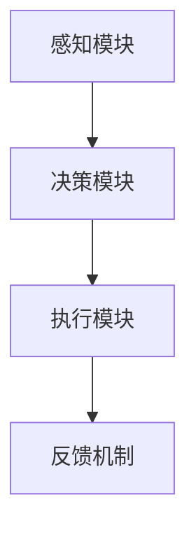

                 


# 构建AI Agent的技术栈选择指南

## 关键词：AI Agent，技术栈，强化学习，系统架构，项目实战

## 摘要：  
本文旨在为开发者和架构师提供一份关于构建AI Agent的技术栈选择的指南。通过详细分析AI Agent的核心概念、算法原理、系统架构以及项目实战，本文将帮助读者理解如何选择合适的技术栈来构建高效且可靠的AI Agent系统。文章从强化学习、监督学习等算法原理出发，结合实际项目案例，深入探讨系统设计的关键点，并总结最佳实践，为读者提供全面的技术指导。

---

## 第一部分：AI Agent的基本概念与技术栈选择背景

### 第1章：AI Agent的基本概念与技术栈选择背景

#### 1.1 AI Agent的定义与核心概念

##### 1.1.1 AI Agent的基本定义  
AI Agent（人工智能代理）是一种能够感知环境、自主决策并执行任务的智能实体。它可以是一个软件程序、机器人或其他智能系统，旨在通过与环境的交互实现特定目标。AI Agent的核心在于其自主性和智能性，能够根据环境反馈动态调整行为。

##### 1.1.2 AI Agent的核心特征  
- **自主性**：AI Agent无需外部干预，能够自主决策。  
- **反应性**：能够实时感知环境并做出响应。  
- **目标导向**：所有行为都以实现特定目标为导向。  
- **学习能力**：能够通过经验改进性能。  

##### 1.1.3 AI Agent的分类与应用场景  
AI Agent可以分为以下几类：  
1. **简单反射型Agent**：基于当前输入做出简单反应，适用于规则明确的任务（如自动门）。  
2. **基于模型的反射型Agent**：维护环境状态模型，适用于复杂任务（如自动驾驶）。  
3. **目标驱动型Agent**：根据目标选择最优行动（如智能助手）。  
4. **效用驱动型Agent**：通过最大化效用函数实现目标（如机器人优化路径规划）。  

应用场景包括：智能助手、自动驾驶、游戏AI、机器人控制、推荐系统等。

---

#### 1.2 技术栈选择的背景与重要性

##### 1.2.1 当前AI技术的发展现状  
AI技术快速发展，深度学习、强化学习等技术成熟，为构建AI Agent提供了丰富的工具和算法支持。然而，技术的选择需要根据具体场景和需求进行权衡。

##### 1.2.2 技术栈选择对企业的影响  
选择合适的技术栈直接影响系统的性能、开发效率和维护成本。错误的技术选择可能导致系统性能不佳或开发成本过高。

##### 1.2.3 构建AI Agent的主要挑战  
- **算法选择**：强化学习、监督学习等算法各有优劣，需根据任务选择合适算法。  
- **数据处理**：AI Agent需要实时处理多源异构数据，数据质量直接影响性能。  
- **系统架构**：复杂的系统架构设计需要平衡扩展性、可维护性和性能。  

---

## 第二部分：AI Agent的核心技术与算法原理

### 第2章：AI Agent的核心技术原理

#### 2.1 强化学习算法

##### 2.1.1 强化学习的基本原理  
强化学习（Reinforcement Learning，RL）是一种通过试错机制学习策略的方法。AI Agent通过与环境交互，获得奖励或惩罚，逐步优化行为策略以最大化累积奖励。

##### 2.1.2 Q-learning算法的数学模型  
Q-learning是最常用的强化学习算法之一，其目标是学习状态-动作值函数Q(s, a)。数学模型如下：  
$$ Q(s, a) = r + \gamma \max_{a'} Q(s', a') $$  
其中，$r$是立即奖励，$\gamma$是折扣因子，$s'$是新状态。

##### 2.1.3 强化学习在AI Agent中的应用  
强化学习适用于需要动态决策的任务，如游戏AI、机器人控制等。通过与环境交互，AI Agent逐步优化策略，实现复杂任务。

#### 2.2 监督学习与无监督学习

##### 2.2.1 监督学习的基本原理  
监督学习通过标记数据训练模型，使其能够对新数据做出预测。适用于分类和回归任务，但AI Agent需要动态决策，监督学习的应用有限。

##### 2.2.2 无监督学习的核心思想  
无监督学习通过发现数据中的模式实现聚类或降维。适用于数据预处理和无标签数据的分析，但难以直接应用于AI Agent的实时决策。

##### 2.2.3 监督与无监督学习在AI Agent中的结合  
在某些场景中，AI Agent可以结合监督学习进行初步训练，再通过无监督学习进行动态调整，实现更灵活的决策。

---

## 第三部分：AI Agent系统架构与技术选型

### 第3章：AI Agent系统架构设计

#### 3.1 系统架构的核心模块

##### 3.1.1 感知模块  
感知模块负责接收环境输入，如传感器数据或用户指令。常见的感知技术包括计算机视觉、自然语言处理等。

##### 3.1.2 决策模块  
决策模块基于感知数据和目标，选择最优动作。强化学习算法常用于此模块的策略优化。

##### 3.1.3 执行模块  
执行模块将决策模块的输出转化为具体行动，如发送指令或驱动机器人执行动作。

#### 3.2 系统架构的交互流程

##### 3.2.1 感知模块的数据处理流程  
1. 接收输入数据。  
2. 对数据进行预处理和特征提取。  
3. 传递数据至决策模块。  

##### 3.2.2 决策模块的算法执行流程  
1. 接收感知数据。  
2. 根据当前状态选择最优动作。  
3. 输出决策结果。  

##### 3.2.3 执行模块的反馈机制  
1. 执行决策并返回结果。  
2. 收集环境反馈，更新Q值或策略。  

#### 3.3 系统架构的Mermaid图  


### 第4章：技术栈的选择与对比

#### 4.1 技术栈的选择标准

##### 4.1.1 算法性能  
选择能够满足任务需求的算法，如强化学习适用于动态决策任务。  

##### 4.1.2 开发效率  
选择开发效率高的工具和库，如Python的TensorFlow和Keras。  

##### 4.1.3 可扩展性  
选择易于扩展的技术栈，便于后续优化和功能扩展。  

#### 4.2 技术栈对比表格  
| **技术栈** | **优点** | **缺点** | **适用场景** |  
|------------|----------|----------|--------------|  
| 强化学习    | 动态决策能力强 | 需大量训练数据 | 自主决策任务 |  
| 监督学习    | 易实现 | 适用于静态场景 | 数据标注需求高的任务 |  
| 无监督学习  | 无需标注数据 | 需处理复杂数据 | 数据挖掘和聚类任务 |  

#### 4.3 选择建议  
根据任务需求选择合适的技术栈，强化学习适用于动态决策，监督学习适用于数据标注任务，无监督学习适用于数据挖掘。

---

## 第四部分：AI Agent的项目实战

### 第4章：项目实战：构建一个简单的AI Agent

#### 4.1 环境安装

##### 4.1.1 安装Python  
```bash
python --version
pip install --upgrade pip
```

##### 4.1.2 安装依赖库  
```bash
pip install numpy matplotlib gym
```

#### 4.2 系统核心实现源代码

##### 4.2.1 强化学习环境  
```python
import gym
env = gym.make('CartPole-v0')
env.reset()
```

##### 4.2.2 Q-learning算法实现  
```python
import numpy as np

class QAgent:
    def __init__(self, state_space, action_space, gamma=0.99, epsilon=0.1):
        self.q_table = np.zeros(state_space + action_space)
        self.gamma = gamma
        self.epsilon = epsilon

    def get_action(self, state):
        if np.random.random() < self.epsilon:
            return np.random.randint(0, action_space)
        return np.argmax(self.q_table[state])

    def update_q(self, state, action, reward, next_state):
        self.q_table[state][action] = reward + self.gamma * np.max(self.q_table[next_state])
```

##### 4.2.3 训练与测试  
```python
env = gym.make('CartPole-v0')
agent = QAgent(env.observation_space.shape[0], env.action_space.n)

for episode in range(1000):
    state = env.reset()
    total_reward = 0
    done = False
    while not done:
        action = agent.get_action(state)
        next_state, reward, done, info = env.step(action)
        agent.update_q(state, action, reward, next_state)
        total_reward += reward
    print(f"Episode {episode}, Total Reward: {total_reward}")
```

#### 4.3 功能解读与分析  
- **感知模块**：接收环境状态。  
- **决策模块**：根据Q表选择动作。  
- **执行模块**：执行动作并返回反馈。  
- **训练过程**：通过不断更新Q表，优化决策策略。  

#### 4.4 案例分析  
通过训练，AI Agent能够在CartPole环境中保持平衡，证明了Q-learning算法的有效性。

---

## 第五部分：最佳实践与总结

### 第5章：最佳实践与总结

#### 5.1 选型原则  
- 根据任务需求选择算法。  
- 优先选择成熟且易用的工具库。  
- 确保系统架构的可扩展性和可维护性。  

#### 5.2 小结  
本文详细分析了构建AI Agent的技术栈选择，从算法原理到系统架构，再到项目实战，为读者提供了全面的指导。

#### 5.3 注意事项  
- 确保数据质量，避免噪声干扰。  
- 定期监控系统性能，及时优化。  
- 注重团队协作，确保开发效率。  

#### 5.4 未来趋势  
随着AI技术的发展，强化学习和无监督学习将在AI Agent中发挥更大作用，边缘计算和实时决策将成为重要趋势。

---

## 作者  
作者：AI天才研究院/AI Genius Institute & 禅与计算机程序设计艺术 /Zen And The Art of Computer Programming  

---

以上是《构建AI Agent的技术栈选择指南》的完整内容，涵盖背景、算法、架构、项目实战和最佳实践，帮助读者全面理解AI Agent的技术选择和实现。

