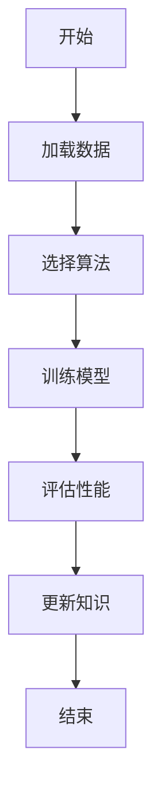
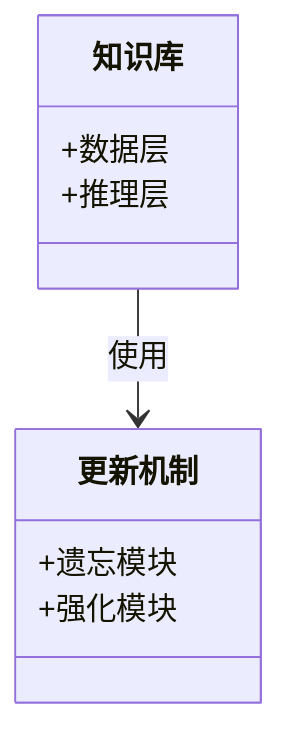

                 


# 构建AI Agent的持续学习与知识更新机制

> 关键词：AI Agent, 持续学习, 知识更新, 知识图谱, 算法原理, 系统架构

> 摘要：本文详细探讨了AI Agent的持续学习与知识更新机制，从核心概念、算法原理到系统架构和项目实战，全面解析如何构建高效的知识更新系统，确保AI Agent能够持续进化和适应复杂环境。

---

# 第1章: AI Agent的持续学习与知识更新概述

## 1.1 问题背景与挑战

### 1.1.1 AI Agent的核心问题
AI Agent需要在动态变化的环境中执行任务，面对新问题和新数据时，必须能够不断更新知识和技能。传统静态模型无法适应这种变化，导致性能下降。

### 1.1.2 持续学习的必要性
持续学习使AI Agent能够处理无限任务和数据，适应环境变化，提升长期性能和用户体验。

### 1.1.3 知识更新的挑战
知识更新涉及数据量大、领域多样、模型复杂度高等问题，需要高效的方法和机制。

## 1.2 持续学习与知识更新的定义

### 1.2.1 持续学习的定义
持续学习是AI Agent在新数据输入时，不断调整和优化模型参数的过程。

### 1.2.2 知识更新的定义
知识更新是AI Agent整合新知识，调整知识表示和推理机制的过程。

### 1.2.3 两者的区别与联系
持续学习关注模型参数调整，知识更新关注知识表示和推理，两者相辅相成。

## 1.3 核心概念与边界

### 1.3.1 核心概念的结构
包括知识表示、知识推理、知识记忆等模块。

### 1.3.2 边界与外延
明确知识更新的边界，如数据预处理和特征提取不属于知识更新。

### 1.3.3 实例分析
通过具体案例说明持续学习和知识更新的应用场景。

## 1.4 本章小结
总结本章内容，强调持续学习和知识更新的重要性。

---

# 第2章: 持续学习的核心原理

## 2.1 持续学习的基本原理

### 2.1.1 知识表示
使用符号逻辑、向量空间模型或知识图谱表示知识。

### 2.1.2 知识推理
通过逻辑推理或概率推理更新知识。

### 2.1.3 知识记忆
利用记忆机制存储和检索知识。

## 2.2 知识更新的机制

### 2.2.1 知识遗忘
通过遗忘曲线控制知识的保留和遗忘。

### 2.2.2 知识强化
通过强化学习机制增强重要知识的权重。

### 2.2.3 知识整合
将新旧知识整合，保持知识库的连贯性和一致性。

## 2.3 持续学习与知识更新的关系

### 2.3.1 相互作用
持续学习驱动知识更新，知识更新支持持续学习。

### 2.3.2 动态平衡
在更新与稳定之间找到平衡点。

### 2.3.3 应用场景
如对话系统、推荐系统中的动态知识更新。

## 2.4 核心概念对比表

| 概念       | 知识表示 | 知识推理 | 知识记忆 |
|------------|----------|----------|----------|
| 定义       | 表达方式 | 推理方法 | 记忆机制 |
| 示例       | 知识图谱 | 概率推理 | 增量记忆 |

## 2.5 ER实体关系图
```mermaid
er
  entity1: 知识点
  entity2: 关系
  entity1 --> entity2: 包含
```

---

# 第3章: 持续学习算法的核心原理

## 3.1 模型更新策略

### 3.1.1 增量学习
逐步更新模型，避免重复训练。

### 3.1.2 对抗学习
通过对抗训练提升模型的鲁棒性。

### 3.1.3 迁移学习
将已学习的知识迁移到新任务中。

## 3.2 知识表示方法

### 3.2.1 知识图谱表示
通过图结构表示知识，支持复杂推理。

### 3.2.2 向量空间模型
将知识映射到向量空间，便于计算和推理。

### 3.2.3 符号逻辑表示
使用符号逻辑明确表示知识。

## 3.3 算法流程图


## 3.4 算法实现代码

### 3.4.1 环境安装
```bash
pip install numpy
pip install tensorflow
```

### 3.4.2 核心代码
```python
import numpy as np
import tensorflow as tf

# 知识表示
def knowledge_represent(data):
    return tf.keras.layers.Dense(128, activation='relu')(data)

# 知识推理
def knowledge_reasoning(inputs):
    return tf.keras.Model(inputs=inputs, outputs=knowledge_represent(inputs))

# 模型训练
def train_model(model, X, y):
    model.compile(optimizer='adam', loss='binary_crossentropy')
    model.fit(X, y, epochs=10, batch_size=32)
```

## 3.5 数学模型与公式

### 3.5.1 知识表示的数学模型
$$
\text{表示函数} = f(x) = \text{激活函数}(\text{权重矩阵} \cdot x + \text{偏置})
$$

### 3.5.2 模型更新的数学公式
$$
\theta_{\text{新}} = \theta_{\text{旧}} + \eta (y - \hat{y}) \cdot X^T
$$

---

# 第4章: 知识更新机制的系统架构设计

## 4.1 应用场景介绍

### 4.1.1 对话系统
实时更新对话历史和用户偏好。

### 4.1.2 推荐系统
根据用户行为更新推荐模型。

## 4.2 系统功能设计

### 4.2.1 领域模型


### 4.2.2 系统架构


## 4.3 接口设计与交互

### 4.3.1 系统接口
```mermaid
sequence
    用户 --> 系统: 请求更新
    系统 --> 知识库: 加载数据
    知识库 --> 更新机制: 执行更新
    更新机制 --> 用户: 返回结果
```

---

# 第5章: 项目实战

## 5.1 环境安装
```bash
pip install numpy tensorflow
```

## 5.2 核心实现代码

### 5.2.1 知识更新模块
```python
def update_knowledge(model, new_data):
    model.fit(new_data, epochs=5, batch_size=16)
```

### 5.2.2 应用示例
```python
# 初始化模型
model = create_model()

# 更新知识
new_data = load_data()
update_knowledge(model, new_data)

# 应用测试
test_case = next(new_data)
predict = model.predict(test_case)
```

## 5.3 案例分析
通过具体案例展示知识更新的过程和效果。

---

# 第6章: 最佳实践与注意事项

## 6.1 小结
总结文章内容，强调持续学习和知识更新的重要性。

## 6.2 注意事项
选择合适的算法，避免知识冗余和过时。

## 6.3 扩展阅读
推荐相关书籍和论文，供读者深入学习。

---

# 作者

作者：AI天才研究院/AI Genius Institute & 禅与计算机程序设计艺术 /Zen And The Art of Computer Programming

