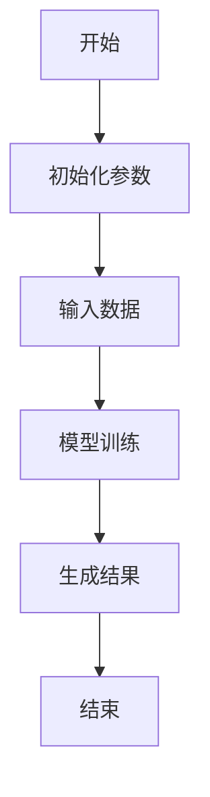

                 


# 构建AI Agent的敏捷开发流程

---

## 关键词：AI Agent、敏捷开发、系统架构、算法原理、项目实战

---

## 摘要：  
本文详细探讨了构建AI Agent的敏捷开发流程，从背景介绍、核心概念到算法原理、系统架构设计，再到项目实战和最佳实践，全面解析了如何在AI Agent开发中应用敏捷方法，优化开发效率和质量。通过具体案例分析和数学模型的推导，深入浅出地展示了AI Agent敏捷开发的关键步骤和注意事项。

---

## 第一部分: 构建AI Agent的敏捷开发流程基础

---

### 第1章: AI Agent与敏捷开发概述

#### 1.1 AI Agent的基本概念  
AI Agent（人工智能代理）是指能够感知环境、自主决策并执行任务的智能体。它具备以下核心特征：  
1. **自主性**：能够独立运作，无需外部干预。  
2. **反应性**：能够根据环境反馈实时调整行为。  
3. **目标导向**：通过设定目标驱动行动。  
4. **学习能力**：能够通过经验优化自身性能。  

AI Agent的应用场景广泛，包括自动驾驶、智能客服、机器人控制等领域。  

#### 1.2 敏捷开发的基本原理  
敏捷开发是一种以迭代和增量开发为核心的方法论，强调灵活性、快速响应变化和团队协作。其核心理念包括：  
1. **用户需求优先**：通过迭代开发满足用户需求。  
2. **持续交付**：以短周期交付可用的产品。  
3. **团队协作**：强调开发人员、测试人员和客户的紧密合作。  

#### 1.3 AI Agent开发中敏捷方法的应用价值  
AI Agent开发通常涉及复杂的算法和多变的需求，敏捷开发能够帮助团队快速验证假设、迭代优化，并在不确定性中保持灵活性。  

---

### 第2章: AI Agent的核心概念解析  

#### 2.1 AI Agent的结构与功能  
AI Agent的结构主要包括知识表示、推理、行为决策和人机交互四个模块：  
1. **知识表示**：通过符号逻辑或概率模型表示知识。  
2. **推理机制**：基于知识库进行逻辑推理或概率推断。  
3. **行为决策**：根据推理结果选择最优行动方案。  
4. **人机交互**：通过自然语言处理实现与用户的互动。  

#### 2.2 敏捷开发中的模块化设计  
模块化设计是敏捷开发的核心原则之一，它通过将系统分解为独立的功能模块，降低耦合度，提升可维护性。  

#### 2.3 核心概念对比分析  
下表对比了AI Agent与传统软件开发在核心概念上的区别：  

| **概念**       | **AI Agent开发**             | **传统软件开发**             |  
|----------------|------------------------------|-----------------------------|  
| 开发目标       | 实现智能行为与自主决策         | 满足功能需求与用户需求       |  
| 开发方法       | 基于算法与数据驱动           | 基于需求分析与功能实现       |  
| 迭代优化       | 频繁迭代优化算法性能           | 定期迭代优化功能模块         |  

---

## 第二部分: AI Agent敏捷开发的算法原理  

### 第3章: AI Agent的核心算法解析  

#### 3.1 生成模型与强化学习  
生成模型（Generative Models）通过学习数据分布生成新的数据，强化学习（Reinforcement Learning）则通过与环境互动优化决策策略。  

#### 3.2 算法流程图  
下图展示了生成模型与强化学习的结合流程：  



#### 3.3 数学模型与公式  
生成模型的核心公式如下：  
$$ P(x|y) = \frac{P(x,y)}{P(y)} $$  

强化学习的奖励函数表示为：  
$$ R(s, a) = r \cdot s + b \cdot a $$  

---

### 第4章: 系统分析与架构设计  

#### 4.1 问题场景介绍  
以智能客服系统为例，AI Agent需要处理用户的咨询请求，并通过自然语言处理生成回复。  

#### 4.2 系统功能设计  
1. **领域模型设计**：  
```mermaid
classDiagram
    class AI-Agent {
        +知识库
        +推理

---

## 第五部分: 项目实战与最佳实践  

### 第5章: 项目实战  

#### 5.1 环境安装  
首先安装Python和必要的库：  
```bash
pip install numpy matplotlib tensorflow
```

#### 5.2 核心代码实现  
以下是生成模型的核心代码：  
```python
import numpy as np

def generate_output(input_data):
    model = load_model()
    output = model.predict(input_data)
    return output
```

#### 5.3 案例分析  
通过实际案例分析，验证AI Agent在不同场景下的表现，并根据反馈优化算法。  

---

### 第6章: 最佳实践  

#### 6.1 流程优化  
1. 采用短周期迭代，确保快速交付和反馈。  
2. 使用自动化测试工具，提高测试效率。  

#### 6.2 工具选择  
推荐使用以下工具：  
1. **开发工具**：PyCharm、VS Code  
2. **版本控制**：Git  
3. **测试工具**：pytest  

#### 6.3 团队协作  
强调团队协作的重要性，确保开发人员、测试人员和产品经理的高效沟通。  

---

## 附录  

### 附录A: 术语表  
- AI Agent：人工智能代理  
- 敏捷开发：Agile Development  
- 生成模型：Generative Models  

---

## 作者：  
AI天才研究院/AI Genius Institute & 禅与计算机程序设计艺术/Zen And The Art of Computer Programming  

---

通过以上结构，文章内容将系统、详细地阐述构建AI Agent的敏捷开发流程，帮助读者从理论到实践全面掌握相关知识。

