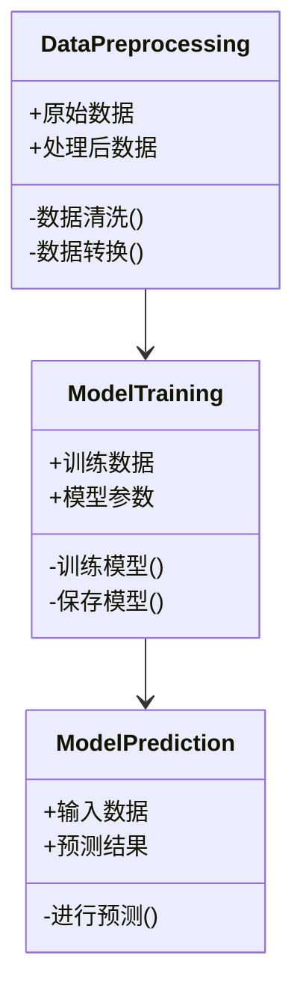
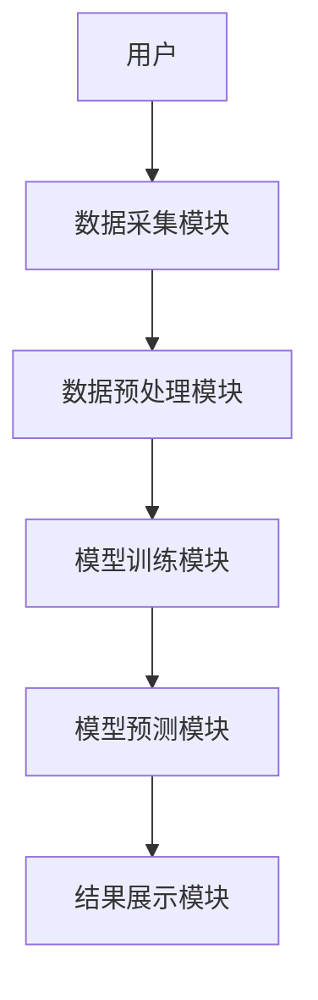

                 


# 《构建AI Agent的时序学习与预测模型》

---

## 关键词  
AI Agent, 时序预测, 深度学习, LSTM, Transformer, 时间序列分析

---

## 摘要  
本文深入探讨了AI Agent在时序学习与预测模型中的应用，从基础概念到高级算法，系统地分析了时序数据的核心特征、AI Agent的基本原理、主流算法的实现及其在实际场景中的应用。文章结合理论与实践，通过详细讲解算法原理、系统架构设计和项目实战，帮助读者构建高效可靠的时序预测系统。

---

# 第1章: AI Agent与时序预测概述

## 1.1 AI Agent的基本概念

### 1.1.1 AI Agent的定义与特点  
AI Agent（人工智能代理）是一种能够感知环境、自主决策并执行任务的智能实体。它具备以下特点：  
1. **自主性**：能够在没有外部干预的情况下独立运行。  
2. **反应性**：能够实时感知环境并做出反应。  
3. **目标导向**：具备明确的目标，通过优化目标函数实现任务。  
4. **学习能力**：能够通过数据和经验不断优化自身性能。

### 1.1.2 时序数据的定义与特征  
时序数据是指按照时间顺序记录的数据序列，其核心特征包括：  
1. **时间依赖性**：数据点之间存在时间相关性。  
2. **趋势性**：数据呈现长期上升或下降的趋势。  
3. **周期性**：数据呈现周期性波动。  
4. **随机性**：数据中包含不可预测的随机噪声。  

### 1.1.3 AI Agent在时序预测中的作用  
AI Agent能够通过时序数据分析，预测未来趋势，帮助决策者做出更明智的选择。例如，在金融领域，AI Agent可以预测股票价格波动；在工业领域，可以预测设备故障风险。

---

## 1.2 时序预测的核心问题

### 1.2.1 时序预测的背景与意义  
时序预测在多个领域具有重要应用价值，例如天气预测、股票价格预测、交通流量预测等。通过对历史数据的分析，可以发现潜在规律，从而支持决策。

### 1.2.2 时序预测的主要挑战  
1. **数据稀疏性**：某些时间序列数据可能较为稀疏，难以提取有效特征。  
2. **非线性关系**：时序数据中可能存在复杂的非线性关系，增加了建模难度。  
3. **外部干扰**：实际场景中可能存在外部干扰因素，影响预测准确性。  

### 1.2.3 AI Agent在时序预测中的优势  
AI Agent具备强大的学习能力和适应性，能够处理复杂时序数据，实时更新模型参数，从而提高预测精度。

---

## 1.3 时序预测的典型应用场景

### 1.3.1 金融时间序列预测  
在金融领域，时序预测常用于股票价格、汇率走势的预测，帮助投资者制定投资策略。

### 1.3.2 智慧城市中的交通预测  
通过分析历史交通数据，AI Agent可以预测未来交通流量，优化交通信号灯控制，缓解拥堵问题。

### 1.3.3 工业生产中的设备预测  
在工业生产中，AI Agent可以预测设备故障时间，提前进行维护，避免生产中断。

---

## 1.4 本章小结  
本章介绍了AI Agent的基本概念、时序数据的核心特征以及时序预测的应用场景。通过这些内容，读者可以理解AI Agent在时序预测中的重要作用。

---

# 第2章: 时序数据的核心概念与分析

## 2.1 时序数据的特征分析

### 2.1.1 时间依赖性  
时序数据中，当前值与过去值密切相关，例如股票价格受到前一交易日价格的影响。

### 2.1.2 趋势性与周期性  
数据可能呈现长期趋势或周期性波动，例如某公司股票价格长期上涨，但每年夏季会出现波动。

### 2.1.3 随机性与异常值  
时序数据中可能包含随机噪声和异常值，这些因素会影响预测模型的准确性。

---

## 2.2 时序数据的预处理方法

### 2.2.1 数据清洗与缺失值处理  
在实际应用中，数据可能包含缺失值，需要通过插值法或其他方法进行填补。

#### 示例代码：  
```python
import pandas as pd
import numpy as np

# 创建包含缺失值的时序数据
data = pd.DataFrame({
    'time': range(10),
    'value': [1, 2, np.nan, 4, 5, 6, np.nan, 8, 9, 10]
})
# 使用线性插值法填补缺失值
data['value'].interpolate(method='linear', inplace=True)
print(data)
```

### 2.2.2 数据标准化与归一化  
数据标准化和归一化是常用的预处理方法，可以提高模型的训练效率和预测精度。

#### 示例代码：  
```python
from sklearn.preprocessing import StandardScaler

# 创建标准化对象
scaler = StandardScaler()
# 对数据进行标准化处理
normalized_data = scaler.fit_transform(data)
```

### 2.2.3 数据分割与滑动窗口技术  
将数据划分为训练集和测试集，并使用滑动窗口技术生成输入特征和目标输出。

#### 示例代码：  
```python
def create_sliding_window(data, window_size=5):
    X = []
    y = []
    for i in range(len(data) - window_size):
        X.append(data[i:i+window_size])
        y.append(data[i+window_size])
    return np.array(X), np.array(y)

X, y = create_sliding_window(data, window_size=5)
```

---

## 2.3 时序数据的可视化分析

### 2.3.1 时间序列的可视化方法  
使用折线图、柱状图等可视化方法，直观展示时序数据的特征。

#### 示例代码：  
```python
import matplotlib.pyplot as plt

data.plot(kind='line')
plt.title('Time Series Plot')
plt.xlabel('Time')
plt.ylabel('Value')
plt.show()
```

### 2.3.2 使用Python进行时序数据分析与可视化  
通过Python的Pandas和Matplotlib库，可以高效地进行时序数据分析与可视化。

### 2.3.3 时序数据的特征提取  
通过统计方法提取数据的均值、方差、自相关系数等特征，为后续建模提供更丰富的信息。

---

## 2.4 本章小结  
本章详细介绍了时序数据的特征分析与预处理方法，包括数据清洗、标准化、滑动窗口技术以及可视化分析。

---

# 第3章: AI Agent的时序学习模型原理

## 3.1 时序预测的经典算法

### 3.1.1 自动回归模型（ARIMA）

#### 算法原理  
ARIMA（Autoregressive Integrated Moving Average）是一种经典的时序预测模型，适用于线性时序数据。

#### 示例代码：  
```python
from statsmodels.tsa.arima_model import ARIMA

model = ARIMA(data['value'], order=(5, 1, 0))
model_fit = model.fit(disp=0)
```

### 3.1.2 状态空间模型（如Kalman滤波）

#### 算法原理  
状态空间模型是一种基于状态估计的时序预测方法，广泛应用于导航、控制等领域。

#### 示例代码：  
```python
from pykalman import KalmanFilter

kf = KalmanFilter(n_dim_state=1)
kf.fit(data.values)
```

### 3.1.3 长短期记忆网络（LSTM）

#### 算法原理  
LSTM（Long Short Term Memory）是一种基于循环神经网络（RNN）的深度学习模型，能够有效捕捉时序数据的长程依赖关系。

#### 示例代码：  
```python
import tensorflow as tf
from tensorflow.keras import layers

model = tf.keras.Sequential([
    layers.LSTM(50, input_shape=(5, 1)),
    layers.Dense(1)
])
model.compile(optimizer='adam', loss='mse')
model.fit(X_train, y_train, epochs=100, batch_size=32)
```

### 3.1.4 Transformer模型

#### 算法原理  
Transformer模型基于自注意力机制，能够捕捉时序数据中的全局关系，适用于长序列预测。

#### 示例代码：  
```python
import tensorflow as tf
from tensorflow.keras import layers

model = tf.keras.Sequential([
    layers.Transformer(n_head=2, d_model=64, d_k=32, d_v=32, 
                       input_shape=(None, 64)),
    layers.Dense(1)
])
model.compile(optimizer='adam', loss='mse')
model.fit(X_train, y_train, epochs=100, batch_size=32)
```

---

## 3.2 AI Agent的时序预测模型选择

### 3.2.1 模型选择的依据  
选择模型时需要考虑数据特征、预测精度、计算资源等因素。

### 3.2.2 模型性能对比  
通过实验对比不同模型的预测效果，选择最优模型。

---

## 3.3 本章小结  
本章介绍了时序预测的经典算法，包括ARIMA、LSTM和Transformer，并通过示例代码展示了它们的实现方法。

---

# 第4章: 系统分析与架构设计

## 4.1 项目背景与目标

### 4.1.1 项目背景  
本项目旨在构建一个基于AI Agent的时序预测系统，应用于某行业的数据预测。

### 4.1.2 项目目标  
通过AI Agent实现时序数据的实时预测，提高预测精度和效率。

---

## 4.2 系统功能设计

### 4.2.1 领域模型类图  


---

## 4.3 系统架构设计

### 4.3.1 系统架构图  


### 4.3.2 系统接口设计  
系统主要接口包括数据输入接口、模型训练接口和预测结果输出接口。

---

## 4.4 本章小结  
本章通过系统分析与架构设计，明确了项目的整体结构和功能模块。

---

# 第5章: 项目实战

## 5.1 环境安装与配置

### 5.1.1 安装Python环境  
使用Anaconda或virtualenv创建独立的Python环境。

### 5.1.2 安装依赖库  
安装Pandas、Matplotlib、TensorFlow等依赖库。

---

## 5.2 系统核心实现

### 5.2.1 数据预处理代码  
```python
import pandas as pd
import numpy as np

# 创建数据集
data = pd.DataFrame({
    'time': range(100),
    'value': np.random.rand(100) * 10
})

# 数据清洗
data.dropna(inplace=True)

# 数据标准化
from sklearn.preprocessing import StandardScaler

scaler = StandardScaler()
normalized_data = scaler.fit_transform(data['value'].values.reshape(-1, 1))
```

### 5.2.2 模型训练代码  
```python
from tensorflow.keras import layers, models

# 创建模型
model = models.Sequential([
    layers.LSTM(50, input_shape=(None, 1)),
    layers.Dense(1)
])

# 编译模型
model.compile(optimizer='adam', loss='mse')

# 训练模型
model.fit(normalized_data[:-10], normalized_data[10:], epochs=50, batch_size=32)
```

### 5.2.3 模型预测代码  
```python
# 使用训练好的模型进行预测
predictions = model.predict(normalized_data[-10:])
```

---

## 5.3 实际案例分析

### 5.3.1 数据来源与预处理  
以某工业设备的运行数据为例，进行数据预处理和特征提取。

### 5.3.2 模型训练与评估  
通过训练集和测试集验证模型的预测精度。

### 5.3.3 结果分析与优化  
分析预测结果，找出模型的不足之处，并进行优化。

---

## 5.4 本章小结  
本章通过项目实战，详细展示了AI Agent时序预测系统的实现过程，包括环境配置、数据处理、模型训练和结果分析。

---

# 第6章: 总结与展望

## 6.1 本文总结  
本文系统地介绍了AI Agent在时序预测中的应用，从理论到实践，全面分析了时序数据的核心特征、模型算法和系统架构。

## 6.2 未来展望  
未来的研究方向包括更高效的时间序列模型、多模态数据融合以及在线预测算法的优化。

---

# 作者：AI天才研究院/AI Genius Institute & 禅与计算机程序设计艺术 /Zen And The Art of Computer Programming

