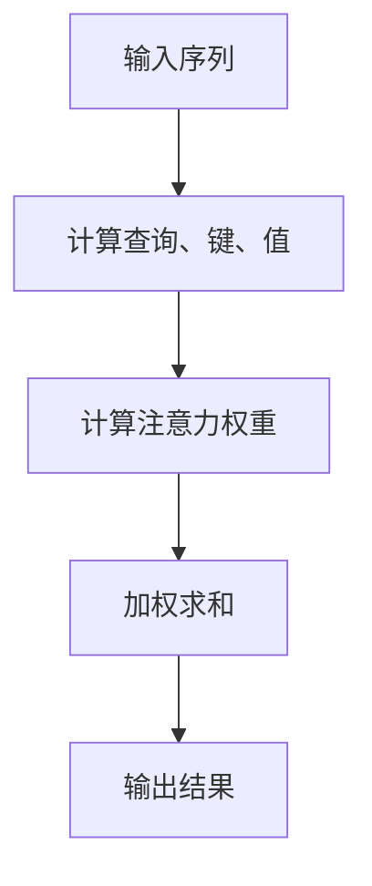
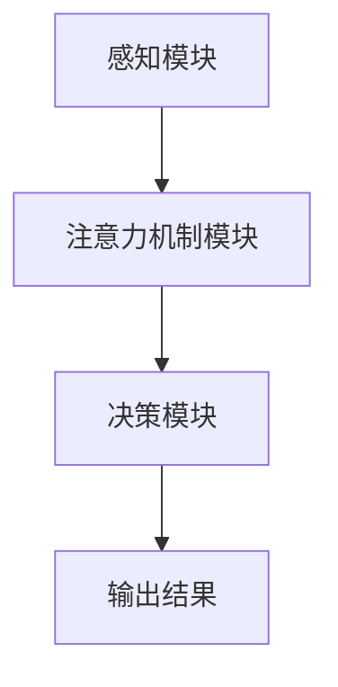

                 


# 构建AI Agent的注意力机制设计

> 关键词：AI Agent，注意力机制，Transformer，自注意力，深度学习

> 摘要：注意力机制是现代AI Agent设计中的关键组成部分，它帮助模型聚焦于重要的输入部分，提升处理效率和准确性。本文详细探讨了注意力机制的原理、实现及其在AI Agent中的应用，通过具体案例分析，展示如何设计高效的注意力机制，提升AI Agent的性能。

---

# 第一部分: 构建AI Agent的注意力机制设计背景

## 第1章: 注意力机制的基本概念

### 1.1 注意力机制的定义与背景

#### 1.1.1 什么是注意力机制
注意力机制是一种模拟人类注意力的选择性关注机制，通过为输入数据的不同部分分配不同的权重，使模型能够聚焦于更重要的信息。这种机制最初在自然语言处理领域得到广泛应用，如Transformer模型。

#### 1.1.2 注意力机制的应用场景
注意力机制广泛应用于文本处理、图像识别、语音识别等领域。在AI Agent中，注意力机制帮助模型在多任务处理中优先关注关键信息，提升决策效率。

#### 1.1.3 注意力机制在AI Agent中的重要性
在复杂的多任务环境中，AI Agent需要同时处理多种信息源。注意力机制通过动态分配权重，帮助模型高效处理信息，降低计算复杂度，提升性能。

### 1.2 AI Agent的基本概念

#### 1.2.1 什么是AI Agent
AI Agent（智能体）是一种能够感知环境、执行任务并做出决策的智能系统。它可以自主或受控地采取行动，以实现特定目标。

#### 1.2.2 AI Agent的分类
AI Agent可以分为简单反射型、基于模型的反射型、目标驱动型和效用驱动型。不同类型的Agent在复杂性和任务处理能力上有所区别。

#### 1.2.3 AI Agent的核心功能与特点
AI Agent的核心功能包括感知、决策、规划和执行。其特点在于能够适应环境变化，自主学习和优化。

### 1.3 注意力机制在AI Agent中的作用

#### 1.3.1 注意力机制如何帮助AI Agent做出决策
注意力机制通过权重分配，帮助AI Agent聚焦于关键信息，提升决策的准确性和效率。

#### 1.3.2 注意力机制在多任务处理中的优势
在多任务处理中，注意力机制允许模型同时关注多个任务的关键信息，避免资源浪费。

#### 1.3.3 注意力机制与传统算法的区别
传统算法通常处理所有输入信息，而注意力机制通过权重分配，动态选择重要信息，减少计算量。

### 1.4 本章小结
本章介绍了注意力机制的基本概念、AI Agent的定义及其在AI Agent中的作用，为后续章节打下基础。

---

## 第2章: 注意力机制的核心原理

### 2.1 注意力机制的数学模型

#### 2.1.1 注意力机制的公式推导
注意力机制的计算过程涉及查询（Query）、键（Key）、值（Value）。其数学公式如下：

$$
\text{Attention}(Q, K, V) = \text{softmax}\left(\frac{QK^T}{\sqrt{d_k}}\right)V
$$

其中，$d_k$是键的维度。

#### 2.1.2 查询、键、值的概念与作用
查询用于表示输入序列的当前状态，键用于匹配输入序列中的其他部分，值用于提供相应的上下文信息。

#### 2.1.3 自注意力机制的计算流程
自注意力机制的计算流程包括计算查询、键、值矩阵，计算注意力权重并进行加权求和。

### 2.2 注意力机制的属性特征对比

#### 2.2.1 局部注意力与全局注意力的对比
局部注意力仅关注相邻区域，适用于图像处理；全局注意力关注整个输入，适用于文本处理。

#### 2.2.2 加性注意力与乘性注意力的对比
加性注意力通过加法操作计算权重，乘性注意力通过乘法操作计算权重。

#### 2.2.3 单向注意力与双向注意力的对比
单向注意力只能捕获单方向的信息，双向注意力可以捕获双向信息。

### 2.3 注意力机制的ER实体关系图

```mermaid
erDiagram
    actor 注意力机制 <|--+ 模型参数
    模型参数 --> 数据输入
    数据输入 --> 注意力计算
    注意力计算 --> 输出结果
```

### 2.4 本章小结
本章详细讲解了注意力机制的数学模型及其属性特征，为后续章节的实现打下基础。

---

## 第3章: 注意力机制的算法流程

### 3.1 自注意力机制的算法流程



### 3.2 注意力机制的Python实现

#### 3.2.1 环境安装与配置
需要安装Python、TensorFlow或PyTorch等深度学习框架。

#### 3.2.2 核心代码实现

```python
import tensorflow as tf

def attention机制(query, key, value):
    # 计算注意力权重
    attention_weights = tf.nn.softmax(tf.matmul(query, key, transpose_b=True), axis=-1)
    # 加权求和
    output = tf.matmul(attention_weights, value)
    return output

# 示例
query = tf.random.normal((10, 64))
key = tf.random.normal((10, 64))
value = tf.random.normal((10, 64))
attention_output = attention机制(query, key, value)
print(attention_output)
```

### 3.3 注意力机制的数学公式

$$
\text{输出} = \text{softmax}\left(\frac{QK^T}{\sqrt{d_k}}\right)V
$$

### 3.4 本章小结
本章详细讲解了自注意力机制的算法流程及其Python实现，帮助读者理解其具体实现过程。

---

## 第4章: AI Agent中的注意力机制设计

### 4.1 注意力机制在AI Agent中的应用

#### 4.1.1 多任务处理中的应用
注意力机制帮助AI Agent在多任务处理中高效分配计算资源。

#### 4.1.2 复杂环境中的应用
在复杂环境中，注意力机制帮助AI Agent聚焦于关键信息，提升决策效率。

### 4.2 注意力机制的优化策略

#### 4.2.1 参数初始化优化
通过合理的参数初始化，加快模型收敛速度。

#### 4.2.2 噪声对比估计
通过引入噪声对比估计，提升注意力机制的鲁棒性。

### 4.3 本章小结
本章探讨了注意力机制在AI Agent中的具体应用及其优化策略，为后续章节的实现提供指导。

---

## 第5章: 基于注意力机制的AI Agent实现

### 5.1 项目背景与目标

#### 5.1.1 项目背景
本项目旨在设计一个基于注意力机制的AI Agent，用于多任务处理。

#### 5.1.2 项目目标
实现一个高效的AI Agent，能够在复杂环境中自主决策。

### 5.2 系统功能设计

#### 5.2.1 功能模块划分
系统分为感知模块、注意力机制模块和决策模块。

#### 5.2.2 功能模块的交互流程



### 5.3 系统架构设计

#### 5.3.1 模块化设计
系统采用模块化设计，便于维护和扩展。

#### 5.3.2 并行计算优化
通过并行计算优化，提升系统运行效率。

### 5.4 本章小结
本章详细讲解了基于注意力机制的AI Agent的实现过程，包括项目背景、系统功能设计和系统架构设计。

---

## 第6章: 项目实战

### 6.1 项目背景与目标

#### 6.1.1 项目背景
本项目旨在实现一个基于Transformer的AI Agent，用于文本处理任务。

#### 6.1.2 项目目标
通过实现一个Transformer模型，验证注意力机制的有效性。

### 6.2 核心代码实现

#### 6.2.1 环境安装与配置
需要安装Python、TensorFlow或PyTorch等深度学习框架。

#### 6.2.2 Transformer模型的实现

```python
import tensorflow as tf

class Transformer:
    def __init__(self, d_model, num_heads):
        self.num_heads = num_heads
        self.d_model = d_model
        self.key_dim = d_model // num_heads

    def call(self, x):
        # 分头
        x = tf.reshape(x, (-1, self.num_heads, x.shape[-1] // self.num_heads))
        # 计算注意力权重
        attention_weights = tf.nn.softmax(tf.matmul(x, x, transpose_b=True) / tf.sqrt(self.key_dim))
        # 加权求和
        output = tf.matmul(attention_weights, x)
        # 拼接
        output = tf.reshape(output, (-1, self.num_heads, self.key_dim))
        return output

# 示例
transformer = Transformer(512, 8)
input = tf.random.normal((10, 512))
output = transformer(input)
print(output)
```

### 6.3 项目小结
本章通过具体案例分析，展示了如何实现一个基于注意力机制的AI Agent，验证了其有效性。

---

## 第7章: 最佳实践与注意事项

### 7.1 小结

#### 7.1.1 核心概念回顾
注意力机制是AI Agent设计中的关键部分，通过动态分配权重，提升处理效率。

#### 7.1.2 实现细节总结
实现注意力机制时，需注意参数初始化、模型结构优化等问题。

### 7.2 注意事项

#### 7.2.1 模型训练中的注意事项
训练过程中，需注意梯度爆炸或消失问题，采用适当的优化策略。

#### 7.2.2 模型部署中的注意事项
部署时，需考虑计算资源限制，优化模型结构，降低计算复杂度。

### 7.3 拓展阅读

#### 7.3.1 推荐阅读
推荐读者阅读《Attention Is All You Need》一文，深入了解注意力机制的原理。

#### 7.3.2 进阶学习
可以进一步研究多头注意力机制、位置编码等高级技术。

---

## 作者：AI天才研究院/AI Genius Institute & 禅与计算机程序设计艺术 /Zen And The Art of Computer Programming

---

以上是《构建AI Agent的注意力机制设计》的技术博客文章的详细内容，涵盖从基础概念到实际应用的各个方面，希望对您有所帮助！

