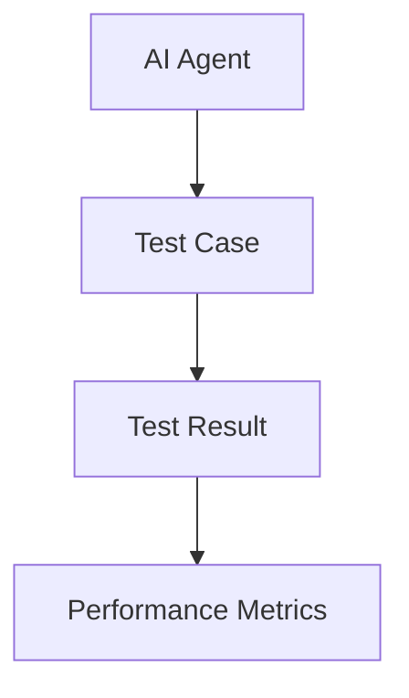
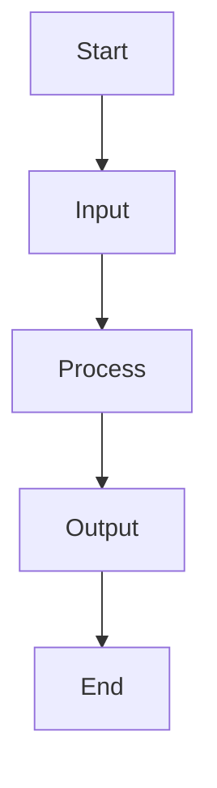
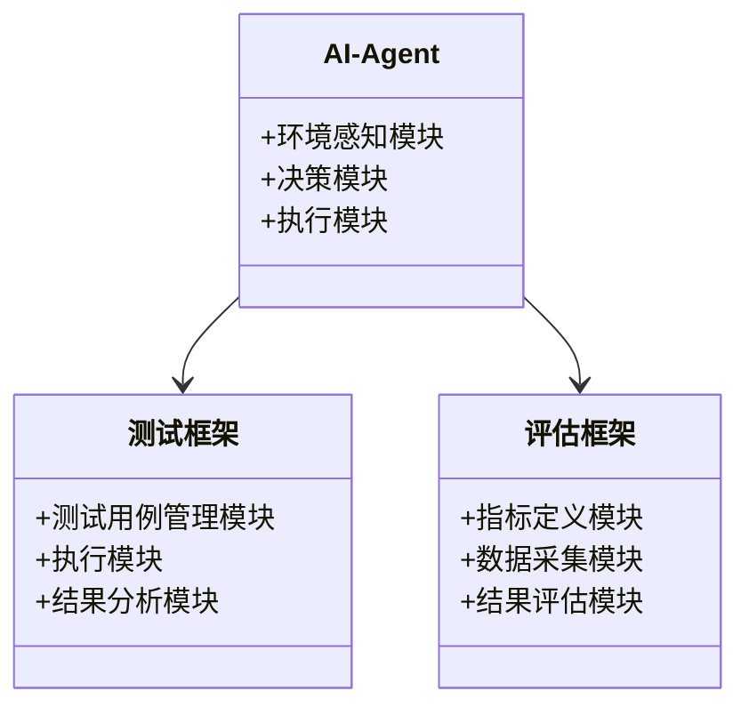
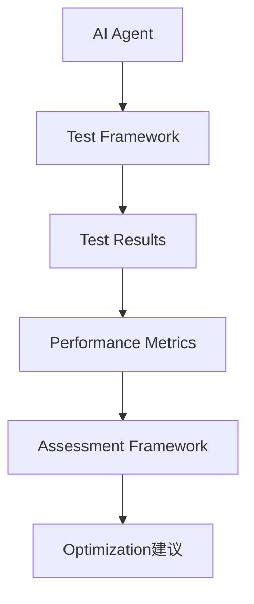
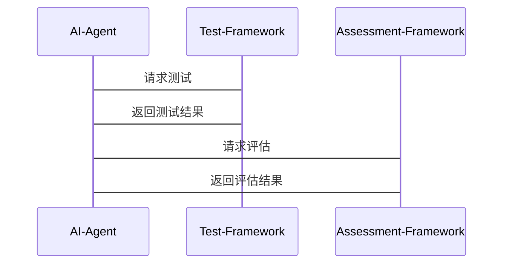

                 


# 构建AI Agent的测试与评估框架

## 关键词：AI Agent，测试框架，评估指标，算法原理，系统架构

## 摘要：  
本文详细探讨了构建AI Agent测试与评估框架的核心原理、算法设计、系统架构和实践方法。通过分析AI Agent的基本概念、测试与评估的挑战，以及实际应用场景，提出了一套完整的测试与评估框架。文章结合数学模型、算法流程图和系统架构图，深入剖析了AI Agent测试与评估的关键步骤和实现细节，为实际应用提供了理论支持和实践指导。

---

# 第一部分: AI Agent测试与评估框架的背景与核心概念

## 第1章: AI Agent的基本概念与问题背景

### 1.1 AI Agent的定义与特点

#### 1.1.1 AI Agent的定义  
AI Agent（人工智能代理）是指在特定环境中能够感知并自主行动以实现目标的智能实体。它可以是一个软件程序、机器人或其他智能系统，通过与环境交互来完成任务。  

#### 1.1.2 AI Agent的核心特点  
- **自主性**：AI Agent能够在没有外部干预的情况下独立决策和行动。  
- **反应性**：能够实时感知环境变化并做出反应。  
- **目标导向性**：所有行动均以实现特定目标为导向。  
- **学习能力**：通过数据和经验不断优化自身性能。  

#### 1.1.3 AI Agent的类型与应用场景  
- **简单反射型AI Agent**：基于预设规则进行反应，适用于简单的决策任务。  
- **基于模型的AI Agent**：利用内部模型和状态进行推理和决策，适用于复杂环境。  
- **学习型AI Agent**：通过机器学习算法不断优化行为策略，适用于需要自适应的任务。  

应用场景包括自动驾驶、智能助手、机器人控制、推荐系统等。  

---

### 1.2 问题背景与挑战

#### 1.2.1 AI Agent在实际应用中的问题  
- **复杂性**：AI Agent需要处理多变的环境和复杂的任务，导致测试与评估难度大。  
- **不确定性**：环境的不确定性和动态变化使得传统测试方法难以适用。  
- **性能瓶颈**：如何在不同环境下保证AI Agent的稳定性和高效性是关键问题。  

#### 1.2.2 测试与评估的必要性  
AI Agent的性能直接关系到系统的可靠性和用户体验，因此需要通过测试与评估来验证其功能、性能和安全性。  

#### 1.2.3 当前AI Agent测试与评估的痛点  
- **缺乏统一标准**：不同场景下的测试指标和方法差异较大，难以统一。  
- **测试环境复杂**：模拟真实环境的测试成本高，且难以覆盖所有可能的情况。  
- **评估指标单一**：现有评估指标往往局限于单一维度，无法全面反映AI Agent的能力。  

---

## 第2章: AI Agent测试与评估的核心概念

### 2.1 测试与评估的基本原理

#### 2.1.1 测试的目标与范围  
- **功能性测试**：验证AI Agent是否能够完成预期的任务。  
- **性能测试**：评估AI Agent在特定环境下的响应速度和处理能力。  
- **安全性测试**：确保AI Agent的行为符合安全规范，避免潜在风险。  

#### 2.1.2 评估的指标与方法  
- **准确性**：AI Agent输出结果与预期结果的匹配程度。  
- **响应时间**：AI Agent完成任务所需的时间。  
- **鲁棒性**：AI Agent在异常情况下的表现。  

#### 2.1.3 核心概念的联系与对比  
| 概念 | 定义 | 特点 |  
|------|------|------|  
| AI Agent | 智能实体，能够感知环境并自主行动 | 自主性、目标导向性 |  
| 测试框架 | 用于验证AI Agent性能的工具集合 | 结构化、可扩展 |  
| 评估指标 | 衡量AI Agent能力的标准 | 客观性、多样性 |  

---

### 2.2 核心概念的ER实体关系图



---

# 第二部分: AI Agent测试与评估的算法原理

## 第3章: AI Agent测试算法的数学模型

### 3.1 测试算法的基本原理

#### 3.1.1 算法输入与输出  
- **输入**：测试用例、环境参数、任务目标。  
- **输出**：测试结果、性能指标、优化建议。  

#### 3.1.2 算法流程图  



---

### 3.2 数学模型与公式

#### 3.2.1 算法的数学表达式  

$$f(x) = \begin{cases} 
0 & \text{if } x < 0 \\
1 & \text{if } 0 \leq x < 1 \\
2 & \text{if } x \geq 1 
\end{cases}$$  

#### 3.2.2 评估指标的计算公式  

$$ \text{准确率} = \frac{\text{正确预测数}}{\text{总预测数}} $$  

---

## 第4章: 评估算法的数学模型

### 4.1 评估算法的基本原理

#### 4.1.1 算法输入与输出  
- **输入**：测试数据、性能指标。  
- **输出**：评估结果、优化建议。  

---

### 4.2 评估算法的数学模型  

$$ \text{综合评估得分} = w_1 \times \text{准确率} + w_2 \times \text{响应时间} + w_3 \times \text{鲁棒性} $$  

其中，$w_1, w_2, w_3$为权重系数。  

---

# 第三部分: AI Agent测试与评估的系统架构

## 第5章: 系统功能设计

### 5.1 领域模型



---

## 第6章: 系统架构设计

### 6.1 系统架构图



---

## 第7章: 系统接口设计

### 7.1 系统交互图



---

# 第四部分: 项目实战

## 第8章: 环境安装与核心代码实现

### 8.1 环境安装  
- **Python 3.8+**  
- **安装依赖**：numpy, pandas, scikit-learn  

### 8.2 核心代码实现  

```python
def test_ai_agent(ai_agent, test_cases):
    results = []
    for case in test_cases:
        result = ai_agent.execute(case)
        results.append(result)
    return results

def assess_performance(results, metrics):
    scores = {}
    for metric in metrics:
        score = calculate_score(results, metric)
        scores[metric] = score
    return scores
```

---

## 第9章: 案例分析与实际应用

### 9.1 案例分析  
以自动驾驶AI Agent为例，分析其在不同路况下的测试与评估过程。  

### 9.2 代码实现解读  
详细解读上述代码的实现逻辑和应用场景。  

---

# 第五部分: 最佳实践与总结

## 第10章: 最佳实践与注意事项

### 10.1 最佳实践  
- **模块化设计**：将测试与评估框架划分为独立模块，便于维护和扩展。  
- **数据驱动测试**：利用测试数据生成工具提高测试效率。  
- **持续集成**：将测试与评估框架集成到开发流程中，实现持续集成与持续交付。  

### 10.2 注意事项  
- **确保测试用例的覆盖率**：覆盖所有可能的场景，避免遗漏关键测试点。  
- **及时更新评估指标**：根据实际应用需求动态调整评估指标。  

---

## 第11章: 小结与拓展阅读

### 11.1 小结  
本文从AI Agent的基本概念出发，详细探讨了测试与评估框架的构建过程，包括算法原理、系统架构和项目实战。通过案例分析和实际应用，为读者提供了全面的理论支持和实践指导。  

### 11.2 拓展阅读  
- 推荐阅读相关领域的书籍，如《机器学习实战》、《深度学习》等。  
- 关注AI Agent领域的最新研究和应用，保持对技术发展的敏感性。  

---

# 作者：AI天才研究院/AI Genius Institute & 禅与计算机程序设计艺术/Zen And The Art of Computer Programming

