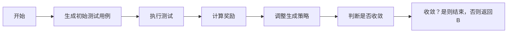
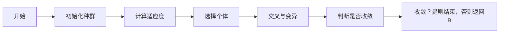
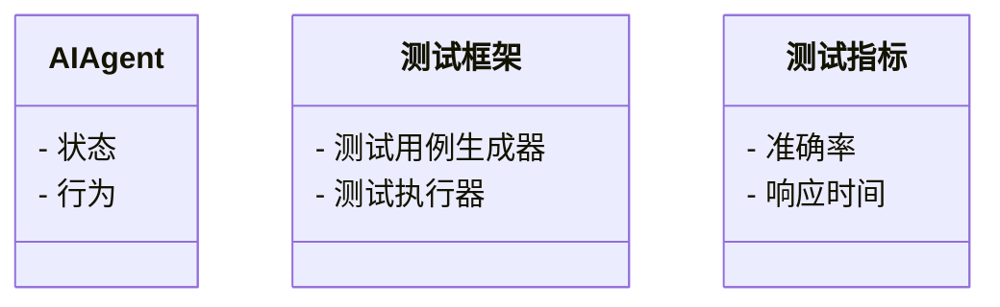
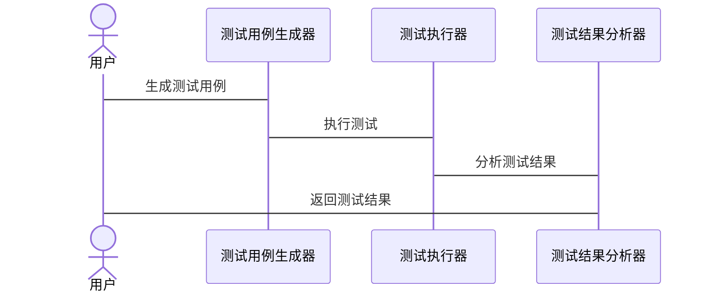

                 


# 构建AI Agent的测试框架：确保性能和可靠性

> 关键词：AI Agent，测试框架，性能测试，可靠性测试，算法原理，系统架构

> 摘要：本文详细探讨了构建AI Agent测试框架的核心概念、算法原理、系统架构以及实际项目中的应用。通过理论与实践相结合的方式，分析了如何确保AI Agent的性能和可靠性，为读者提供了从基础到实战的全面指导。

---

# 第1章: AI Agent与测试框架基础

## 1.1 AI Agent的基本概念

### 1.1.1 AI Agent的定义与特点

AI Agent（智能体）是指在环境中能够感知并自主行动以实现目标的实体。与传统程序不同，AI Agent具备以下特点：

- **自主性**：能够在没有外部干预的情况下独立运行。
- **反应性**：能够根据环境的变化调整自身行为。
- **目标导向性**：所有行动均以实现特定目标为导向。

### 1.1.2 AI Agent的分类与应用场景

AI Agent可以根据智能水平分为以下几类：

1. **反应式AI Agent**：基于当前感知做出反应，适用于实时性要求较高的场景，如自动驾驶。
2. **认知式AI Agent**：具备复杂推理能力，适用于需要处理复杂任务的场景，如智能助手。
3. **学习型AI Agent**：能够通过经验改进性能，如强化学习驱动的AI Agent。

### 1.1.3 AI Agent测试的重要性

AI Agent的性能和可靠性直接关系到系统的稳定性和用户体验。测试框架的作用在于：

- **验证AI Agent的行为符合预期**。
- **发现潜在缺陷并优化性能**。
- **确保AI Agent在各种场景下的稳定运行**。

## 1.2 测试框架的基本概念

### 1.2.1 测试框架的定义与作用

测试框架是一种用于系统化测试的结构化方法，其作用包括：

- **提高测试效率**：通过自动化测试减少人工干预。
- **确保测试覆盖率**：覆盖更多测试场景，降低遗漏风险。
- **便于团队协作**：统一的框架便于多人协作开发。

### 1.2.2 测试框架的分类与选择

测试框架主要分为以下几类：

1. **数据驱动测试框架**：测试用例由外部数据驱动，便于参数化测试。
2. **关键字驱动测试框架**：基于关键字进行测试设计，适用于需求变化较大的场景。
3. **行为驱动测试框架**：通过自然语言描述测试场景，便于非技术人员参与测试设计。

### 1.2.3 AI Agent测试框架的独特性

AI Agent的测试框架需要具备以下特点：

- **动态性**：能够适应AI Agent行为的变化。
- **智能性**：能够生成复杂的测试用例。
- **可扩展性**：支持不同类型的AI Agent测试需求。

## 1.3 AI Agent测试框架的目标与挑战

### 1.3.1 测试框架的目标

- 确保AI Agent在各种场景下的稳定性和可靠性。
- 提供高效的测试方法，降低开发成本。
- 为AI Agent的优化提供数据支持。

### 1.3.2 测试中的主要挑战

- **动态环境**：AI Agent需要在不断变化的环境中运行，测试场景难以穷举。
- **不确定性**：AI Agent的行为可能受到算法决策的影响，测试结果具有不确定性。
- **复杂性**：AI Agent的测试涉及多个模块的协同工作，测试框架设计复杂。

### 1.3.3 如何确保性能与可靠性

- **多层次测试**：结合功能测试、性能测试和可靠性测试。
- **自动化测试**：通过自动化测试减少人工干预，提高测试效率。
- **持续优化**：根据测试结果不断优化AI Agent的算法和测试框架。

## 1.4 本章小结

本章介绍了AI Agent的基本概念、测试框架的作用与分类，以及构建AI Agent测试框架的目标与挑战。通过理解这些内容，读者可以为后续的测试框架设计奠定基础。

---

# 第2章: AI Agent测试框架的核心概念与联系

## 2.1 测试指标与评价体系

### 2.1.1 常见测试指标

- **准确率**：AI Agent在测试场景中的正确行为比例。
- **响应时间**：AI Agent对输入的反应速度。
- **稳定性**：AI Agent在长时间运行中的表现。
- **鲁棒性**：AI Agent在异常情况下的表现。

### 2.1.2 指标之间的关系与权衡

- **准确率与响应时间**：高准确率可能需要较长的响应时间，反之亦然。
- **稳定性与鲁棒性**：稳定性关注正常情况下的表现，鲁棒性关注异常情况下的表现。

### 2.1.3 评价体系的构建

构建评价体系需要综合考虑多个指标，并根据具体应用场景进行权重分配。

---

## 2.2 测试方法与策略

### 2.2.1 白盒测试与黑盒测试

- **白盒测试**：需要了解AI Agent的内部结构，适用于单元测试。
- **黑盒测试**：仅关注输入输出，适用于功能测试。

### 2.2.2 功能测试与性能测试

- **功能测试**：验证AI Agent在特定场景下的行为。
- **性能测试**：评估AI Agent在压力环境下的表现。

### 2.2.3 模糊测试与边界测试

- **模糊测试**：通过随机输入测试AI Agent的健壮性。
- **边界测试**：测试AI Agent在边界条件下的表现。

---

## 2.3 AI Agent行为模型与测试用例设计

### 2.3.1 AI Agent的行为模型

AI Agent的行为模型需要考虑以下方面：

- **感知能力**：AI Agent如何感知环境。
- **决策能力**：AI Agent如何基于感知做出决策。
- **执行能力**：AI Agent如何将决策转化为行动。

### 2.3.2 测试用例的设计原则

- **覆盖性**：测试用例应覆盖所有关键场景。
- **可重复性**：测试用例应便于重复执行。
- **可扩展性**：测试用例应便于根据需求扩展。

### 2.3.3 测试用例的生成方法

- **基于场景的生成方法**：根据实际场景生成测试用例。
- **基于模型的生成方法**：基于行为模型生成测试用例。

---

## 2.4 核心概念关系图

### 2.4.1 关键概念属性对比表

| 概念       | 描述                               | 属性1 | 属性2 |
|------------|------------------------------------|--------|--------|
| AI Agent   | 具备自主性和目标导向性的智能体     | 自主性 | 目标导向性 |
| 测试框架   | 用于系统化测试的结构化方法         | 动态性 | 智能性 |
| 测试指标   | 用于评价AI Agent表现的量化标准     | 准确率 | 响应时间 |

### 2.4.2 ER实体关系图

```mermaid
er
actor(AI Agent)
actor 测试框架
actor 测试指标
```

---

## 2.5 本章小结

本章详细探讨了AI Agent测试框架的核心概念，包括测试指标、测试方法和行为模型，并通过对比表和实体关系图展示了这些概念之间的关系。

---

# 第3章: AI Agent测试框架的算法原理

## 3.1 基于强化学习的测试用例生成

### 3.1.1 强化学习的基本原理

强化学习是一种通过试错机制来优化决策过程的算法。其核心在于通过不断尝试不同的动作来最大化累积奖励。

### 3.1.2 在测试用例生成中的应用

- **状态定义**：AI Agent的行为状态。
- **动作定义**：测试用例生成的动作。
- **奖励机制**：根据测试用例的有效性给予奖励。

### 3.1.3 算法实现步骤

1. 初始化测试用例生成器。
2. 生成初始测试用例。
3. 根据测试结果调整生成策略。
4. 重复上述步骤，直到达到收敛条件。

### 3.1.4 算法流程图



---

## 3.2 基于遗传算法的测试用例优化

### 3.2.1 遗传算法的基本原理

遗传算法是一种模拟生物进化过程的优化算法，主要包括选择、交叉和变异三个步骤。

### 3.2.2 在测试用例优化中的应用

- **个体编码**：将测试用例表示为基因序列。
- **适应度评估**：根据测试结果计算个体的适应度。
- **选择与交叉**：根据适应度选择优秀个体进行交叉。
- **变异**：随机改变部分个体的基因以引入多样性。

### 3.2.3 算法实现步骤

1. 初始化种群。
2. 计算个体适应度。
3. 根据适应度进行选择。
4. 进行交叉和变异操作。
5. 重复上述步骤，直到达到收敛条件。

### 3.2.4 算法流程图



---

## 3.3 算法原理的数学模型与公式

### 3.3.1 强化学习的数学模型

强化学习的目标是通过优化策略函数来最大化累积奖励。策略函数通常表示为：

$$ \pi(a|s) = \arg\max_a Q(s,a) $$

其中，\( Q(s,a) \) 表示在状态 \( s \) 下执行动作 \( a \) 的期望奖励。

### 3.3.2 遗传算法的数学模型

遗传算法的核心在于适应度函数的设计。适应度函数通常表示为：

$$ f(x) = \sum_{i=1}^{n} w_i x_i $$

其中，\( w_i \) 表示第 \( i \) 个特征的权重，\( x_i \) 表示第 \( i \) 个特征的值。

---

## 3.4 本章小结

本章详细探讨了AI Agent测试框架中常用的两种算法：强化学习和遗传算法。通过数学模型和流程图的形式，展示了这些算法在测试用例生成和优化中的具体应用。

---

# 第4章: AI Agent测试框架的系统分析与架构设计

## 4.1 问题场景介绍

AI Agent需要在复杂多变的环境中运行，测试框架需要能够适应不同的测试场景。

---

## 4.2 系统功能设计

### 4.2.1 领域模型

AI Agent测试框架的领域模型包括以下几类：



### 4.2.2 系统架构设计

AI Agent测试框架的系统架构包括以下几个模块：


### 4.2.3 系统接口设计

AI Agent测试框架需要与外部系统进行交互，主要接口包括：

- **测试用例接口**：定义测试用例的格式和调用方式。
- **测试结果接口**：定义测试结果的输出格式。
- **配置接口**：定义框架的配置参数。

### 4.2.4 系统交互设计

AI Agent测试框架的系统交互流程如下：



---

## 4.3 本章小结

本章详细介绍了AI Agent测试框架的系统分析与架构设计，包括领域模型、系统架构、接口设计和交互流程。

---

# 第5章: AI Agent测试框架的项目实战

## 5.1 环境安装与配置

### 5.1.1 环境要求

- **操作系统**：Linux/Windows/MacOS
- **编程语言**：Python 3.8+
- **依赖库**：numpy, pandas, scikit-learn, matplotlib

### 5.1.2 安装步骤

```bash
pip install numpy pandas scikit-learn matplotlib
```

---

## 5.2 系统核心实现

### 5.2.1 测试用例生成器

```python
import numpy as np

def generate_test_cases(n=100):
    X = np.random.randn(n, 2)
    y = np.random.randint(0, 2, n)
    return X, y
```

### 5.2.2 测试执行器

```python
def execute_test(X, y):
    # 假设AI Agent为分类器
    from sklearn.svm import SVC
    model = SVC()
    model.fit(X, y)
    return model.predict(X)
```

### 5.2.3 测试结果分析器

```python
def analyze_results(y_true, y_pred):
    from sklearn.metrics import accuracy_score
    return accuracy_score(y_true, y_pred)
```

---

## 5.3 实际案例分析与结果解读

### 5.3.1 测试用例生成与执行

```python
X, y = generate_test_cases(100)
y_pred = execute_test(X, y)
print(analyze_results(y, y_pred))
```

### 5.3.2 结果分析

假设输出为：

```
0.85
```

这意味着AI Agent在该测试集上的准确率为85%。

---

## 5.4 本章小结

本章通过一个简单的案例，展示了AI Agent测试框架的核心实现步骤，包括环境配置、测试用例生成、测试执行和结果分析。

---

# 第6章: 总结与展望

## 6.1 总结

本文详细探讨了AI Agent测试框架的核心概念、算法原理、系统架构以及实际项目中的应用。通过理论与实践相结合的方式，分析了如何确保AI Agent的性能和可靠性。

---

## 6.2 展望

随着AI技术的不断发展，AI Agent测试框架也将面临新的挑战和机遇。未来的研究方向包括：

- **更智能的测试用例生成方法**：结合强化学习和遗传算法，提高测试用例的有效性。
- **更高效的测试执行策略**：通过分布式计算和并行执行，提高测试效率。
- **更全面的测试结果分析**：结合自然语言处理技术，提高测试结果的可解释性。

---

# 作者：AI天才研究院/AI Genius Institute & 禅与计算机程序设计艺术 /Zen And The Art of Computer Programming

---

**注意事项：**
- 本文内容基于AI Agent测试框架的最新研究成果，仅供参考，实际应用中需要根据具体场景进行调整。
- 测试框架的实现需要结合实际需求，选择合适的算法和工具。
- 持续优化和改进测试框架是确保AI Agent性能和可靠性的关键。

**拓展阅读：**
- 推荐阅读《机器学习实战》和《深度学习》等相关书籍，以深入了解AI Agent的实现细节。
- 关注AI领域最新动态，及时了解测试框架的新技术和新方法。

