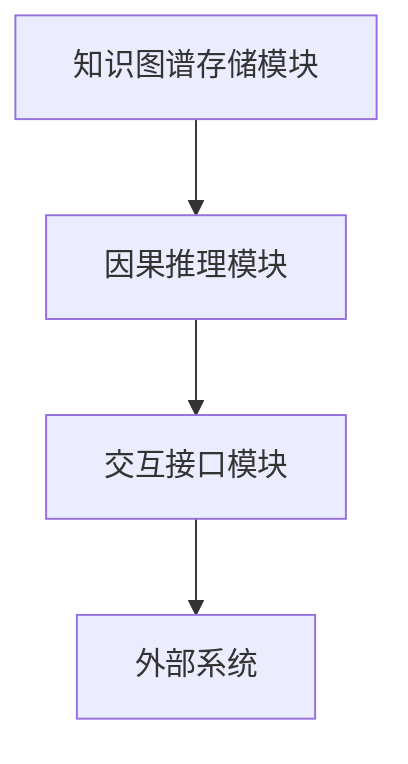
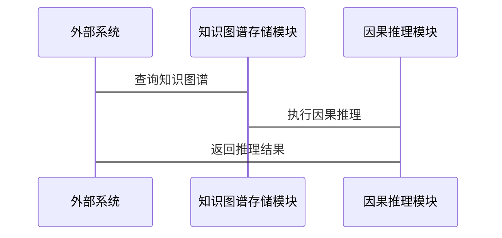

                 


# 构建AI Agent的知识图谱因果推理引擎

## 关键词：AI Agent，知识图谱，因果推理，因果图，因果增强图神经网络，知识图谱构建，因果推理算法

## 摘要：  
知识图谱和因果推理是构建智能AI Agent的核心技术。本文系统地介绍了知识图谱的构建方法、因果推理的基本理论以及如何将两者结合，构建高效的AI Agent知识图谱因果推理引擎。文章从知识图谱和因果推理的基本概念出发，详细探讨了知识图谱的构建与管理、因果推理的理论与方法，以及知识图谱与因果推理的结合。最后，本文详细设计了AI Agent的知识图谱因果推理引擎，并通过实际案例展示了其应用。

---

# 第一部分: 知识图谱与因果推理基础

---

# 第1章: 知识图谱与因果推理概述

## 1.1 知识图谱的基本概念

### 1.1.1 知识图谱的定义与特点

知识图谱是一种以图结构形式表示知识的语义网络，由实体和关系构成，具有语义丰富、结构化、可扩展性强等特点。知识图谱的核心目标是将分散在不同数据源中的知识整合到一个统一的语义网络中，以便于计算机理解和推理。

### 1.1.2 知识图谱与传统数据库的区别

传统数据库（如关系型数据库）主要关注数据的存储和查询，而知识图谱则强调数据之间的语义关系和知识的关联性。知识图谱能够表示复杂的语义关系，而传统数据库难以表达实体之间的动态关系。

### 1.1.3 知识图谱的构建方法

知识图谱的构建通常包括数据收集、实体识别、关系抽取和知识融合等步骤。数据来源可以是结构化数据、文本数据或外部知识库。

---

## 1.2 因果推理的基本概念

### 1.2.1 因果推理的定义与特点

因果推理是研究因果关系的推理过程，其核心是理解“为什么”某个事件会发生，而不是仅仅发现相关关系。因果推理具有干预性、时间性和反事实性等特点。

### 1.2.2 因果关系与相关关系的区别

相关关系描述变量之间的关联性，而因果关系描述变量之间的因果联系。相关关系并不意味着因果关系，而因果关系则必然伴随着相关关系。

### 1.2.3 因果推理在AI Agent中的作用

在AI Agent中，因果推理能够帮助Agent理解动作与结果之间的因果关系，从而做出更智能的决策和规划。

---

## 1.3 AI Agent的基本概念

### 1.3.1 AI Agent的定义与分类

AI Agent是指具有感知环境、自主决策和执行任务能力的智能体。AI Agent可以分为简单反射Agent、基于模型的反射Agent、目标驱动Agent和效用驱动Agent等类型。

### 1.3.2 AI Agent的核心能力

AI Agent的核心能力包括感知能力、推理能力、规划能力、学习能力和交互能力。

### 1.3.3 知识图谱在AI Agent中的应用

知识图谱可以为AI Agent提供丰富的知识背景，支持其进行语义理解、因果推理和决策优化。

---

## 1.4 本章小结

本章从知识图谱和因果推理的基本概念出发，介绍了知识图谱的构建方法、因果推理的基本理论以及AI Agent的核心能力。知识图谱和因果推理是构建智能AI Agent的重要基础。

---

# 第2章: 知识图谱的构建与管理

## 2.1 知识图谱的构建流程

### 2.1.1 数据收集与预处理

数据收集是知识图谱构建的第一步，需要从多种数据源（如网页、数据库、文本文件等）获取数据。预处理步骤包括数据清洗、格式转换和去重。

### 2.1.2 实体识别与关系抽取

实体识别是通过自然语言处理技术从文本中提取实体，关系抽取则是识别实体之间的关系。例如，从文本“张三在北京工作”中提取实体“张三”、“北京”和关系“工作”。

### 2.1.3 知识图谱的构建工具

常用的构建工具包括Ubergraph、Neo4j、Falcon等。

---

## 2.2 知识图谱的存储与管理

### 2.2.1 知识图谱的存储方式

知识图谱可以存储在图数据库（如Neo4j）或关系型数据库中。图数据库更适合存储复杂的语义关系。

### 2.2.2 知识图谱的查询与检索

知识图谱的查询通常使用SPARQL语言。通过查询可以快速获取实体之间的关系和属性信息。

### 2.2.3 知识图谱的更新与维护

知识图谱需要定期更新以保持其准确性和完整性。更新过程包括新增实体、修改关系和删除过时信息。

---

## 2.3 知识图谱的可视化

### 2.3.1 知识图谱的可视化工具

常用的可视化工具包括Neo4j的内置可视化工具、Gephi和Cytoscape。

### 2.3.2 知识图谱的可视化方法

知识图谱的可视化方法包括节点链接图、树状图和矩阵图等。

### 2.3.3 知识图谱的交互式分析

交互式分析允许用户通过可视化界面与知识图谱进行交互，例如通过拖放操作探索实体之间的关系。

---

## 2.4 本章小结

本章详细介绍了知识图谱的构建流程、存储与管理以及可视化方法。知识图谱的构建和管理是构建AI Agent知识图谱因果推理引擎的基础。

---

# 第3章: 因果推理的理论与方法

## 3.1 因果推理的基本理论

### 3.1.1 因果关系的定义与性质

因果关系是描述变量之间“原因与结果”的关系。因果关系具有干预性、时间性和反事实性。

### 3.1.2 因果图的基本概念

因果图是用有向图表示因果关系的工具，节点表示变量，边表示因果关系。例如，因果图可以表示为$A \rightarrow B$，表示$A$是$B$的原因。

### 3.1.3 因果推理的数学基础

因果推理的数学基础包括概率论、图论和逻辑推理等。

---

## 3.2 常见的因果推理方法

### 3.2.1 潜在结果模型

潜在结果模型（Potential Outcome Model）是一种基于反事实的因果推理方法。其核心思想是通过比较不同干预下的潜在结果来估计因果效应。

### 3.2.2 因果图结构学习

因果图结构学习是通过数据学习因果图的结构。常用的方法包括基于约束的结构学习和基于评分的结构学习。

### 3.2.3 随机化实验方法

随机化实验是通过随机分配干预来估计因果效应的方法。例如，在医学实验中，随机分配患者接受药物或安慰剂。

---

## 3.3 因果推理的评估与验证

### 3.3.1 因果推理的评估指标

因果推理的评估指标包括精确率、召回率和F1值等。

### 3.3.2 因果推理的验证方法

因果推理的验证方法包括交叉验证和独立验证。

### 3.3.3 因果推理的局限性与挑战

因果推理的局限性包括数据不足、因果关系复杂性和干预成本高等。

---

## 3.4 本章小结

本章介绍了因果推理的基本理论和常见方法，包括潜在结果模型、因果图结构学习和随机化实验方法。因果推理是构建AI Agent知识图谱因果推理引擎的重要理论基础。

---

# 第4章: 知识图谱与因果推理的结合

## 4.1 知识图谱中的因果关系建模

### 4.1.1 知识图谱中的因果关系表示

知识图谱可以表示因果关系，例如，$A \rightarrow B$表示$A$是$B$的原因。

### 4.1.2 因果图在知识图谱中的应用

因果图可以嵌入到知识图谱中，用于表示复杂的因果关系网络。

### 4.1.3 知识图谱的因果增强方法

知识图谱的因果增强方法包括因果关系推理和因果图结构学习。

---

## 4.2 知识图谱辅助因果推理

### 4.2.1 知识图谱在因果推理中的作用

知识图谱可以提供丰富的背景知识，支持因果推理过程。

### 4.2.2 基于知识图谱的因果推理算法

基于知识图谱的因果推理算法包括因果增强的图神经网络和知识图谱嵌入方法。

### 4.2.3 知识图谱对因果推理的优化

知识图谱可以优化因果推理的准确性和效率。

---

## 4.3 因果推理增强的知识图谱构建

### 4.3.1 基于因果推理的知识图谱构建

基于因果推理的知识图谱构建方法可以提高知识图谱的准确性和完整性。

### 4.3.2 因果推理对知识图谱质量的提升

因果推理可以检测和修复知识图谱中的错误和不一致。

### 4.3.3 知识图谱与因果推理的双向促进

知识图谱和因果推理可以相互促进，共同提升AI Agent的知识表示和推理能力。

---

## 4.4 本章小结

本章探讨了知识图谱与因果推理的结合，介绍了知识图谱中的因果关系建模、知识图谱辅助因果推理以及因果推理增强的知识图谱构建方法。

---

# 第5章: AI Agent的知识图谱因果推理引擎设计

## 5.1 引擎的设计目标与架构

### 5.1.1 引擎的设计目标

AI Agent的知识图谱因果推理引擎的设计目标是提供高效的因果推理能力和丰富的知识表示能力。

### 5.1.2 引擎的总体架构

引擎的总体架构包括知识图谱存储模块、因果推理模块和交互接口模块。知识图谱存储模块负责存储和管理知识图谱，因果推理模块负责执行因果推理，交互接口模块负责与外部系统交互。

---

## 5.2 系统功能设计

### 5.2.1 知识图谱构建与管理

系统功能包括知识图谱的构建、存储和管理。

### 5.2.2 因果推理功能

系统功能包括因果关系建模、因果推理和因果效应评估。

---

## 5.3 系统架构设计

### 5.3.1 系统架构图

以下是系统的架构图：



### 5.3.2 系统接口设计

系统接口设计包括知识图谱接口和因果推理接口。知识图谱接口用于与外部系统交互，因果推理接口用于执行因果推理。

### 5.3.3 系统交互序列图

以下是系统的交互序列图：



---

## 5.4 项目实战

### 5.4.1 环境安装

需要安装的知识图谱存储工具和因果推理工具，例如Neo4j和D-因果。

### 5.4.2 核心实现源代码

以下是基于知识图谱的因果推理算法的实现代码：

```python
import networkx as nx

def causal_inference(graph, treatment, outcome):
    # 计算因果效应
    effect = 0
    for node in graph.nodes():
        if graph.has_edge(node, treatment):
            effect += 1
    return effect

# 创建因果图
graph = nx.DiGraph()
graph.add_edges_from([("A", "B"), ("B", "C"), ("D", "C")])

# 执行因果推理
treatment = "A"
outcome = "C"
result = causal_inference(graph, treatment, outcome)
print("因果效应为:", result)
```

### 5.4.3 案例分析

通过实际案例分析，验证知识图谱因果推理引擎的有效性。

---

## 5.5 本章小结

本章详细设计了AI Agent的知识图谱因果推理引擎，包括系统架构设计、功能设计和项目实战。知识图谱因果推理引擎的设计为AI Agent的智能推理提供了有力支持。

---

# 第6章: 最佳实践与展望

## 6.1 最佳实践

### 6.1.1 知识图谱构建的注意事项

在构建知识图谱时，需要注意数据的准确性和完整性。

### 6.1.2 因果推理算法的选择

在选择因果推理算法时，需要考虑数据的特性和应用场景。

### 6.1.3 系统优化建议

建议通过分布式计算和缓存优化来提升系统的性能。

---

## 6.2 未来展望

随着人工智能技术的发展，知识图谱因果推理引擎将在更多领域得到应用，例如智能医疗、自动驾驶和智能金融等。

---

# 作者：AI天才研究院/AI Genius Institute & 禅与计算机程序设计艺术 /Zen And The Art of Computer Programming

---

通过以上目录和内容，您可以根据实际需求进一步扩展和补充每个章节的具体内容。

