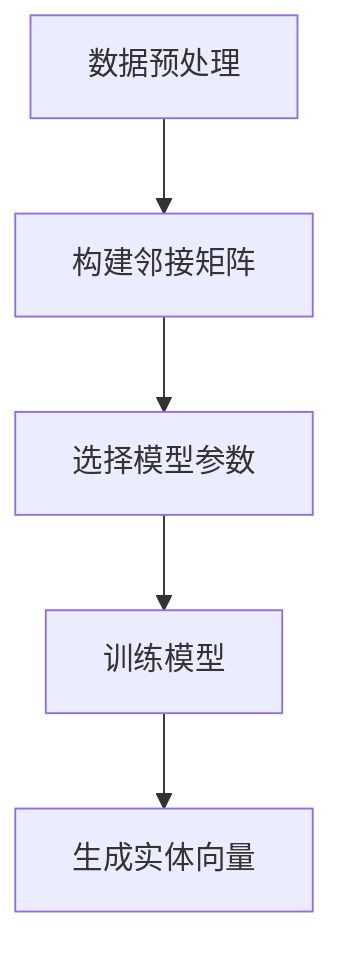
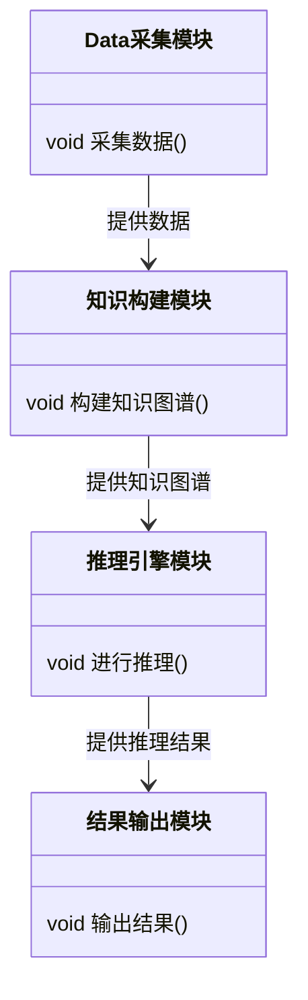
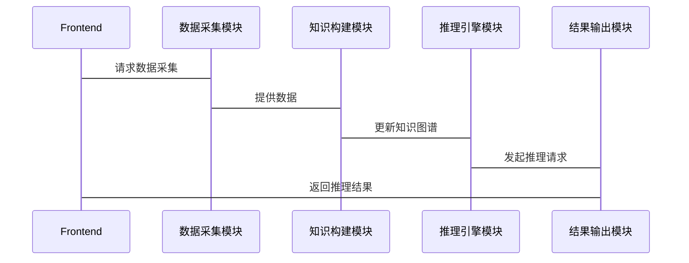

                 


# 《构建AI Agent的知识图谱多模态推理系统》

---

## 关键词

- AI Agent
- 知识图谱
- 多模态推理
- 系统架构
- 项目实战

---

## 摘要

本文详细探讨了构建AI Agent的知识图谱多模态推理系统的各个方面，从核心概念到算法原理，再到系统设计和项目实战。文章首先介绍了知识图谱和多模态推理的基本概念及其在AI Agent中的重要性，随后深入分析了两者的核心原理和联系。接着，文章详细讲解了相关的算法原理，包括知识图谱的嵌入方法和多模态数据融合策略，并通过mermaid流程图和Python代码示例进行了直观展示。在系统设计部分，文章从问题场景出发，设计了系统的功能模块和架构，并通过mermaid图展示了系统架构和接口设计。最后，文章通过项目实战部分，指导读者如何搭建环境、实现核心功能，并通过实际案例分析了系统的应用场景和优化方向。本文旨在为AI Agent的构建提供全面的技术指导和实践参考。

---

## 第一部分：背景介绍

### 第1章：知识图谱与多模态推理概述

#### 1.1 知识图谱的基本概念

- 1.1.1 知识图谱的定义与特点
  - 知识图谱是一种以结构化方式表示知识的图数据，节点代表实体或概念，边代表实体之间的关系。
  - 特点：语义丰富、结构化、可扩展性强。

- 1.1.2 知识图谱的结构与构建方法
  - 三元组（subject-predicate-object）表示法。
  - 构建方法：数据抽取、实体识别、关系抽取、知识融合。

- 1.1.3 知识图谱在AI Agent中的作用
  - 提供上下文理解能力，增强推理能力。

#### 1.2 多模态推理的定义与特点

- 1.2.1 多模态数据的定义
  - 包括文本、图像、语音等多种数据类型。
  - 多模态数据的融合可以提升信息理解和推理的准确性。

- 1.2.2 多模态推理的核心概念
  - 基于多种数据模态进行联合推理，考虑不同模态之间的关联性。

- 1.2.3 多模态推理与知识图谱的结合
  - 利用知识图谱中的语义信息，增强多模态推理的效果。

#### 1.3 AI Agent的知识图谱多模态推理系统

- 1.3.1 系统的目标与应用场景
  - 目标：构建一个能够处理多模态数据，并基于知识图谱进行推理的AI Agent系统。
  - 应用场景：智能客服、智能推荐、智能监控等。

- 1.3.2 系统的边界与外延
  - 边界：专注于多模态数据处理和知识图谱推理，不涉及具体的应用层实现。
  - 外延：可扩展到其他AI应用领域。

- 1.3.3 系统的核心要素组成
  - 数据采集模块、知识构建模块、推理引擎模块、结果输出模块。

---

## 第二部分：核心概念与联系

### 第2章：知识图谱与多模态推理的核心概念

#### 2.1 知识图谱的原理与实现

- 2.1.1 知识图谱的构建流程
  - 数据采集：从结构化数据（如数据库）和非结构化数据（如文本）中提取三元组。
  - 实体识别：通过NLP技术识别文本中的实体。
  - 关系抽取：识别实体之间的关系。
  - 知识融合：消除冲突，构建统一的知识库。

- 2.1.2 知识图谱的存储与管理
  - 使用图数据库（如Neo4j）或关系型数据库存储。
  - 通过构建索引提高查询效率。

- 2.1.3 知识图谱的查询与推理
  - SPARQL查询语言。
  - 基于规则的推理和基于深度学习的推理。

#### 2.2 多模态数据的处理与融合

- 2.2.1 多模态数据的获取与预处理
  - 文本数据：分词、词干提取、去除停用词。
  - 图像数据：特征提取、图像分割。
  - 语音数据：语音识别、特征提取。

- 2.2.2 多模态数据的表示方法
  - 文本：词向量（如Word2Vec）、句子向量（如BERT）。
  - 图像：CNN提取特征向量。
  - 语音：MFCC特征向量。

- 2.2.3 多模态数据的融合策略
  - 程度：浅层融合（特征拼接）和深层融合（联合学习）。
  - 方法：加权融合、注意力机制。

#### 2.3 知识图谱与多模态推理的联系

- 2.3.1 知识图谱为多模态推理提供语义支持
  - 通过知识图谱中的实体关系，增强多模态数据的理解。
  - 例如，在图像描述中，结合知识图谱中的物体关系，提升推理的准确性。

- 2.3.2 多模态推理为知识图谱提供动态更新能力
  - 通过多模态数据的实时处理，动态更新知识图谱。
  - 例如，利用图像识别结果更新知识图谱中的实体属性。

---

## 第三部分：算法原理讲解

### 第3章：知识图谱的嵌入方法

#### 3.1 知识图谱的向量化表示

- 3.1.1 基于矩阵分解的方法
  - 使用矩阵分解将实体和关系映射到低维向量空间。
  - 例如，TransE算法：将三元组（s, r, o）映射为向量s、r、o，满足s + r ≈ o。

- 3.1.2 基于深度学习的方法
  - 使用图神经网络（如Graph Neural Networks）进行实体向量化。
  - 例如，GAT（Graph Attention Networks）通过注意力机制捕捉实体之间的关系。

#### 3.2 知识图谱嵌入的实现步骤

- 数据预处理：构建知识图谱的邻接矩阵或边列表。
- 确定模型参数：选择嵌入维度、学习率等。
- 模型训练：使用训练数据优化模型参数。
- 应用模型：将新实体输入模型，生成其向量表示。

#### 3.3 算法流程图



#### 3.4 Python代码示例

```python
import numpy as np
from sklearn.decomposition import TruncatedSVD

# 假设我们有一个知识图谱的邻接矩阵 adjacency_matrix
# 使用TruncatedSVD进行降维
model = TruncatedSVD(n_components=100)
model.fit(adjacency_matrix)
embeddings = model.transform(adjacency_matrix)
```

---

## 第四部分：系统分析与架构设计

### 第4章：系统架构设计

#### 4.1 问题场景介绍

- 系统目标：构建一个能够处理多模态数据，并基于知识图谱进行推理的AI Agent。
- 应用场景：智能客服、智能推荐等。

#### 4.2 系统功能设计

- 功能模块：
  - 数据采集模块：负责采集多模态数据。
  - 知识构建模块：构建和更新知识图谱。
  - 推理引擎模块：进行多模态推理。
  - 结果输出模块：输出推理结果。

- 领域模型：



#### 4.3 系统架构设计

- 系统架构：


#### 4.4 接口设计与交互

- 接口设计：
  - 数据采集接口：接收多模态数据。
  - 知识图谱接口：提供知识查询服务。
  - 推理接口：接收推理请求，返回结果。

- 交互流程：



---

## 第五部分：项目实战

### 第5章：项目实战

#### 5.1 环境搭建

- 安装必要的库：
  - Python：3.8+
  - 图数据库：Neo4j
  - 深度学习框架：TensorFlow、Keras

```bash
pip install neo4j==4.0.0
pip install tensorflow==2.5.0
```

#### 5.2 核心代码实现

- 数据预处理：

```python
import neo4j
from neo4j import GraphDatabase

# 连接到Neo4j数据库
driver = GraphDatabase.driver("bolt://localhost:7687", auth=("neo4j", "password"))
```

- 知识构建：

```python
# 在Neo4j中创建节点和关系
with driver.session() as session:
    session.run("CREATE (a:Person {name: 'Alice'})")
    session.run("CREATE (b:Person {name: 'Bob'})")
    session.run("CREATE (a)-[r:KNOWS]->(b)")
```

- 推理引擎：

```python
from neo4j.exceptions import ServiceUnavailable

try:
    with driver.session() as session:
        result = session.run("MATCH (a:Person {name: 'Alice'})-[r:KNOWS]->(b) RETURN b.name")
        print(result.single()[0])
except ServiceUnavailable:
    print("无法连接到数据库")
```

#### 5.3 项目总结

- 成功的关键点：
  - 知识图谱的构建和维护。
  - 多模态数据的处理与融合。
  - 推理算法的优化与调优。

- 可能遇到的问题：
  - 数据质量问题：多模态数据的准确性影响推理结果。
  - 计算资源限制：大规模数据处理需要高性能计算资源。

---

## 第六部分：总结与扩展

### 第6章：总结与扩展

#### 6.1 全文总结

- 本文详细探讨了构建AI Agent的知识图谱多模态推理系统的各个方面，包括核心概念、算法原理、系统设计和项目实战。

#### 6.2 最佳实践 tips

- 数据预处理是关键，确保数据的准确性和一致性。
- 知识图谱的构建需要结合具体应用场景，进行针对性优化。
- 多模态推理算法的选择应根据任务需求和数据特点进行调整。

#### 6.3 注意事项

- 数据隐私和安全问题需要高度重视。
- 系统设计应考虑可扩展性和可维护性。

#### 6.4 拓展阅读

- 推荐书籍：《知识图谱：概念、方法与应用》
- 推荐论文：《A Survey on Multimodal Representation Learning》

---

## 作者

作者：AI天才研究院 & 禅与计算机程序设计艺术

---

以上目录大纲和内容设计遵循了逐步分析和详细讲解的思路，确保读者能够系统地理解和掌握构建AI Agent的知识图谱多模态推理系统的各个方面。

