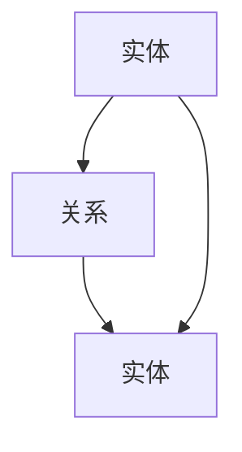

                 


# 构建AI Agent的知识图谱推理引擎

## 关键词：知识图谱、AI Agent、推理引擎、知识表示、逻辑推理、系统架构

## 摘要：  
本文旨在探讨如何构建AI Agent的知识图谱推理引擎。通过分析知识图谱的核心概念与推理引擎的原理，结合实际应用场景，详细阐述了知识图谱推理引擎的构建过程，包括算法原理、系统架构设计与实现。文章还提供了具体的项目实战案例，总结了最佳实践经验和注意事项，为构建高效、智能的知识图谱推理引擎提供了理论与实践的双重指导。

---

# 第一部分：知识图谱与AI Agent概述

## 第1章：知识图谱与AI Agent背景介绍

### 1.1 知识图谱的定义与特点
知识图谱是一种以图结构形式表示知识的语义网络，由实体、关系和属性组成。其核心特点包括：
- **语义性**：通过明确的关系和属性，描述实体之间的语义联系。
- **层次性**：支持层次化组织，便于知识的推理和扩展。
- **可扩展性**：支持大规模数据的构建和扩展。

### 1.2 AI Agent的基本概念
AI Agent是一种能够感知环境、自主决策并执行任务的智能实体，具有以下核心功能：
- **感知**：通过传感器或数据接口获取环境信息。
- **推理**：基于知识库进行逻辑推理，做出决策。
- **规划**：制定行动计划并执行。

### 1.3 知识图谱推理引擎的定义与作用
知识图谱推理引擎是AI Agent的核心组件，负责根据知识图谱进行推理，为决策提供支持。其作用包括：
- **知识检索**：快速定位相关知识。
- **逻辑推理**：基于知识图谱进行推导，得出结论。
- **结果解释**：将推理结果转化为可理解的形式。

### 1.4 本章小结
本章介绍了知识图谱和AI Agent的基本概念，强调了推理引擎在AI Agent中的重要性。

---

## 第2章：知识图谱的核心概念与原理

### 2.1 知识图谱的构建过程
知识图谱的构建包括数据采集与预处理、知识抽取与表示、知识融合与优化三个阶段。

#### 2.1.1 数据采集与预处理
- 数据来源：结构化数据（数据库）、非结构化数据（文本、图像）。
- 预处理步骤：清洗、去重、格式转换。

#### 2.1.2 知识抽取与表示
- 抽取方法：基于规则、统计学习、深度学习。
- 表示形式：三元组（实体、关系、实体）或属性-值对。

#### 2.1.3 知识融合与优化
- 融合方法：冲突检测、一致性检查。
- 优化策略：消除冗余、提高准确性。

### 2.2 知识图谱的存储与管理
知识图谱的存储方式包括：
- 图数据库（Neo4j、MongoDB）。
- 关系型数据库（MySQL、PostgreSQL）。
- 文件存储（RDF、N-Triples）。

### 2.3 知识图谱的属性特征对比
以下是知识图谱中实体与关系的对比：

| 属性 | 实体 | 关系 |
|------|------|------|
| 类型 | 类别：人、组织、地点 | 二元关系：属于、包含 |
| 示例 | 人名：张三 | 关系：属于：张三属于公司 |

### 2.4 知识图谱的ER实体关系图


---

## 第3章：推理引擎的核心原理与算法

### 3.1 推理引擎的基本原理
推理引擎通过知识图谱中的已知信息，推导出未知结论。推理类型包括：
- **演绎推理**：从一般到特殊的推理。
- **归纳推理**：从特殊到一般的推理。
- **溯因推理**：从结果追溯原因。

### 3.2 知识图谱推理算法
#### 3.2.1 基于规则的推理算法
- **规则定义**：如果A且B，则C。
- **实现步骤**：
  1. 匹配规则的前提条件。
  2. 生成结论。

#### 3.2.2 基于概率的推理算法
- **概率公式**：
  $$ P(h|e) = \frac{P(e|h) \cdot P(h)}{P(e)} $$
  其中，$h$为假设，$e$为证据。

#### 3.2.3 基于学习的推理算法
- **深度学习模型**：使用神经网络进行推理。

### 3.3 推理引擎的实现流程
#### 3.3.1 数据预处理
- 数据清洗、标准化。
#### 3.3.2 知识表示
- 使用三元组表示知识。
#### 3.3.3 推理过程
- 应用推理算法，生成结论。
#### 3.3.4 结果解释
- 将推理结果转化为人类可理解的形式。

### 3.4 推理算法的数学模型
- **基于规则的推理公式**：
  $$ P(h) = 1 \text{ 如果 } h \text{ 满足所有规则} $$
- **基于概率的推理公式**：
  $$ P(h|e) = \frac{P(e|h) \cdot P(h)}{P(e)} $$

### 3.5 推理算法的实现代码示例
```python
def rule_based_reasoning(knowledge_graph):
    for rule in rules:
        if rule.applies_to(knowledge_graph):
            return rule.inference(knowledge_graph)
    return None
```

---

## 第4章：系统分析与架构设计

### 4.1 问题场景介绍
AI Agent需要在复杂环境中进行推理，应用场景包括智能问答、推荐系统、自动化决策等。

### 4.2 系统功能设计
- **知识存储**：存储知识图谱数据。
- **推理引擎**：实现逻辑推理功能。
- **结果解释**：将推理结果转化为用户可理解的形式。

### 4.3 系统架构设计
- **分层架构**：分为数据层、逻辑层、应用层。
- **接口设计**：提供RESTful API供其他系统调用。

### 4.4 系统交互流程
- **用户请求**：发送查询请求。
- **知识检索**：从知识图谱中检索相关知识。
- **逻辑推理**：基于知识图谱进行推理。
- **结果返回**：返回推理结果。

---

## 第5章：项目实战与最佳实践

### 5.1 环境安装
- **工具安装**：安装Python、Jupyter Notebook、图数据库等工具。
- **依赖管理**：使用pip安装必要的库（如networkx、py2neo）。

### 5.2 系统核心实现
- **知识图谱构建**：编写代码提取知识三元组。
- **推理引擎实现**：实现基于规则的推理算法。

### 5.3 代码实现与解读
```python
import networkx as nx

def build_knowledge_graph(data):
    G = nx.Graph()
    for triple in data:
        G.add_edge(triple[0], triple[1], relation=triple[2])
    return G
```

### 5.4 案例分析
- **案例描述**：构建一个简单的知识图谱，推理“张三属于哪家公司？”。
- **推理过程**：基于规则匹配，找到张三的关系属性。

### 5.5 项目总结
- **经验总结**：推理引擎的设计需要考虑规则的可扩展性。
- **注意事项**：数据质量和推理规则的准确性直接影响推理结果。

### 5.6 最佳实践 Tips
- **数据清洗**：确保数据的准确性和完整性。
- **规则优化**：定期更新规则，提高推理效率。

---

## 第6章：小结与展望

### 6.1 小结
本文详细介绍了知识图谱推理引擎的构建过程，从核心概念到算法实现，再到系统设计，为AI Agent的开发提供了理论与实践指导。

### 6.2 展望
未来，知识图谱推理引擎将更加智能化，支持复杂场景下的推理任务，如多模态推理、动态知识更新等。

---

## 作者信息

作者：AI天才研究院/AI Genius Institute  
联系邮箱：contact@aicourse.com  

---

以上是文章的完整内容，涵盖了从理论到实践的各个方面，旨在为读者提供一个全面的知识图谱推理引擎构建指南。

