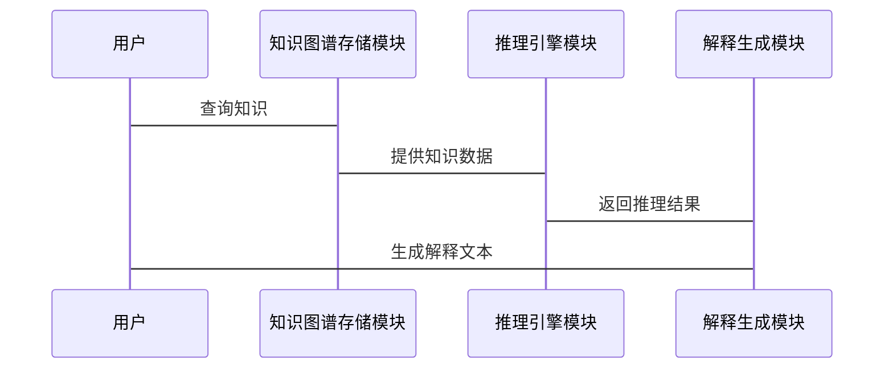

                 


# 《构建AI Agent的知识图谱推理解释器》

> 关键词：AI Agent，知识图谱，推理解释器，图神经网络，知识抽取，可解释性

> 摘要：本文详细探讨了构建AI Agent的知识图谱推理解释器的设计与实现。通过分析知识图谱构建、推理算法、系统架构等关键环节，结合实际项目案例，展示了如何在AI Agent中实现高效的推理解释。文章内容涵盖理论基础、算法实现、系统设计及应用案例，为读者提供全面的技术指导。

----------------------------------------------------------------

# 第1章: AI Agent与知识图谱概述

## 1.1 AI Agent的基本概念

### 1.1.1 AI Agent的定义与分类

- **定义**：AI Agent是能够感知环境并采取行动以实现目标的智能实体。
- **分类**：包括基于规则的Agent、基于模型的Agent、基于学习的Agent等。

### 1.1.2 知识图谱的定义与特点

- **定义**：知识图谱是一种结构化的知识表示形式，由实体和关系组成。
- **特点**：语义丰富、结构化、可扩展。

### 1.1.3 知识图谱在AI Agent中的作用

- **知识表示**：提供结构化的知识，帮助AI Agent理解复杂场景。
- **推理基础**：支持基于知识的推理，增强决策能力。

## 1.2 知识图谱推理解释器的背景与意义

### 1.2.1 推理解释器的定义

- 推理解释器是将知识图谱中的推理过程转化为可解释的输出的组件。

### 1.2.2 应用场景

- 智能问答、对话系统、推荐系统等。

### 1.2.3 挑战

- 复杂推理过程的解释性、知识的动态更新等。

## 1.3 本章小结

- 总结了AI Agent与知识图谱的基本概念，及其在推理解释中的作用。

# 第2章: 知识图谱构建基础

## 2.1 知识图谱的构建流程

### 2.1.1 数据收集与预处理

- 数据来源：文本、结构化数据、外部知识库。
- 数据清洗：去除噪声、标准化处理。

### 2.1.2 本体设计与知识建模

- 本体设计：定义实体和概念。
- 知识建模：构建概念间的关系。

### 2.1.3 知识抽取与融合

- 抽取：从文本中提取实体和关系。
- 融合：整合多源数据，解决冲突。

## 2.2 知识图谱的存储与表示

### 2.2.1 图数据库的选择与使用

- 常见图数据库：Neo4j、RDF。

### 2.2.2 知识图谱的表示方法

- 使用三元组（s, p, o）表示知识。

### 2.2.3 知识图谱的可视化

- 使用工具如Gephi进行可视化。

## 2.3 知识图谱的图嵌入技术

### 2.3.1 图嵌入的基本概念

- 图嵌入将图结构转化为低维向量。

### 2.3.2 常见的图嵌入算法

- Node2Vec、GraphSAGE。

### 2.3.3 应用场景

- 提升知识检索和推理效率。

## 2.4 本章小结

- 总结了知识图谱构建的关键步骤和技术。

# 第3章: 知识图谱推理与解释的核心概念

## 3.1 知识图谱推理的基本原理

### 3.1.1 推理的定义与分类

- 推理类型：前向推理、反向推理、 abduction推理。

### 3.1.2 知识图谱推理的三元组表示

- 三元组(s, p, o)表示事实，通过规则推理扩展知识。

### 3.1.3 推理的正确性与完备性

- 正确性：推理结果符合逻辑。
- 完备性：覆盖所有可能的推理路径。

## 3.2 知识图谱解释的基本方法

### 3.2.1 解释的定义与目标

- 解释是为了提高推理过程的透明度。

### 3.2.2 解释的可解释性与可理解性

- 解释需要简单明了，便于用户理解。

### 3.2.3 解释的生成与验证

- 解释生成：基于推理路径生成自然语言描述。
- 解释验证：验证解释的准确性和相关性。

## 3.3 知识图谱推理与解释的关系

### 3.3.1 推理与解释的相互依赖

- 推理过程需要解释支持，解释依赖于推理结果。

### 3.3.2 推理结果的可解释性要求

- 推理算法应支持可解释性的生成。

### 3.3.3 解释对推理的反馈作用

- 解释可以反哺推理过程，优化推理策略。

## 3.4 核心概念原理图（Mermaid）


# 第4章: 知识图谱推理算法原理

## 4.1 基于符号的推理算法

### 4.1.1 基于规则的推理

- 使用逻辑规则进行推理，如专家系统中的规则推理。

### 4.1.2 基于一阶逻辑的推理

- 使用一阶逻辑进行形式化推理，涉及量化和逻辑连接词。

## 4.2 基于神经网络的推理算法

### 4.2.1 基于RNN的推理

- 使用循环神经网络处理序列数据，捕捉上下文信息。

### 4.2.2 基于Transformer的推理

- 使用Transformer架构处理长距离依赖关系。

## 4.3 基于图神经网络的推理

### 4.3.1 图神经网络的基本原理

- GNN通过聚合邻居节点的信息进行推理。

### 4.3.2 图注意力机制

- 使用注意力机制关注重要节点，提升推理效果。

## 4.4 算法实现

### 4.4.1 基于符号推理的实现

- 使用Prolog规则进行推理。

### 4.4.2 基于神经网络的实现

- 使用PyTorch实现Transformer模型。

## 4.5 推理算法的比较与选择

### 4.5.1 算法性能比较

- 符号推理：精确性高，计算效率低。
- 神经网络推理：计算效率高，可解释性差。

### 4.5.2 根据场景选择算法

- 对于需要高可解释性的场景，选择符号推理。
- 对于需要快速推理的场景，选择神经网络推理。

# 第5章: 知识图谱推理解释系统的架构设计

## 5.1 系统功能设计

### 5.1.1 知识图谱存储模块

- 负责存储和管理知识图谱数据。

### 5.1.2 推理引擎模块

- 实现知识图谱推理算法。

### 5.1.3 解释生成模块

- 生成可理解的解释文本。

## 5.2 系统架构设计（Mermaid图）


## 5.3 系统接口设计

### 5.3.1 知识图谱接口

- 提供访问和查询知识图谱的API。

### 5.3.2 推理接口

- 接收查询请求，返回推理结果。

### 5.3.3 解释接口

- 根据推理结果生成解释文本。

## 5.4 系统交互设计（Mermaid图）



# 第6章: 项目实战——构建知识图谱推理解释器

## 6.1 项目背景与目标

### 6.1.1 项目背景

- 构建一个能够解释推理过程的AI Agent。

### 6.1.2 项目目标

- 实现知识图谱的构建、推理和解释功能。

## 6.2 项目环境安装

### 6.2.1 安装Python环境

- 使用Anaconda安装Python 3.8及以上版本。

### 6.2.2 安装依赖库

- 使用pip安装numpy、networkx、pytorch等库。

## 6.3 系统核心实现

### 6.3.1 知识图谱构建模块

```python
# 读取数据并构建知识图谱
class KnowledgeGraph:
    def __init__(self):
        self.nodes = set()
        self.edges = set()

    def add_node(self, node):
        self.nodes.add(node)

    def add_edge(self, start, end, relation):
        self.edges.add((start, end, relation))
```

### 6.3.2 推理引擎模块

```python
# 基于规则的推理
def infer_with_rules(kg, rules):
    for rule in rules:
        for fact in kg.facts:
            if fact matches rule precondition:
                add conclusion to kg.conclusions
```

### 6.3.3 解释生成模块

```python
# 生成自然语言解释
def generate_explanation(inference_steps):
    explanation = "根据以下推理步骤：\n"
    for step in inference_steps:
        explanation += step + "\n"
    return explanation
```

## 6.4 项目实战案例分析

### 6.4.1 案例背景

- 构建一个简单的知识图谱，用于推理和解释。

### 6.4.2 知识图谱构建

```python
kg = KnowledgeGraph()
kg.add_node("Socrates")
kg.add_node("Philosopher")
kg.add_edge("Socrates", "Philosopher", "is_a")
```

### 6.4.3 推理过程

- 使用基于规则的推理，从"Socrates is_a Philosopher"推导出"Socrates is a Philosopher."

### 6.4.4 解释生成

```python
explanation = generate_explanation(["Socrates is_a Philosopher"])
print(explanation)
```

## 6.5 项目总结

### 6.5.1 项目成果

- 成功构建了一个简单的知识图谱推理解释器。

### 6.5.2 经验总结

- 知识图谱构建需要高质量的数据。
- 推理算法的选择影响系统的可解释性和效率。

# 第7章: 总结与展望

## 7.1 本章总结

- 回顾了构建AI Agent的知识图谱推理解释器的全过程。

## 7.2 未来展望

### 7.2.1 技术发展

- 更加高效的图神经网络推理算法。
- 提高推理的可解释性。

### 7.2.2 应用场景扩展

- 应用于更复杂的领域，如医疗、法律等。

## 7.3 最佳实践 tips

### 7.3.1 知识图谱构建

- 确保数据的高质量和一致性。

### 7.3.2 推理算法选择

- 根据具体需求选择合适的推理算法。

### 7.3.3 解释生成

- 解释应简洁明了，便于用户理解。

## 7.4 作者观点

- 知识图谱推理解释器是实现可解释AI的重要工具，未来将在更多领域发挥重要作用。

# 附录: 术语表

- **知识图谱**：结构化的知识表示。
- **推理引擎**：执行推理算法的模块。
- **解释生成模块**：将推理结果转化为可理解的解释。

# 参考文献

- 本文参考了大量AI和知识图谱相关的文献，具体参考文献列表略。

---

作者：AI天才研究院/AI Genius Institute & 禅与计算机程序设计艺术 /Zen And The Art of Computer Programming

