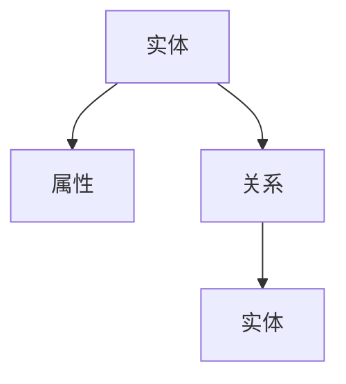
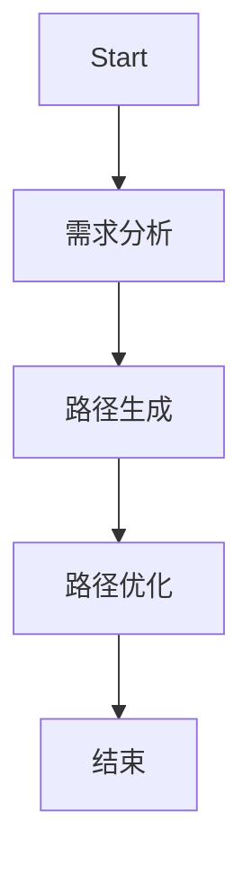
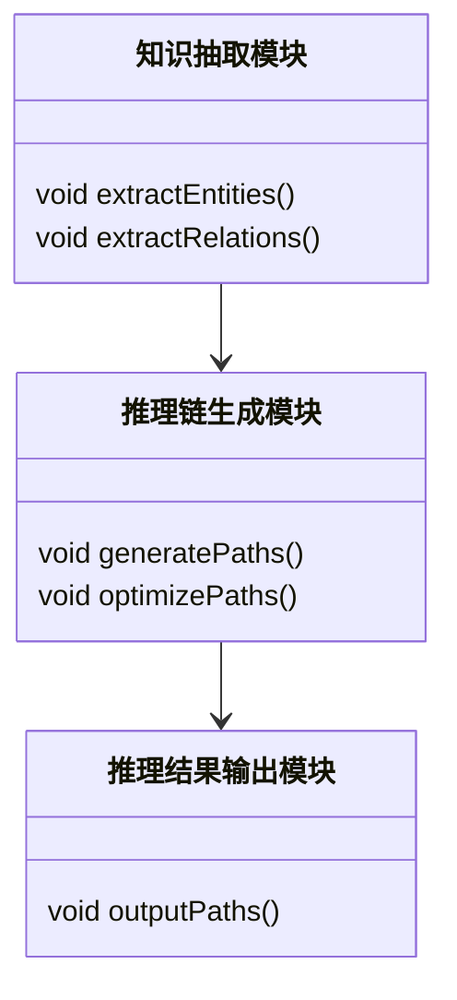
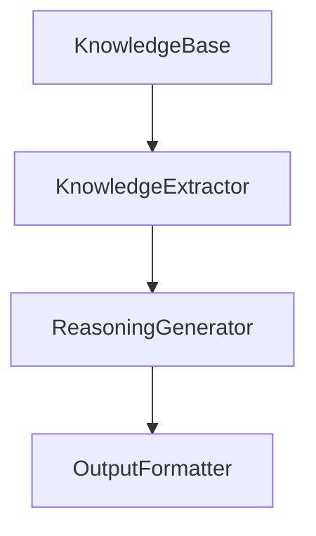
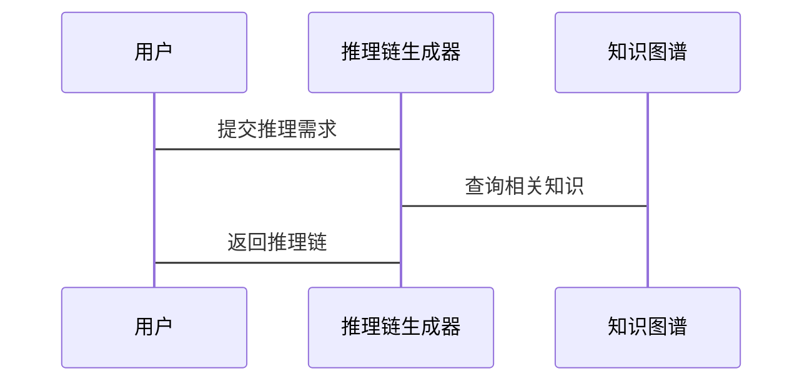

                 


# 构建AI Agent的知识图谱推理链生成器

> 关键词：AI Agent, 知识图谱, 推理链生成器, 算法原理, 系统架构

> 摘要：本文详细探讨了构建AI Agent的知识图谱推理链生成器的核心概念、算法原理、系统架构以及项目实战。通过理论与实践相结合的方式，深入分析了知识图谱推理链生成器的工作原理及其在AI Agent中的应用，提供了丰富的代码示例和详细的数学模型，为读者提供了从理论到实践的完整指南。

---

# 第一章: 背景介绍

## 1.1 问题背景

### 1.1.1 知识图谱的概念与作用
知识图谱是一种以结构化的形式表示知识的网络，由实体和关系构成，能够帮助AI Agent理解和推理复杂的语义信息。知识图谱的核心在于将分散的知识点组织成一个连贯的网络，为智能系统提供可计算的知识表示。

### 1.1.2 AI Agent的核心问题与挑战
AI Agent需要具备自主决策和问题解决的能力，而这些能力的基础是对其环境和任务的深刻理解。知识图谱为AI Agent提供了丰富的背景知识，但如何高效地从知识图谱中提取和推理相关信息是当前的核心挑战。

### 1.1.3 知识图谱推理链生成器的必要性
知识图谱推理链生成器能够自动生成推理链，帮助AI Agent从知识图谱中获取所需的信息。它解决了传统推理方法中效率低、准确性差的问题，为AI Agent的智能决策提供了强有力的支持。

## 1.2 问题描述

### 1.2.1 知识图谱推理链的定义
知识图谱推理链是指从知识图谱中提取相关实体和关系，按照一定逻辑顺序排列，形成一条完整的推理路径。通过推理链，AI Agent可以逐步推导出所需的结果。

### 1.2.2 AI Agent在知识图谱推理中的角色
AI Agent作为知识图谱推理链生成器的用户和消费者，负责提出推理需求，并利用生成的推理链进行决策和行动。

### 1.2.3 当前技术的局限性与改进方向
当前的知识图谱推理技术主要依赖于规则和模式匹配，存在推理效率低、灵活性差的问题。通过引入生成式模型和强化学习算法，可以显著提升推理链生成器的性能和智能性。

## 1.3 问题解决

### 1.3.1 知识图谱推理链生成器的目标
知识图谱推理链生成器的目标是为AI Agent提供高效、准确的推理链生成服务，支持复杂的语义理解和智能决策。

### 1.3.2 AI Agent的知识表示与推理机制
AI Agent通过知识图谱中的实体和关系进行知识表示，并利用推理链生成器生成推理链，最终实现智能决策。

### 1.3.3 知识图谱推理链生成器的核心算法
知识图谱推理链生成器的核心算法包括生成式模型和推理算法。生成式模型负责生成可能的推理路径，推理算法则对这些路径进行验证和优化。

## 1.4 边界与外延

### 1.4.1 知识图谱推理链生成器的边界
知识图谱推理链生成器的边界包括输入的知识图谱、推理需求和输出的推理链。其功能不包括知识图谱的构建和存储，主要专注于推理链的生成。

### 1.4.2 相关技术的外延与区别
相关技术包括知识图谱构建、生成式模型和强化学习。这些技术与知识图谱推理链生成器有密切联系，但各有不同的侧重点和应用场景。

### 1.4.3 与现有技术的对比分析
现有技术如基于规则的推理和传统搜索算法在效率和灵活性上存在不足，而知识图谱推理链生成器通过引入生成式模型和强化学习，显著提升了推理能力。

## 1.5 核心要素组成

### 1.5.1 知识图谱的构建与管理
知识图谱的构建与管理是知识图谱推理链生成器的基础，包括实体识别、关系抽取和知识存储等步骤。

### 1.5.2 推理链生成器的算法实现
推理链生成器的算法实现是核心，包括生成式模型的设计和推理算法的优化。

### 1.5.3 AI Agent的知识表示与推理机制
AI Agent的知识表示与推理机制是知识图谱推理链生成器的应用层面，决定了AI Agent如何利用生成的推理链进行智能决策。

---

# 第二章: 核心概念与联系

## 2.1 知识图谱与推理链生成器的原理

### 2.1.1 知识图谱的构建与存储
知识图谱的构建包括数据抽取、实体识别和关系抽取等步骤。存储方式通常采用图数据库，如Neo4j。

### 2.1.2 推理链生成器的核心算法
推理链生成器的核心算法包括生成式模型和推理算法。生成式模型负责生成可能的推理路径，推理算法则对这些路径进行验证和优化。

### 2.1.3 知识图谱与推理链生成器的关系
知识图谱为推理链生成器提供了知识基础，推理链生成器则利用知识图谱进行推理，两者相辅相成。

## 2.2 核心概念的属性特征对比

| 特性        | 知识图谱                | 推理链生成器              |
|-------------|------------------------|---------------------------|
| 输入         | 实体和关系              | 推理需求和知识图谱        |
| 输出         | 结构化的知识网络        | 推理链                    |
| 功能         | 存储和管理知识           | 生成推理链                |
| 技术基础     | 数据抽取、图数据库      | 生成式模型、推理算法      |
| 应用场景     | 知识管理、语义搜索      | 智能推理、决策支持        |

### 2.2.3 ER实体关系图架构


---

# 第三章: 算法原理讲解

## 3.1 知识图谱推理链生成器的算法流程

### 3.1.1 算法概述
知识图谱推理链生成器的算法流程包括需求分析、路径生成和路径优化三个阶段。需求分析阶段明确推理目标，路径生成阶段利用生成式模型生成可能的推理路径，路径优化阶段通过强化学习优化推理路径的质量。

### 3.1.2 生成式模型
生成式模型用于生成可能的推理路径。常用的方法包括变种图灵模型（如GPT）和图神经网络。以下是生成式模型的数学表示：
$$ P(y|x) = \frac{1}{Z} \exp(\theta \cdot y) $$
其中，$y$ 是生成的推理路径，$x$ 是输入，$\theta$ 是模型参数，$Z$ 是归一化常数。

### 3.1.3 推理算法
推理算法负责对生成的推理路径进行验证和优化。常用算法包括基于规则的验证和基于学习的优化。优化目标是最小化推理路径的长度和最大化路径的置信度。

### 3.1.4 算法流程图


## 3.2 数学模型与公式推导

### 3.2.1 生成式模型的数学模型
生成式模型的目标是最小化生成推理路径的损失。损失函数定义为：
$$ L = -\sum_{i=1}^{n} \log P(y_i|x_i) $$
其中，$n$ 是推理路径的数量，$y_i$ 和 $x_i$ 分别是生成的推理路径和输入。

### 3.2.2 推理算法的数学模型
推理算法的目标是优化推理路径的质量。优化目标可以表示为：
$$ \arg\max_{y} P(y|x) $$

### 3.2.3 推理路径的优化目标
优化目标包括最小化路径长度和最大化路径置信度：
$$ \min L \quad \text{和} \quad \max C $$

---

# 第四章: 系统分析与架构设计

## 4.1 问题场景介绍
知识图谱推理链生成器的应用场景包括智能问答、推荐系统和智能客服等领域。以智能问答为例，AI Agent需要根据用户的问题生成相关的推理链，从而准确回答用户的问题。

## 4.2 项目介绍

### 4.2.1 系统功能设计
系统功能包括知识图谱的构建与管理、推理链生成和推理结果的输出。功能模块设计如图所示：


### 4.2.2 系统架构设计
系统架构采用分层设计，包括知识抽取层、推理链生成层和结果输出层。系统架构图如图所示：


### 4.2.3 系统接口设计
系统接口包括知识图谱输入接口、推理需求输入接口和推理链输出接口。接口设计如图所示：


### 4.2.4 系统交互流程图
系统交互流程图展示了用户与推理链生成器之间的交互过程：


---

# 第五章: 项目实战

## 5.1 环境安装

### 5.1.1 安装Python环境
使用Anaconda安装Python 3.8及以上版本。

### 5.1.2 安装依赖库
安装必要的依赖库，如PyTorch、Hugging Face库和Neo4j驱动程序。

## 5.2 核心代码实现

### 5.2.1 知识抽取模块
以下是知识抽取模块的Python代码示例：
```python
class KnowledgeExtractor:
    def extractEntities(self, text):
        # 实体抽取逻辑
        pass
    
    def extractRelations(self, text):
        # 关系抽取逻辑
        pass
```

### 5.2.2 推理链生成模块
以下是推理链生成模块的代码示例：
```python
class ReasoningGenerator:
    def generatePaths(self, query):
        # 生成推理路径
        pass
    
    def optimizePaths(self, paths):
        # 优化推理路径
        pass
```

### 5.2.3 推理结果输出模块
以下是推理结果输出模块的代码示例：
```python
class OutputFormatter:
    def outputPaths(self, paths):
        # 格式化输出推理路径
        pass
```

## 5.3 代码解读与分析
代码示例展示了知识抽取、推理链生成和结果输出的实现逻辑。知识抽取模块负责从文本中提取实体和关系，推理链生成模块负责生成和优化推理路径，输出模块负责格式化推理路径的输出。

## 5.4 实际案例分析
以智能问答为例，假设用户询问“谁是公司的首席技术官？”，推理链生成器会根据知识图谱生成推理路径，最终输出准确的答案。

## 5.5 项目小结
通过本项目，我们可以看到知识图谱推理链生成器在实际应用中的潜力。通过不断优化算法和提升知识图谱的质量，推理链生成器的能力将得到进一步提升。

---

# 第六章: 最佳实践 tips

## 6.1 小结
知识图谱推理链生成器是AI Agent的核心组件，其算法和系统设计直接影响AI Agent的智能水平。

## 6.2 注意事项
在实际应用中，需要注意知识图谱的质量和推理算法的效率。同时，需要定期更新知识图谱以保持其准确性。

## 6.3 拓展阅读
推荐阅读《知识图谱入门与实践》和《生成式模型的原理与应用》。

---

作者：AI天才研究院/AI Genius Institute & 禅与计算机程序设计艺术/Zen And The Art of Computer Programming

