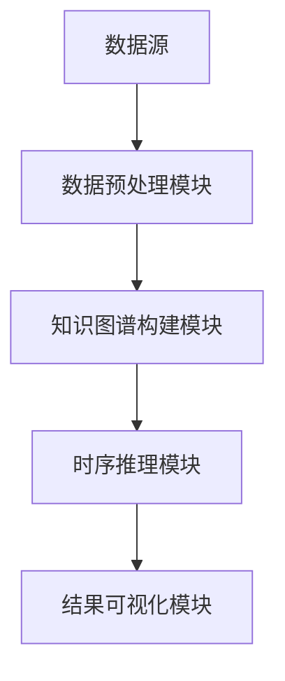

                 


# 构建AI Agent的知识图谱时序推理系统

> 关键词：AI Agent，知识图谱，时序推理，系统架构，算法原理，项目实战

> 摘要：本文详细探讨了构建AI Agent的知识图谱时序推理系统的各个方面，包括核心概念、算法原理、系统架构设计以及项目实战。通过分析知识图谱与时序推理的结合，展示了如何利用这些技术构建高效的AI Agent系统。

---

## 第1章: AI Agent与知识图谱时序推理系统概述

### 1.1 AI Agent的基本概念

#### 1.1.1 AI Agent的定义与特点
AI Agent（人工智能代理）是一种能够感知环境、自主决策并执行任务的智能实体。其特点包括：
- **自主性**：无需外部干预，自主完成任务。
- **反应性**：能够实时感知环境并做出反应。
- **目标导向**：基于目标驱动行为。
- **学习能力**：通过数据和经验不断优化性能。

#### 1.1.2 AI Agent的核心功能与应用场景
AI Agent的核心功能包括感知、推理、决策和执行。其应用场景广泛，如自动驾驶、智能助手、金融交易和医疗诊断等。

#### 1.1.3 时序推理在AI Agent中的重要性
时序推理是AI Agent理解和预测事件序列的关键能力，帮助其在动态环境中做出合理决策。

### 1.2 知识图谱的基本概念

#### 1.2.1 知识图谱的定义与特点
知识图谱是一种以图结构表示知识的数据模型，具有语义丰富、结构化和可扩展性强的特点。

#### 1.2.2 知识图谱的构建与表示方法
知识图谱的构建包括数据抽取、实体识别和关系抽取等步骤，常用表示方法有RDF、RDFS和OWL。

#### 1.2.3 知识图谱在AI Agent中的应用
知识图谱为AI Agent提供了丰富的知识库，支持其进行推理和决策。

### 1.3 时序推理的基本概念

#### 1.3.1 时序推理的定义与特点
时序推理是指根据时间序列数据推断出隐藏的模式或关系，具有时间依赖性和动态性特点。

#### 1.3.2 时序推理的核心算法与技术
常用算法包括ARIMA、LSTM和Transformer等。

#### 1.3.3 时序推理在知识图谱中的应用
通过时序推理，AI Agent能够理解和预测事件的发展趋势。

## 第2章: 知识图谱时序推理系统的核心概念

### 2.1 知识图谱的表示与存储

#### 2.1.1 知识图谱的表示方法
知识图谱通常使用三元组（头实体，关系，尾实体）进行表示。

#### 2.1.2 知识图谱的存储技术
常用存储技术包括RDF数据库和图数据库。

### 2.2 时序推理算法的核心原理

#### 2.2.1 时序推理的基本原理
时序推理基于时间序列数据，利用历史信息预测未来趋势。

### 2.3 知识图谱与时序推理的结合

#### 2.3.1 知识图谱如何支持时序推理
知识图谱为时序推理提供了丰富的上下文信息。

#### 2.3.2 时序推理如何增强知识图谱
时序推理能够揭示知识图谱中潜在的动态关系。

### 2.4 核心概念对比分析

#### 2.4.1 知识图谱与传统数据库的对比
知识图谱具有语义丰富和结构化的特点，而传统数据库注重数据的结构化存储和查询。

#### 2.4.2 时序推理与传统预测方法的对比
时序推理注重时间序列的分析，而传统预测方法可能缺乏对时间依赖性的建模。

## 第3章: 时序推理算法的数学模型与公式

### 3.1 常见时序推理算法的数学模型

#### 3.1.1 ARIMA模型的数学公式
ARIMA模型的数学公式为：
$$ y_t = \mu + \phi_1 y_{t-1} + \dots + \phi_p y_{t-p} + \theta_1 \epsilon_{t-1} + \dots + \theta_q \epsilon_{t-q} + \epsilon_t $$

#### 3.1.2 LSTM网络的数学公式
LSTM的三个门控机制：
1. 输入门控：$$ i_t = \sigma(W_i x_t + U_i h_{t-1} + b_i) $$
2. 遗忘门控：$$ f_t = \sigma(W_f x_t + U_f h_{t-1} + b_f) $$
3. 输出门控：$$ o_t = \sigma(W_o x_t + U_o h_{t-1} + b_o) $$

#### 3.1.3 Transformer模型的数学公式
Transformer的注意力机制：
$$ \text{Attention}(Q, K, V) = \text{softmax}\left(\frac{QK^T}{\sqrt{d_k}}\right)V $$

### 3.2 算法原理的详细讲解

#### 3.2.1 ARIMA算法的详细步骤
1. 数据预处理：检查数据的平稳性。
2. 参数估计：确定AR和MA的阶数。
3. 模型验证：检查残差是否符合白噪声。

### 3.3 时序推理算法的举例说明

#### 3.3.1 ARIMA算法的实例分析
以股票价格预测为例，通过ARIMA模型预测未来的价格走势。

## 第4章: 系统分析与架构设计方案

### 4.1 系统问题场景介绍

#### 4.1.1 知识图谱时序推理系统的应用场景
在金融领域，预测股票价格波动；在医疗领域，预测疾病发展趋势。

#### 4.1.2 系统的主要功能需求
包括知识图谱构建、时序数据处理、推理算法实现和结果可视化。

### 4.2 系统功能设计

#### 4.2.1 系统功能模块
- 数据采集模块：从多种数据源获取数据。
- 知识图谱构建模块：提取实体和关系。
- 时序推理模块：选择合适的算法进行预测。
- 结果可视化模块：将推理结果以图形化方式展示。

### 4.3 系统架构设计

#### 4.3.1 系统架构图


### 4.4 本章小结

---

## 第5章: 项目实战与最佳实践

### 5.1 环境安装

#### 5.1.1 系统依赖安装
安装Python、Pandas、NumPy、Scikit-learn、TensorFlow和Keras等库。

#### 5.1.2 知识图谱存储与查询工具安装
安装Neo4j图数据库和SPARQL查询工具。

### 5.2 系统核心实现源代码

#### 5.2.1 知识图谱构建代码
```python
from neo4j import GraphDatabase
from neo4j.exceptions import ServiceUnavailable

class KnowledgeGraph:
    def __init__(self, uri, user, password):
        self.driver = GraphDatabase.driver(uri, auth=(user, password))
    
    def add_entity(self, entity_type, entity_name):
        with self.driver.session() as session:
            session.run("CREATE (:{} {{name: '{}'})".format(entity_type, entity_name))
    
    def add_relation(self, start_entity, relation_type, end_entity):
        with self.driver.session() as session:
            session.run("MATCH (a {{name: '{0}'}}), (b {{name: '{1}'}}) "
                        "CREATE (a)-[r:{2}]->(b)".format(start_entity, end_entity, relation_type))
```

#### 5.2.2 时序推理代码
```python
import numpy as np
from sklearn.metrics import mean_squared_error
from keras.models import Sequential
from keras.layers import LSTM, Dense

def create_model(input_shape):
    model = Sequential()
    model.add(LSTM(50, input_shape=input_shape))
    model.add(Dense(1))
    model.compile(loss='mean_squared_error', optimizer='adam')
    return model

def train_model(model, X_train, y_train, epochs=50):
    model.fit(X_train, y_train, epochs=epochs, verbose=1)

def evaluate_model(model, X_test, y_test):
    predictions = model.predict(X_test)
    mse = mean_squared_error(y_test, predictions)
    return mse
```

### 5.3 案例分析与详细解读

#### 5.3.1 知识图谱构建案例
构建一个简单的知识图谱，包含公司、行业和竞争关系。

#### 5.3.2 时序推理案例
使用LSTM模型预测股票价格。

### 5.4 项目小结

---

## 第6章: 扩展阅读与未来展望

### 6.1 扩展阅读建议
建议读者深入研究知识图谱和时序推理的前沿技术，如图神经网络和强化学习。

### 6.2 未来展望
未来的研究方向包括结合知识图谱和生成式AI，提升时序推理系统的智能性。

---

## 作者：AI天才研究院 & 禅与计算机程序设计艺术

---

以上是一个详细的构建AI Agent的知识图谱时序推理系统的博客文章结构，涵盖了从基础概念到项目实战的各个方面，适合技术博客的读者阅读。

