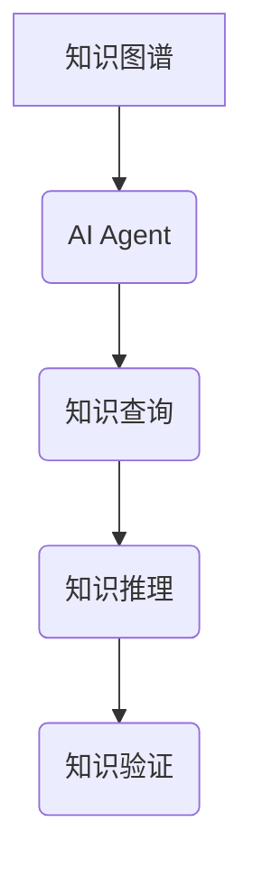
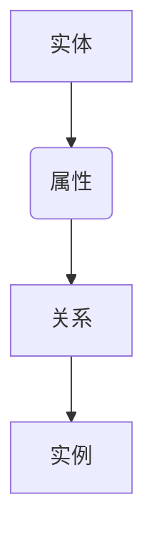
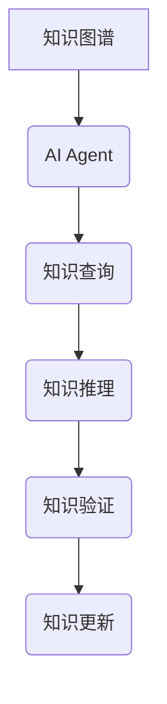
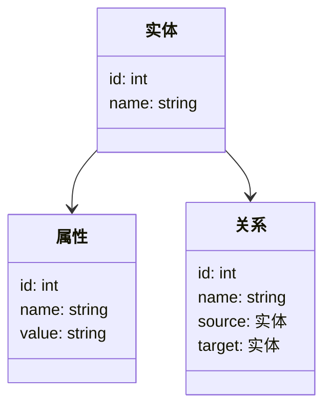
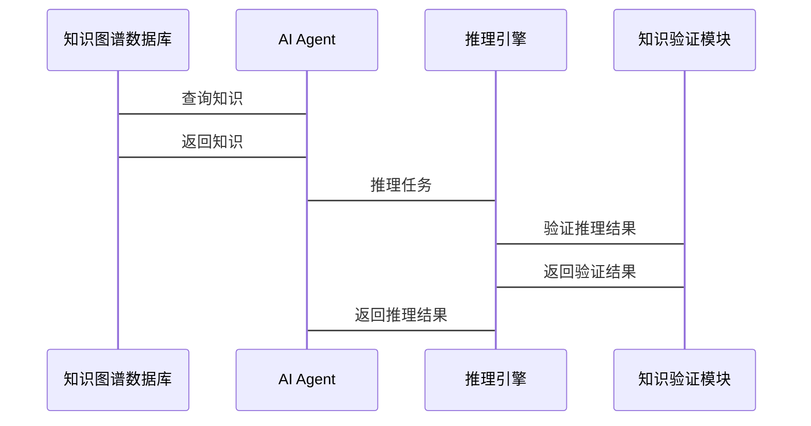

                 


# 《构建AI Agent的知识图谱自动扩展与验证框架》

> 关键词：知识图谱，AI Agent，自动扩展，验证框架，自然语言处理，图神经网络，AI推理

> 摘要：本文详细探讨了构建AI Agent的知识图谱自动扩展与验证框架的方法。从知识图谱的基本概念到AI Agent的知识需求，从自动扩展算法到验证框架的设计，本文通过理论分析与实际案例相结合的方式，全面阐述了该框架的构建过程。文章还结合具体代码实现和系统架构设计，为读者提供了实践指导。

---

# 第一部分: 背景与核心概念

## 第1章: 知识图谱与AI Agent概述

### 1.1 问题背景
#### 1.1.1 知识图谱的定义与特点
知识图谱是一种以图结构形式表示知识的语义网络，由实体（概念）和关系组成，具有语义丰富、结构化、可扩展性强等特点。

#### 1.1.2 AI Agent的基本概念
AI Agent是具有感知环境、自主决策和执行任务的智能体，需要依赖知识图谱来支持其推理和决策能力。

#### 1.1.3 知识图谱在AI Agent中的作用
知识图谱为AI Agent提供了丰富的知识表示和推理基础，帮助AI Agent更好地理解和处理复杂任务。

### 1.2 问题描述
#### 1.2.1 知识图谱构建的挑战
知识图谱的构建需要解决数据来源多样、实体识别、关系抽取等问题。

#### 1.2.2 AI Agent的知识需求
AI Agent需要动态更新和扩展知识图谱，以应对复杂多变的任务需求。

#### 1.2.3 知识图谱自动扩展的必要性
动态扩展知识图谱可以提高AI Agent的适应性和智能性。

### 1.3 问题解决
#### 1.3.1 知识图谱自动扩展的方法
基于规则和基于学习的两种主要方法，各有优缺点。

#### 1.3.2 AI Agent的知识验证机制
通过知识推理和验证算法，确保知识图谱的准确性和完整性。

#### 1.3.3 知识图谱与AI Agent的结合应用
知识图谱为AI Agent提供知识支持，AI Agent则通过任务驱动知识图谱的动态扩展。

### 1.4 边界与外延
#### 1.4.1 知识图谱的边界
知识图谱的构建范围和应用场景。

#### 1.4.2 AI Agent的能力边界
AI Agent的知识能力和任务处理边界。

#### 1.4.3 知识图谱自动扩展的外延
动态扩展的范围和未来发展趋势。

### 1.5 核心要素与概念结构
#### 1.5.1 知识图谱的核心要素
实体、属性、关系。

#### 1.5.2 AI Agent的核心要素
感知能力、推理能力、执行能力。

#### 1.5.3 知识图谱与AI Agent的关系图


---

# 第二部分: 核心概念与联系

## 第2章: 知识图谱与AI Agent的核心概念

### 2.1 知识图谱的属性与特征
#### 2.1.1 知识图谱的属性
语义性、关联性、可扩展性。

#### 2.1.2 知识图谱的特征对比
与传统数据库相比，知识图谱更注重语义和关联关系。

#### 2.1.3 知识图谱的存储方式
基于图数据库（如Neo4j）或分布式存储（如RDF）。

### 2.2 AI Agent的属性与特征
#### 2.2.1 AI Agent的属性
自主性、反应性、社会性。

#### 2.2.2 AI Agent的特征对比
与传统程序相比，AI Agent具有自主决策和学习能力。

#### 2.2.3 AI Agent的交互方式
基于知识图谱的自然语言交互和基于规则的交互。

### 2.3 知识图谱与AI Agent的关系
#### 2.3.1 实体关系图（ER图）


#### 2.3.2 知识图谱与AI Agent的交互流程图


---

# 第三部分: 算法原理与数学模型

## 第3章: 知识图谱自动扩展算法

### 3.1 知识图谱构建算法
#### 3.1.1 基于规则的构建算法
通过预定义规则提取实体和关系。

#### 3.1.2 基于学习的构建算法
使用深度学习模型（如RNN、BERT）进行实体识别和关系抽取。

#### 3.1.3 知识图谱构建的数学模型
$$ P(word) = \prod_{i=1}^{n} P(word_i | word_{i-1}) $$

### 3.2 知识图谱推理算法
#### 3.2.1 基于符号逻辑的推理
使用逻辑规则进行推理。

#### 3.2.2 基于概率的推理
使用贝叶斯网络进行推理。

#### 3.2.3 知识图谱推理的数学公式
$$ P(A \mid B) = \frac{P(B \mid A)P(A)}{P(B)} $$

---

## 第4章: 系统分析与架构设计

### 4.1 问题场景
AI Agent需要动态扩展知识图谱以支持复杂任务。

### 4.2 系统功能设计
#### 4.2.1 领域模型


#### 4.2.2 系统架构图


#### 4.2.3 接口设计


---

## 第5章: 项目实战

### 5.1 环境安装
#### 5.1.1 知识图谱数据库安装
使用Neo4j或其他图数据库。

#### 5.1.2 AI Agent框架安装
使用现有的AI框架（如TensorFlow、PyTorch）。

#### 5.1.3 推理引擎安装
安装逻辑推理库或概率推理库。

### 5.2 核心代码实现
#### 5.2.1 知识图谱构建代码
```python
import neo4j
def add_entity(tx, entity_name):
    tx.run("CREATE (:Entity {name: $name})", name=entity_name)
```

#### 5.2.2 知识图谱推理代码
```python
from logic推理库 import 推理引擎
engine = 推理引擎()
result = engine.run(rule_set, input_data)
```

### 5.3 案例分析与详细解读
以医疗领域的知识图谱构建为例，详细讲解实现步骤。

---

## 第6章: 总结与展望

### 6.1 最佳实践
确保知识图谱的准确性和完整性，选择合适的算法和工具。

### 6.2 小结
知识图谱自动扩展与验证框架为AI Agent提供了强大的知识支持。

### 6.3 注意事项
注意数据质量和算法的可解释性。

### 6.4 拓展阅读
推荐阅读相关领域的最新论文和技术报告。

---

作者：AI天才研究院/AI Genius Institute & 禅与计算机程序设计艺术/Zen And The Art of Computer Programming

