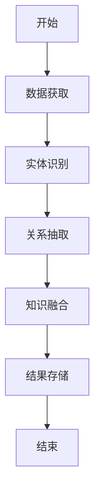
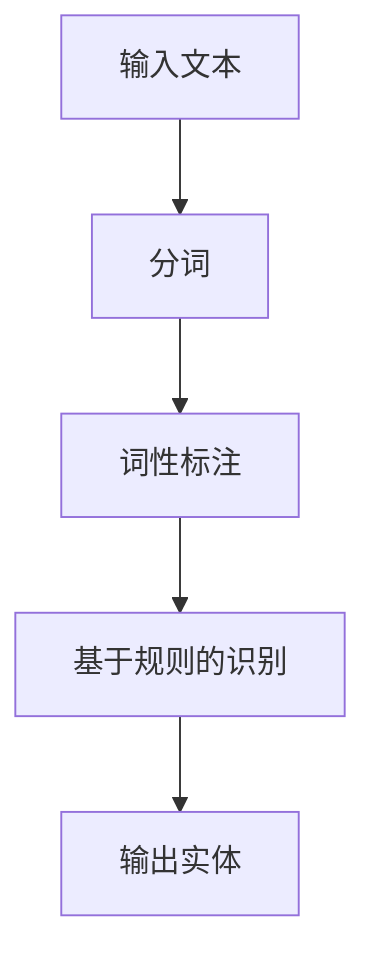
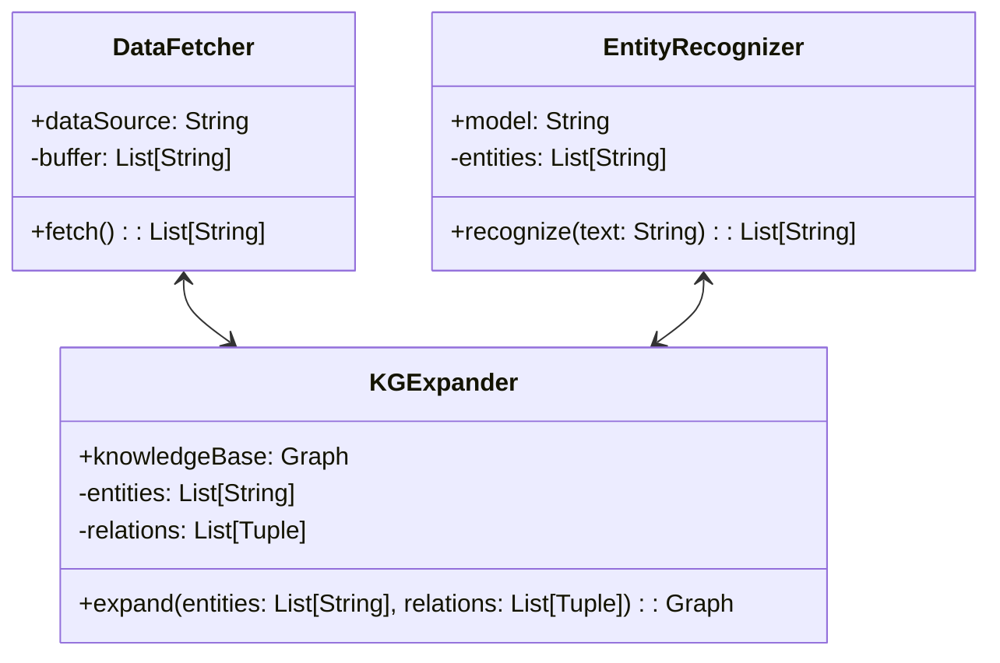
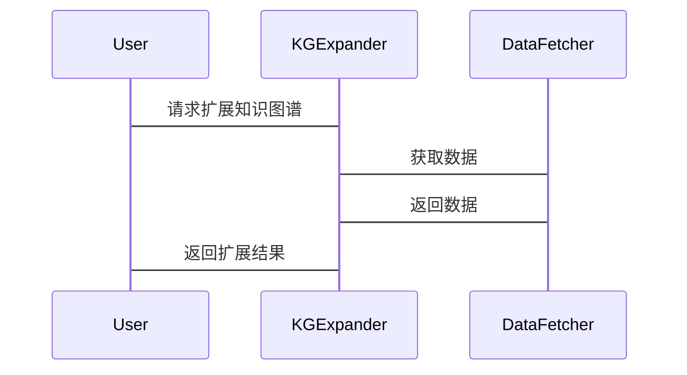

                 


# 构建AI Agent的知识图谱自动扩展系统

## 关键词：知识图谱，AI Agent，自动扩展，信息抽取，实体识别

## 摘要：本文详细探讨了如何构建一个基于AI Agent的知识图谱自动扩展系统。通过分析知识图谱和AI Agent的核心概念，阐述了系统的构建原理、算法设计和系统架构。文章还提供了实际项目案例和最佳实践，帮助读者理解和实现类似系统。

---

# 第1章: 知识图谱与AI Agent的背景与概念

## 1.1 知识图谱的基本概念

### 1.1.1 知识图谱的定义与特点
知识图谱是一种以图结构表示知识的形式，节点代表实体或概念，边表示实体之间的关系。其特点包括：
- **结构化**：节点和边明确表示实体和关系。
- **语义化**：通过语义关联建立实体间的联系。
- **可扩展性**：支持动态扩展和更新。

### 1.1.2 知识图谱的构建与应用
构建知识图谱通常包括数据采集、信息抽取、知识融合和存储等步骤。其应用领域广泛，如搜索引擎优化、语义搜索、智能问答系统等。

### 1.1.3 知识图谱与AI Agent的关系
AI Agent通过知识图谱获取上下文信息，执行任务。知识图谱为AI Agent提供了语义理解和推理的基础。

## 1.2 AI Agent的基本概念

### 1.2.1 AI Agent的定义与分类
AI Agent是具有感知和行动能力的智能体，根据环境信息执行任务。分类包括基于规则的Agent和基于模型的Agent。

### 1.2.2 AI Agent的核心功能与特点
核心功能包括感知环境、推理决策和执行行动。特点包括自主性、反应性、学习能力。

### 1.2.3 AI Agent在知识图谱中的作用
AI Agent利用知识图谱进行推理和决策，提升任务执行的智能性和准确性。

## 1.3 知识图谱自动扩展系统的背景与意义

### 1.3.1 知识图谱扩展的必要性
知识图谱需要不断更新以保持准确性，自动扩展是其持续发展的关键。

### 1.3.2 AI Agent在知识图谱扩展中的优势
AI Agent能够实时处理信息，自动识别新实体和关系，提升扩展效率。

### 1.3.3 系统构建的目标与应用场景
目标是实现知识图谱的动态扩展，应用场景包括智能问答、推荐系统等。

---

# 第2章: 知识图谱自动扩展的核心概念与原理

## 2.1 知识图谱自动扩展的定义与边界

### 2.1.1 知识图谱自动扩展的定义
指利用AI技术自动识别和添加新实体及关系的过程。

### 2.1.2 系统的边界与外延
边界包括输入数据和输出扩展后的知识图谱，外延涉及数据源和扩展规则。

## 2.2 知识图谱自动扩展的核心原理

### 2.2.1 信息抽取与实体识别
从文本中提取实体，常用技术包括基于规则和深度学习的方法。

### 2.2.2 实体关联与关系推理
识别实体间的关系，常用图嵌入和路径推理算法。

### 2.2.3 知识融合与冲突处理
整合多源信息，解决冲突，确保知识图谱的准确性。

## 2.3 核心概念之间的关系

### 2.3.1 实体、关系与属性的对比分析
- **实体**：独立存在的对象。
- **关系**：实体间的关联。
- **属性**：实体的描述特征。

### 2.3.2 知识图谱扩展的流程图（Mermaid）



---

# 第3章: 知识图谱扩展的关键算法

## 3.1 信息抽取算法

### 3.1.1 基于规则的命名实体识别（NER）

#### 算法流程图（Mermaid）



#### 代码示例

```python
import nltk
text = "Apple is a company based in California."
tokens = nltk.word_tokenize(text)
entities = nltk.chunk.ne_chunk(tokens)
for entity in entities:
    if isinstance(entity, nltk.tree.Tree):
        print(entity.leaves())
```

### 3.1.2 基于深度学习的关系抽取

#### 数学模型

$$ f(x) = \text{max}(w_1x + b_1, w_2x + b_2) $$

#### 代码示例

```python
import tensorflow as tf
model = tf.keras.Sequential([
    tf.keras.layers.Dense(64, activation='relu'),
    tf.keras.layers.Dense(1, activation='sigmoid')
])
model.compile(optimizer='adam', loss='binary_crossentropy')
```

---

## 3.2 实体关联与关系推理

### 3.2.1 基于图嵌入的关系推理

#### 数学模型

$$ E(x) = \text{skip\_gram}(x, context) $$

### 3.2.2 基于知识图谱的路径推理

#### 代码示例

```python
from kgEmbedding import EntityEmbedding
embedding = EntityEmbedding()
similarity = embedding.similarity(entity1, entity2)
```

---

## 3.3 知识融合与冲突处理

### 3.3.1 基于概率的冲突检测

#### 数学模型

$$ P(A|B) = \frac{P(B|A)P(A)}{P(B)} $$

### 3.3.2 基于规则的冲突消除

#### 代码示例

```python
def resolve_conflict(conflicting_entities):
    return max(conflicting_entities, key=lambda x: x.confidence)
```

---

# 第4章: 系统架构与设计

## 4.1 系统整体架构

### 4.1.1 数据获取模块

#### 功能：从多种数据源获取信息。

### 4.1.2 数据处理模块

#### 功能：执行信息抽取和实体识别。

### 4.1.3 知识存储模块

#### 功能：存储和管理扩展后的知识图谱。

## 4.2 系统架构设计（Mermaid）



---

## 4.3 系统交互设计（Mermaid）



---

# 第5章: 项目实战

## 5.1 环境安装

#### 安装Python和必要的库：

```bash
pip install numpy
pip install tensorflow
pip install nltk
pip install kgEmbedding
```

## 5.2 核心代码实现

### 5.2.1 实体识别代码

```python
import nltk
text = "Apple is a company based in California."
tokens = nltk.word_tokenize(text)
entities = nltk.ne_chunk(tokens)
for entity in entities:
    if isinstance(entity, nltk.tree.Tree):
        print(' '.join([word for word, pos in entity.leaves()]))
```

### 5.2.2 关系抽取代码

```python
import spacy
nlp = spacy.load("en_core_web_sm")
doc = nlp("Apple is a company based in California.")
relations = []
for token in doc:
    if token.dep_ == "prep":
        relations.append((token.lemma_, token.head.lemma_))
print(relations)
```

## 5.3 案例分析

### 5.3.1 数据源：维基百科片段

```text
"Apple is a company based in California. It was founded by Steve Jobs."
```

### 5.3.2 实体识别结果

```
Apple, company, California, Steve Jobs
```

### 5.3.3 关系抽取结果

```
is_based_in(Apple, California), founded_by(Apple, Steve Jobs)
```

## 5.4 小结

通过实战，读者可以理解系统的核心功能，并掌握关键算法的实现。

---

# 第6章: 最佳实践与小结

## 6.1 小结

本文详细讲解了知识图谱自动扩展系统的构建过程，从核心概念到算法实现，再到系统设计，为读者提供了全面的指导。

## 6.2 注意事项

- 数据质量直接影响扩展效果。
- 算法选择需根据具体场景调整。
- 系统设计需考虑可扩展性和维护性。

## 6.3 拓展阅读

推荐阅读《知识图谱构建与应用》和《人工智能系统设计》。

---

# 作者：AI天才研究院 & 禅与计算机程序设计艺术

---

通过以上内容，读者可以系统地了解知识图谱自动扩展系统的构建过程，并掌握相关技术和方法。

