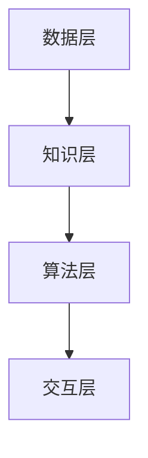
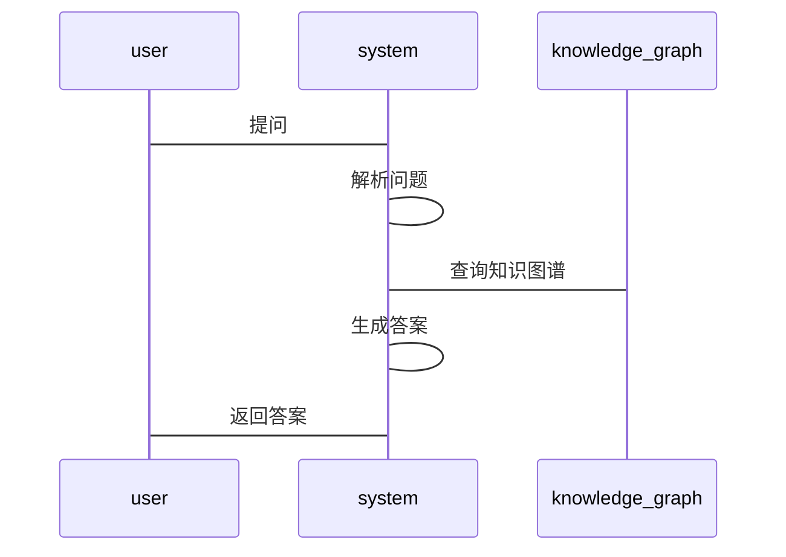

                 


# 构建AI Agent的知识图谱自动问答系统

> 关键词：AI Agent，知识图谱，自动问答系统，自然语言处理，问答系统，知识图谱构建

> 摘要：本文详细介绍了构建AI Agent的知识图谱自动问答系统的核心概念、算法原理、系统架构及实现方案。通过分析知识图谱、问答系统和AI Agent之间的关系，结合实际案例，展示如何利用知识图谱构建智能问答系统，并通过AI Agent实现智能化交互。文章还提供了详细的代码实现和系统设计，帮助读者从理论到实践全面掌握相关技术。

---

## 第1章: 知识图谱自动问答系统概述

### 1.1 问题背景

随着人工智能技术的快速发展，知识图谱和自动问答系统在多个领域得到了广泛应用。传统的问答系统基于规则或关键词匹配，难以处理复杂语义和长尾问题。而知识图谱作为一种结构化的知识表示方式，能够提供丰富的语义信息，为问答系统提供了更强大的语义理解能力。AI Agent作为智能体，能够进一步提升问答系统的交互能力和智能化水平。

#### 1.1.1 知识图谱的定义与特点
知识图谱是一种将实体及其关系以结构化形式表示的知识库。其特点包括：
- **结构化**：实体和关系以图结构表示，便于计算机理解和推理。
- **语义丰富**：通过实体间的关系，可以提供更准确的答案。
- **可扩展性**：支持大规模知识的构建和更新。

#### 1.1.2 自动问答系统的发展历程
自动问答系统经历了从基于规则到基于深度学习的转变：
- **早期阶段**：基于规则的问答系统，依赖关键词匹配。
- **发展阶段**：引入自然语言处理技术，支持语义理解。
- **现代阶段**：结合知识图谱和大语言模型，实现更智能的问答。

#### 1.1.3 AI Agent在智能问答中的作用
AI Agent作为智能体，能够：
- **主动交互**：根据用户需求主动获取信息。
- **上下文理解**：通过对话历史理解上下文，提供更精准的答案。
- **多轮对话**：支持多轮对话，提升用户体验。

### 1.2 问题描述

知识图谱自动问答系统的核心问题是如何利用结构化知识库提供准确、智能的问答服务。主要挑战包括：
- **知识表示**：如何高效表示和存储知识。
- **语义理解**：如何准确理解用户意图。
- **推理能力**：如何基于知识图谱进行推理。

### 1.3 问题解决

通过构建知识图谱和设计高效的问答算法，可以实现智能问答。AI Agent能够通过知识图谱进行推理，提供更智能的服务。

### 1.4 边界与外延

知识图谱的边界包括其存储的实体和关系，自动问答系统的适用范围主要为基于知识图谱的语义问答。AI Agent的应用场景包括智能客服、智能助手等。

### 1.5 概念结构与核心要素

知识图谱的核心要素包括实体、属性和关系。问答系统的核心要素包括输入处理、语义理解、知识查询和结果生成。AI Agent的核心要素包括感知、决策和交互。

---

## 第2章: 核心概念与联系

### 2.1 知识图谱的核心原理

知识图谱通过实体和关系构建结构化的知识网络。其实体包括节点和边，节点表示实体，边表示实体间的关系。

#### 2.1.1 实体与关系的定义
- 实体：知识图谱中的基本单元，例如“人名”、“地名”。
- 关系：实体之间的联系，例如“人名出生地为地名”。

#### 2.1.2 知识图谱的构建流程
1. 数据采集：从多种来源（如网页、数据库）获取数据。
2. 数据清洗：去除噪声数据，确保数据质量。
3. 数据抽取：从文本中提取实体和关系。
4. 数据存储：将实体和关系存储为结构化的数据。

#### 2.1.3 知识图谱的存储与查询
知识图谱通常存储在图数据库中，支持高效的图查询。

### 2.2 自动问答系统的原理

自动问答系统通过自然语言处理技术，将用户的问题映射到知识图谱中，获取答案。

#### 2.2.1 基于知识图谱的问答流程
1. 用户输入问题。
2. 系统解析问题，提取关键词。
3. 在知识图谱中查找相关实体和关系。
4. 返回答案。

#### 2.2.2 基于向量的问答机制
使用向量表示法，将问题和知识图谱中的实体进行对比，找到最相关的答案。

#### 2.2.3 基于规则的问答策略
通过预设规则，匹配问题到知识图谱中的特定路径。

### 2.3 AI Agent的核心原理

AI Agent通过感知环境、分析需求、执行任务，实现智能交互。

#### 2.3.1 AI Agent的定义与分类
- 定义：AI Agent是一种智能体，能够感知环境并执行任务。
- 分类：包括简单反射型、基于模型的反应型、目标驱动型和实用驱动型。

#### 2.3.2 AI Agent的感知与决策机制
- 感知：通过传感器或接口获取环境信息。
- 决策：基于知识图谱和上下文，生成行动方案。

#### 2.3.3 AI Agent的交互方式
- 多轮对话：通过上下文理解用户需求。
- 主动交互：根据知识图谱主动提供信息。

### 2.4 核心概念的联系

知识图谱为问答系统提供语义理解能力，问答系统为AI Agent提供交互能力，AI Agent通过知识图谱实现智能化服务。

---

## 第3章: 算法原理与实现

### 3.1 知识图谱中的实体链接算法

实体链接算法通过将文本中的实体映射到知识图谱中的实体，实现语义理解。

#### 3.1.1 实体链接算法步骤
1. 从文本中提取实体。
2. 在知识图谱中查找匹配的实体。
3. 计算相似度，选择最相关的实体。

#### 3.1.2 实体链接算法实现
```python
def entity_linking(text, knowledge_graph):
    entities = extract_entities(text)
    matched_entities = []
    for entity in entities:
        matches = knowledge_graph.find(entity)
        if matches:
            matched_entities.append(matches[0])
    return matched_entities
```

#### 3.1.3 实体链接算法的数学模型
实体相似度计算公式：
$$
similarity = \frac{1}{1 + d}
$$
其中，d是实体间的距离。

### 3.2 自动问答系统中的意图理解算法

意图理解算法通过分析用户问题，确定其意图。

#### 3.2.1 意图理解算法步骤
1. 分词和词性标注。
2. 识别关键词和关系。
3. 匹配到知识图谱中的实体和关系。

#### 3.2.2 意图理解算法实现
```python
def intent_understanding(text, knowledge_graph):
    tokens = tokenize(text)
    intent = find_intent(tokens)
    entities = extract_entities(tokens)
    return find_answers(knowledge_graph, entities, intent)
```

#### 3.2.3 意图理解算法的数学模型
意图相似度计算公式：
$$
similarity = \sum_{i=1}^{n} w_i \cdot f(word_i)
$$
其中，w_i是关键词的权重，f(word_i)是词向量。

---

## 第4章: 系统分析与架构设计

### 4.1 项目介绍

知识图谱自动问答系统旨在利用知识图谱构建智能问答服务，结合AI Agent实现智能化交互。

### 4.2 系统功能设计

系统功能模块包括：
- 数据采集与处理：从多种来源采集数据，清洗和抽取实体。
- 知识图谱构建：构建和存储知识图谱。
- 问答系统实现：实现问题解析、知识查询和答案生成。
- AI Agent交互：支持多轮对话和主动交互。

### 4.3 系统架构设计

系统架构包括数据层、知识层、算法层和交互层。数据层负责数据存储，知识层负责知识图谱构建，算法层负责实体链接和意图理解，交互层负责用户交互。

#### 4.3.1 系统架构图


### 4.4 系统接口设计

系统接口包括：
- 数据接口：用于数据采集和存储。
- 知识图谱接口：用于实体查询和关系查询。
- 问答接口：用于问题解析和答案生成。
- AI Agent接口：用于多轮对话和主动交互。

### 4.5 系统交互流程

用户输入问题，系统解析问题，查询知识图谱，返回答案。

#### 4.5.1 交互流程图


---

## 第5章: 项目实战

### 5.1 环境安装

安装必要的依赖：
- 图数据库：Neo4j
- 自然语言处理库：spaCy
- 问答系统库：Falcon

### 5.2 核心代码实现

#### 5.2.1 知识图谱构建代码
```python
from neo4j import GraphDatabase

class KnowledgeGraph:
    def __init__(self, uri, user, password):
        self.driver = GraphDatabase.driver(uri, auth=(user, password))
    
    def add_entity(self, entity):
        # 实体添加代码
        pass
    
    def add_relation(self, entity1, relation, entity2):
        # 关系添加代码
        pass
```

#### 5.2.2 问答系统实现代码
```python
def answer_question(question, knowledge_graph):
    entities = extract_entities(question)
    relations = extract_relations(question)
    answers = knowledge_graph.query(entities, relations)
    return answers
```

### 5.3 代码解读与分析

详细解读核心代码的功能和实现逻辑，分析代码的优缺点。

### 5.4 实际案例分析

通过具体案例，展示系统的实际应用和效果。

---

## 第6章: 最佳实践与小结

### 6.1 最佳实践

- 知识图谱构建：确保数据质量和完整性。
- 问答系统优化：结合多种算法提高准确率。
- AI Agent设计：注重交互设计和用户体验。

### 6.2 小结

本文详细介绍了构建AI Agent的知识图谱自动问答系统的各个方面，从理论到实践，全面阐述了系统的构建过程。通过实际案例分析，展示了系统的实际应用和效果。

### 6.3 注意事项

- 知识图谱构建需要大量时间和资源。
- 问答系统需要结合具体场景进行优化。
- AI Agent的设计需要考虑用户体验和交互逻辑。

### 6.4 拓展阅读

推荐相关书籍和论文，帮助读者进一步学习和研究。

---

## 作者：AI天才研究院 & 禅与计算机程序设计艺术

