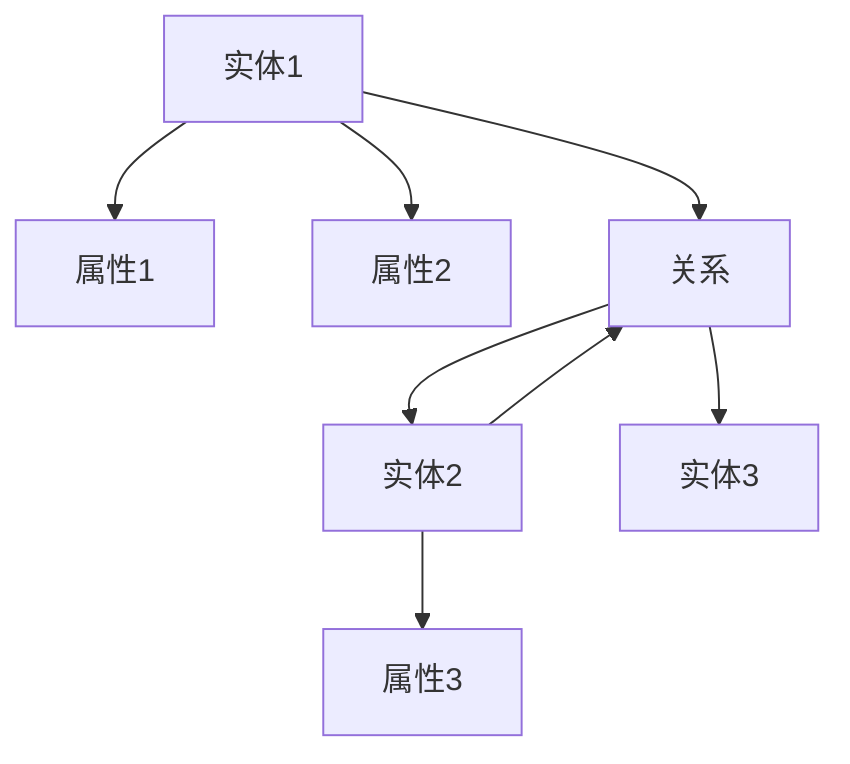
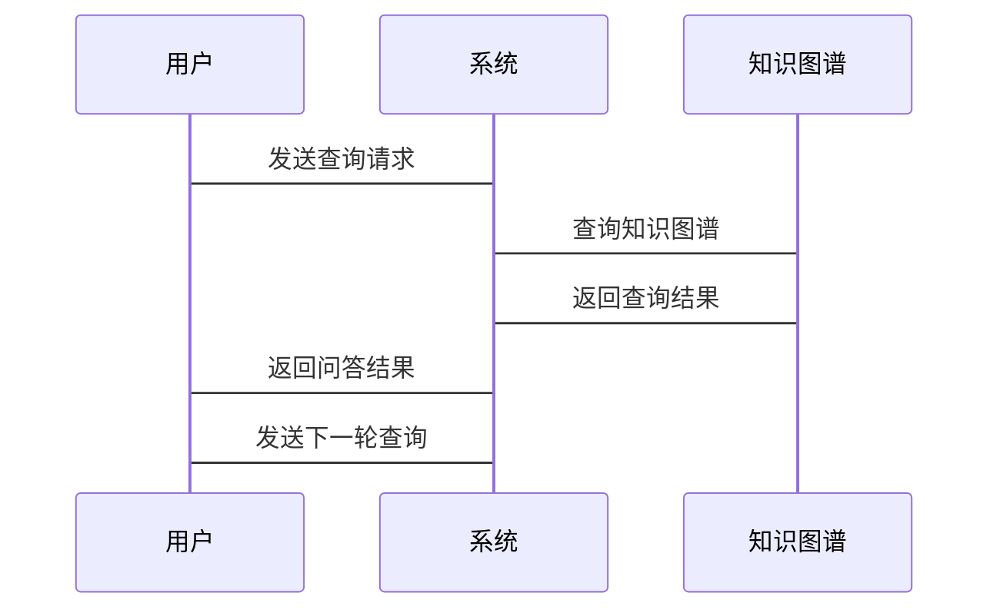

                 


# 构建AI Agent的知识图谱问答系统优化

> 关键词：知识图谱，问答系统，AI Agent，智能问答，系统优化

> 摘要：本文详细探讨了如何构建基于知识图谱的AI Agent智能问答系统，并从算法原理、系统架构、项目实现等多个维度进行深入分析。通过理论与实践结合，结合具体的案例分析，帮助读者全面理解如何优化知识图谱问答系统，构建高效、智能的问答解决方案。

---

## 第一部分: 构建AI Agent的知识图谱问答系统背景与基础

### 第1章: 知识图谱问答系统概述

#### 1.1 问题背景
- 当前问答系统面临的挑战：
  - 数据稀疏性问题
  - 知识表示的不一致性
  - 多轮对话中的上下文理解问题
- 知识图谱在问答系统中的作用：
  - 提供结构化的知识表示
  - 支持语义理解与推理
  - 优化问答系统的准确率与响应速度
- AI Agent在问答系统中的定位与价值：
  - 作为智能助手，提供个性化的问答服务
  - 通过知识图谱实现意图识别与对话管理

#### 1.2 问题描述
- 知识图谱问答系统的定义：
  - 基于知识图谱的智能问答系统，结合自然语言处理技术，提供精准的知识检索与推理服务。
- 系统的核心功能与目标：
  - 提供基于知识图谱的问答服务
  - 支持多轮对话的上下文理解
  - 实现基于知识图谱的意图识别与对话管理
- 系统的边界与外延：
  - 边界：专注于知识图谱的构建与应用，不涉及外部数据源的整合。
  - 外延：可扩展至智能客服、教育问答、医疗咨询等领域。

#### 1.3 问题解决思路
- 知识图谱构建与应用：
  - 数据抽取、实体识别、关系抽取等技术
  - 知识图谱的存储与查询优化
- AI Agent的智能问答机制：
  - 多轮对话的上下文管理
  - 基于知识图谱的意图识别与对话策略
- 系统优化的必要性与方向：
  - 知识图谱的动态更新与维护
  - 问答系统性能的优化与提升
  - AI Agent的智能性与用户体验的提升

---

### 第2章: 知识图谱与问答系统核心概念

#### 2.1 核心概念原理
- 知识图谱的定义与特点：
  - 知识图谱是一种结构化的知识表示形式，由实体、属性和关系组成。
  - 特点：语义丰富、结构清晰、可扩展性强。
- 问答系统的分类与工作原理：
  - 基于规则的问答系统
  - 基于统计的问答系统
  - 基于深度学习的问答系统
- AI Agent的智能问答机制：
  - 基于知识图谱的意图识别
  - 多轮对话的上下文理解
  - 基于强化学习的对话策略

#### 2.2 核心概念属性对比
| 比较维度 | 知识图谱 | 问答系统 | AI Agent |
|----------|----------|----------|----------|
| 核心功能 | 实体识别与关系抽取 | 提供问答服务 | 智能问答与对话管理 |
| 技术特点 | 结构化知识表示 | 语义理解与匹配 | 多轮对话与上下文管理 |
| 应用场景 | 智能搜索、知识库构建 | 智能客服、教育问答 | 智能助手、虚拟对话 |

#### 2.3 ER实体关系图架构


---

## 第二部分: 知识图谱问答系统的算法原理

### 第3章: 知识图谱构建与优化算法

#### 3.1 知识抽取与表示
- 实体识别与关系抽取：
  - 使用自然语言处理技术（如NER）进行实体识别。
  - 基于依存句法分析进行关系抽取。
- 知识表示的向量空间模型：
  - 使用Word2Vec或GloVe进行词向量表示。
  - 基于图嵌入（Graph Embedding）进行实体和关系的向量化表示。
- 知识图谱的构建流程：
  1. 数据清洗与预处理。
  2. 实体识别与关系抽取。
  3. 知识图谱的存储与索引。

#### 3.2 知识融合与优化
- 知识融合的算法原理：
  - 使用图匹配算法（Graph Matching）进行实体对齐。
  - 基于相似度计算（如余弦相似度）进行知识融合。
- 知识图谱的优化方法：
  - 去除冗余节点与关系。
  - 增加层次化结构，优化查询效率。
- 知识图谱的质量评估：
  - 评估指标：覆盖率、准确性、完整性。
  - 基于反馈机制进行质量优化。

---

### 第4章: 问答系统的核心算法

#### 4.1 基于知识图谱的问答算法
- 基于向量的相似度计算：
  - 使用余弦相似度或欧氏距离进行相似度计算。
  - 示例代码：
    ```python
    def cosine_similarity(vector1, vector2):
        return np.dot(vector1, vector2) / (np.linalg.norm(vector1) * np.linalg.norm(vector2))
    ```
- 基于图结构的路径搜索：
  - 使用广度优先搜索（BFS）或深度优先搜索（DFS）进行路径搜索。
  - 示例代码：
    ```python
    def bfs(start, end, graph):
        queue = deque()
        queue.append(start)
        visited = set()
        visited.add(start)
        while queue:
            node = queue.popleft()
            if node == end:
                return True
            for neighbor in graph[node]:
                if neighbor not in visited:
                    visited.add(neighbor)
                    queue.append(neighbor)
        return False
    ```
- 基于深度学习的问答模型：
  - 使用预训练语言模型（如BERT）进行问答匹配。
  - 示例代码：
    ```python
    import transformers
    model = transformers.BertForQuestionAnswering.from_pretrained('bert-large-uncased-whole-word-masks')
    tokenizer = transformers.BertTokenizer.from_pretrained('bert-large-uncased-whole-word-masks')
    inputs = tokenizer.encode_plus(question, context, add_special_tokens=True, return_tensors='pt')
    outputs = model(**inputs)
    ```

#### 4.2 AI Agent的智能问答机制
- 多轮对话的上下文理解：
  - 使用序列模型（如LSTM或Transformer）进行上下文表示。
  - 示例代码：
    ```python
    import torch
    input_seq = torch.randn(1, seq_length, hidden_size)
    lstm = torch.nn.LSTM(input_size=hidden_size, hidden_size=hidden_size)
    outputs, (h_n, c_n) = lstm(input_seq)
    ```
- 基于知识图谱的意图识别：
  - 使用分类模型（如SVM或随机森林）进行意图分类。
  - 示例代码：
    ```python
    from sklearn.svm import SVC
    model = SVC()
    model.fit(X_train, y_train)
    y_pred = model.predict(X_test)
    ```
- 基于强化学习的对话策略：
  - 使用Q-Learning或Deep Q-Network进行对话策略优化。
  - 示例代码：
    ```python
    import numpy as np
    q_table = np.zeros((state_space, action_space))
    def update_q_table(state, action, reward, next_state, alpha, gamma):
        q_table[state, action] = (1 - alpha) * q_table[state, action] + alpha * (reward + gamma * np.max(q_table[next_state]))
    ```

---

## 第三部分: 知识图谱问答系统的系统架构与设计

### 第5章: 系统分析与架构设计

#### 5.1 问题场景介绍
- 系统目标与功能需求：
  - 提供基于知识图谱的问答服务。
  - 支持多轮对话的上下文理解。
  - 实现基于知识图谱的意图识别与对话管理。
- 系统的输入输出分析：
  - 输入：用户查询、知识图谱数据。
  - 输出：问答结果、对话历史记录。
- 系统的性能指标与约束：
  - 响应时间：<= 2秒。
  - 系统可扩展性：支持大规模数据扩展。

#### 5.2 系统功能设计
- 知识图谱构建模块：
  - 数据抽取、实体识别、关系抽取。
  - 知识图谱的存储与索引。
- 问答系统核心模块：
  - 用户查询解析。
  - 基于知识图谱的意图识别。
  - 多轮对话的上下文管理。

#### 5.3 系统架构设计


#### 5.4 系统接口设计
- 输入接口：
  - REST API：POST /query，接收用户查询。
  - WebSocket：实时通信接口。
- 输出接口：
  - JSON格式：返回问答结果。
  - 日志记录：记录对话历史。

#### 5.5 系统交互流程


---

## 第四部分: 知识图谱问答系统的项目实战

### 第6章: 项目实现与案例分析

#### 6.1 环境安装
- 安装必要的依赖：
  ```bash
  pip install numpy transformers networkx
  ```
- 安装知识图谱构建工具：
  ```bash
  pip install networkx
  ```

#### 6.2 核心代码实现
- 知识图谱构建：
  ```python
  import networkx as nx
  G = nx.DiGraph()
  G.add_edge("实体1", "属性1")
  G.add_edge("实体1", "关系", "实体2")
  G.add_edge("实体2", "属性2")
  ```
- 问答系统实现：
  ```python
  from transformers import BertTokenizer, BertModel
  tokenizer = BertTokenizer.from_pretrained('bert-base-cased')
  model = BertModel.from_pretrained('bert-base-cased')
  inputs = tokenizer.encode_plus("问题", "上下文", return_tensors="pt")
  outputs = model(**inputs)
  ```

#### 6.3 案例分析与解读
- 案例分析：
  - 查询问题：基于知识图谱，找到实体1的相关属性。
  - 实体识别与关系抽取。
  - 返回问答结果：实体1的属性列表。

#### 6.4 项目小结
- 知识图谱问答系统的实现步骤：
  1. 知识图谱的构建与优化。
  2. 问答系统的核心算法实现。
  3. 系统架构设计与接口实现。

---

## 第五部分: 知识图谱问答系统的优化与展望

### 第7章: 优化与展望

#### 7.1 最佳实践 tips
- 知识图谱的动态更新与维护：
  - 定期更新知识图谱数据。
  - 基于用户反馈优化问答结果。
- 系统性能优化：
  - 使用分布式架构优化查询性能。
  - 基于缓存技术优化问答响应速度。
- 系统安全性优化：
  - 数据加密与访问控制。
  - 防止数据泄露与滥用。

#### 7.2 小结
- 知识图谱问答系统的核心价值：
  - 提供精准的知识检索与推理服务。
  - 支持多轮对话的上下文理解。
  - 实现基于知识图谱的意图识别与对话管理。
- 系统优化的关键点：
  - 知识图谱的动态更新与维护。
  - 系统性能优化与用户体验提升。

#### 7.3 注意事项
- 知识图谱的构建与应用：
  - 注意数据质量与知识覆盖范围。
  - 建立有效的反馈机制优化知识图谱。
- 问答系统的设计与实现：
  - 注意上下文理解的准确性。
  - 优化对话策略提升用户体验。

#### 7.4 拓展阅读
- 推荐书籍：
  - 《知识图谱：概念、方法与应用》
  - 《深度学习与自然语言处理》
- 推荐论文：
  - "Question Answering over Knowledge Graphs: An Overview"
  - "Deep Learning for问答系统"

---

## 作者：AI天才研究院/AI Genius Institute & 禅与计算机程序设计艺术 /Zen And The Art of Computer Programming

---

以上是文章的完整目录和部分核心内容。如果需要更详细的内容或代码示例，可以根据具体需求进一步扩展。

