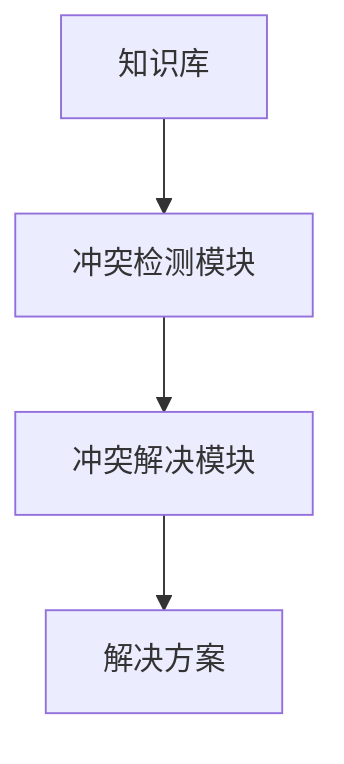
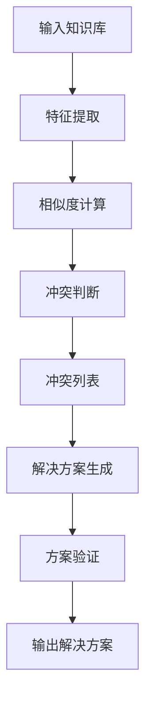
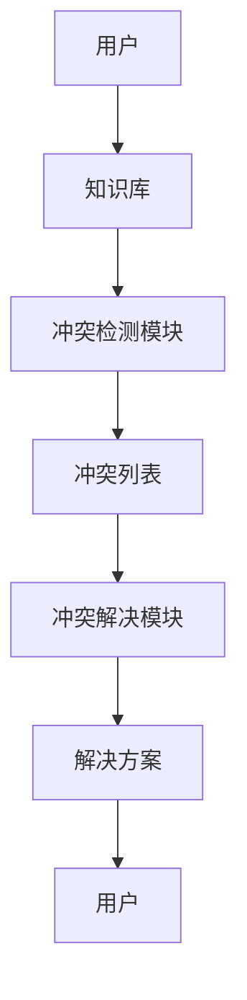

                 


# 构建AI Agent的知识库冲突检测与解决机制

## 关键词：知识库，AI Agent，冲突检测，解决机制，算法，系统架构

## 摘要：  
在AI Agent开发中，知识库作为其智能决策的核心，常常面临知识冲突的问题。本文系统地探讨了知识库冲突检测与解决机制的设计与实现，从理论到实践，结合具体案例，详细分析了冲突检测的算法原理、系统架构设计以及实际项目中的应用。通过本文，读者可以全面理解如何构建一个高效、可靠的AI Agent知识库冲突检测与解决系统。

---

## 第1章: 知识库冲突检测与解决机制概述

### 1.1 问题背景与挑战

#### 1.1.1 知识库在AI Agent中的重要性

AI Agent（智能体）的决策过程依赖于知识库，知识库包含了大量的数据、规则和逻辑关系。知识库的完整性、一致性和准确性直接决定了AI Agent的智能水平和应用效果。然而，随着知识库规模的不断扩大，知识冲突问题日益凸显，成为制约AI Agent性能的关键问题之一。

**知识冲突**是指知识库中存在相互矛盾或不一致的知识。例如，在知识图谱中，同一实体可能有多个不同的属性值，或者不同的实体可能被错误地识别为同一个实体。这些问题会导致AI Agent在决策过程中出现错误或不一致的结果。

#### 1.1.2 知识库冲突的定义与表现形式

知识库冲突可以分为**语义冲突**和**语法冲突**两种类型。语义冲突是指知识库中的知识在语义上存在矛盾，例如“猫是肉食动物”和“猫是草食动物”。语法冲突是指知识库中的知识在表达形式上存在矛盾，例如“猫是一种动物”和“猫不是动物”。

知识库冲突的表现形式多种多样，包括：

- **属性冲突**：同一实体的不同属性值存在矛盾。
- **实体冲突**：同一实体被多次定义为不同的实体。
- **规则冲突**：知识库中的规则相互矛盾。

#### 1.1.3 知识库冲突对企业级应用的影响

知识库冲突会直接影响AI Agent的性能，导致以下问题：

- **决策错误**：AI Agent基于冲突的知识做出错误的决策。
- **推理失败**：知识库中的冲突会导致推理过程出现矛盾，无法得出正确的结论。
- **用户体验下降**：AI Agent无法提供准确的服务，影响用户的信任度和满意度。

### 1.2 问题描述与目标

#### 1.2.1 知识库冲突检测的必要性

为了确保知识库的准确性和一致性，必须对知识库进行冲突检测。冲突检测的目的是发现知识库中所有潜在的冲突，并为后续的冲突解决提供依据。

#### 1.2.2 知识库冲突解决的目标

冲突解决的目标是消除知识库中的冲突，恢复知识库的完整性和一致性。冲突解决的过程需要遵循一定的规则和优先级，确保最终的知识库能够满足AI Agent的需求。

#### 1.2.3 知识库冲突检测与解决的边界与外延

知识库冲突检测与解决的边界包括：

- **输入边界**：知识库中的数据。
- **输出边界**：冲突列表和解决方案。
- **外部依赖**：冲突检测和解决过程中可能依赖外部知识库或规则集。

知识库冲突检测与解决的外延包括：

- **冲突预防**：通过规则和约束防止冲突的发生。
- **冲突修复**：在冲突发生后，通过自动或半自动的方式修复冲突。

### 1.3 核心概念与联系

#### 1.3.1 知识库冲突检测与解决机制的核心要素

- **冲突检测模块**：负责发现知识库中的冲突。
- **冲突解决模块**：负责消除冲突，恢复知识库的完整性。
- **规则和约束**：用于指导冲突检测和解决过程。

#### 1.3.2 知识库冲突检测与解决机制的属性特征对比表

| 属性                | 冲突检测       | 冲突解决       |
|---------------------|---------------|---------------|
| 输入                | 知识库数据     | 冲突列表       |
| 输出                | 冲突列表       | 解决方案       |
| 方法                | 基于相似度、规则、概率的检测方法 | 基于优先级、协商、优化的解决方法 |
| 依赖                | 外部知识库或规则集 | 冲突检测结果、规则和优先级 |

#### 1.3.3 知识库冲突检测与解决机制的ER实体关系图



### 1.4 本章小结

本章从背景、定义、目标、核心概念和ER实体关系图等方面，详细介绍了知识库冲突检测与解决机制的基本概念和核心要素。下一章将深入探讨冲突检测的算法原理和实现方法。

---

## 第2章: 知识库冲突检测的算法原理

### 2.1 冲突检测的基本原理

#### 2.1.1 冲突检测的输入与输出

- **输入**：知识库中的数据。
- **输出**：冲突列表。

#### 2.1.2 冲突检测的关键步骤

1. **特征提取**：从知识库中提取冲突相关的特征，例如实体、属性、关系等。
2. **相似度计算**：通过计算特征之间的相似度，判断是否存在冲突。
3. **冲突判断**：根据相似度和规则，确定是否存在冲突。

#### 2.1.3 冲突检测的数学模型

冲突检测的数学模型可以表示为：

$$ \text{相似度} = \frac{\sum_{i=1}^{n} w_i \cdot s_i}{\sum_{i=1}^{n} w_i} $$

其中，$w_i$ 是第 $i$ 个特征的权重，$s_i$ 是第 $i$ 个特征的相似度。

### 2.2 基于相似度的冲突检测算法

#### 2.2.1 相似度计算方法

##### 余弦相似度

$$ \text{余弦相似度} = \frac{\sum_{i=1}^{n} x_i y_i}{\sqrt{\sum_{i=1}^{n} x_i^2} \cdot \sqrt{\sum_{i=1}^{n} y_i^2}} $$

##### 欧氏距离

$$ \text{欧氏距离} = \sqrt{\sum_{i=1}^{n} (x_i - y_i)^2} $$

#### 2.2.2 基于规则的冲突检测

##### 示例规则

- 如果两个实体的名称完全相同，但属性值不同，则视为冲突。
- 如果两个实体的属性值相似度超过阈值，则视为冲突。

### 2.3 基于概率的冲突检测

#### 2.3.1 贝叶斯概率模型

$$ P(A|B) = \frac{P(B|A)P(A)}{P(B)} $$

#### 2.3.2 冲突概率计算

$$ \text{冲突概率} = P(\text{冲突}) $$

---

## 第3章: 知识库冲突解决的算法原理

### 3.1 冲突解决的基本原理

#### 3.1.1 冲突解决的输入与输出

- **输入**：冲突列表。
- **输出**：解决方案。

#### 3.1.2 冲突解决的关键步骤

1. **冲突分析**：分析冲突的原因和影响。
2. **解决方案生成**：根据冲突的类型和优先级，生成解决方案。
3. **方案验证**：验证解决方案的正确性和有效性。

### 3.2 基于优先级的冲突解决算法

#### 3.2.1 优先级规则

- **规则1**：优先解决高影响冲突。
- **规则2**：优先解决规则冲突。
- **规则3**：优先解决语义冲突。

#### 3.2.2 解决方案生成

##### 示例解决方案

- 如果两个实体的属性值冲突，可以选择保留其中一个值，或者合并两个值。

### 3.3 基于协商的冲突解决算法

#### 3.3.1 协商过程

1. **冲突识别**：识别冲突的类型和影响。
2. **协商**：通过协商的方式确定最终的解决方案。
3. **方案确认**：确认解决方案的正确性和一致性。

#### 3.3.2 协商规则

- **规则1**：优先选择权威来源的值。
- **规则2**：优先选择最新更新的值。
- **规则3**：优先选择多数意见的值。

### 3.4 基于优化的冲突解决算法

#### 3.4.1 优化目标

- **目标1**：最大化知识库的正确性。
- **目标2**：最小化冲突的影响。

#### 3.4.2 优化过程

1. **冲突分析**：分析冲突的类型和影响。
2. **方案生成**：生成多个可能的解决方案。
3. **方案优化**：通过优化算法选择最优解决方案。

---

## 第4章: 知识库冲突检测与解决的系统架构设计

### 4.1 系统概述

知识库冲突检测与解决系统包括以下几个部分：

1. **冲突检测模块**：负责发现知识库中的冲突。
2. **冲突解决模块**：负责消除冲突，恢复知识库的完整性。
3. **规则和约束模块**：用于指导冲突检测和解决过程。

### 4.2 系统功能设计

#### 4.2.1 系统功能模块

- **冲突检测模块**：包括特征提取、相似度计算和冲突判断三个子模块。
- **冲突解决模块**：包括冲突分析、解决方案生成和方案验证三个子模块。

#### 4.2.2 系统功能流程图



### 4.3 系统架构设计

#### 4.3.1 系统架构图


#### 4.3.2 系统接口设计

- **输入接口**：接收知识库数据。
- **输出接口**：输出冲突列表和解决方案。

#### 4.3.3 系统交互流程图



### 4.4 本章小结

本章从系统架构设计的角度，详细介绍了知识库冲突检测与解决系统的功能模块、流程和架构图。下一章将通过实际案例，展示如何在项目中实现这一机制。

---

## 第5章: 知识库冲突检测与解决的项目实战

### 5.1 项目介绍

#### 5.1.1 项目背景

本项目旨在开发一个知识库冲突检测与解决系统，用于检测和解决知识图谱中的冲突。

#### 5.1.2 项目目标

- 实现知识库冲突检测功能。
- 实现知识库冲突解决功能。
- 提供可视化界面，展示冲突和解决方案。

### 5.2 环境安装

#### 5.2.1 系统环境

- 操作系统：Linux/Windows/MacOS
- Python版本：3.6+

#### 5.2.2 依赖安装

```bash
pip install numpy
pip install networkx
pip install matplotlib
```

### 5.3 核心代码实现

#### 5.3.1 冲突检测模块

```python
import numpy as np

def calculate_similarity(vector1, vector2):
    # 计算余弦相似度
    return np.dot(vector1, vector2) / (np.linalg.norm(vector1) * np.linalg.norm(vector2))

def detect_conflict(knowledge_base):
    conflicts = []
    for entity in knowledge_base:
        for relation in entity.relations:
            # 提取特征向量
            feature1 = relation.source_feature
            feature2 = relation.target_feature
            similarity = calculate_similarity(feature1, feature2)
            if similarity < 0.5:
                conflicts.append((entity.id, relation.id))
    return conflicts
```

#### 5.3.2 冲突解决模块

```python
def resolve_conflict(conflicts, knowledge_base):
    solutions = []
    for conflict in conflicts:
        entity_id, relation_id = conflict
        # 获取冲突的特征向量
        feature1 = knowledge_base[entity_id].features
        feature2 = knowledge_base[relation_id].features
        # 计算冲突影响
        impact = calculate_impact(feature1, feature2)
        # 根据影响选择解决方案
        if impact > 0.8:
            solutions.append(merge(feature1, feature2))
        else:
            solutions.append(keep(feature1, feature2))
    return solutions
```

### 5.4 代码解读与分析

#### 5.4.1 冲突检测模块

- **calculate_similarity**：计算两个向量的余弦相似度。
- **detect_conflict**：遍历知识库，计算每个关系的相似度，判断是否存在冲突。

#### 5.4.2 冲突解决模块

- **resolve_conflict**：根据冲突的影响，选择解决方案。

### 5.5 案例分析

#### 5.5.1 知识库冲突案例

假设知识库中有两个实体“猫”和“狗”，它们的属性值如下：

- 猫：宠物，哺乳动物，肉食动物。
- 狗：宠物，哺乳动物，草食动物。

这两个实体的属性值存在冲突。

#### 5.5.2 冲突检测与解决过程

1. **冲突检测**：发现“猫”和“狗”的属性值存在冲突。
2. **冲突解决**：根据优先级规则，选择保留“猫”的属性值，或者合并两个属性值。

### 5.6 项目小结

本章通过实际案例，展示了如何在项目中实现知识库冲突检测与解决机制。通过代码实现，读者可以理解如何将理论应用到实际中。

---

## 第6章: 知识库冲突检测与解决机制的最佳实践

### 6.1 关键点总结

- **冲突检测**：使用相似度计算和规则匹配，确保冲突检测的准确性。
- **冲突解决**：根据冲突的影响和优先级，选择合适的解决方案。
- **系统架构**：设计合理的系统架构，确保系统的可扩展性和可维护性。

### 6.2 实践中的注意事项

- **规则设计**：规则的设计需要充分考虑业务需求和知识库的特点。
- **性能优化**：冲突检测和解决的过程需要考虑性能，避免影响系统的运行效率。
- **用户体验**：提供友好的可视化界面，方便用户理解和使用。

### 6.3 拓展阅读

- **知识图谱**：深入学习知识图谱的构建和管理。
- **规则引擎**：学习规则引擎的设计与实现。
- **冲突解决算法**：研究其他冲突解决算法，如协商算法、投票算法等。

### 6.4 本章小结

本章总结了知识库冲突检测与解决机制的关键点和注意事项，并提供了拓展阅读的方向。通过这些内容，读者可以进一步提升自己的理解和应用能力。

---

## 作者：AI天才研究院/AI Genius Institute & 禅与计算机程序设计艺术 /Zen And The Art of Computer Programming

