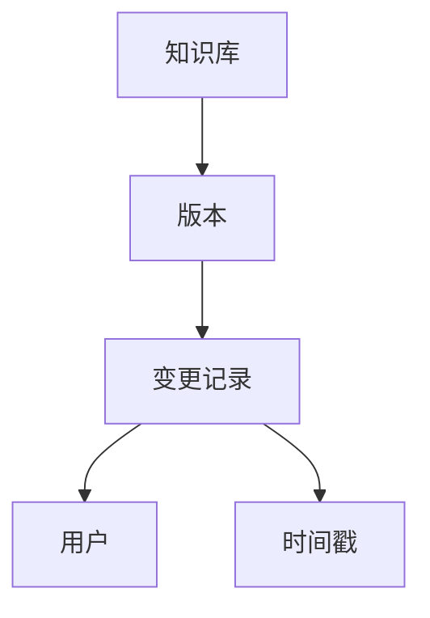
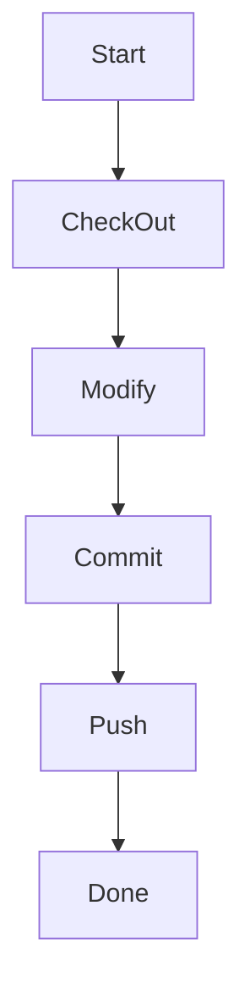
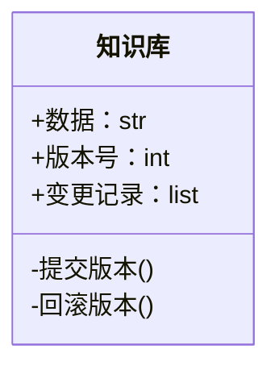
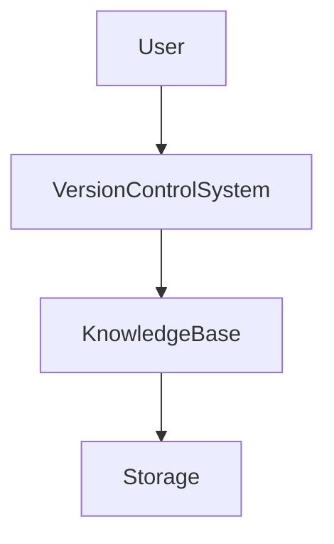

                 


# 构建AI Agent的知识库版本控制系统

## 关键词：知识库版本控制，AI Agent，系统架构设计，算法原理，项目实战

## 摘要：本文详细探讨了构建AI Agent的知识库版本控制系统的关键问题，包括背景分析、核心概念、算法实现、系统架构设计和项目实战。通过系统的分析和具体的案例，本文提出了构建AI Agent知识库版本控制系统的解决方案，并给出了实际的代码实现和应用案例。

---

# 第一部分: 构建AI Agent的知识库版本控制系统概述

## 第1章: 知识库版本控制的背景与问题背景

### 1.1 知识库版本控制的背景

#### 1.1.1 AI Agent与知识库的关系
AI Agent（人工智能代理）依赖于知识库来执行任务、做出决策和与环境交互。知识库是AI Agent的核心数据存储，包含了AI Agent所需的所有信息，包括规则、事实、策略和历史数据等。这些信息以结构化的形式存储，并通过AI Agent的推理引擎进行处理。

#### 1.1.2 知识库版本控制的必要性
AI Agent的知识库是一个动态变化的系统，需要不断更新和优化。然而，知识库的更新可能会导致数据的不一致性和可追溯性的缺失。为了确保知识库的正确性和可追溯性，版本控制是必不可少的。版本控制能够记录知识库的变化历史，支持回滚和分支开发，从而保证知识库的稳定性和可靠性。

#### 1.1.3 当前知识库管理的挑战
当前的知识库管理面临以下挑战：
1. **动态更新**：知识库需要频繁更新以适应环境的变化，但更新过程中可能出现数据冲突和不一致。
2. **版本追溯**：在复杂的应用场景中，需要追溯到特定版本的知识库状态，以便定位问题和优化性能。
3. **可扩展性**：知识库规模可能非常庞大，版本控制系统的性能和扩展性需要足够强。

### 1.2 问题背景与问题描述

#### 1.2.1 AI Agent知识库的动态更新需求
AI Agent需要根据外部环境的变化和内部推理的结果不断更新知识库。例如，智能客服系统需要根据用户的反馈不断优化知识库中的FAQ内容；自动驾驶系统需要根据实时传感器数据更新环境模型。

#### 1.2.2 知识库版本控制的核心问题
知识库版本控制的核心问题包括：
1. **版本记录**：如何记录知识库的每一次变化，并保证记录的完整性和准确性。
2. **版本回滚**：如何在出现问题时快速回滚到之前的版本。
3. **版本冲突**：如何处理多个用户或模块对知识库的并发修改导致的冲突。

#### 1.2.3 知识库版本控制的边界与外延
知识库版本控制的边界包括：
1. **知识库的范围**：明确知识库的边界，确保版本控制只针对特定的数据范围。
2. **版本控制的粒度**：确定版本控制的粒度，是针对整个知识库还是部分模块。
3. **版本控制的参与者**：明确参与版本控制的用户或模块。

---

## 第2章: 知识库版本控制的核心概念与联系

### 2.1 核心概念原理

#### 2.1.1 知识库版本控制的基本原理
知识库版本控制的基本原理与传统的代码版本控制类似，但有一些特殊性。传统的版本控制系统（如Git）主要处理代码文件的版本，而知识库版本控制需要处理的是结构化的数据和知识图谱。知识库版本控制需要考虑数据的语义和关联关系，确保版本变化不会破坏数据的完整性。

#### 2.1.2 版本控制与知识库管理的结合
版本控制与知识库管理的结合需要考虑以下方面：
1. **数据建模**：如何将知识库中的数据建模为适合版本控制的格式。
2. **版本记录**：如何记录知识库的每次修改，并生成对应的版本号。
3. **版本依赖**：如何处理知识库中不同部分之间的依赖关系，确保版本的兼容性。

### 2.2 核心概念属性对比表

| **属性**         | **传统代码版本控制**                     | **知识库版本控制**                          |
|------------------|-----------------------------------------|--------------------------------------------|
| **数据类型**     | 文本文件、代码文件等                     | 结构化数据、知识图谱、数据库等              |
| **变更粒度**     | 单个文件或代码块                        | 整个知识库或部分模块                      |
| **依赖关系**     | 文件之间的依赖关系                     | 数据之间的语义依赖关系                      |
| **版本冲突**     | 文件内容的冲突                         | 数据语义的冲突                             |

### 2.3 ER实体关系图



---

## 第3章: 知识库版本控制的算法原理

### 3.1 分布式版本控制算法

#### 3.1.1 Git的实现原理
Git是一种分布式版本控制系统，采用基于内容的分层存储结构。每个版本的提交都是一个树状结构，包含了文件的元数据和内容。Git通过生成唯一的提交哈希来标识每个版本，并通过分支和标签来管理不同的版本。

#### 3.1.2 分布式版本控制在知识库中的应用
在知识库版本控制中，分布式版本控制系统可以提供以下优势：
1. **去中心化**：避免单点故障，提高系统的容错性和可用性。
2. **高效协作**：支持多人协作开发，减少冲突和协调成本。
3. **快速恢复**：通过版本回滚和分支操作，快速恢复到稳定版本。

### 3.2 知识库版本控制算法

#### 3.2.1 知识库版本控制的流程图



#### 3.2.2 算法实现代码示例

```python
def commit_changes(data, version):
    # 生成唯一的提交哈希
    hash = generate_hash(data)
    # 记录提交的版本号
    version_number = version + 1
    # 更新版本控制系统
    update_repository(data, version_number, hash)
    return version_number, hash
```

### 3.3 数学公式与模型

#### 3.3.1 版本哈希函数
版本哈希函数用于生成每个版本的唯一标识符。常见的哈希函数包括MD5、SHA-1和SHA-256等。

$$ hash = H(data) $$

其中，H是哈希函数，data是当前版本的数据。

#### 3.3.2 版本依赖关系模型
版本依赖关系模型用于表示不同版本之间的依赖关系。可以通过有向图来表示版本之间的依赖关系，其中每个节点代表一个版本，边表示依赖关系。

$$ D = (V, E) $$

其中，V是版本集合，E是依赖关系边的集合。

---

## 第4章: 知识库版本控制的系统架构设计

### 4.1 问题场景介绍

#### 4.1.1 知识库版本控制的典型场景
AI Agent的知识库版本控制需要处理以下典型场景：
1. **在线更新**：AI Agent需要实时更新知识库以适应环境变化。
2. **历史回溯**：需要回溯到特定时间点的知识库状态，以便分析问题。
3. **多用户协作**：多个开发人员或模块需要协作更新知识库。

#### 4.1.2 系统需要解决的核心问题
1. **高效存储**：如何高效存储和检索知识库的各个版本。
2. **版本冲突**：如何处理多个用户对知识库的并发修改导致的冲突。
3. **性能优化**：如何优化版本控制系统的性能，使其能够支持大规模的知识库。

### 4.2 系统功能设计

#### 4.2.1 领域模型设计



#### 4.2.2 系统架构设计



### 4.3 系统架构设计

#### 4.3.1 系统

---

作者：AI天才研究院/AI Genius Institute & 禅与计算机程序设计艺术 /Zen And The Art of Computer Programming

