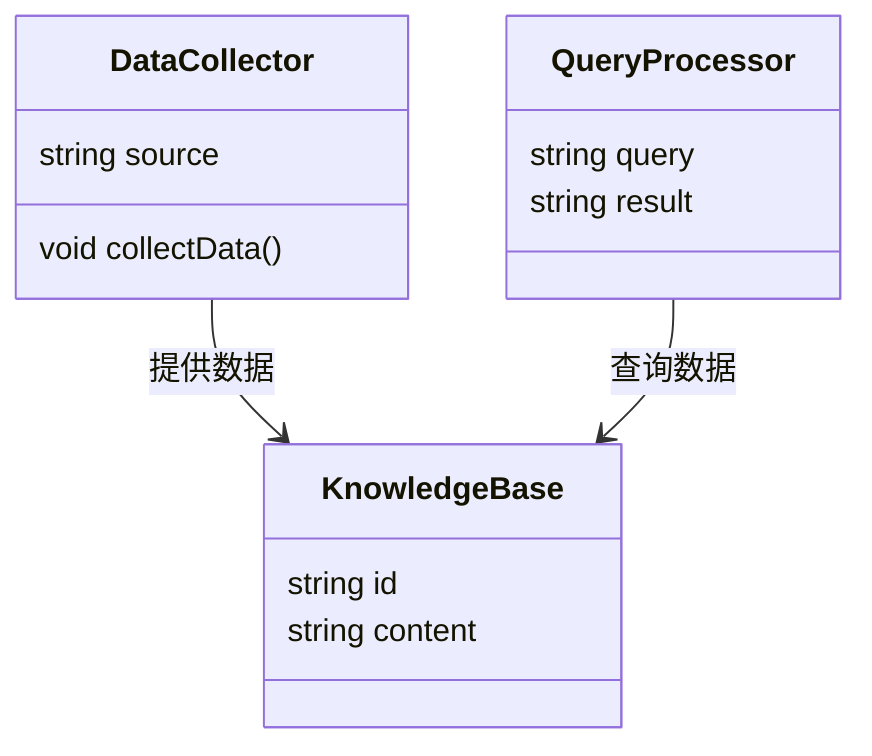

                 


# 《构建AI Agent的知识库：数据收集与组织》

---

## 关键词：
AI Agent, 知识库, 数据收集, 数据组织, 算法原理, 系统架构, 项目实战

---

## 摘要：
本文详细探讨构建AI Agent知识库的核心过程，重点分析数据收集与组织的方法。从知识库的背景到数据收集的算法原理，再到系统架构设计和项目实战案例，全面解析知识库构建的关键步骤与技术细节。文章通过实际案例分析和系统设计，帮助读者掌握高效构建AI Agent知识库的能力。

---

# 正文

## 第1章 知识库构建的背景与问题背景

### 1.1 知识库在AI Agent中的作用
AI Agent需要依赖知识库来理解和执行任务，知识库是其智能决策的基础。知识库的核心概念包括知识表示、存储机制和更新维护。应用场景广泛，如问答系统、推荐系统和智能助手。构建知识库的必要性在于提升AI Agent的智能性和响应速度，但同时也面临数据质量、隐私保护等挑战。

### 1.2 数据收集与组织的背景
数据是AI Agent的核心资源，数据收集的重要性体现在其质量和多样性。数据收集过程中常见的问题包括数据冗余、噪声和不一致性，解决方案涉及数据清洗和预处理。知识库组织的目标是结构化存储，使其便于查询和更新。

---

## 第2章 知识库构建的核心概念与联系

### 2.1 知识库的核心概念
知识表示是将信息转化为计算机可理解的形式，常用方法包括符号逻辑和语义网络。知识库的存储机制涉及数据库和知识图谱，更新维护需要定期添加新数据并修正错误。

### 2.2 核心概念的对比分析
知识表示与数据结构的区别在于，知识表示强调语义，而数据结构注重组织方式。数据结构与存储机制的关系是，数据结构决定存储方式。知识库与数据库的区别在于，知识库更注重语义连接，而数据库强调事务处理。

### 2.3 ER实体关系图
```mermaid
erDiagram
    actor User {
        +string id
        +string name
    }
    actor DataCollector {
        +string id
        +string source
    }
    actor KnowledgeBase {
        +string id
        +string content
    }
    User --> KnowledgeBase : 查询
    DataCollector --> KnowledgeBase : 提供数据
```

---

## 第3章 数据收集的算法原理与实现

### 3.1 数据收集的算法原理
数据收集的算法包括爬虫技术、数据清洗和特征提取。爬虫技术通过HTTP请求获取网页内容，数据清洗去除噪声，特征提取利用TF-IDF方法。

### 3.2 爬虫技术实现
```python
import requests

url = 'https://example.com'
response = requests.get(url)
print(response.text)
```

特征提取的数学模型：
$$ TF-IDF(t) = \frac{tf(t)}{idf(t)} $$

---

## 第4章 系统分析与架构设计

### 4.1 系统问题场景
知识库构建涉及多源数据收集和异构数据整合，系统需具备高扩展性和容错性。

### 4.2 系统功能设计
领域模型类图展示知识表示和存储模块的关系：


### 4.3 系统架构设计
系统架构图展示模块间的交互：
```mermaid
client --> KnowledgeBase: 查询
client --> DataCollector: 请求数据
DataCollector --> KnowledgeBase: 更新数据
```

---

## 第5章 项目实战：知识库构建案例分析

### 5.1 案例选择与环境配置
选择问答系统作为案例，环境配置包括Python和相关库的安装。

### 5.2 数据收集与预处理
使用爬虫收集数据，清洗并提取关键词。

### 5.3 模型训练与结果分析
训练分类模型，评估准确率和召回率。

---

## 第6章 最佳实践与未来展望

### 6.1 总结
知识库构建的关键在于数据质量、算法选择和系统设计。未来发展方向包括结合大模型和分布式存储，提升知识库的智能化和可扩展性。

---

## 作者信息
作者：AI天才研究院 & 禅与计算机程序设计艺术

---

以上是文章的详细结构和内容，确保每一部分都涵盖必要的技术细节和实际案例，帮助读者全面理解AI Agent知识库的构建过程。

