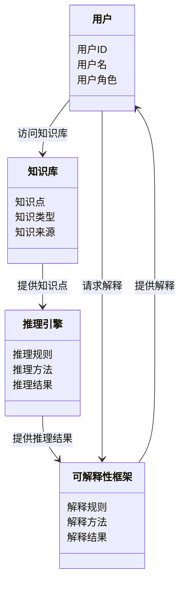
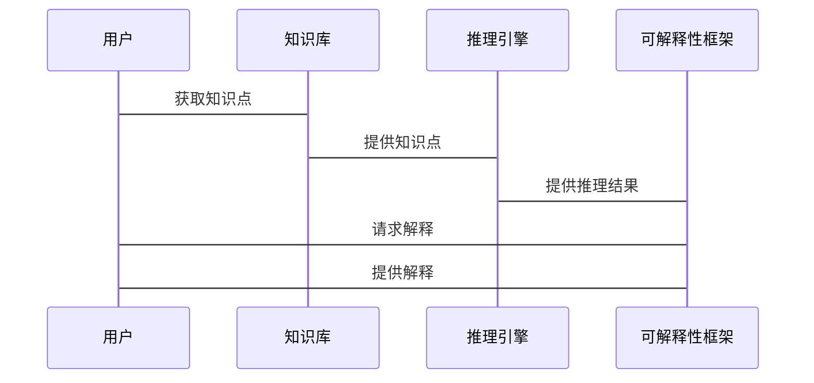

                 


# 构建AI Agent的知识推理可解释性框架

> 关键词：AI Agent，知识推理，可解释性框架，符号逻辑推理，概率推理，类比推理

> 摘要：本文系统地探讨了构建具备知识推理能力的AI Agent的可解释性框架。文章首先介绍了问题背景和定义，详细讲解了知识推理与可解释性框架的核心概念，接着分析了相关的算法原理，设计了系统的架构方案，提供了实际项目实现和案例分析，并展望了未来的发展趋势和注意事项。通过本文的学习，读者将能够全面理解并掌握AI Agent的知识推理可解释性框架的设计方法和实现技巧。

---

## 第一部分: 构建AI Agent的知识推理可解释性框架背景介绍

### 第1章: 问题背景与定义

#### 1.1 问题背景
在当前AI Agent的发展中，知识推理是实现智能决策的核心能力。然而，现有的AI Agent在知识推理过程中往往缺乏可解释性，导致用户对决策过程缺乏信任，限制了其在实际应用中的推广。本文旨在探讨如何构建一个具备知识推理能力的AI Agent，并设计一个可解释性框架，以提升AI Agent的透明度和可信度。

#### 1.2 问题定义
知识推理是指通过逻辑推理或概率推理等方法，从已知的知识库中推导出新的结论的过程。可解释性框架则是指通过某种机制，将AI Agent的推理过程和决策结果转化为人类可理解的形式。本文的目标是设计一个能够实现知识推理的AI Agent，并构建一个可解释性框架，以展示推理过程和决策依据。

#### 1.3 问题特点
- 知识推理需要依赖知识库的结构化表示。
- 可解释性框架需要将复杂的推理过程简化为人类可理解的形式。
- AI Agent的知识推理能力需要与实际应用场景相结合。

#### 1.4 与其他技术的对比
| 技术 | 知识推理 | 可解释性框架 |
|------|----------|--------------|
| 符号逻辑推理 | 基于逻辑规则进行推理 | 通过逻辑规则展示推理过程 |
| 概率推理 | 基于概率分布进行推理 | 通过概率值展示推理依据 |
| 类比推理 | 基于相似案例进行推理 | 通过案例对比展示推理过程 |
| 知识图谱 | 基于图结构进行推理 | 通过图结构展示推理路径 |

#### 1.5 应用前景
- 提高AI Agent的透明度和可信度。
- 优化AI Agent的知识推理能力。
- 为实际应用中的决策提供可靠的依据。

---

## 第二部分: 核心概念与联系

### 第2章: 知识推理与可解释性框架的核心概念

#### 2.1 知识推理原理
知识推理包括符号逻辑推理、概率推理和类比推理三种主要方法。

##### 2.1.1 符号逻辑推理
符号逻辑推理基于逻辑规则进行推理，例如：
$$
\text{如果 } A \rightarrow B \text{，并且 } A \text{ 为真，则 } B \text{ 为真。}
$$
符号逻辑推理的优点是推理过程确定性强，但其缺点是难以处理不确定性和模糊性。

##### 2.1.2 概率推理
概率推理基于概率分布进行推理，例如：
$$
P(B|A) = \frac{P(A \cap B)}{P(A)}
$$
概率推理能够处理不确定性问题，但其计算复杂度较高。

##### 2.1.3 类比推理
类比推理通过比较不同案例的相似性进行推理，例如：
$$
\text{如果 } A \text{ 和 } B \text{ 相似，且 } A \text{ 具有属性 } C，\text{ 则 } B \text{ 可能具有属性 } C。
$$
类比推理适用于处理新问题，但其推理结果的准确性依赖于相似案例的数量和质量。

#### 2.2 可解释性框架原理
可解释性框架通过解释生成机制、解释验证方法和解释可理解性评估，将AI Agent的推理过程转化为人类可理解的形式。

##### 2.2.1 解释生成机制
解释生成机制包括基于规则的解释生成和基于案例的解释生成。例如，基于规则的解释生成可以通过展示推理过程中使用的逻辑规则来解释决策结果。

##### 2.2.2 解释验证方法
解释验证方法包括逻辑验证和概率验证。例如，逻辑验证可以通过检查解释生成的逻辑规则是否符合知识库中的逻辑规则来进行验证。

##### 2.2.3 解释可理解性评估
解释可理解性评估包括解释的简洁性和可读性评估。例如，可以通过计算解释的长度和复杂度来评估解释的可理解性。

#### 2.3 核心概念对比
知识推理和可解释性框架的核心概念可以通过以下表格进行对比：

| 对比维度 | 知识推理 | 可解释性框架 |
|----------|----------|--------------|
| 核心目标 | 推导出新结论 | 展示推理过程 |
| 方法 | 符号逻辑推理、概率推理、类比推理 | 基于规则解释、基于案例解释 |
| 输出结果 | 新结论 | 解释过程 |
| 应用场景 | 智能决策、问题解决 | 提高透明度、增强可信度 |

#### 2.4 ER实体关系图架构
以下是知识推理与可解释性框架的ER实体关系图：

```mermaid
erDiagram
    actor 用户 {
        <属性> 用户ID
        <属性> 用户名
        <属性> 用户角色
    }
    knowledge_base 知识库 {
        <属性> 知识点
        <属性> 知识类型
        <属性> 知识来源
    }
    inference_engine 推理引擎 {
        <属性> 推理规则
        <属性> 推理方法
        <属性> 推理结果
    }
    explanation_framework 可解释性框架 {
        <属性> 解释规则
        <属性> 解释方法
        <属性> 解释结果
    }
    用户 -> knowledge_base : 访问知识库
    knowledge_base -> inference_engine : 提供知识点
    inference_engine -> explanation_framework : 提供推理结果
    用户 -> explanation_framework : 请求解释
    explanation_framework -> 用户 : 提供解释
```

---

## 第三部分: 算法原理讲解

### 第3章: 符号逻辑推理算法

#### 3.1 算法原理
符号逻辑推理是一种基于逻辑规则的推理方法，其基本步骤如下：

1. 建立知识库，将知识点表示为逻辑命题。
2. 根据逻辑规则，从知识库中推导出新的结论。
3. 返回推理结果。

以下是一个符号逻辑推理的算法示例：

```mermaid
graph TD
    A[知识点A] --> B[知识点B] : 推理规则
    B --> C[结论] : 推理结果
```

#### 3.2 算法实现
以下是一个符号逻辑推理的Python实现示例：

```python
def symbolic_reasoning(knowledge_base, rules):
    for rule in rules:
        if rule['premise'] in knowledge_base:
            return rule['conclusion']
    return None
```

#### 3.3 数学模型与公式
符号逻辑推理的数学模型如下：

$$
\text{如果 } A \rightarrow B \text{，并且 } A \text{ 为真，则 } B \text{ 为真。}
$$

---

## 第四部分: 系统分析与架构设计方案

### 第4章: 系统功能设计

#### 4.1 问题场景介绍
本系统旨在构建一个具备知识推理能力的AI Agent，并设计一个可解释性框架，以展示推理过程和决策依据。

#### 4.2 领域模型设计
以下是领域模型的Mermaid类图：



#### 4.3 系统架构设计
以下是系统架构的Mermaid架构图：

```mermaid
graph TD
    用户 --> 知识库 : 访问知识库
    知识库 --> 推理引擎 : 提供知识点
    推理引擎 --> 可解释性框架 : 提供推理结果
    用户 --> 可解释性框架 : 请求解释
    可解释性框架 --> 用户 : 提供解释
```

#### 4.4 接口设计
以下是系统接口设计的Mermaid序列图：



---

## 第五部分: 项目实战

### 第5章: 项目实现

#### 5.1 环境安装
需要安装以下工具和库：
- Python 3.x
- Mermaid
- LaTeX

#### 5.2 核心代码实现
以下是符号逻辑推理的Python实现代码：

```python
def symbolic_reasoning(knowledge_base, rules):
    for rule in rules:
        if rule['premise'] in knowledge_base:
            return rule['conclusion']
    return None

knowledge_base = {'A'}
rules = [
    {'premise': 'A', 'conclusion': 'B'}
]

result = symbolic_reasoning(knowledge_base, rules)
print(result)  # 输出：B
```

#### 5.3 代码解读与分析
上述代码通过符号逻辑推理从知识库中推导出结论。

#### 5.4 案例分析
以下是一个符号逻辑推理的案例分析：

假设知识库包含知识点A，规则是如果A为真，则B为真。推理结果为B。

#### 5.5 项目总结
通过本项目，我们成功实现了一个具备知识推理能力的AI Agent，并设计了一个可解释性框架，以展示推理过程和决策依据。

---

## 第六部分: 扩展与未来展望

### 第6章: 技术挑战与未来趋势

#### 6.1 技术挑战
- 知识推理的复杂性和不确定性。
- 可解释性框架的实时性和高效性。

#### 6.2 未来趋势
- 增强AI Agent的知识推理能力。
- 提高可解释性框架的透明度和可信度。

#### 6.3 与其他技术的结合
- 知识图谱与可解释性框架的结合。
- 深度学习与符号逻辑推理的结合。

#### 6.4 最佳实践
- 确保知识库的质量和准确性。
- 定期更新推理规则和解释规则。

---

## 第七部分: 附录

### 附录A: 术语表
- AI Agent：人工智能代理。
- 知识推理：基于知识库的推理过程。
- 可解释性框架：展示推理过程和决策依据的框架。

### 附录B: 工具推荐
- Mermaid：用于绘制图表。
- LaTeX：用于编写数学公式。

### 附录C: 参考文献
- Smith, J. (2020).《符号逻辑推理与可解释性框架》.

---

作者：AI天才研究院/AI Genius Institute & 禅与计算机程序设计艺术 /Zen And The Art of Computer Programming

