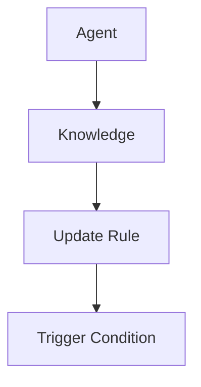
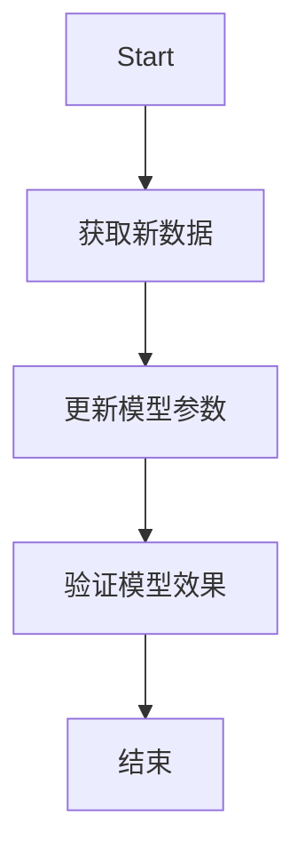
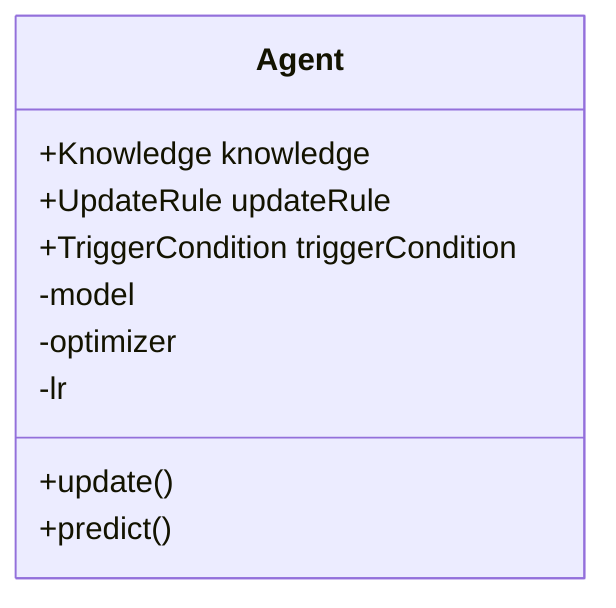
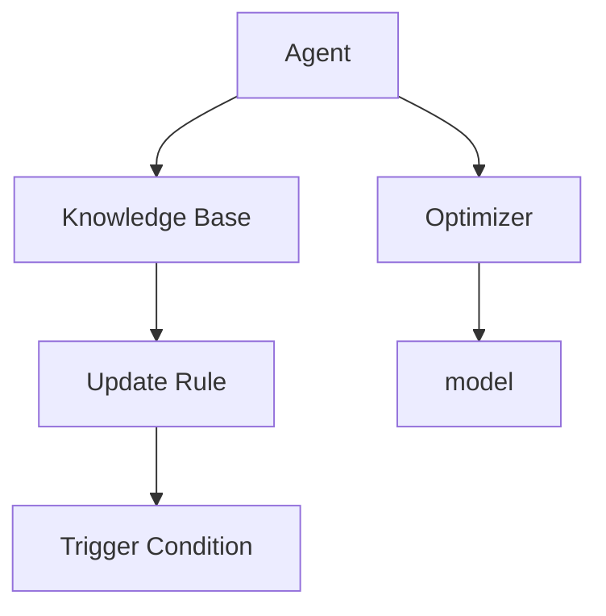
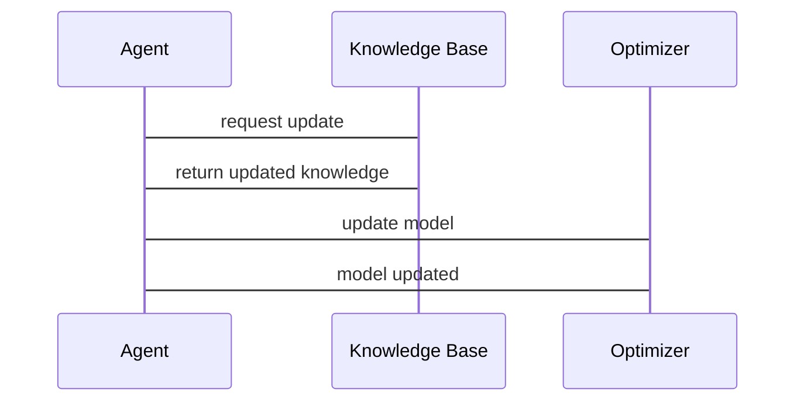

                 


# 构建AI Agent的知识更新机制：保持信息时效性

## 关键词：AI Agent、知识更新机制、信息时效性、增量式学习、在线学习、自适应学习

## 摘要：本文详细探讨了构建AI Agent的知识更新机制，特别是如何保持信息的时效性。通过分析知识更新的原理、算法实现以及系统架构设计，本文为读者提供了从理论到实践的全面指导，帮助AI Agent能够实时更新知识，适应不断变化的环境。

---

# 第一部分: AI Agent的知识更新机制概述

## 第1章: AI Agent与知识更新机制概述

### 1.1 AI Agent的基本概念

#### 1.1.1 AI Agent的定义

AI Agent（人工智能代理）是指能够感知环境、做出决策并采取行动的智能实体。它可以是一个软件程序、机器人或其他智能系统，通过与环境交互来实现特定目标。

#### 1.1.2 AI Agent的核心特征

- **自主性**：能够在没有外部干预的情况下独立运作。
- **反应性**：能够实时感知环境并做出响应。
- **目标导向性**：所有行为都围绕实现特定目标展开。
- **学习能力**：通过经验或数据不断优化自身性能。

#### 1.1.3 AI Agent的类型与应用场景

- **简单反射型AI Agent**：基于预定义规则做出反应，适用于简单的决策场景。
- **基于模型的反应式AI Agent**：结合内部状态和环境信息进行决策，适用于复杂环境。
- **目标驱动型AI Agent**：通过内部目标驱动行为，适用于需要长期规划的任务。
- **实用驱动型AI Agent**：通过最大化效用函数来优化决策，适用于多目标优化场景。

### 1.2 知识更新机制的重要性

#### 1.2.1 信息时效性的定义

信息时效性指的是信息的有效性和相关性随时间变化的特性。在动态环境中，过时的信息可能导致AI Agent做出错误决策。

#### 1.2.2 知识更新的必要性

- **适应环境变化**：环境中的信息不断变化，AI Agent需要及时更新知识以保持准确性。
- **提高决策效率**：通过更新知识，AI Agent能够更快地做出更优决策。
- **增强系统鲁棒性**：知识更新能够帮助AI Agent在面对新情况时依然保持稳定性能。

#### 1.2.3 知识更新机制的边界与外延

- **边界**：知识更新仅针对可更新的信息，如市场数据、用户偏好等，而对于基本逻辑和算法结构不进行更新。
- **外延**：知识更新机制可以与其他机制（如自适应控制、反馈学习）结合，形成更复杂的系统。

### 1.3 知识更新机制的核心要素

#### 1.3.1 知识表示与存储

- **知识表示方法**：包括符号表示、概率表示、语义网络等。
- **知识存储结构**：如数据库、知识图谱等，用于高效存储和检索。

#### 1.3.2 知识推理与应用

- **推理方法**：如逻辑推理、归纳推理、演绎推理等。
- **推理引擎**：用于执行推理过程，如规则引擎、概率推理引擎等。

#### 1.3.3 知识更新的触发条件

- **主动触发**：基于预设规则自动触发更新，如定期更新、事件驱动等。
- **被动触发**：当检测到信息不一致或错误时触发更新。

## 1.4 本章小结

本章介绍了AI Agent的基本概念、核心特征以及知识更新机制的重要性。通过分析信息时效性、知识更新的必要性和边界，为后续章节奠定了基础。

---

# 第二部分: 知识更新机制的核心概念与联系

## 第2章: 知识更新机制的原理与方法

### 2.1 知识更新机制的原理

#### 2.1.1 增量式学习

- **增量式学习的定义**：仅使用新数据更新模型，避免重新训练整个模型。
- **增量式学习的优势**：节省计算资源，适用于实时更新场景。

#### 2.1.2 在线学习

- **在线学习的定义**：数据流不断输入，模型在数据流中逐步更新。
- **在线学习的应用场景**：实时数据分析、流数据处理等。

#### 2.1.3 自适应学习

- **自适应学习的定义**：根据环境变化自动调整学习策略和模型参数。
- **自适应学习的优势**：能够快速响应环境变化，保持模型性能。

### 2.2 知识更新方法的对比分析

#### 2.2.1 主动学习与被动学习

- **主动学习**：模型主动选择最有价值的数据进行学习。
- **被动学习**：模型被动接收数据进行学习。

#### 2.2.2 强化学习与监督学习

- **强化学习**：通过与环境交互获得奖励，逐步优化策略。
- **监督学习**：基于标记数据进行学习，适用于已知任务。

#### 2.2.3 在线学习与离线学习

- **在线学习**：实时处理数据流，适用于动态环境。
- **离线学习**：基于历史数据进行批量训练，适用于静态环境。

### 2.3 知识更新机制的ER实体关系图



### 2.4 本章小结

本章分析了知识更新机制的原理与方法，通过对比不同学习方法，帮助读者理解如何选择合适的方法实现知识更新。

---

# 第三部分: 知识更新机制的算法实现

## 第3章: 知识更新算法的原理与实现

### 3.1 增量式学习算法

#### 3.1.1 算法流程

1. 初始化模型参数。
2. 逐步接收新数据样本。
3. 使用新数据更新模型参数。
4. 验证模型性能。

#### 3.1.2 增量式学习的Python实现示例

```python
class IncrementalLearner:
    def __init__(self, model):
        self.model = model
        self.optimizer = torch.optim.SGD(model.parameters(), lr=0.1)
    
    def update_model(self, new_data):
        # 前向传播
        outputs = self.model(new_data)
        # 计算损失
        loss = F.cross_entropy(outputs, labels)
        # 反向传播和优化
        self.optimizer.zero_grad()
        loss.backward()
        self.optimizer.step()
```

#### 3.1.3 算法流程图



### 3.2 在线学习算法

#### 3.2.1 算法流程

1. 初始化模型参数。
2. 实时接收数据流。
3. 使用流数据更新模型参数。
4. 输出实时结果。

#### 3.2.2 在线学习的数学模型

在线学习可以看作是一个动态优化问题，其目标函数可以表示为：

$$
\theta_{t+1} = \theta_t + \eta (y_t - \hat{y}_t)
$$

其中，$\theta_t$ 表示第 $t$ 步的参数，$\eta$ 表示学习率，$y_t$ 表示真实值，$\hat{y}_t$ 表示预测值。

### 3.3 自适应学习算法

#### 3.3.1 自适应学习的定义

自适应学习是指模型能够根据环境变化自动调整学习策略和参数。

#### 3.3.2 自适应学习的Python实现示例

```python
class AdaptiveLearner:
    def __init__(self, model):
        self.model = model
        self.lr = 0.1
    
    def update_model(self, new_data):
        # 前向传播
        outputs = self.model(new_data)
        # 计算损失
        loss = F.cross_entropy(outputs, labels)
        # 反向传播和优化
        self.optimizer.zero_grad()
        loss.backward()
        # 动态调整学习率
        if loss.item() < 0.5:
            self.lr *= 0.9
        else:
            self.lr *= 1.1
        self.optimizer = torch.optim.SGD(model.parameters(), lr=self.lr)
        self.optimizer.step()
```

### 3.4 本章小结

本章详细讲解了增量式学习、在线学习和自适应学习的算法原理和实现方法，并通过代码示例和流程图帮助读者理解这些算法的实现细节。

---

# 第四部分: 系统分析与架构设计

## 第4章: 系统分析与架构设计

### 4.1 问题场景介绍

假设我们正在开发一个智能客服系统，需要实时更新产品信息和用户偏好，以提供准确的客户服务。

### 4.2 系统功能设计

#### 4.2.1 领域模型设计



#### 4.2.2 系统架构设计



#### 4.2.3 接口设计

- **知识更新接口**：`update_knowledge(new_data)`
- **知识查询接口**：`query_knowledge(key)`
- **模型更新接口**：`update_model(new_data)`

#### 4.2.4 交互流程



### 4.3 本章小结

本章通过一个实际场景介绍了系统分析与架构设计，展示了如何将知识更新机制应用于实际系统中。

---

# 第五部分: 项目实战

## 第5章: 项目实战

### 5.1 环境安装

安装必要的库：

```bash
pip install torch matplotlib numpy
```

### 5.2 系统核心实现

#### 5.2.1 知识更新模块实现

```python
class KnowledgeUpdater:
    def __init__(self, knowledge_base):
        self.knowledge_base = knowledge_base
        self.trigger_conditions = []
    
    def add_trigger(self, condition):
        self.trigger_conditions.append(condition)
    
    def update_knowledge(self):
        for condition in self.trigger_conditions:
            if condition.check():
                self.knowledge_base.update()
```

#### 5.2.2 模型更新模块实现

```python
class ModelUpdater:
    def __init__(self, model, optimizer):
        self.model = model
        self.optimizer = optimizer
        self.loss_fn = torch.nn.CrossEntropyLoss()
    
    def update_model(self, batch):
        outputs = self.model(batch)
        loss = self.loss_fn(outputs, labels)
        self.optimizer.zero_grad()
        loss.backward()
        self.optimizer.step()
```

#### 5.2.3 知识更新触发条件实现

```python
class AccuracyTrigger:
    def __init__(self, threshold):
        self.threshold = threshold
    
    def check(self, accuracy):
        return accuracy < self.threshold
```

### 5.3 代码应用解读与分析

- **KnowledgeUpdater**：负责管理知识的更新，支持多种触发条件。
- **ModelUpdater**：负责更新模型参数，使用优化器进行梯度下降。
- **AccuracyTrigger**：当模型准确率低于阈值时触发知识更新。

### 5.4 实际案例分析

假设我们有一个分类任务，模型准确率下降到一定程度时触发知识更新。

### 5.5 项目小结

通过项目实战，我们展示了如何将知识更新机制应用于实际系统中，并通过代码实现验证了其可行性。

---

# 第六部分: 最佳实践

## 第6章: 最佳实践

### 6.1 小结与经验分享

- **及时更新**：定期检查数据源，确保知识库的及时更新。
- **选择合适方法**：根据场景选择合适的学习方法，如增量式学习适用于小数据更新，在线学习适用于大数据流。
- **监控性能**：通过监控模型性能，及时发现并解决问题。

### 6.2 注意事项

- **数据质量**：确保新数据的质量，避免引入噪声。
- **模型收敛**：关注模型收敛速度，避免过慢或过快更新。
- **资源管理**：合理分配计算资源，避免更新过程耗尽资源。

### 6.3 拓展阅读

- 《机器学习实战》：深入理解机器学习算法。
- 《深度学习》：掌握深度学习的核心概念。
- 《强化学习》：探索强化学习的应用场景。

### 6.4 本章小结

本章总结了知识更新机制的设计与实现的经验，并提供了最佳实践建议，帮助读者在实际项目中更好地应用这些机制。

---

# 作者：AI天才研究院 & 禅与计算机程序设计艺术

通过以上目录，我们可以看到文章从背景介绍到算法实现，再到系统设计和项目实战，最后总结经验，为读者提供了一个完整的构建AI Agent知识更新机制的框架。

