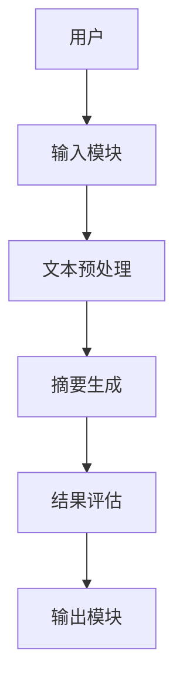
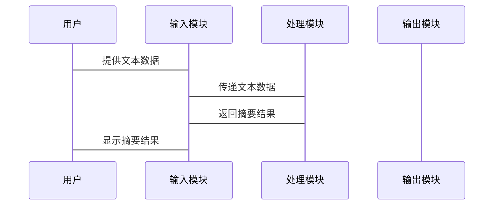

                 


# 《构建AI Agent的自动摘要生成系统》

> **关键词**：AI Agent、自动摘要生成系统、文本摘要、自然语言处理、深度学习

> **摘要**：本文详细探讨了构建AI Agent的自动摘要生成系统的各个方面。从基本概念到算法原理，从系统架构到项目实战，全面解析了该系统的构建过程。文章通过清晰的逻辑和丰富的技术细节，帮助读者理解如何利用先进的自然语言处理技术，构建高效、准确的自动摘要生成系统，以提升信息处理效率。

---

# 第1章 AI Agent与自动摘要生成系统概述

## 1.1 AI Agent的基本概念

### 1.1.1 AI Agent的定义
AI Agent（人工智能代理）是指能够感知环境、自主决策并执行任务的智能实体。它可以是一个软件程序，也可以是一个物理设备，通过传感器和执行器与环境交互。

### 1.1.2 AI Agent的核心特征
1. **自主性**：能够在没有外部干预的情况下独立运行。
2. **反应性**：能够实时感知环境并做出响应。
3. **目标导向**：具备明确的目标，并通过规划和推理来实现目标。
4. **学习能力**：能够通过数据和经验不断优化自身的性能。

### 1.1.3 AI Agent的应用场景
- **智能家居**：通过AI Agent实现家电的智能控制。
- **自动驾驶**：利用AI Agent进行环境感知和路径规划。
- **智能助手**：如Siri、Alexa等，帮助用户完成日常任务。

## 1.2 自动摘要生成系统的定义与特点

### 1.2.1 自动摘要的定义
自动摘要生成系统是指通过计算机算法，从大量文本中提取关键信息并生成简短摘要的过程。它可以分为抽取式摘要和生成式摘要两类。

### 1.2.2 自动摘要的核心技术
1. **自然语言处理（NLP）**：用于理解和生成人类语言。
2. **文本挖掘**：从大量文本中提取有用信息。
3. **机器学习**：用于训练模型以生成高质量的摘要。

### 1.2.3 自动摘要的应用价值
- **提升信息处理效率**：快速获取文本的核心内容。
- **降低信息过载**：在信息爆炸的时代，帮助用户筛选重要信息。
- **多领域应用**：适用于新闻、学术、商业等领域。

## 1.3 AI Agent与自动摘要生成系统的结合

### 1.3.1 系统的整体架构
AI Agent与自动摘要生成系统的结合，形成了一个完整的智能化信息处理系统。AI Agent负责任务的规划和执行，而自动摘要生成系统则负责信息的提取和生成。

### 1.3.2 系统的核心功能
1. **信息采集**：通过传感器或API获取文本数据。
2. **摘要生成**：利用算法生成文本摘要。
3. **决策与执行**：根据摘要结果做出决策并执行任务。

### 1.3.3 系统的创新点
- **智能化**：AI Agent能够自主学习和优化。
- **高效性**：通过自动摘要生成系统快速处理大量文本。
- **多样性**：支持多种摘要生成方法，满足不同需求。

## 1.4 本章小结
本章介绍了AI Agent和自动摘要生成系统的基本概念、特点及其结合方式。AI Agent通过与自动摘要生成系统的结合，能够实现智能化的信息处理，为各种应用场景提供了强大的技术支持。

---

# 第2章 自动摘要生成系统的背景与应用

## 2.1 自动摘要生成系统的背景

### 2.1.1 当前信息爆炸的时代背景
在信息爆炸的时代，人们每天面对海量信息，如何快速获取核心内容成为一个重要问题。

### 2.1.2 自动摘要的需求驱动
- **信息过载**：用户无法逐一阅读所有内容。
- **时间限制**：用户需要快速获取信息。
- **多语言支持**：需要处理多种语言的文本。

### 2.1.3 AI技术的快速发展
深度学习和自然语言处理技术的快速发展，为自动摘要生成系统的实现提供了技术支持。

## 2.2 自动摘要生成系统的应用领域

### 2.2.1 新闻媒体
- **新闻标题生成**：从新闻全文中提取标题。
- **新闻摘要生成**：为用户提供新闻的核心内容。

### 2.2.2 学术研究
- **论文摘要生成**：从学术论文中提取摘要。
- **文献综述**：快速获取相关领域的研究进展。

### 2.2.3 商业应用
- **商业情报分析**：从商业报告中提取关键信息。
- **客户服务**：通过摘要快速了解客户反馈。

## 2.3 系统构建的必要性与目标

### 2.3.1 构建自动摘要生成系统的必要性
- **提升信息处理效率**：快速获取核心内容。
- **降低信息过载**：帮助用户筛选重要信息。
- **支持多语言处理**：满足全球用户的需求。

### 2.3.2 系统的核心目标
- **高效性**：快速生成高质量的摘要。
- **准确性**：确保摘要内容的准确性和相关性。
- **可扩展性**：支持大规模文本处理。

### 2.3.3 系统的预期效果
- **提升用户体验**：用户能够快速获取所需信息。
- **节省时间**：减少用户阅读大量文本的时间。
- **支持决策**：通过摘要帮助用户做出更明智的决策。

## 2.4 本章小结
本章分析了自动摘要生成系统的背景和应用领域，强调了构建该系统的必要性和目标。通过高效、准确的自动摘要生成，可以帮助用户快速获取信息，提升信息处理效率。

---

# 第3章 自动摘要生成系统的算法原理

## 3.1 文本摘要的基本原理

### 3.1.1 文本摘要的定义
文本摘要是指从文本中提取关键信息并生成简短摘要的过程。

### 3.1.2 文本摘要的分类
- **抽取式摘要**：从原文中直接抽取关键词或句子。
- **生成式摘要**：通过模型生成新的文本作为摘要。

### 3.1.3 文本摘要的评价指标
- **准确性**：摘要内容是否准确反映原文。
- **简洁性**：摘要是否简短明了。
- **流畅性**：摘要是否通顺易读。

## 3.2 基于抽取式的文本摘要算法

### 3.2.1 抽取式摘要的基本原理
抽取式摘要通过分析文本的关键词或重要句子，直接从原文中提取摘要。

### 3.2.2 常见的抽取式摘要算法
- **TF-IDF算法**：基于词频-逆文档频率的统计方法。
- **TextRank算法**：基于图的排序算法。

### 3.2.3 抽取式摘要的优缺点
- **优点**：实现简单，效率高。
- **缺点**：可能无法生成连贯的摘要，尤其在复杂语境下表现不佳。

## 3.3 基于生成式的文本摘要算法

### 3.3.1 生成式摘要的基本原理
生成式摘要通过机器学习模型生成新的文本作为摘要，通常基于编码-解码框架（Encoder-Decoder）。

### 3.3.2 常见的生成式摘要算法
- **Seq2Seq模型**：基于循环神经网络的编码-解码架构。
- **Transformer模型**：基于自注意力机制的模型。

### 3.3.3 生成式摘要的优缺点
- **优点**：能够生成连贯且流畅的摘要。
- **缺点**：实现复杂，训练需要大量数据。

## 3.4 算法实现的数学模型

### 3.4.1 TF-IDF算法的数学模型
$$ TF-IDF = \text{词频} \times \text{逆文档频率} $$

### 3.4.2 Seq2Seq模型的数学模型
$$ P(y|x) = \prod_{i=1}^{n} P(y_i | y_{i-1}, x) $$

### 3.4.3 Transformer模型的数学模型
$$ \text{自注意力机制} = \text{查询} \times \text{键值对} \times \text{缩放点积} $$

## 3.5 本章小结
本章详细讲解了自动摘要生成系统的算法原理，包括抽取式和生成式摘要的实现方法及其数学模型。通过对比分析，帮助读者理解不同算法的优缺点，为后续系统设计奠定基础。

---

# 第4章 系统架构设计与实现

## 4.1 系统架构设计

### 4.1.1 问题场景分析
- **输入**：用户提供的文本数据。
- **输出**：生成的文本摘要。

### 4.1.2 系统功能设计
- **文本预处理**：分词、去除停用词等。
- **摘要生成**：选择合适的算法生成摘要。
- **结果评估**：评估摘要的质量。

### 4.1.3 系统架构图


## 4.2 系统实现

### 4.2.1 环境安装
- **Python**：安装最新版本的Python。
- **依赖库**：安装`numpy`, `tensorflow`, `transformers`等库。

### 4.2.2 核心代码实现

#### 4.2.2.1 抽取式摘要实现
```python
from sklearn.feature_extraction.text import TfidfVectorizer

def extractive_summary(doc):
    vectorizer = TfidfVectorizer()
    tfidf = vectorizer.fit_transform([doc])
    scores = pd.DataFrame(tfidf.toarray(), columns=vectorizer.get_feature_names_out())
    top_words = scores.sum().sort_values(ascending=False).head(5)
    return ' '.join(top_words.index)
```

#### 4.2.2.2 生成式摘要实现
```python
from transformers import AutoTokenizer, AutoModelForSeq2Seq
import torch

tokenizer = AutoTokenizer.from_pretrained('facebook/mbart-large-50')
model = AutoModelForSeq2Seq.from_pretrained('facebook/mbart-large-50')

def generate_summary(doc):
    inputs = tokenizer(doc, return_tensors='pt', max_length=512, truncation=True)
    with torch.no_grad():
        outputs = model.generate(inputs.input_ids)
    summary = tokenizer.decode(outputs[0], skip_special_tokens=True)
    return summary
```

### 4.2.3 代码解读与分析
- **抽取式摘要**：使用TF-IDF算法提取关键词，生成摘要。
- **生成式摘要**：基于预训练模型生成摘要，能够生成更连贯的文本。

## 4.3 系统交互流程

### 4.3.1 用户与系统交互流程


## 4.4 本章小结
本章详细讲解了系统的架构设计与实现过程，包括环境安装、核心代码实现以及系统交互流程。通过实际代码示例，帮助读者理解如何构建一个完整的自动摘要生成系统。

---

# 第5章 系统优化与未来展望

## 5.1 系统优化

### 5.1.1 算法优化
- **改进抽取式算法**：结合多种特征进行关键词提取。
- **优化生成式算法**：引入领域知识，提升摘要准确性。

### 5.1.2 系统性能优化
- **并行处理**：通过多线程或分布式计算提升处理效率。
- **内存优化**：优化数据存储结构，减少内存占用。

## 5.2 未来展望

### 5.2.1 新兴技术的影响
- **大语言模型**：如GPT-4的引入，将提升摘要生成的质量。
- **多模态摘要**：结合图像、音频等多种数据源生成摘要。

### 5.2.2 应用场景扩展
- **实时摘要生成**：在直播、会议等场景中实时生成摘要。
- **个性化摘要**：根据用户偏好生成个性化摘要。

## 5.3 本章小结
本章探讨了系统的优化方向和未来发展趋势，强调了新兴技术对自动摘要生成系统的推动作用，同时也指出了未来可能的应用场景。

---

# 作者

作者：AI天才研究院/AI Genius Institute & 禅与计算机程序设计艺术 /Zen And The Art of Computer Programming

---

感谢您的耐心阅读，希望这篇文章对您有所帮助！

