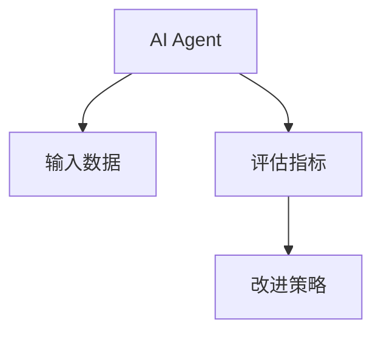
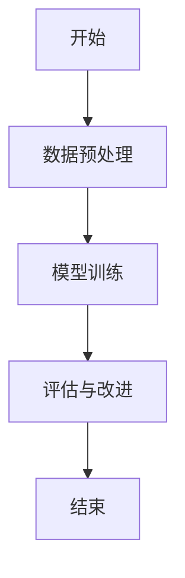
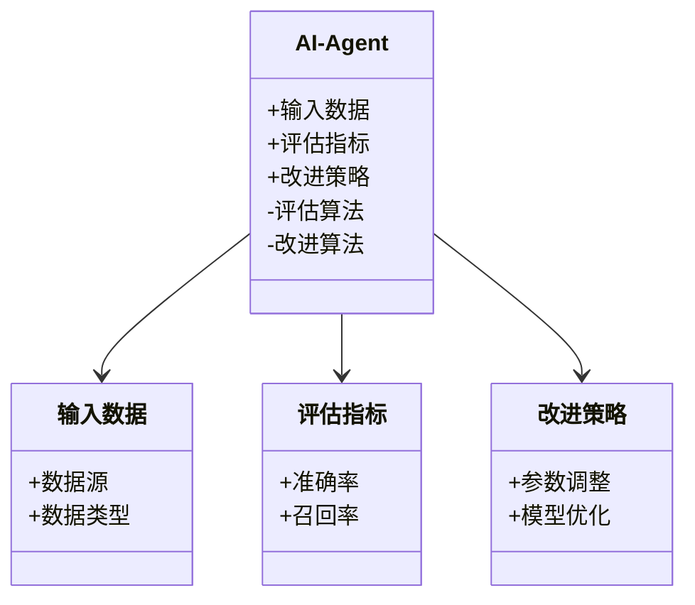
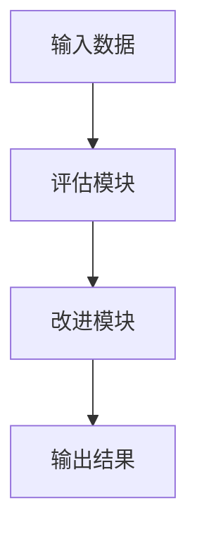

                 


# 构建AI Agent的自我评估机制：持续改进性能

## 关键词：AI Agent, 自我评估, 持续改进, 性能优化, 强化学习, 系统架构

## 摘要：本文深入探讨了构建AI Agent自我评估机制的理论基础、算法实现、系统架构和项目实战。通过结合强化学习与监督学习的评估与改进策略，我们详细分析了如何设计和实现一个能够持续优化性能的AI Agent。从核心概念到数学模型，从系统设计到代码实现，本文为读者提供了一个全面的指导框架，帮助他们在实际项目中构建高效的AI Agent自我评估机制。

---

# 第一部分: AI Agent自我评估机制的背景与核心概念

## 第1章: AI Agent自我评估机制的背景与问题描述

### 1.1 问题背景
#### 1.1.1 当前AI Agent的发展现状
AI Agent（人工智能代理）正在广泛应用于自动驾驶、智能助手、机器人控制等领域。然而，现有的AI Agent在复杂动态环境中往往缺乏自我评估和持续改进的能力，导致性能下降或适应性不足。

#### 1.1.2 自我评估机制的必要性
为了使AI Agent能够在动态环境中保持高性能，自我评估机制是必不可少的。它能够帮助AI Agent识别自身的不足，并通过改进策略来优化性能。

#### 1.1.3 持续改进性能的重要性
在实际应用中，环境往往是动态变化的，AI Agent需要能够实时调整策略以应对变化。持续改进性能的能力使得AI Agent能够更好地适应这些变化。

### 1.2 问题描述
#### 1.2.1 AI Agent的核心功能与目标
AI Agent的核心功能包括感知环境、决策制定和执行动作。其目标是通过持续优化性能来提高决策的准确性和效率。

#### 1.2.2 自我评估机制的关键问题
自我评估机制需要解决以下关键问题：
- 如何准确评估当前性能？
- 如何制定改进策略？
- 如何实现持续改进？

#### 1.2.3 持续改进性能的实现路径
持续改进性能的实现路径包括：
1. 定义评估指标。
2. 实现评估算法。
3. 制定改进策略。
4. 实现改进算法。

### 1.3 问题解决与边界
#### 1.3.1 自我评估机制的解决方案
自我评估机制的解决方案包括：
- 使用强化学习（Reinforcement Learning）进行评估。
- 使用监督学习（Supervised Learning）进行改进。

#### 1.3.2 边界与外延
自我评估机制的边界包括：
- 输入数据的类型和格式。
- 评估指标的选择和计算。
- 改进策略的范围和限制。

#### 1.3.3 核心要素与组成结构
自我评估机制的核心要素包括：
- 输入数据。
- 评估指标。
- 改进策略。

### 1.4 核心概念与联系
#### 1.4.1 自我评估机制的原理
自我评估机制的原理是通过评估当前性能，识别不足，并通过改进策略来优化性能。

#### 1.4.2 核心概念属性特征对比表格
| 核心概念 | 属性 | 特征 |
|----------|------|------|
| 输入数据 | 类型 | 文本/数据点 |
| 评估指标 | 类型 | 准确率/召回率 |
| 改进策略 | 类型 | 参数调整/模型优化 |

#### 1.4.3 ER实体关系图


### 1.5 本章小结
本章介绍了AI Agent自我评估机制的背景与问题描述，明确了自我评估机制的必要性和实现路径，并通过对比分析和实体关系图展示了核心概念的联系。

---

## 第2章: 自我评估机制的核心算法原理

### 2.1 算法原理概述
#### 2.1.1 基于强化学习的评估机制
强化学习是一种通过奖励机制来优化策略的算法。在AI Agent的自我评估中，可以使用强化学习来评估当前策略的有效性。

#### 2.1.2 基于监督学习的改进策略
监督学习是一种通过 labeled 数据来训练模型的算法。在自我评估机制中，可以使用监督学习来制定改进策略。

#### 2.1.3 综合评估与改进的算法框架
综合评估与改进的算法框架包括：
1. 使用强化学习进行评估。
2. 使用监督学习进行改进。
3. 结合评估结果制定改进策略。

### 2.2 算法实现流程
#### 2.2.1 数据预处理
数据预处理是确保数据质量的重要步骤。包括数据清洗、特征提取和数据标准化。

#### 2.2.2 模型训练
模型训练是通过数据训练模型参数的过程。包括选择模型架构、定义损失函数和优化器。

#### 2.2.3 评估与改进
评估与改进是通过评估指标计算当前性能，并根据结果制定改进策略。

### 2.3 算法实现代码示例
```python
def evaluate_model(model, data):
    # 计算评估指标
    metrics = model.evaluate(data)
    return metrics

def improve_model(model, data, metrics):
    # 根据评估结果改进模型
    if metrics['accuracy'] < 0.8:
        model.train(data)
    return model
```

### 2.4 数学模型与公式
#### 2.4.1 评估指标计算公式
准确率的计算公式为：
$$ \text{准确率} = \frac{\text{正确预测数}}{\text{总预测数}} $$

召回率的计算公式为：
$$ \text{召回率} = \frac{\text{正确预测的正例数}}{\text{实际正例数}} $$

#### 2.4.2 改进策略的符号表示
改进策略可以用以下符号表示：
- 状态空间：S
- 行动空间：A
- 奖励函数：R(s, a)

### 2.5 算法流程图


### 2.6 本章小结
本章详细讲解了自我评估机制的核心算法原理，包括基于强化学习和监督学习的评估与改进策略，并通过代码示例和流程图展示了算法的实现过程。

---

## 第3章: 系统分析与架构设计

### 3.1 问题场景介绍
AI Agent在复杂动态环境中需要实时调整策略以应对变化。为了实现这一点，我们需要设计一个能够自我评估和持续改进的系统架构。

### 3.2 系统功能设计
#### 3.2.1 领域模型设计
领域模型设计包括：
- 用户需求分析。
- 功能模块划分。
- 数据流设计。

#### 3.2.2 领域模型类图


### 3.3 系统架构设计
#### 3.3.1 系统架构图


#### 3.3.2 接口设计
接口设计包括：
- 输入数据接口。
- 评估指标接口。
- 改进策略接口。

### 3.4 系统交互设计
#### 3.4.1 交互流程图
```mermaid
sequenceDiagram
参与者 用户
系统 AI-Agent
用户 -> 系统: 提供输入数据
系统 -> 用户: 返回评估指标
用户 -> 系统: 提供改进策略
系统 -> 用户: 返回优化后的结果
```

### 3.5 本章小结
本章通过系统分析与架构设计，展示了如何将自我评估机制应用于实际系统中，并通过类图和流程图详细描述了系统架构和交互过程。

---

## 第4章: 项目实战与案例分析

### 4.1 项目实战
#### 4.1.1 环境安装
需要安装的环境包括：
- Python
- TensorFlow或PyTorch
- Mermaid工具

#### 4.1.2 系统核心实现
核心代码实现包括：
```python
class AI-Agent:
    def __init__(self):
        self.input_data = None
        self.evaluation_metrics = None
        self.improvement_strategy = None

    def evaluate(self):
        # 实现评估逻辑
        pass

    def improve(self):
        # 实现改进逻辑
        pass
```

### 4.2 代码应用解读与分析
#### 4.2.1 代码实现细节
代码实现细节包括：
- 输入数据的处理。
- 评估指标的计算。
- 改进策略的制定。

#### 4.2.2 代码优化技巧
代码优化技巧包括：
- 参数调优。
- 模型优化。
- 算法优化。

### 4.3 实际案例分析
#### 4.3.1 案例背景
案例背景包括：
- 应用场景。
- 数据来源。
- 评估指标。

#### 4.3.2 案例分析
案例分析包括：
- 数据预处理。
- 模型训练。
- 评估与改进。

### 4.4 项目小结
项目小结包括：
- 项目总结。
- 经验教训。
- 改进方向。

### 4.5 本章小结
本章通过项目实战和案例分析，展示了如何将自我评估机制应用于实际项目中，并通过代码实现和案例分析帮助读者理解技术细节。

---

## 第5章: 最佳实践与小结

### 5.1 最佳实践
#### 5.1.1 小结
小结包括：
- 核心概念回顾。
- 算法实现总结。
- 系统设计要点。

#### 5.1.2 注意事项
注意事项包括：
- 数据质量的重要性。
- 模型选择的影响。
- 算法调优的技巧。

#### 5.1.3 拓展阅读
拓展阅读包括：
- 强化学习相关书籍。
- 监督学习相关书籍。
- AI Agent相关研究论文。

### 5.2 本章小结
本章总结了构建AI Agent自我评估机制的最佳实践，并为读者提供了进一步学习和实践的建议。

---

## 作者：AI天才研究院/AI Genius Institute & 禅与计算机程序设计艺术 /Zen And The Art of Computer Programming

