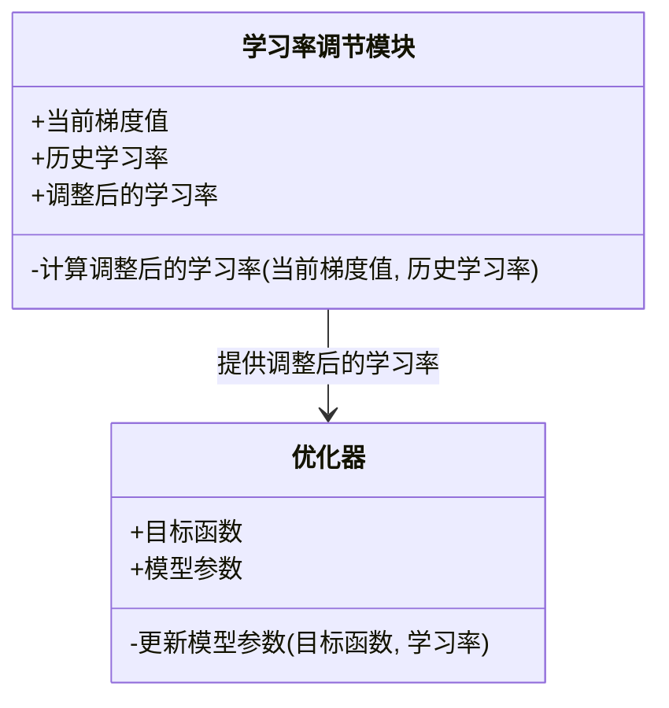
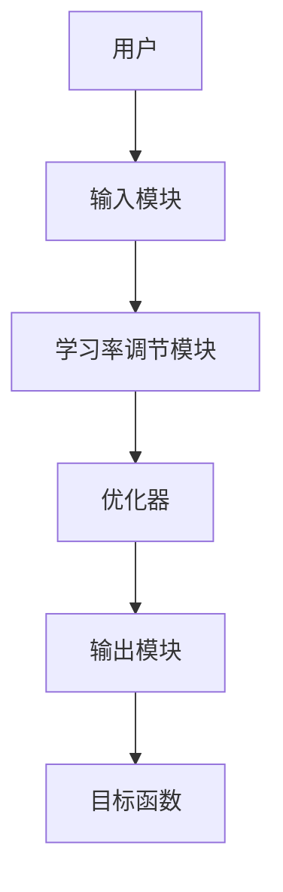
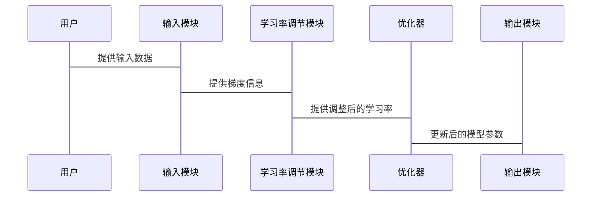

                 


# 构建AI Agent的自适应学习率调节系统

> 关键词：AI Agent, 自适应学习率调节, 优化算法, 系统设计, 技术博客

> 摘要：本文系统地探讨了构建AI Agent的自适应学习率调节系统的各个方面，从背景介绍到核心算法，从系统架构设计到项目实战，全面解析了该系统的构建过程和关键点。通过详细的数学模型和算法流程图，结合实际代码实现，帮助读者深入理解并掌握如何设计和实现一个高效的自适应学习率调节系统。

---

# 第一部分: 背景介绍

## 第1章: AI Agent与自适应学习率调节系统概述

### 1.1 AI Agent的基本概念

#### 1.1.1 AI Agent的定义
AI Agent（人工智能代理）是指能够感知环境、采取行动以实现目标的智能实体。它可以是一个软件程序，也可以是一个物理设备，通过传感器和执行器与环境交互。

#### 1.1.2 AI Agent的核心特征
- **自主性**：能够在没有外部干预的情况下运行。
- **反应性**：能够感知环境并做出实时反应。
- **目标导向**：所有行为都以实现特定目标为导向。
- **学习能力**：能够通过经验或数据优化自身行为。

#### 1.1.3 自适应学习率调节的背景与意义
在AI Agent的学习过程中，优化算法（如梯度下降）的学习率直接影响训练的速度和效果。传统固定学习率的方法在面对复杂问题时常常效率低下，甚至可能导致训练失败。自适应学习率调节能够根据训练过程中的动态情况自动调整学习率，从而提高训练效率和模型性能。

### 1.2 问题背景与问题描述

#### 1.2.1 传统学习率调节的局限性
- **收敛速度慢**：固定学习率可能导致模型在训练初期下降过快，后期下降过慢。
- **适应性差**：不同问题和数据集可能需要不同的学习率，固定学习率难以适应所有情况。

#### 1.2.2 自适应学习率调节的需求
- **动态调整**：根据梯度变化自动调整学习率。
- **提高效率**：加快收敛速度，减少训练时间。
- **增强稳定性**：避免训练过程中的震荡和不稳定。

#### 1.2.3 问题解决的目标与边界
目标是设计一个能够根据训练过程中的梯度信息动态调整学习率的系统。边界包括：仅针对连续优化问题，不考虑非连续或无监督学习场景。

### 1.3 系统设计的核心要素

#### 1.3.1 系统功能模块划分
- **感知模块**：收集梯度信息。
- **决策模块**：根据梯度信息计算调整后的学习率。
- **执行模块**：更新优化算法的学习率。

#### 1.3.2 系统输入与输出定义
- **输入**：当前梯度值、历史学习率信息。
- **输出**：调整后的学习率值。

#### 1.3.3 系统性能指标与评估标准
- **收敛速度**：模型达到目标函数最小值的时间。
- **训练稳定性**：训练过程中目标函数的波动情况。
- **计算效率**：调整学习率的计算时间。

---

# 第二部分: 核心概念与联系

## 第2章: 自适应学习率调节的核心原理

### 2.1 自适应学习率调节的原理

#### 2.1.1 学习率调节的基本机制
自适应学习率调节通过监测训练过程中的梯度信息，动态调整学习率。常见的方法包括：
- **Adagrad**：针对每个参数单独调整学习率。
- **Adam**：结合动量和自适应学习率的优化算法。

#### 2.1.2 自适应调节的数学模型
自适应学习率调节的基本公式如下：
$$ \alpha(t) = \alpha_0 \times \frac{1}{1 + \beta \times t} $$
其中，$\alpha_0$ 是初始学习率，$\beta$ 是衰减系数，$t$ 是训练步数。

#### 2.1.3 调节策略的分类与对比
- **固定学习率**：简单但适应性差。
- **指数衰减**：学习率随时间指数衰减。
- **Adam优化器**：结合动量和自适应学习率。

### 2.2 核心概念的属性特征对比

#### 2.2.1 不同学习率调节方法的特征对比表

| 方法       | 是否动态调整 | 是否基于梯度 | 是否计算二阶矩 |
|------------|--------------|--------------|----------------|
| Adagrad     | 是           | 是           | 否              |
| Adam        | 是           | 是           | 是              |
| 固定学习率  | 否           | 否           | 否              |

#### 2.2.2 系统核心要素的ER实体关系图

```mermaid
er
actor: 用户
|-----|
| 系统 |
|-----|
| 学习率调节模块 |
|-----|
| 优化器 |
```

---

# 第三部分: 算法原理讲解

## 第3章: 自适应学习率调节算法的数学模型

### 3.1 数学模型与公式推导

#### 3.1.1 学习率调节的基本公式
$$ \alpha(t) = \alpha_0 \times \frac{1}{1 + \beta \times t} $$

#### 3.1.2 自适应调节的数学模型
$$ \alpha(t) = \alpha_0 \times \frac{1}{1 + \beta \times t} $$

#### 3.1.3 算法流程图

```

--- 

# 第四部分: 系统分析与架构设计

## 第4章: 系统分析与架构设计

### 4.1 问题场景介绍

#### 4.1.1 系统功能设计（领域模型）



### 4.2 系统架构设计

#### 4.2.1 系统架构图



### 4.3 接口设计与交互流程

#### 4.3.1 系统交互流程图



---

# 第五部分: 项目实战

## 第5章: 项目实战

### 5.1 环境安装与配置

```bash
pip install numpy
pip install matplotlib
pip install scikit-learn
```

### 5.2 系统核心实现源代码

#### 5.2.1 学习率调节模块的实现

```python
import numpy as np

class AdaptiveLearningRate:
    def __init__(self, alpha_0, beta):
        self.alpha_0 = alpha_0
        self.beta = beta
        self.current_t = 0
    
    def get_learning_rate(self):
        lr = self.alpha_0 / (1 + self.beta * self.current_t)
        self.current_t += 1
        return lr
```

#### 5.2.2 优化器的实现

```python
class Optimizer:
    def __init__(self, model_params, learning_rate_module):
        self.model_params = model_params
        self.learning_rate_module = learning_rate_module
        self.current_step = 0
    
    def update_params(self, gradients):
        lr = self.learning_rate_module.get_learning_rate()
        for i in range(len(self.model_params)):
            self.model_params[i] -= lr * gradients[i]
        self.current_step += 1
```

### 5.3 代码应用解读与分析

#### 5.3.1 学习率调节模块的代码解读
- 初始化时设定初始学习率和衰减系数。
- 每次调用`get_learning_rate`时，计算当前学习率并递增时间步。

#### 5.3.2 优化器的代码解读
- 在初始化时接收模型参数和学习率调节模块。
- 在每次更新参数时，调用学习率调节模块获取当前学习率，并更新模型参数。

### 5.4 实际案例分析

#### 5.4.1 简单线性回归问题

```python
# 定义目标函数
def loss(y_pred, y_true):
    return np.mean((y_pred - y_true)**2)

# 初始化模型参数
model_params = np.array([2.0, 3.0])
learning_rate_module = AdaptiveLearningRate(alpha_0=0.1, beta=0.01)
optimizer = Optimizer(model_params, learning_rate_module)

# 生成假数据
X = np.array([[1, 2], [3, 4], [5, 6]])
y_true = np.array([6, 14, 22])

# 训练过程
for _ in range(100):
    y_pred = np.dot(X, model_params)
    gradients = (2 * (y_pred - y_true)).mean(axis=0)
    optimizer.update_params(gradients)
    print(f"模型参数: {model_params}, 当前学习率: {learning_rate_module.get_learning_rate()}")
```

---

# 第六部分: 总结与展望

## 第6章: 总结与展望

### 6.1 内容总结
本文详细探讨了构建AI Agent的自适应学习率调节系统的各个方面，从理论基础到实际实现，全面解析了系统的构建过程。通过数学模型和算法流程图，展示了自适应学习率调节的核心原理和实现方法。

### 6.2 应用前景
自适应学习率调节在深度学习、强化学习等领域具有广泛的应用前景，能够显著提高模型训练效率和性能。未来的研究可以进一步探索更加智能的学习率调节策略，如基于元学习的方法。

### 6.3 最佳实践 tips
- 在实际应用中，建议根据具体问题选择合适的学习率调节方法。
- 定期监控训练过程中的学习率变化和模型性能，及时调整参数。
- 结合其他优化技术（如动量和自适应矩估计）进一步提升训练效果。

---

# 作者：AI天才研究院 & 禅与计算机程序设计艺术

