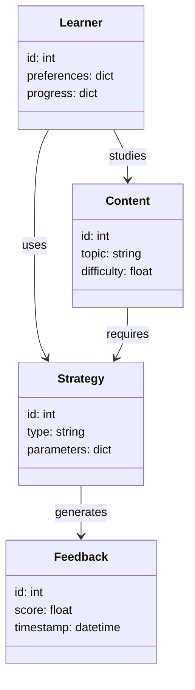
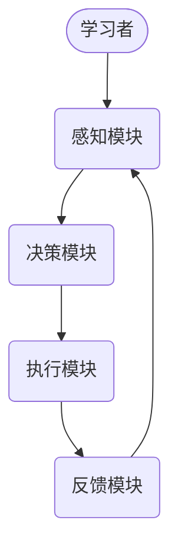
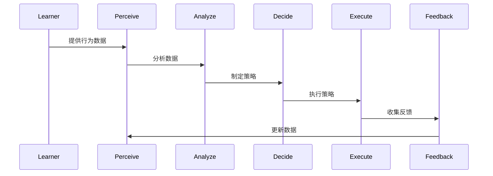

                 


# 构建AI Agent的自适应学习系统

> 关键词：AI Agent、自适应学习系统、人工智能、机器学习、教育技术、系统架构、算法优化

> 摘要：本文将详细探讨如何构建一个基于AI Agent的自适应学习系统。从系统背景到核心算法，从架构设计到项目实现，我们将全面解析这一系统的设计与实现过程。通过本文，读者将深入了解自适应学习系统的构建方法，掌握AI Agent在教育领域的应用技巧。

---

## 第一部分: AI Agent与自适应学习系统背景

### 第1章: AI Agent与自适应学习系统概述

#### 1.1 AI Agent的基本概念

##### 1.1.1 AI Agent的定义与分类
AI Agent（人工智能代理）是指能够感知环境、自主决策并执行任务的智能实体。根据功能和应用场景的不同，AI Agent可以分为以下几类：
- **简单反射型Agent**：基于简单的规则做出反应，适用于处理重复性任务。
- **基于模型的反射型Agent**：通过内部模型感知环境并做出决策，适用于复杂场景。
- **目标驱动型Agent**：以特定目标为导向，主动规划和执行任务。
- **实用驱动型Agent**：通过最大化效用函数来优化决策，常用于动态环境。

##### 1.1.2 自适应学习系统的定义
自适应学习系统是一种能够根据学习者的特点、需求和反馈动态调整教学策略和内容的智能系统。其核心在于通过数据采集、分析和反馈机制，为学习者提供个性化的学习路径。

##### 1.1.3 AI Agent与自适应学习系统的关联
AI Agent作为自适应学习系统的核心组件，负责感知学习者的状态、分析数据并做出决策。自适应学习系统通过AI Agent实现动态调整，从而提供个性化的学习体验。

#### 1.2 自适应学习系统的重要性

##### 1.2.1 传统学习系统 vs 自适应学习系统
- **传统学习系统**：固定的教学内容和节奏，难以满足个体差异。
- **自适应学习系统**：根据学习者的特点动态调整内容和节奏，提升学习效果。

##### 1.2.2 自适应学习系统的应用场景
- **在线教育**：为学习者提供个性化的学习路径。
- **企业培训**：根据员工的需求定制培训内容。
- **终身学习**：支持学习者持续更新知识和技能。

##### 1.2.3 自适应学习系统的挑战与优势
- **挑战**：数据采集的准确性、算法的复杂性、系统的实时性。
- **优势**：个性化学习体验、高效的知识掌握、动态的知识更新。

### 第2章: 自适应学习系统的构建背景

#### 2.1 问题背景

##### 2.1.1 当前教育与学习中的问题
- **学习者个体差异大**：传统教育难以满足不同学习者的需求。
- **知识更新速度快**：学习内容需要动态调整。
- **学习效果反馈滞后**：传统教学难以实时评估学习效果。

##### 2.1.2 AI技术在教育中的应用潜力
- **个性化推荐**：通过AI技术分析学习者的特点，推荐适合的学习内容。
- **实时反馈**：通过AI技术实时监控学习者的学习状态，提供即时反馈。

##### 2.1.3 自适应学习系统的必要性
- **解决传统教育的不足**：通过AI技术实现个性化和动态调整。
- **提升学习效果**：通过精准的教学策略和内容推荐，提高学习效率。

#### 2.2 问题描述

##### 2.2.1 学习者个体差异的挑战
- 学习者的认知水平、兴趣爱好和学习风格各不相同，传统教学难以满足所有人的需求。

##### 2.2.2 知识点的动态更新需求
- 知识点的更新速度加快，学习系统需要能够快速响应变化。

##### 2.2.3 学习效果的实时反馈需求
- 学习者需要实时了解自己的学习进度和效果，以便及时调整学习策略。

#### 2.3 问题解决

##### 2.3.1 AI Agent在自适应学习中的角色
- **感知**：采集学习者的行为数据，分析学习者的认知特点。
- **决策**：根据分析结果，制定个性化的学习策略。
- **执行**：通过推荐系统和反馈机制，动态调整学习内容和节奏。

##### 2.3.2 自适应学习系统的整体解决方案
- **数据采集**：通过传感器和日志系统采集学习者的行为数据。
- **数据分析**：利用机器学习算法分析数据，识别学习者的特点。
- **策略制定**：基于分析结果，制定个性化的学习策略。
- **策略执行**：通过推荐系统和反馈机制，动态调整学习内容和节奏。

#### 2.4 概念结构与核心要素

##### 2.4.1 自适应学习系统的组成要素
- **学习者模型**：分析学习者的特点和需求。
- **知识模型**：描述知识点之间的关系和层次结构。
- **学习策略**：制定个性化的学习路径。
- **反馈机制**：实时监控学习效果，调整学习策略。

##### 2.4.2 AI Agent与学习者、内容的关系
- **学习者模型**：AI Agent通过分析学习者的行为数据，构建学习者模型。
- **知识模型**：AI Agent通过分析知识点的结构和关系，构建知识模型。
- **学习策略**：AI Agent基于学习者模型和知识模型，制定个性化的学习策略。

##### 2.4.3 系统的核心功能模块
- **感知模块**：采集学习者的行为数据。
- **决策模块**：分析数据，制定学习策略。
- **执行模块**：通过推荐系统和反馈机制，动态调整学习内容和节奏。

### 第3章: AI Agent与自适应学习系统的关联

#### 3.1 AI Agent的核心功能

##### 3.1.1 感知与理解
- AI Agent通过传感器和日志系统采集学习者的行为数据，分析学习者的特点和需求。

##### 3.1.2 决策与规划
- AI Agent基于分析结果，制定个性化的学习策略。

##### 3.1.3 执行与反馈
- AI Agent通过推荐系统和反馈机制，动态调整学习内容和节奏，实时监控学习效果。

#### 3.2 自适应学习系统的构成

##### 3.2.1 学习目标设定
- 根据学习者的特点和需求，设定个性化的学习目标。

##### 3.2.2 学习内容推荐
- 基于学习者模型和知识模型，推荐适合的学习内容。

##### 3.2.3 学习效果评估
- 通过实时反馈机制，评估学习效果，调整学习策略。

#### 3.3 AI Agent在自适应学习中的具体应用

##### 3.3.1 个性化学习路径规划
- AI Agent根据学习者的特点和需求，制定个性化的学习路径。

##### 3.3.2 动态知识推荐
- AI Agent根据学习者的实时行为数据，动态推荐相关知识点。

##### 3.3.3 学习效果实时反馈
- AI Agent通过实时监控学习者的行为数据，评估学习效果，调整学习策略。

---

## 第二部分: 核心算法与数学模型

### 第4章: 强化学习算法

#### 4.1 强化学习的基本原理

##### 4.1.1 Q-learning算法
- Q-learning是一种经典的强化学习算法，通过不断更新Q值来优化决策策略。

##### 4.1.2 DQN算法
- DQN（Deep Q-Network）是一种基于深度学习的强化学习算法，通过神经网络来逼近Q值函数。

#### 4.2 算法实现

##### 4.2.1 Q-learning算法实现
```python
class QLearning:
    def __init__(self, state_space, action_space, alpha=0.1, gamma=0.9):
        self.q_table = np.zeros((state_space, action_space))
        self.alpha = alpha
        self.gamma = gamma

    def update(self, state, action, reward, next_state):
        self.q_table[state][action] = self.q_table[state][action] + self.alpha * (reward + self.gamma * max(self.q_table[next_state]) - self.q_table[state][action])
```

##### 4.2.2 DQN算法实现
```python
import torch
import torch.nn as nn
import torch.optim as optim

class DQN:
    def __init__(self, input_dim, output_dim, hidden_dim=32):
        self.model = nn.Sequential(
            nn.Linear(input_dim, hidden_dim),
            nn.ReLU(),
            nn.Linear(hidden_dim, output_dim)
        )
        self.optimizer = optim.Adam(self.model.parameters())

    def forward(self, x):
        return self.model(x)
    
    def update(self, x, y):
        prediction = self.model(x)
        loss = nn.MSELoss()(prediction, y)
        self.optimizer.zero_grad()
        loss.backward()
        self.optimizer.step()
```

#### 4.3 数学模型

##### 4.3.1 Q-learning的数学模型
$$ Q(s, a) = Q(s, a) + \alpha [r + \gamma \max Q(s', a) - Q(s, a)] $$

##### 4.3.2 DQN的数学模型
$$ Q(s, a) = \arg\max_a Q_{\theta}(s, a) $$
$$ \theta_{t+1} = \theta_t + \alpha (y_t - Q_{\theta_t}(s_t, a_t)) $$

---

## 第三部分: 系统分析与架构设计

### 第5章: 系统分析

#### 5.1 需求分析

##### 5.1.1 功能需求
- **数据采集**：采集学习者的行为数据。
- **数据分析**：分析学习者的特点和需求。
- **策略制定**：制定个性化的学习策略。
- **策略执行**：动态调整学习内容和节奏。

##### 5.1.2 性能需求
- **实时性**：系统需要实时监控学习者的行为数据。
- **准确性**：分析结果需要准确反映学习者的特点和需求。

#### 5.2 风险分析

##### 5.2.1 数据隐私风险
- 学习者的行为数据可能包含敏感信息，需要采取数据加密和匿名化处理。

##### 5.2.2 算法偏差风险
- 算法可能存在偏差，导致推荐内容不准确，需要通过多样性和公平性优化来降低风险。

### 第6章: 架构设计

#### 6.1 领域模型设计

##### 6.1.1 领域模型类图


#### 6.2 系统架构设计

##### 6.2.1 系统架构图


#### 6.3 接口设计

##### 6.3.1 API接口
- `/api/learner/preferences`：获取学习者的偏好。
- `/api/content/recommend`：推荐学习内容。
- `/api/feedback/submit`：提交学习反馈。

#### 6.4 交互设计

##### 6.4.1 交互流程图


---

## 第四部分: 项目实战

### 第7章: 项目实现

#### 7.1 环境配置

##### 7.1.1 安装依赖
```bash
pip install numpy torch matplotlib
```

##### 7.1.2 环境配置
- **操作系统**：Linux/Windows/MacOS
- **编程语言**：Python 3.8+
- **框架**：TensorFlow/PyTorch

#### 7.2 核心代码实现

##### 7.2.1 感知模块
```python
import numpy as np

class Perceive:
    def __init__(self):
        self.data = []

    def collect(self, learner_id):
        # 采集学习者的行为数据
        self.data.append({
            'id': learner_id,
            'timestamp': datetime.now(),
            'action': 'study',
            'content_id': 123
        })
```

##### 7.2.2 决策模块
```python
import numpy as np

class Decide:
    def __init__(self, data):
        self.data = data

    def analyze(self):
        # 分析学习者的特点和需求
        preferences = {}
        for entry in self.data:
            learner_id = entry['id']
            if learner_id not in preferences:
                preferences[learner_id] = {'actions': [], 'topics': []}
            preferences[learner_id]['actions'].append(entry['action'])
            preferences[learner_id]['topics'].append(entry['content_id'])
        return preferences
```

##### 7.2.3 执行模块
```python
import numpy as np

class Execute:
    def __init__(self, strategy):
        self.strategy = strategy

    def recommend(self, learner_id):
        # 根据策略推荐学习内容
        return {
            'learner_id': learner_id,
            'content_id': self.strategy.recommend(learner_id),
            'timestamp': datetime.now()
        }
```

##### 7.2.4 反馈模块
```python
import numpy as np

class Feedback:
    def __init__(self):
        self.feedback_data = []

    def collect(self, learner_id, score):
        # 收集学习反馈
        self.feedback_data.append({
            'id': learner_id,
            'score': score,
            'timestamp': datetime.now()
        })
```

#### 7.3 案例分析

##### 7.3.1 案例背景
- **学习者ID**：123
- **学习目标**：掌握Python编程基础
- **学习内容**：Python语法、数据结构、函数、模块

##### 7.3.2 实施步骤
1. **数据采集**：采集学习者123的行为数据，包括学习时间、访问频率、学习内容偏好等。
2. **数据分析**：分析数据，识别学习者在Python语法方面存在薄弱环节。
3. **策略制定**：制定个性化的学习策略，推荐重点学习函数和模块。
4. **策略执行**：通过推荐系统，动态调整学习内容，优先推荐函数和模块相关知识。
5. **反馈收集**：实时监控学习效果，根据反馈进一步优化学习策略。

---

## 第五部分: 优化与扩展

### 第8章: 系统优化

#### 8.1 性能优化

##### 8.1.1 算法优化
- **优化策略**：使用更高效的强化学习算法，如DQN。
- **模型优化**：通过模型压缩和剪枝优化模型性能。

##### 8.1.2 并行计算
- **分布式计算**：利用分布式计算技术，提高数据处理效率。
- **并行训练**：通过并行计算加速模型训练。

#### 8.2 可扩展性优化

##### 8.2.1 模块化设计
- **模块化设计**：将系统划分为独立的模块，便于扩展和维护。
- **插件式架构**：支持插件扩展，增加新的功能模块。

##### 8.2.2 高可用性设计
- **负载均衡**：通过负载均衡技术，提高系统的可用性。
- **容错设计**：通过冗余设计，提高系统的容错能力。

### 第9章: 应用场景扩展

#### 9.1 教育领域

##### 9.1.1 在线教育
- **个性化推荐**：为学习者提供个性化的学习路径。
- **实时反馈**：实时监控学习者的学习效果。

##### 9.1.2 企业培训
- **员工培训**：根据员工的需求定制培训内容。
- **绩效评估**：通过实时反馈评估员工的学习效果。

#### 9.2 其他领域

##### 9.2.1 个性化推荐
- **电子商务**：根据用户的购买历史推荐商品。
- **内容推荐**：根据用户的兴趣推荐相关内容。

##### 9.2.2 动态调整
- **金融投资**：根据市场变化动态调整投资策略。
- **游戏设计**：根据玩家的行为动态调整游戏难度。

---

## 第六部分: 总结与展望

### 第10章: 总结

#### 10.1 核心内容回顾
- AI Agent在自适应学习系统中的核心作用。
- 自适应学习系统的构建过程，包括数据采集、分析、策略制定和执行。
- 系统优化和扩展的关键点。

#### 10.2 项目小结
- 通过实际案例分析，展示了如何构建一个基于AI Agent的自适应学习系统。
- 强调了系统设计中的模块化和插件化设计的重要性。

### 第11章: 未来展望

#### 11.1 研究方向
- **算法优化**：研究更高效的强化学习算法。
- **模型压缩**：研究更轻量的模型，提高系统的实时性。

#### 11.2 应用前景
- **教育领域**：进一步拓展自适应学习系统的应用。
- **其他领域**：将自适应学习系统的理念应用到更多领域，如医疗、金融等。

---

## 作者信息

作者：AI天才研究院/AI Genius Institute & 禅与计算机程序设计艺术 /Zen And The Art of Computer Programming

