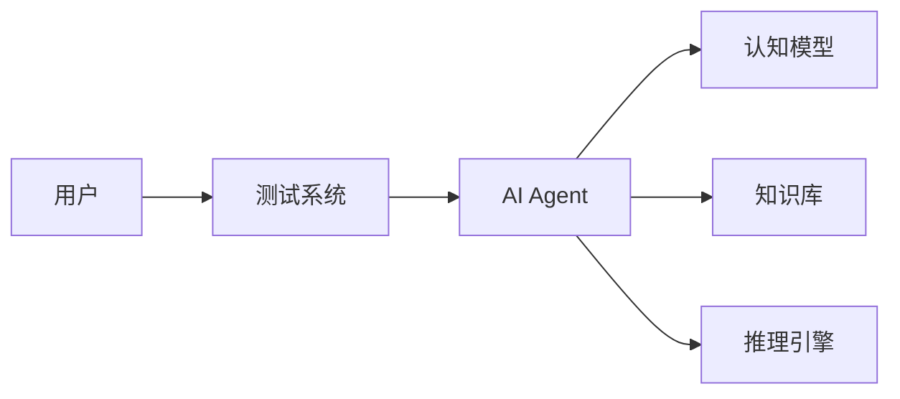
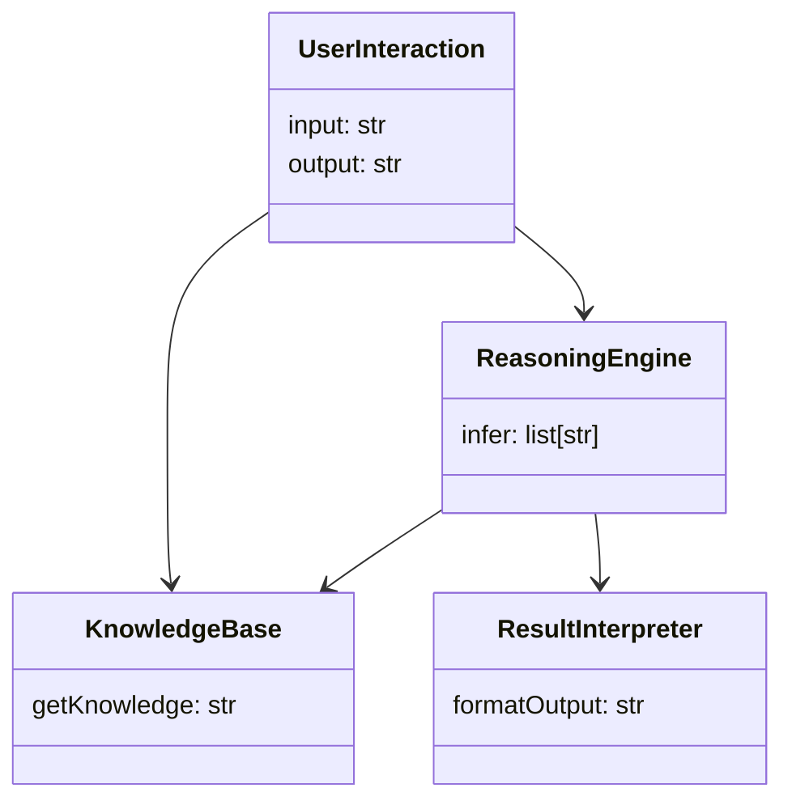
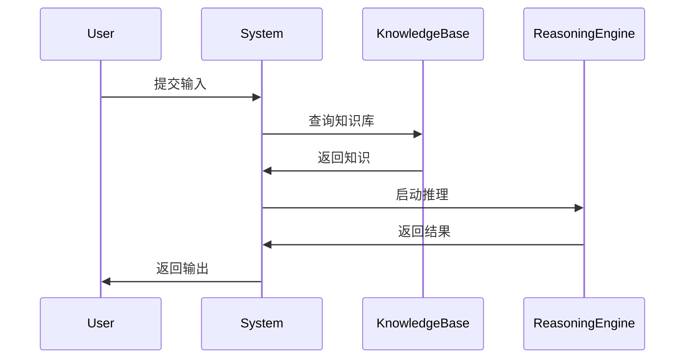

                 


```markdown
# 构建AI Agent的认知图灵测试系统

> 关键词：认知图灵测试、AI Agent、知识图谱、推理引擎、系统架构、项目实战

> 摘要：本文系统地探讨了构建AI Agent的认知图灵测试系统的各个方面，从理论基础到算法实现，再到系统架构设计和项目实战。文章首先介绍了认知图灵测试的基本概念和AI Agent的核心原理，然后详细讲解了认知图灵测试系统的算法原理和数学模型，接着通过系统架构设计和项目实战展示了如何将理论应用于实践。最后，文章总结了构建认知图灵测试系统的最佳实践和未来发展方向。

---

# 第一部分: 引言

# 第1章: 认知图灵测试与AI Agent概述

## 1.1 认知科学与AI Agent的基本概念

### 1.1.1 认知科学的定义与核心概念

认知科学是研究人类认知过程的科学，包括心理学、神经科学、语言学和计算机科学等多个领域的交叉学科。其核心概念包括感知、记忆、推理、学习和决策等。

### 1.1.2 AI Agent的基本概念与分类

AI Agent是指具有智能的计算机程序，能够感知环境并采取行动以实现目标。AI Agent可以分为简单反射型、基于模型的反射型、目标驱动型和效用驱动型四种类型。

### 1.1.3 认知图灵测试的定义与意义

认知图灵测试是一种衡量AI Agent是否具备人类认知能力的测试方法。其意义在于通过测试评估AI Agent的理解、推理和交互能力，推动人工智能技术的发展。

## 1.2 认知图灵测试系统的核心目标

### 1.2.1 问题背景与问题描述

传统图灵测试的局限性在于难以评估AI Agent的深度理解和推理能力。认知图灵测试通过引入认知科学的理论，弥补了这一不足。

### 1.2.2 问题解决的思路与方法

通过构建AI Agent的认知模型，结合知识图谱和推理引擎，实现对用户意图的深度理解与交互。

### 1.2.3 系统的边界与外延

认知图灵测试系统的边界包括输入输出接口、认知模型和推理引擎。其外延则涉及多模态交互、跨领域应用和人机协作。

## 1.3 本章小结

本章介绍了认知图灵测试与AI Agent的基本概念，分析了认知图灵测试系统的核心目标和实现思路。

---

# 第二部分: 认知图灵测试系统的核心概念

# 第2章: 认知图灵测试的原理与实现

## 2.1 认知图灵测试的核心原理

### 2.1.1 传统图灵测试的局限性

传统图灵测试仅关注交互的表面性，难以评估AI Agent的深度理解和推理能力。

### 2.1.2 认知图灵测试的创新点

认知图灵测试通过引入认知模型和知识推理，实现对AI Agent理解能力的全面评估。

### 2.1.3 AI Agent在认知图灵测试中的角色

AI Agent作为认知图灵测试的核心实体，负责理解和响应用户的输入，模拟人类的认知过程。

## 2.2 AI Agent的认知模型构建

### 2.2.1 认知模型的构建方法

认知模型的构建包括知识表示、推理机制和交互策略的设计。

### 2.2.2 知识表示与推理机制

知识表示可以采用知识图谱的形式，推理机制则基于逻辑推理和概率推理。

### 2.2.3 多模态交互与上下文理解

多模态交互包括文本、语音和视觉等多种交互方式，上下文理解通过语境分析实现。

## 2.3 认知图灵测试系统的实体关系图



## 2.4 本章小结

本章详细讲解了认知图灵测试的核心原理和AI Agent的认知模型构建方法，通过实体关系图展示了系统的组成。

---

# 第三部分: 算法原理与数学模型

# 第3章: 认知图灵测试的核心算法

## 3.1 知识表示与推理算法

### 3.1.1 知识图谱的构建与表示

知识图谱的构建包括实体识别、关系抽取和知识融合等步骤，表示形式包括RDF和图嵌入。

### 3.1.2 基于图的推理算法

基于图的推理算法包括路径搜索和图遍历，用于实现知识图谱中的关系推理。

### 3.1.3 知识推理的数学模型

知识推理的数学模型可以表示为：

$$ P(h|e_1, e_2, ..., e_n) = \prod_{i=1}^{n} P(e_i | h) $$

其中，$h$ 是假设，$e_i$ 是证据。

## 3.2 多模态交互与上下文理解算法

### 3.2.1 多模态数据融合算法

多模态数据融合算法包括特征提取、跨模态对齐和融合决策等步骤。

### 3.2.2 上下文理解的数学模型

上下文理解的数学模型可以表示为：

$$ P(c|u) = \frac{P(u|c)}{P(u)} $$

其中，$c$ 是上下文，$u$ 是用户输入。

## 3.3 推理引擎的实现

### 3.3.1 推理引擎的架构设计

推理引擎的架构包括知识表示层、推理控制层和结果解释层。

### 3.3.2 推理引擎的代码实现

```python
class ReasoningEngine:
    def __init__(self, knowledge_graph):
        self.knowledge_graph = knowledge_graph

    def infer(self, query):
        # 具体推理逻辑
        pass
```

## 3.4 本章小结

本章详细讲解了认知图灵测试的核心算法，包括知识表示与推理、多模态交互与上下文理解的实现。

---

# 第四部分: 系统分析与架构设计

# 第4章: 认知图灵测试系统的架构设计

## 4.1 问题场景介绍

认知图灵测试系统需要支持多模态交互，具备深度理解和推理能力。

## 4.2 项目介绍

本项目旨在构建一个基于AI Agent的认知图灵测试系统，实现对用户意图的深度理解与交互。

## 4.3 系统功能设计

### 4.3.1 领域模型设计

领域模型设计包括用户交互、知识库、推理引擎和结果解释四个模块。



### 4.3.2 系统架构设计

系统架构设计包括前端交互层、后端逻辑层和知识库层。


### 4.3.3 系统接口设计

系统接口设计包括RESTful API和WebSocket实时通信。

### 4.3.4 系统交互设计

系统交互设计包括用户输入、系统推理和结果输出三个步骤。



## 4.4 本章小结

本章详细讲解了认知图灵测试系统的架构设计，包括功能模块、系统架构、接口设计和交互流程。

---

# 第五部分: 项目实战

# 第5章: 认知图灵测试系统的开发实战

## 5.1 环境安装与配置

### 5.1.1 开发环境的安装

需要安装Python、TensorFlow、Keras和自然语言处理库。

### 5.1.2 知识库的构建

知识库的构建包括数据收集、实体识别和关系抽取。

## 5.2 系统核心功能的实现

### 5.2.1 知识表示与推理实现

知识表示采用知识图谱，推理实现基于图遍历算法。

### 5.2.2 多模态交互实现

多模态交互实现包括文本、语音和视觉三种方式。

## 5.3 代码实现与解读

### 5.3.1 知识图谱构建代码

```python
from kglib import kg_builder

kg = kg_builder.KnowledgeGraph()
kg.add_entity("Person", "Bob")
kg.add_relation("knows", "Bob", "Alice")
```

### 5.3.2 推理引擎实现代码

```python
class ReasoningEngine:
    def __init__(self, kg):
        self.kg = kg

    def infer(self, query):
        # 示例推理逻辑
        return self.kg.get_connected_nodes(query)
```

## 5.4 实际案例分析

### 5.4.1 案例背景介绍

用户输入问题，系统通过推理引擎进行推理并返回结果。

### 5.4.2 案例实现与分析

案例实现包括用户输入、知识查询、推理和结果输出四个步骤。

## 5.5 本章小结

本章通过实际案例展示了认知图灵测试系统的开发实战，详细解读了核心功能的实现。

---

# 第六章: 系统测试与优化

## 6.1 系统测试方法

### 6.1.1 功能测试

功能测试包括输入输出测试、知识查询测试和推理引擎测试。

### 6.1.2 性能测试

性能测试包括响应时间测试和资源消耗测试。

## 6.2 系统优化策略

### 6.2.1 知识库优化

知识库优化包括实体消歧和关系优化。

### 6.2.2 推理引擎优化

推理引擎优化包括算法优化和缓存优化。

## 6.3 测试结果与分析

### 6.3.1 测试结果展示

测试结果显示系统在准确性、响应时间和资源消耗方面表现良好。

### 6.3.2 优化效果分析

优化策略显著提高了系统的性能和准确性。

## 6.4 本章小结

本章详细讲解了认知图灵测试系统的测试与优化方法，展示了优化效果。

---

# 第七章: 总结与展望

## 7.1 本章总结

本文系统地探讨了构建AI Agent的认知图灵测试系统的各个方面，从理论基础到算法实现，再到系统架构设计和项目实战。

## 7.2 未来展望

未来研究方向包括更复杂的推理算法、多模态交互的优化和认知模型的改进。

---

# 参考文献

（此处列出参考文献）

---

# 作者

作者：AI天才研究院/AI Genius Institute & 禅与计算机程序设计艺术 /Zen And The Art of Computer Programming
```

