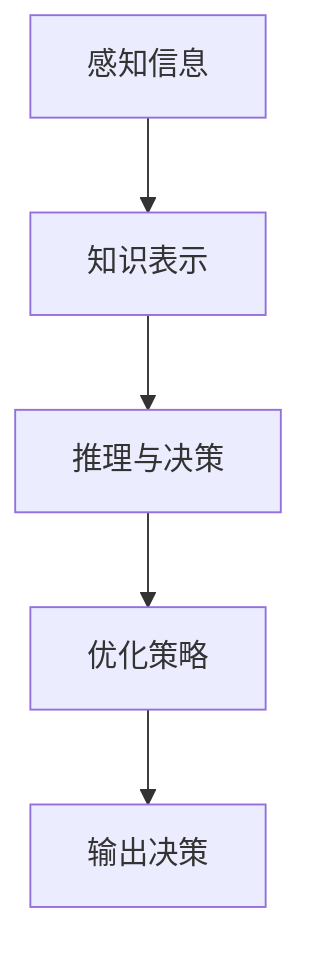
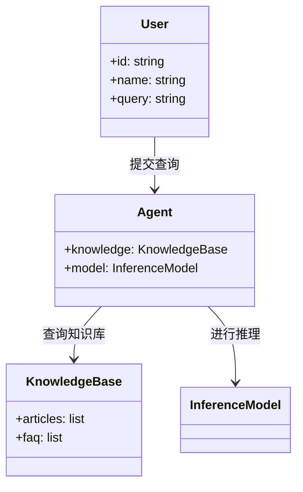
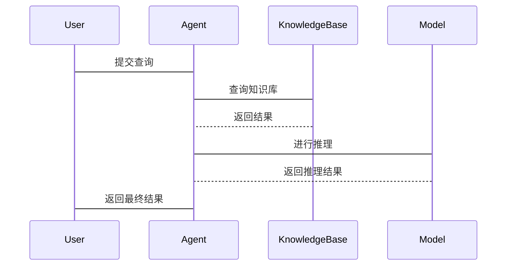

                 


# 《构建AI Agent的认知架构设计》

---

## 关键词：  
AI Agent, 认知架构, 知识表示, 推理与决策, 强化学习, 系统架构

---

## 摘要：  
本文深入探讨了AI Agent认知架构的设计与实现，从背景到核心概念，从算法原理到系统架构，结合实际案例，全面解析认知架构在AI Agent中的重要性与应用。通过详细的技术分析和实际代码实现，帮助读者理解如何构建一个高效、智能的AI Agent认知系统。

---

## 第一部分: AI Agent认知架构的背景与基础

### 第1章: AI Agent认知架构概述

#### 1.1 问题背景与问题描述  
人工智能（AI）技术的快速发展，使得AI Agent的概念逐渐成为学术界和工业界的热点。AI Agent是指在特定环境中能够感知环境、自主决策并执行任务的智能体。与传统的规则驱动系统不同，AI Agent需要具备更强的自主性、适应性和学习能力。本文将重点探讨AI Agent的认知架构设计，旨在为读者提供一个系统化的设计思路。

#### 1.2 问题解决与边界外延  
AI Agent的认知架构设计需要解决的核心问题包括：  
1. 如何实现AI Agent的感知能力，使其能够从环境中获取信息。  
2. 如何构建知识表示模型，以便AI Agent能够理解和推理信息。  
3. 如何设计推理与决策机制，使AI Agent能够基于知识做出最优决策。  
4. 如何实现自适应学习，使AI Agent能够从经验中不断优化性能。  

#### 1.3 核心概念与组成要素  
AI Agent的认知架构由以下几个核心要素组成：  
1. **感知模块**：负责从环境中获取信息，并将其转化为可处理的形式。  
2. **知识表示模块**：用于存储和组织知识，以便推理和决策。  
3. **推理与决策模块**：基于知识和感知信息，生成决策指令。  
4. **学习模块**：通过与环境的交互，不断优化知识和决策策略。  

---

## 第二部分: AI Agent认知架构的核心概念与联系

### 第2章: 认知架构的核心原理  

#### 2.1 感知与知识表示  
**感知模块**是AI Agent认知架构的首要环节。感知的核心任务是将环境中的信息转化为结构化的知识表示。例如，通过自然语言处理技术，AI Agent可以将文本信息转化为语义向量。  

**知识表示**是认知架构的核心组成部分，常用的表示方法包括：  
- **符号表示**：使用符号逻辑（如谓词逻辑）表示知识。  
- **语义网络**：通过节点和边表示概念及其关系。  
- **知识图谱**：通过结构化的数据表示实体及其属性。  

#### 2.2 推理与决策机制  
**推理模块**是AI Agent认知架构的核心，其任务是基于知识表示和感知信息，生成合理的推理结果。常用的推理方法包括：  
- **逻辑推理**：基于符号逻辑进行推理。  
- **概率推理**：基于概率论进行推理。  
- **强化学习**：通过与环境的交互，学习最优决策策略。  

**决策模块**的任务是基于推理结果生成决策指令。常用的决策方法包括：  
- **基于规则的决策**：根据预定义的规则进行决策。  
- **基于模型的决策**：基于预构建的模型进行决策。  
- **基于强化学习的决策**：通过强化学习算法（如Q-learning）进行决策。  

#### 2.3 学习与自适应能力  
**学习模块**是AI Agent认知架构的重要组成部分，其任务是通过与环境的交互，不断优化知识和决策策略。常用的机器学习方法包括：  
- **监督学习**：通过标注数据训练模型。  
- **无监督学习**：通过未标注数据发现数据中的结构。  
- **强化学习**：通过与环境的交互，学习最优决策策略。  

---

## 第三部分: AI Agent认知架构的算法原理与数学模型  

### 第3章: 基于注意力机制的算法原理  

#### 3.1 注意力机制的数学模型  
注意力机制是一种基于概率的加权方法，用于在序列数据中关注重要的部分。其数学公式如下：  
$$  
\text{softmax}(x) = \frac{e^{x}}{\sum_{i} e^{x_i}}  
$$  

#### 3.2 基于强化学习的决策算法  
强化学习是一种通过与环境交互来学习最优决策策略的方法。其核心算法包括：  
- **Q-learning**：通过更新Q值表来学习最优策略。  
- **策略梯度法**：通过优化策略函数来学习最优策略。  

#### 3.3 算法流程图（Mermaid格式）  



---

## 第四部分: AI Agent认知架构的系统分析与架构设计  

### 第4章: 系统分析与架构设计方案  

#### 4.1 问题场景介绍  
以智能客服系统为例，AI Agent需要能够理解用户的问题，并根据知识库中的信息生成合理的回答。  

#### 4.2 系统功能设计（领域模型Mermaid类图）  



#### 4.3 系统架构设计（Mermaid架构图）  


#### 4.4 系统接口设计  
AI Agent的系统接口设计需要考虑以下几点：  
- **输入接口**：接收用户的查询请求。  
- **输出接口**：返回推理结果。  
- **知识库接口**：与知识库进行交互。  

#### 4.5 系统交互序列图（Mermaid格式）  



---

## 第五部分: AI Agent认知架构的项目实战  

### 第5章: 项目实战  

#### 5.1 环境安装  
AI Agent的认知架构设计需要以下环境：  
- Python 3.8+  
- PyTorch 1.9+  
- transformers库  
- numpy  

#### 5.2 系统核心实现（Python代码）  

```python
import torch
from transformers import AutoTokenizer, AutoModelForMaskedLM

# 初始化模型和tokenizer
tokenizer = AutoTokenizer.from_pretrained('bert-base-uncased')
model = AutoModelForMaskedLM.from_pretrained('bert-base-uncased')

# 定义推理函数
def infer(context, question):
    inputs = tokenizer(context + " " + question, return_tensors="pt")
    outputs = model(**inputs)
    return tokenizer.decode(outputs.logits.argmax(dim=-1).squeeze().tolist())

# 示例调用
context = "The capital of France is Paris."
question = "What is the capital of France?"
print(infer(context, question))
```

#### 5.3 案例分析与代码解读  
上述代码实现了基于BERT模型的问答系统。通过填充空白（mask）技术，模型能够根据上下文生成答案。  

#### 5.4 项目小结  
通过本项目，我们实现了AI Agent的认知架构设计，验证了其在实际场景中的应用价值。

---

## 第六部分: 最佳实践与拓展阅读  

### 第6章: 最佳实践  

#### 6.1 小结  
本文详细介绍了AI Agent认知架构的设计与实现，从理论到实践，为读者提供了系统的指导。  

#### 6.2 注意事项  
- 确保知识表示的准确性和完整性。  
- 选择合适的推理与决策算法。  
- 定期优化模型性能。  

#### 6.3 拓展阅读  
-《Deep Learning》——Ian Goodfellow  
-《Reinforcement Learning: Theory and Algorithms》——Sutton & Barto  

---

## 作者：  
AI天才研究院/AI Genius Institute  
禅与计算机程序设计艺术 / Zen And The Art of Computer Programming

