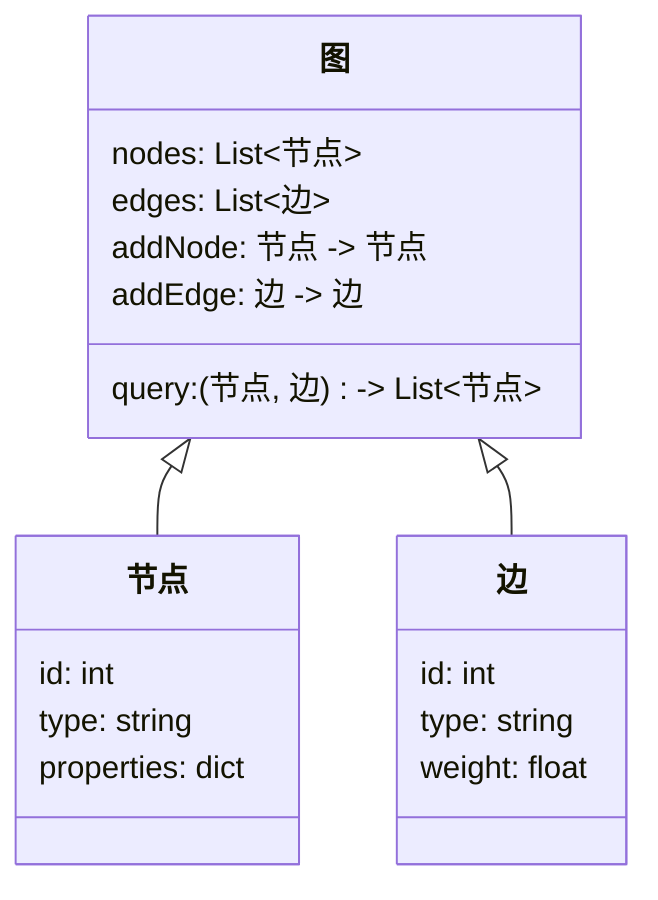
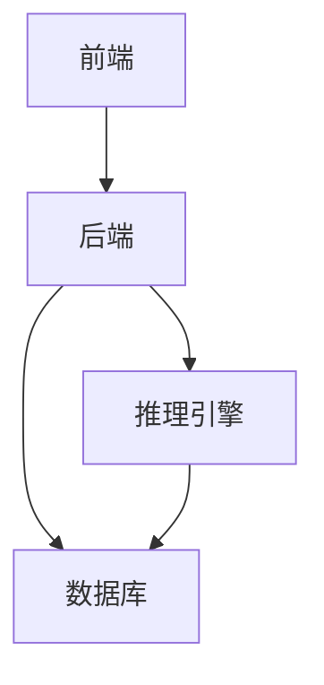

                 


# 《构建AI Agent的认知计算图模型》

> 关键词：AI Agent、认知计算图模型、图神经网络、系统架构设计、项目实战、技术博客

> 摘要：本文详细探讨了构建AI Agent的认知计算图模型，从背景介绍、核心概念、算法原理到系统架构设计和项目实战，层层剖析，旨在为读者提供全面且深入的技术指导。文章结合理论与实践，通过丰富的图表和代码示例，帮助读者理解并掌握AI Agent的认知计算图模型的构建方法。

---

## 第1章：认知计算图模型的背景与基础

### 1.1 认知计算图模型的基本概念

#### 1.1.1 问题背景与问题描述
在AI Agent的构建过程中，认知计算图模型是一种基于图结构的知识表示方法，旨在模拟人类的认知过程。通过构建图模型，AI Agent能够理解和推理复杂的信息关系。然而，当前AI Agent的知识表示方法多基于传统的知识图谱，难以满足动态、复杂场景下的推理需求。因此，我们需要一种更灵活、更具表现力的认知计算图模型。

#### 1.1.2 问题解决方法与边界
认知计算图模型通过将知识表示为图结构，结合图神经网络算法，实现了对复杂关系的推理和学习。该模型的边界在于其知识表示的范围和推理能力的深度，受限于图结构的复杂性和算法的计算效率。

#### 1.1.3 概念结构与核心要素
认知计算图模型的核心要素包括：
- **节点**：表示知识的基本单元，如实体或概念。
- **边**：表示节点之间的关系。
- **属性**：节点的额外信息，如权重或类型。

### 1.2 认知计算图模型的核心概念

#### 1.2.1 概念属性对比表
以下是认知计算图模型与传统知识图谱的核心概念对比：

| **概念**   | **认知计算图模型**                     | **传统知识图谱**                     |
|------------|---------------------------------------|---------------------------------------|
| 节点       | 表示具体实体或抽象概念                 | 表示具体实体或概念                   |
| 边         | 表示关系，支持多种关系类型             | 主要支持二元关系                     |
| 属性       | 节点的附加信息，支持动态扩展           | 属性固定，难以动态扩展               |

#### 1.2.2 ER实体关系图
认知计算图模型的ER实体关系图如下：

```mermaid
er
actor: 用户
action: 行为
object: 对象
```

---

## 第2章：认知计算图模型的原理与联系

### 2.1 概念原理

#### 2.1.1 认知计算图模型的原理
认知计算图模型通过构建图结构，利用图神经网络进行推理和学习。其核心原理如下：
- **知识表示**：将知识表示为图结构，节点表示实体，边表示关系。
- **推理机制**：通过图神经网络进行路径推理，发现隐含关系。
- **动态更新**：支持实时更新图结构，适应动态知识变化。

#### 2.1.2 概念属性特征对比表
以下是认知计算图模型中节点和边的属性特征对比：

| **属性**   | **节点属性**               | **边属性**               |
|------------|----------------------------|--------------------------|
| 类型       | 实体类型（人、物、概念）     | 关系类型（属性、动作）   |
| 权重       | 表示重要性                   | 表示关系强度             |
| 动态性     | 支持动态更新                 | 支持动态更新             |

### 2.2 ER实体关系图


---

## 第3章：认知计算图模型的算法原理

### 3.1 图神经网络算法

#### 3.1.1 图神经网络的基本原理
图神经网络通过聚合节点及其邻居的信息，进行节点表示学习和关系推理。其基本流程如下：


#### 3.1.2 图神经网络的数学模型
图神经网络的数学模型如下：

$$
h_i^{(l+1)} = \sigma(\sum_{j \in N(i)} W_{ij} h_j^{(l)} + b_i)
$$

其中：
- $h_i^{(l)}$ 表示节点 $i$ 在第 $l$ 层的表示。
- $N(i)$ 表示节点 $i$ 的邻居节点集合。
- $W_{ij}$ 表示节点 $i$ 和 $j$ 之间的权重。
- $\sigma$ 表示激活函数。

---

## 第4章：系统分析与架构设计方案

### 4.1 问题场景介绍
认知计算图模型的构建需要解决以下问题：
- **知识表示**：如何将复杂知识表示为图结构。
- **推理机制**：如何通过图神经网络进行高效推理。
- **系统架构**：如何设计高效的系统架构支持大规模图数据处理。

### 4.2 系统功能设计

#### 4.2.1 领域模型
领域模型如下：



### 4.3 系统架构设计

#### 4.3.1 系统架构图
系统架构图如下：



---

## 第5章：项目实战

### 5.1 环境安装
以下是构建认知计算图模型所需的环境配置：

- **Python版本**：Python 3.8+
- **依赖库**：`networkx`, `pymermaid`, `numpy`, `scikit-learn`

### 5.2 核心代码实现

#### 5.2.1 图结构构建

```python
import networkx as nx

G = nx.Graph()
G.add_nodes_from(["A", "B", "C"])
G.add_edges_from([("A", "B"), ("B", "C")])
```

#### 5.2.2 图神经网络实现

```python
import numpy as np

class GNNLayer:
    def __init__(self, input_dim, output_dim):
        self.W = np.random.randn(input_dim, output_dim)
    
    def forward(self, inputs):
        return np.dot(inputs, self.W)
    
    def backward(self, dLoss):
        return dLoss.dot(self.W.T)
```

---

## 第6章：最佳实践与总结

### 6.1 小结
认知计算图模型的构建需要从知识表示、算法设计和系统架构三个方面入手。通过图神经网络实现高效的推理和学习，结合合理的系统架构设计，能够构建高效、灵活的AI Agent。

### 6.2 注意事项
- **数据质量**：知识图谱的质量直接影响推理效果。
- **计算效率**：大规模图数据的处理需要高效的算法和优化的架构。
- **模型可解释性**：复杂的图结构可能会影响模型的可解释性。

### 6.3 拓展阅读
- **图神经网络**：推荐阅读《Graph Neural Networks: A Comprehensive Survey》。
- **知识图谱构建**：推荐阅读《Knowledge Graph Construction: A Comprehensive Survey》。

---

## 作者：AI天才研究院/AI Genius Institute & 禅与计算机程序设计艺术 /Zen And The Art of Computer Programming

---

以上是《构建AI Agent的认知计算图模型》的技术博客文章的完整内容，涵盖了从背景介绍到项目实战的各个方面，希望对您有所帮助！

