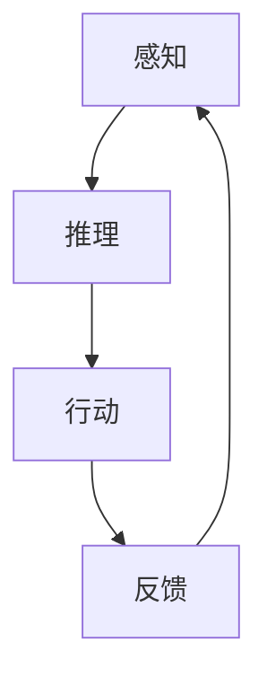
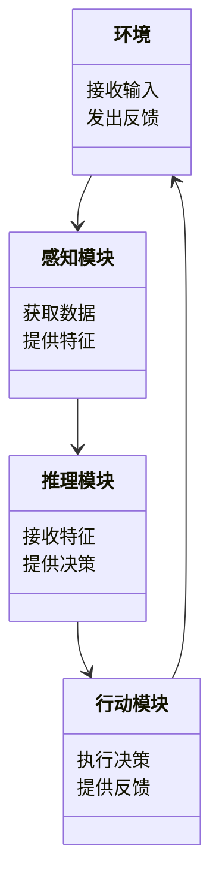
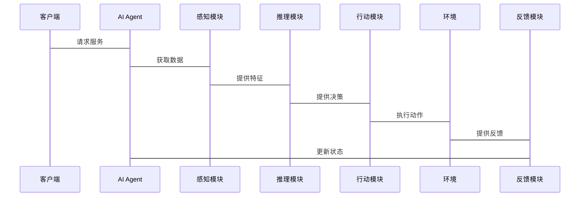

                 


# 构建AI Agent的认知计算模型

## 关键词：AI Agent、认知计算模型、机器学习、算法原理、系统设计、应用案例

## 摘要：  
本文将详细介绍AI Agent的认知计算模型的构建方法，从基本概念到核心算法，从系统设计到项目实战，全面解析AI Agent的感知、推理与行动机制。通过具体案例分析，深入探讨认知计算模型在实际应用中的实现细节与优化策略。

---

# 第一部分: AI Agent与认知计算模型概述

## 第1章: AI Agent的基本概念

### 1.1 什么是AI Agent
AI Agent（智能体）是指在计算机系统中能够感知环境并采取行动以实现目标的实体。AI Agent可以是软件程序、机器人或其他智能系统，其核心目标是通过与环境交互来完成特定任务。

### 1.2 AI Agent的特点与优势
- **自主性**：AI Agent能够在没有外部干预的情况下独立运行。
- **反应性**：能够实时感知环境并做出响应。
- **目标导向**：所有行为都围绕特定目标展开。
- **学习能力**：通过经验改进性能。

### 1.3 AI Agent的应用场景
- **智能家居**：控制家中的设备，提供便利生活。
- **自动驾驶**：实现车辆的自主驾驶功能。
- **智能助手**：如Siri、Alexa等，帮助用户完成日常任务。

---

## 第2章: 认知计算模型的背景

### 2.1 认知科学的基础
认知科学是研究人类认知过程的科学，包括感知、记忆、推理和决策等。认知计算模型旨在模拟这些过程，以便在计算机系统中实现类似人类的智能。

### 2.2 认知过程的建模
认知过程建模的目标是将人类的认知能力转化为计算机可以处理的形式。这包括将感知、推理和决策过程转化为算法和数据结构。

### 2.3 认知计算模型的类型
- **基于规则的模型**：通过预定义的规则进行推理。
- **基于知识的模型**：依赖知识库进行推理和决策。
- **基于学习的模型**：通过机器学习算法从数据中学习认知模型。

---

# 第二部分: AI Agent的核心概念与联系

## 第3章: AI Agent的核心概念

### 3.1 感知
AI Agent通过传感器或其他数据源感知环境，获取信息并进行处理。

#### 3.1.1 数据采集与处理
- **数据采集**：通过摄像头、麦克风等设备获取原始数据。
- **数据预处理**：对数据进行清洗、归一化等处理，以便后续分析。

#### 3.1.2 特征提取与识别
- **特征提取**：从数据中提取有用的特征，例如从图像中提取边缘特征。
- **模式识别**：通过分类器识别数据中的模式，例如识别图像中的物体。

#### 3.1.3 语义理解与分析
- **自然语言处理**：理解文本的语义，例如通过NLP技术分析用户输入的查询。
- **情感分析**：分析文本中的情感倾向。

### 3.2 推理
AI Agent通过推理模块将感知到的信息转化为决策依据。

#### 3.2.1 知识表示与推理
- **知识表示**：将知识以某种形式存储，例如知识图谱。
- **逻辑推理**：通过逻辑规则进行推理，例如基于一阶逻辑的推理。

#### 3.2.2 情境理解与关联
- **情境理解**：理解当前环境中的情境，例如在自动驾驶中理解道路状况。
- **关联分析**：将不同信息关联起来，例如在推荐系统中关联用户的偏好和物品属性。

### 3.3 行动
AI Agent根据推理结果采取行动，以实现目标。

#### 3.3.1 决策制定与执行
- **决策制定**：基于推理结果选择最优行动方案。
- **行动执行**：通过执行机构（如机器人）或软件接口执行决策。

#### 3.3.2 动作规划与优化
- **动作规划**：规划具体的执行步骤，例如在机器人路径规划中规划行走路线。
- **优化策略**：通过优化算法改进动作的效率，例如使用遗传算法优化路径。

---

## 第4章: 认知计算模型的原理与实现

### 4.1 感知模块的实现
#### 4.1.1 数据采集与预处理
- **数据采集**：通过传感器获取实时数据。
- **数据预处理**：对数据进行清洗和标准化处理。

#### 4.1.2 特征提取算法
- **主成分分析（PCA）**：用于降维特征。
- **卷积神经网络（CNN）**：用于图像特征提取。

#### 4.1.3 语义分析模型
- **词嵌入（Word Embedding）**：将词语转换为向量表示。
- **序列模型（如RNN、LSTM）**：用于处理序列数据，如文本和时间序列。

### 4.2 推理模块的实现
#### 4.2.1 知识表示方法
- **知识图谱**：通过图结构表示知识。
- **本体论（Ontology）**：定义领域特定的概念和关系。

#### 4.2.2 推理算法选择
- **逻辑推理算法**：如基于规则的推理和逻辑演绎。
- **概率推理算法**：如贝叶斯网络推理。

#### 4.2.3 情境理解模型
- **上下文感知模型**：通过上下文信息理解当前情境。
- **情境记忆模型**：记录和回忆之前的情境信息。

### 4.3 行动模块的实现
#### 4.3.1 决策算法设计
- **强化学习算法**：如Q-learning和Deep Q-Networks。
- **监督学习算法**：如分类和回归算法。

#### 4.3.2 动作规划与优化
- **路径规划算法**：如A*算法和RRT算法。
- **优化策略**：如遗传算法和模拟退火算法。

#### 4.3.3 反馈机制实现
- **实时反馈**：根据环境反馈调整行动策略。
- **闭环控制**：通过反馈环路优化系统性能。

### 4.4 系统整体流程
#### 4.4.1 系统流程图


#### 4.4.2 模块之间的交互


---

## 第5章: AI Agent的算法原理与数学模型

### 5.1 强化学习算法
#### 5.1.1 Q-learning算法
- **算法流程**：
  1. 初始化Q表。
  2. 选择动作。
  3. 执行动作并获得奖励。
  4. 更新Q表。

- **数学公式**：
  $$ Q(s, a) = Q(s, a) + \alpha (r + \gamma \max Q(s', a') - Q(s, a)) $$

#### 5.1.2 Deep Q-Networks算法
- **网络结构**：
  - 输入层：接收状态输入。
  - 隐藏层：提取特征。
  - 输出层：输出每个动作的Q值。

- **数学公式**：
  $$ Q(s, a) = \arg \max_a Q_\theta(s, a) $$

#### 5.1.3 策略梯度算法
- **策略表示**：
  - 使用概率分布表示策略。
- **优化目标**：
  - 最大化期望奖励。

- **数学公式**：
  $$ J(\theta) = \mathbb{E}_{\tau \sim \pi_\theta} [\sum_{t=0}^T \gamma^t r_t] $$
  $$ \nabla J(\theta) = \mathbb{E}_{\tau \sim \pi_\theta} [\sum_{t=0}^T \gamma^t \nabla \log \pi_\theta(a_t|s_t) Q_\theta(s_t, a_t)] $$

### 5.2 监督学习算法
#### 5.2.1 分类算法
- **逻辑回归**：
  - 输入：特征向量。
  - 输出：类别标签。
  - 损失函数：交叉熵损失。
  - 优化算法：梯度下降。

- **数学公式**：
  $$ P(y=1|x) = \frac{1}{1 + e^{-w^T x - b}} $$

#### 5.2.2 回归算法
- **线性回归**：
  - 输入：特征向量。
  - 输出：回归值。
  - 损失函数：均方误差。
  - 优化算法：最小二乘法。

- **数学公式**：
  $$ y = w^T x + b $$

---

## 第6章: 系统分析与架构设计

### 6.1 问题场景介绍
- **智能家居控制**：通过AI Agent控制家中的设备，如灯光、空调等。
- **自动驾驶**：AI Agent控制车辆的行驶。

### 6.2 系统功能设计
#### 6.2.1 领域模型（Mermaid 类图）


#### 6.2.2 系统架构设计（Mermaid 架构图）


#### 6.2.3 系统交互设计（Mermaid 序列图）


---

## 第7章: 项目实战

### 7.1 环境安装
- **Python 3.8+**
- **TensorFlow或PyTorch**
- **Scikit-learn**
- **OpenCV**

### 7.2 系统核心实现源代码
```python
# 感知模块
def get_data():
    # 获取传感器数据
    return data

# 推理模块
class InferenceModel:
    def __init__(self):
        self.model = load_model()

    def predict(self, input):
        return self.model.predict(input)

# 行动模块
class ActionModule:
    def execute_action(self, action):
        # 执行具体动作
        pass
```

### 7.3 代码应用解读与分析
- **感知模块**：从环境中获取数据并进行预处理。
- **推理模块**：基于预处理后的数据进行推理，生成决策。
- **行动模块**：根据决策结果执行具体动作。

### 7.4 实际案例分析
- **智能家居控制**：AI Agent根据环境数据（如温度、光线）调整家居设备。
- **自动驾驶**：AI Agent根据传感器数据（如距离、速度）调整车辆行驶。

### 7.5 项目小结
通过本项目，我们实现了AI Agent的认知计算模型，验证了感知、推理和行动模块的有效性，并展示了其在实际场景中的应用。

---

## 第8章: 最佳实践、小结与注意事项

### 8.1 最佳实践 tips
- **模块化设计**：将系统划分为独立模块，便于维护和扩展。
- **数据预处理**：确保数据质量，减少噪声干扰。
- **模型优化**：通过调参和模型优化提高性能。

### 8.2 小结
本文详细介绍了AI Agent的认知计算模型的构建方法，从基本概念到核心算法，从系统设计到项目实战，全面解析了AI Agent的感知、推理与行动机制。

### 8.3 注意事项
- **数据安全**：确保数据的安全性和隐私性。
- **系统鲁棒性**：设计时考虑系统的容错性和恢复能力。
- **性能优化**：通过优化算法和硬件配置提高系统性能。

---

## 第9章: 拓展阅读与参考文献

### 9.1 拓展阅读
- **《机器学习实战》**
- **《深度学习》**
- **《强化学习》**

### 9.2 参考文献
- [1] Russell, S., & Norvig, P. (2010). Artificial Intelligence: A Modern Approach.
- [2] Goodfellow, I., Bengio, Y., & Courville, A. (2016). Deep Learning.
- [3] Sutton, R. S., & Barto, A. G. (2018). Reinforcement Learning: Theory and Algorithms.

---

## 作者：AI天才研究院/AI Genius Institute & 禅与计算机程序设计艺术 /Zen And The Art of Computer Programming

